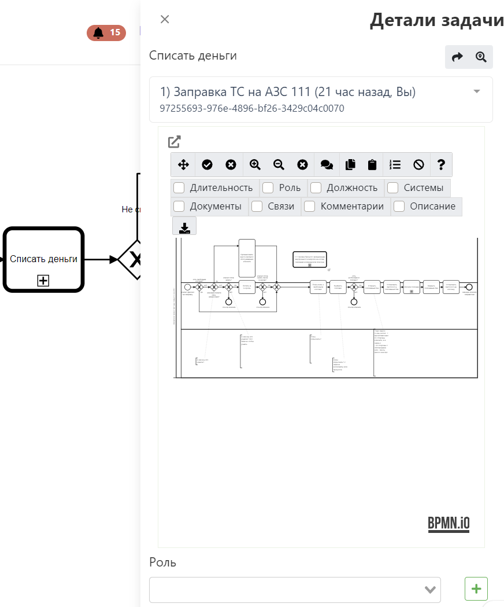
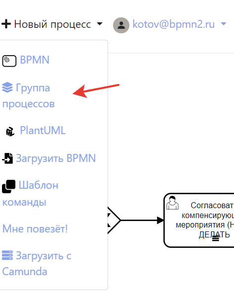

# Описание функций

:::danger
Раздел в разработке
:::

На этой странице дано подробное описание всех функций системы. Страница большая, функций много, крепитесь :)
::: tip Подсказка
В [разделе](../real-life-scenarios/) приведеные реальные сценарии использования системы, возможно начать оттуда будет лучшей идей.
:::

[[toc]]

## Редактор BPMN

Наш редактор имеет множество функций и все они направлены на обеспечение удобства работы с BPMN диаграммами.  
Рассмотрим подробнее все возможности:

### Левое меню

Левое меню предназначено для выбора и использования элементов BPMN и обеспечения удобства использования редактора.

::: warning Не все элементы
В левом меню не все элементы BPMN, но это не значит их нет в системе :) Типы элементов меняются в контекстном меню.
:::

Советуем обратить внимание на кнопки, обеспечивающие удобство работы:

Для понимания того, в какие элементы можно превратить элементы, нужно понимать [BPMN](/bpmn/) - сервис старается защитить вас от ошибок и не дать использовать элементы, которые невозможны по нотации.

### Меню сохранения

#### Сохранение диаграммы

В этом меню вы можете:

- Указать название диаграммы
- Указать [папку](#папки)
- Добавить [теги](#теги)
- Указать тип-процесса (AS-IS / TO-BE) и связать со вторым процессом для [сравнения](#сравнение-as-is-и-to-be)
- Указать комментарий к текущей версии
- Оценить [качество] вашей диаграммы

::: tip
При сохранении создается [версия](#версионирование), к которой можно откатиться или выполнить сравнение
:::

В этом же меню сохранить **чужую диаграмму**, к которой вы не имеете доступа на редактирование, в свои диаграммы.

#### Скачать

В этом меню можно скачать диаграмму в нужном формате, включая [.docx](#регламенты)

:::tip
Скачивание картинки с [оверлеями](#меню-оверлеев) доступно по другой кнопке
:::

#### Поделиться диаграммой

В этом меню можно предоставить/отзовать доступ на диаграмму:

- Анонимно (не требует учетной записи в системе)
- Конкретному человеку по e-mail с указанием прав (просматривать/редактировать)
- Получить код для встраивания диаграммы, она будет выглядеть вот так:
<iframe src="https://stormbpmn.com/app/diagram/0855ae10-6ef8-4a23-9df0-f7d6cef12722?embedded=true" style="border:1px #f2f2f2 none;" name="extAdmin" scrolling="yes" frameborder="1"  height="500" width="100%" allowfullscreen></iframe>

Больше о [совместной работе](../team-work/)

#### Сменить статус

Для информирования коллег о состоянии работы над процессом можно использовать статусы.

- **Новый** - процесс еще не трогали, просто создали.
- **В работе** - над процессом активно идет работа.
- **На согласовании** - процесс согласуется с кем-то, менять схему **нельзя**. Подробнее в [согласованиях](#согласование)
- **Готов** - процесс готов к работе. Меня схему нельзя.
  

::: warning
Сейчас менять или добавлять статусы нельзя.
:::

#### AS-IS и TO-BE

Если в [меню сохранения](#меню-сохранения) вы указали тип процесса и связанный процесс, то появится возможность быстро перемещаться между версиями AS-IS и TO-BE, а так же визуально сравнить их.

### Верхнее меню

Верхнее меню предназначено для работы с конкретной диаграммой и предоставляет возможности:  
 

1. Развернуть диаграмму на полный экран
2. Открыть панель свойств BPMN/свойств Camunda.
3. Включить [проверку ошибок](#оценка-качества).
4. Отключить проверку ошибок.
5. Отменить последнее дейсвтие.
6. Повторить последнее действие.
7. Распределить выделенные элементы по горизонтали.
8. Выровнять выделенные элементы по центру.
9. Приблизить.
10. Отдалить.
11. Включить или выключить миникарту.
12. Сменить цвет выбранным элементам.
13. Скопировать выделенные элементы для вставки между вкладками.
14. Вставить выделенные элементы из другой вкладки.
15. Включить автонумерацию элементов.
16. Отключить автонумерацию элементов.
17. Открыть [правое меню](#правое-меню) с доп.функциям.
18. Открыть встроенную справку по [BPMN](../bpmn/) и горячим клавишам.

### Контекстное меню

### Меню оверлеев

### Меню представлений

### Правое меню

Правое меню отображает дополнительную информацию к диаграмме в зависимости от выбранного отображения.
 

1. Включить отображение всех [ролей](#роли).
2. Включить отображение [деталей задачи по клику](#детали-по-клику).
3. Сравнить текущую [версию](#версионирование) с предидущими
4. Включить отображение всех элементов архитектуры.
5. Включить отображение связей процесса. 
6. Включить комментарии.

#### Детали по клику

После включения соответсвующей настройки в правом меню появляется возможность:

- Поделиться ссылкой на конкретный элемент
- Найти выбранный элемент на схеме
- Установить [связь](#связь-процессов) с Call Activity
- Установить роль
- Установить элементы архитектуры
- Прочитать описание выбранной задачи
- Просмотреть и написать комментарий к выбранной задачи

::: tip
В этом представлении отображается схема выбранного Call Activity! Это удобный способ просматривать их содержимое с той же диаграммы, на которой оно используется.
:::

### Обеспечение удобства работы

## Редактор групп процессов

::: warning

Группы процессов работают только на тарифах TEAM и выше.

:::

::: danger
Функционал недавно выпущен и может содержать ошибки. Сообщайте о любых ошибках в чат в приложении, мы оперативно их устраним.
:::

Группы процессов это отличная возможность моделировать процессы сверху-вниз. Вы можете смотреть на группы процессов как на простую иерархию, бизнес-возможности(Business Capability) или бизнес-функции.

::: tip
Вложенность групп неограничена, но по практике лучше не использовать больше 3-4 уровней, а сложные структуры проектировать через вложенность диаграммы групп в диаграммы групп.
:::

### Создание группы процессов

Создать группу процессов можно так:

::: tip

Групп процессов может быть сколько угодно! Это значит что вы можете формировать разные иерархии для разных целей. И этими группами можно так же [делиться по ссылке](#поделиться-диаграммои). А еще работаю [комментарии](#комментирование).
:::

### Как работать с группами

1. Добавьте группу нужного размера:  
   
2. Двойным кликом на группу откройте меню редактирования группы:
   
3. Укажите информацию о группе:
   - Название
   - Цвет
   - Описание
   - Приоритет (возможно использовать для фильтрации)
   - Уровень (возможно использовать для фильтрации)
4. Укажите связь группы с реализацией. Тут 2 возможности:
   - **Создать новую** - создастся "заглушка" процесса (если выбрать BPMN) или группы процессов (если выбрать BCM). Отличная возможность приступить к реализации позднее или раздать задачи бизнес-аналиткам для моделирования.
   - **Существующая схема** - позволяет выбрать уже существующую реализацию процесса или группы процессов. Отлично подойдет, если вы из существующих процессов формируете иерархию. **Существующая схема может быть привязана к любому количеству групп**.

::: tip
Привязка реализации позволяет отслеживать статус работы над реализацией и визуализировать ваш процесс по моделированию всей иерархии!

::: 
5. Формируйте группы и перемещайте их друг в друга, чтобы отобразить иерархию. Чтобы вытащить группы другой группы, зажмите **CTRL** и перемещайте ее за границу родителя.

6. Используйте правое меню для навигации или просмотра фильтра групп. В фильтре работают:
   - Фильтр по названию группы
   - Фильтр по названию родительской группы
   - Фильтр по статусу привязанного процесса (new, progress, approve, done ) 
   -  Фильтр по типу (BPMN, BCM) 
   -  Фильтр по названию связанного процесса  
7. Используйте фильтр и навигируйтесь по иерархии кликом на симол лупы с картой.    

### Горячие клавиши

Редактор групп поддерживает горячие клавиши:

- **CTRL+Z** - отменить последнее действие.
- **CTRL+Y** - повторить последнее действие.
- **CTRL+C** - скопировать группу (без дочерних).
- **CTRL+V** - вставить группу.
- **DEL** - удалить группу с дочерними.

#### Элементы архитектуры

#### Связи процесса

#### Сравнение версий

#### Комментарии

#### Горячие клавиши

#### Копирование между разными диаграммами

#### Смена цветов

#### Горячие клавиши

## Описание задач

## Домашняя страница

## Оргструктура

### Загрузка из CSV

## Группы процессов

## Регламенты

## Версионирование
Система автоматически создает версии диаграмм вот по таким поводам:
 - Прошло больше 30 изменений диаграммы
 - Кто-то (не владелец процесса и не пред.автор изменения) внес изменения в диаграмму
 Это позволяет **всегда** восстановить пред.версию и посмотреть разницу. Автор диаграммы получает е-мейл уведомление, если в его диаграмме создали новую версию.
 
 ### Как вернуть версию процесса
 1. Если вы хотите вернуть версию процесса, то найдите на главной странице карточку процесса и нажмите в верхний правый угол, выберите "Все версии":
   
 2. Выберете интересующую версию и нажмите **посмотреть версию**.
 3. В открывшемся окне нажмите **"установить как текущую"**.

## Комментирование

## Графы

## Согласование

## Импорт процессов

## Экспорт процессов

## Поиск процессов

## Элементы архитектуры

### Загрузка из CSV

## Связь процессов

## Сравнение AS-IS и TO-BE

## Обеспечение качества

### Оценка качества

### Проверка токена

## Папки

## Теги

## Роли

Роли это отличный инструмент для указания исполнителей задач. Под ролью понимается исполнитель конкретной задачи в процессе или процессах (т.к. Роли - это справочник, который можно переиспользовать). Роли это правильная и хорошая альтернатива дорожкам.

<iframe width="560" height="315" src="https://www.youtube.com/embed/_2W10c0YzcI?si=Br3u2STg2zdWwIQ8" frameborder="0" allow="autoplay; encrypted-media" allowfullscreen></iframe>

### Создание ролей

::: warning
Создавать роли может только **администратор команды**. Роли - это часть платной подписки TEAM или Enterprise. Без подписки использовать их не получится.
:::

#### С интефейса процесса в [контекстом меню](#контекстное-меню)

#### С интефейса процесса в [описании задач](#описание-задач)

#### C отдельного представления

По [ссылке](https://stormbpmn.com/app/team/assignees/):  

#### C помощью загрузки из .csv

По [ссылке](https://stormbpmn.com/app/team):  

### Редактирование ролей

Редактирование ролей так же доступно в контекстом меню или с отдельного представления по [ссылке](https://stormbpmn.com/app/team/assignees/).

### Удаление ролей

Удалять роли можно только с отдельного представления по [ссылке](https://stormbpmn.com/app/team/assignees/).

:::warning
Удалить роли не получится, пока они привязаны к задачам на процессах. Отвяжите их перед удалением.
:::
