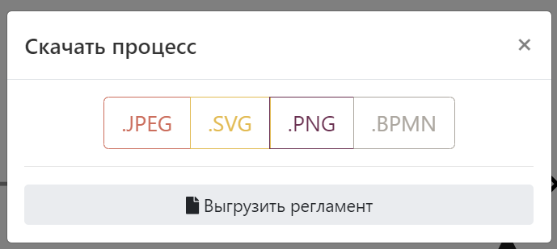
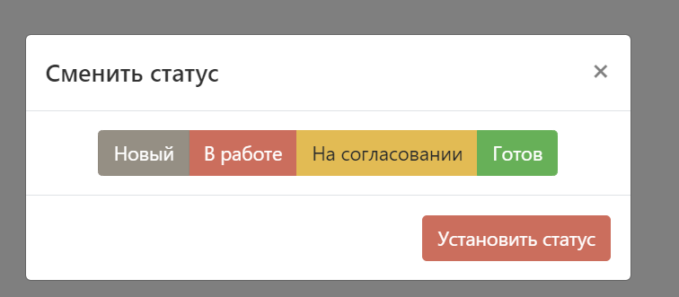

# Описание функций

:::danger
Раздел в разработке
:::

На этой странице дано подробное описание всех функций системы. Страница большая, функций много, крепитесь :)
::: tip Подсказка
В [разделе](../real-life-scenarios/) приведеные реальные сценарии использования системы, возможно начать оттуда будет лучшей идей.
:::

[[toc]]
## Редактор BPMN
Наш редактор имеет множество функций и все они направлены на обеспечение удобства работы с BPMN диаграммами.  
Рассмотрим подробнее все возможности:

### Левое меню
Левое меню предназначено для выбора и использования элементов BPMN и обеспечения удобства использования редактора.

::: warning Не все элементы
В левом меню не все элементы BPMN, но это не значит их нет в системе :) Типы элементов меняются в контекстном меню.
::: 

Советуем обратить внимание на кнопки, обеспечивающие удобство работы:  

Для понимания того, в какие элементы можно превратить элементы, нужно понимать [BPMN](/bpmn/) - сервис старается защитить вас от ошибок и не дать использовать элементы, которые невозможны по нотации. 

### Меню сохранения
#### Сохранение диаграммы
В этом меню вы можете:
 - Указать название диаграммы
 - Указать [папку](#папки)
 - Добавить [теги](#теги)
 - Указать тип-процесса (AS-IS / TO-BE) и связать со вторым процессом для [сравнения](#сравнение-as-is-и-to-be)
 - Указать комментарий к текущей версии
 - Оценить [качество] вашей диаграммы

::: tip 
При сохранении создается [версия](#версионирование), к которой можно откатиться или выполнить сравнение
:::

В этом же меню сохранить **чужую диаграмму**, к которой вы не имеете доступа на редактирование, в свои диаграммы.

 

#### Скачать
В этом меню можно скачать диаграмму в нужном формате, включая [.docx](#регламенты) 
 

 :::tip 
 Скачивание картинки с [оверлеями](#меню-оверлеев) доступно по другой кнопке
 :::

#### Поделиться диаграммой
В этом меню можно предоставить/отзовать доступ на диаграмму:
 - Анонимно (не требует учетной записи в системе)
 - Конкретному человеку по e-mail с указанием прав (просматривать/редактировать)
 - Получить код для встраивания диаграммы, она будет выглядеть вот так:
 <iframe src="https://stormbpmn.com/app/diagram/0855ae10-6ef8-4a23-9df0-f7d6cef12722?embedded=true" style="border:1px #f2f2f2 none;" name="extAdmin" scrolling="yes" frameborder="1"  height="500" width="100%" allowfullscreen></iframe>

 

Больше о [совместной работе](../team-work/)

#### Сменить статус
Для информирования коллег о состоянии работы над процессом можно использовать статусы.
 - __Новый__ - процесс еще не трогали, просто создали.
 - __В работе__ - над процессом активно идет работа.
 - __На согласовании__ - процесс согласуется с кем-то, менять схему __нельзя__. Подробнее в [согласованиях](#согласование)
 - __Готов__ - процесс готов к работе. Меня схему нельзя.
 

::: warning 
Сейчас менять или добавлять статусы нельзя.
:::
#### AS-IS и TO-BE
Если в [меню сохранения](#меню-сохранения) вы указали тип процесса и связанный процесс, то появится возможность быстро перемещаться между версиями AS-IS и TO-BE, а так же визуально сравнить их.
 

### Верхнее меню

### Контекстное меню
### Меню оверлеев
### Меню представлений
### Правое меню

### Обеспечение удобства работы
#### Горячие клавиши
#### Копирование между разными диаграммами
#### Смена цветов
#### Горячие клавиши

## Описание задач

## Домашняя страница
## Оргструктура
### Загрузка из CSV

## Группы процессов
## Регламенты

## Версионирование

## Комментирование

## Графы

## Согласование

## Импорт процессов

## Экспорт процессов

## Поиск процессов

## Элементы архитектуры
### Загрузка из CSV

## Связь процессов
## Сравнение AS-IS и TO-BE

## Обеспечение качества
### Оценка качества
### Проверка токена

## Папки
## Роли
## Теги