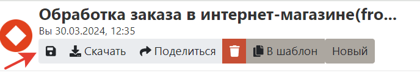
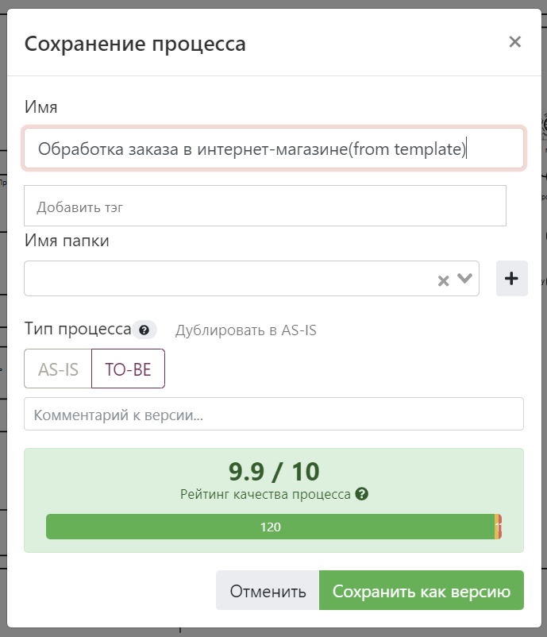

# С чего начать

Stormbpmn  - это лучший веб-сервис для **полноценного** моделирования бизнес-процессов с использованием BPMN. В отличии от прочих сервисов, в Storm можно описывать все аспекты процессов:

- Cхему взаимодействия участников в BPMN;
- Задачи участников;
- Самих участников, как в виде ролей, так и на оргструктуре;
- Длительность выполнения задач;
- Использование систем, документов в бизнес-процессах;
- Связь процессов друг с другом;

::: tip Наш главный приоритет
Скорость и удобство работы команд бизнес-аналитиков и их коллег. Вы убедитесь в этом, как только начнете работу с системой.
:::

## Какие задачи решает Stormbpmn

Система идеально подойдет, если вы:
- Хотите описать сложное взаимодействие группы людей и систем;
- Спроектировать большие изменения вашей бизнес и ИТ-архитектуры;
- Сфомировать ТЗ на автоматизацию бизнес-процессов;
- Обеспечить быструю и качественную адаптацию новых сотрудников;

Смотрите [примеры из реальной жизни](./real-life-scenarios/index.md), чтобы узнать больше.

## Ваш первый процесс от идеи до заказчика за 5 минут

1. Зарегистрируйтесь в [системе](https://stormbpmn.com/app/signup):  

2. Создайте процесс:  

3. Используйте [BPMN](./bpmn/):  

4. Сохраните процесс:  

4. Укажите имя:  

5. Поделись ссылкой:  

6. Укажите анонимный доступ:  

:::tip Вот и все
__Отправьте ссылку коллеге, она уже в буфере обмена. Вы великолепны :tada:!__
:::

