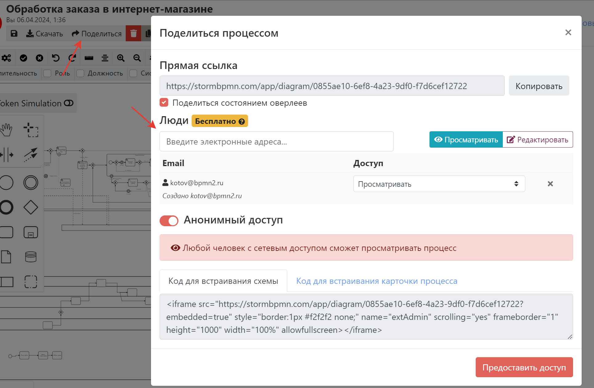
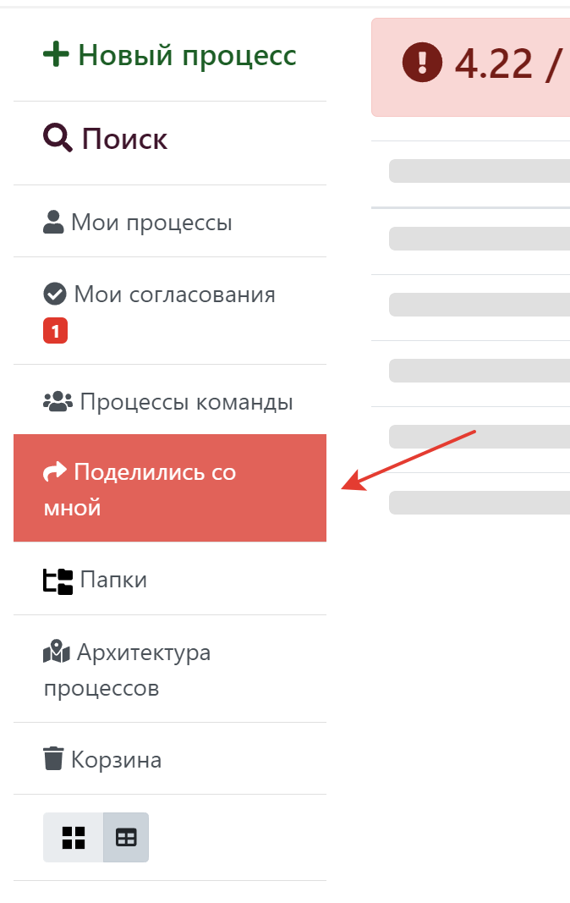

# Совместная работа
:::danger
Раздел в разработке. Одновременная работа с одной диаграммой из нескольких вкладок или браузеров пока не поддерживается.
:::

Совместная работа в система в работе предназначена для того, чтобы экономить ваше время за счет:
- Все видят одни и теже процессы
- Все процессы в актуальном состоянии
- Не надо пересылать файлы и ссылки
- Все изменения версионируются и можно откатиться к пред. версиям, если кто-то что-то сломал
- Можно посмотреть, чем текущая версия отличается от предидущей.

## 4 типа совместной работы
В системе существует несколько способов поделиться своей работой с коллегами - на уровне процесса, на уровне папки, на уровне команды и на уровне предприятия.  

 Чем ближе выданы права к диаграмме, тем они сильнее. Т.е. права на уровне процесса сильнее прав на уровне папки. А на уровне папки - сильнее чем на уровне команды.

### На уровне процесса - поделиться конкретным процессом 
Вы можете поделиться конкретной диаграммой с конкретными пользователями. Это хорошо работает, когда вам нужно просто поделиться одной диаграммой.

::: tip
Используйте этот способ, если хотите поделиться процессом не заставляя регистрироваться в системе. Включите галочку анонимный доступ.
:::

На этом экране можно настраивать:
- Отображение [оверлеев](../features/#меню-оверлеев)  по ссылке
- Просматривать, редактировать или удалять права конкретных пользователей на диаграмму
- Предоставлять анонимный доступ 
- Предоставлять доступ к диаграмме для организации (только ENTERPRISE-версия)
- Просматривать код для встраивания диаграммы в системы типа Confluence

Чтобы посмотреть и массово управлять такими выданными правами, нужно перейти в раздел [гости](https://stormbpmn.com/app/guests). 

::: warning

Такое предоставление доступа не делает получателя доступа членом вашей команды. Такое предоставление доступа потребяет лимит бесплатных доступов на тарифе Personal.

::: 

При выдаче доступа человек получит уведомление по почте с предложением зарегистрироваться (если не было учетной записи в системе) или с тем, что ему предоставлен доступ (если учетная запись была).
Все диаграммы, которыми когда либо делились с человеком, доступы на главной странице в разделе "Поделились со мной":  

### На уровне папки

В тарифе TEAM существует возможность поделится конкретной папкой с конкретным человеком. По смыслу работает точно так же  - отображается в "поделились со мной", шлется нотификация. При этом человек НЕ увидит внутреннюю структуру папок, а просто увидит их все скопом.  Анонимный доступ до папок невозможен.

::: tip
Этот вариант хорошо работает, когда вы не хотите приглашать человека в вашу команду, но вам нужно поделиться с ним группой каких-то процессов.
::: 

## Управление командой
### Cоздание команды
### Приглашение в команду
### Управление правами
### Обеспечение качества работы команды

## Поделиться процессом
## Встроить процесс
## Поделиться папкой
