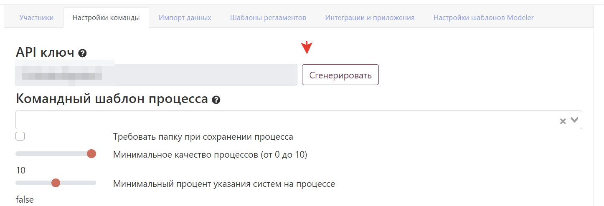

---
dir:
    order: 7
    link: true
    text: 6. REST API
    collapsible: false
order: 7
---

[[toc]]

# REST API

Система предоставляет REST API для автоматизации основных задач - получения и изменения диаграмм, управления элементами архитектуры. API работает по протоколу HTTP с сериализацией JSON.

::: warning Ограничения облачной версии
В облачной версии действуют ограничения на использование API по скорости и размеру запросов.
:::

---

## Авторизация

### Получение ключа API

Для получения ключа API выполните следующие шаги:

1. Перейдите в раздел **"Команда"**
2. Откройте вкладку **"Настройки команды"**
3. Нажмите **"Сгенерировать ключ"**



### Использование ключа

| Параметр         | Значение              | Описание                                     |
| ---------------- | --------------------- | -------------------------------------------- |
| **Заголовок**    | `X-Api-Key`           | Добавляйте ко всем API запросам              |
| **Права**        | Администратор команды | Действия выполняются от имени администратора |
| **Безопасность** | Конфиденциально       | Не передавайте ключ третьим лицам            |

---

## Ограничения облачной версии

### Лимиты по умолчанию

| Параметр               | Значение          | Описание                                      |
| ---------------------- | ----------------- | --------------------------------------------- |
| **Скорость запросов**  | 5 запросов/минуту | Проверяйте заголовок `X-Rate-Limit-Remaining` |
| **Размер запроса**     | 10 МБ             | Максимальный размер одного запроса            |
| **Диаграмм за запрос** | 20 штук           | Для методов загрузки диаграмм                 |

### Превышение лимитов

**При достижении квоты:**

```json
{
    "timestamp": "2022-06-28T12:03:03.438+00:00",
    "status": 429,
    "error": "Too Many Requests",
    "message": "You have exhausted your API Request Quota",
    "path": "/public-api/v1/upload-diagrams"
}
```

**Заголовки ответа:**

-   `X-Rate-Limit-Remaining` - оставшиеся запросы
-   `X-Rate-Limit-Retry-After-Seconds` - время ожидания до следующей попытки

::: danger Блокировка аккаунта
При превышении лимита более 3 раз за 24 часа учетная запись будет заблокирована. Обратитесь в поддержку для разблокировки.
:::

---

## Загрузка диаграмм

### Основной метод

**Путь:** `POST /public-api/v1/upload-diagrams`

### Структура запроса

```json
[
    {
        "id": "Meeting Scheduling:1:1123",
        "xml": "<?xml version=\"1.0\" encoding=\"UTF-8\"?>...",
        "name": "Meetings",
        "source": "CamundaMeetingsBackend"
    }
]
```

### Параметры запроса

| Поле       | Тип      | Обязательное | Описание                            |
| ---------- | -------- | ------------ | ----------------------------------- |
| **id**     | `string` | ✅           | Внешний идентификатор процесса      |
| **xml**    | `string` | ✅           | XML тело диаграммы (экранированное) |
| **name**   | `string` | ✅           | Имя процесса (важно для обновлений) |
| **source** | `string` | ✅           | Источник версии для истории         |

### Структура ответа

```json
{
    "errors": {
        "emptyName": [],
        "emptyDefinition": [],
        "notXml": []
    },
    "createdDiagrams": [],
    "updatedDiagrams": [
        {
            "stormDiagramId": "94d2e63f-f84a-40d4-b4a3-592b0cc7c7d9",
            "sourceDiagramId": "rhsrthsrth"
        }
    ]
}
```

### Важные особенности

-   **Максимум 20 диаграмм** в одном запросе
-   **Поле name критично** - не изменяйте в Storm для обновлений
-   **Версионность** - диаграммы с одинаковым ID обновляются по порядку
-   **История версий** - можно загружать разные версии в одном запросе

### Пример shell-скрипта для Camunda

::: tip Автоматизация для Camunda
Используйте этот скрипт для автоматического обновления диаграмм после деплоя:
:::

```bash
#!/bin/bash
# Сбор BPMN файлов и отправка в StormBPMN
files=($(ls ./src/main/resources/bpmn/*.bpmn))
size=${#files[@]}
echo '[' > temp.json
counter=1

echo "Начинаем обработку файлов..."
for file in ${files[*]}; do
  id="$(grep -Po '(?<=<bpmn:process\sid=")[^"]+' $file)"
  content="$(cat $file | sed 's/"/\\"/g;')"
  name="$(basename $file .bpmn)"
  echo '{"id":"'$id'","xml":"'$content'", "name": "'$name'", "source": "app"}' >> temp.json

  # Запятые между объектами (не в конце списка)
  if ((counter % 20)) && ((size != counter)) ; then
    echo ',' >> temp.json
  fi

  # Отправка пакета по 20 диаграмм
  if ! ((counter % 20)); then
    echo ']' >> temp.json
    curl -X POST -H "X-Api-Key: API-KEY" -H "Content-Type: application/json" \
         -d @temp.json stormbpmn.com/public-api/v1/upload-diagrams -i
    rm temp.json
    echo '[' > temp.json
  fi

  ((counter=counter+1))

  # Соблюдение лимита скорости
  if ((counter > 100)); then
    sleep 60
  fi
done

# Отправка оставшихся диаграмм
echo ']' >> temp.json
curl -X POST -H "X-Api-Key: API_KEY" -H "Content-Type: application/json" \
     -d @temp.json stormbpmn.com/public-api/v1/upload-diagrams -i
rm temp.json
```

---

## Управление элементами архитектуры

### Загрузка и обновление

**Путь:** `POST /public-api/v1/assets`

### Структура запроса

```json
[
    {
        "id": null,
        "externalId": null,
        "name": "B2C USER",
        "description": "",
        "externalUrl": null,
        "type": "CLIENT",
        "status": "NEW"
    }
]
```

### Параметры запроса

| Поле            | Тип      | Обязательное | Описание                       |
| --------------- | -------- | ------------ | ------------------------------ |
| **id**          | `number` | 📎           | ID элемента в системе          |
| **externalId**  | `string` | 📎           | ID элемента во внешней системе |
| **name**        | `string` | ✅           | Название элемента              |
| **description** | `string` | 📄           | HTML описание (unescaped)      |
| **externalUrl** | `string` | 📄           | Ссылка с плейсхолдерами        |
| **type**        | `enum`   | 📄           | Тип элемента архитектуры       |
| **status**      | `enum`   | 📄           | Статус элемента                |

### Типы элементов архитектуры

| Значение        | Описание                     |
| --------------- | ---------------------------- |
| `UNSPECIFIED`   | Не определено (по умолчанию) |
| `DOCUMENT`      | Документ                     |
| `SYSTEM`        | Система                      |
| `COMMUNICATION` | Коммуникация                 |
| `CLIENT`        | Клиент                       |
| `ENTITY`        | Сущность                     |
| `ACTION`        | Действие                     |
| `OTHER`         | Прочее                       |

### Статусы элементов

| Значение          | Описание              |
| ----------------- | --------------------- |
| `NEW`             | Новый                 |
| `TRIAL`           | Тестирование          |
| `PRODUCTION`      | Продакшн              |
| `DECOMMISSIONING` | Вывод из эксплуатации |
| `ARCHIVE`         | Архив                 |

### Логика обновления

| Условие                  | Действие                     |
| ------------------------ | ---------------------------- |
| **Только externalId**    | Обновление по внешнему ID    |
| **Только id**            | Обновление по внутреннему ID |
| **И id, и externalId**   | Обновление по внутреннему ID |
| **Ни id, ни externalId** | Создание нового элемента     |

---

## Получение списка диаграмм

### Основной метод

**Путь:** `GET /public-api/v1/get-diagram-list`

### Query-параметры

| Параметр | Тип      | Обязательный | Описание             |
| -------- | -------- | ------------ | -------------------- |
| **page** | `number` | ✅           | Номер страницы (с 0) |

### Структура ответа

```json
{
    "totalElements": 223,
    "page": 0,
    "size": 20,
    "returnDiagrams": [
        {
            "id": "6b547a8f-a78f-4375-b39e-59c4afd9388e",
            "name": "Draft",
            "status": "NEW",
            "versionNumber": 3,
            "updatedBy": "kotov@bpmn2.ru",
            "teamName": "Мои кредиты",
            "type": "BCM",
            "public": true,
            "createdOn": "2024-05-02T17:19:41.459888",
            "updatedOn": "2024-05-02T17:28:07.695362"
        }
    ]
}
```

::: info Права доступа
Список диаграмм зависит от прав администратора команды на диаграммы.
:::

---

## Получение диаграммы по ID

### Основной метод

**Путь:** `GET /public-api/v1/get-diagram-by-id`

### Query-параметры

| Параметр      | Тип    | Обязательный | Описание                           |
| ------------- | ------ | ------------ | ---------------------------------- |
| **diagramId** | `UUID` | ✅           | Уникальный идентификатор диаграммы |

### Ключевые поля ответа

| Поле              | Тип      | Описание                 |
| ----------------- | -------- | ------------------------ |
| **id**            | `UUID`   | Идентификатор диаграммы  |
| **name**          | `string` | Название диаграммы       |
| **body**          | `string` | XML содержимое диаграммы |
| **versionNumber** | `number` | Номер версии             |
| **status**        | `string` | Статус диаграммы         |
| **type**          | `string` | Тип диаграммы            |

::: warning Изменения контракта
Контракт API может измениться. Используйте tolerant reader для получения нужных полей (обычно это поле `body`).
:::

---

## Обновление описания элемента

### Основной метод

**Путь:** `POST /public-api/v1/element-description/{diagramId}/{elementId}`

### Параметры пути

| Параметр      | Тип      | Описание                |
| ------------- | -------- | ----------------------- |
| **diagramId** | `UUID`   | Идентификатор диаграммы |
| **elementId** | `string` | Идентификатор элемента  |

### Структура запроса

```json
{
    "description": "Подробное описание элемента",
    "duration": 3600,
    "externalLink": "https://wiki.company.com/process"
}
```

### Параметры запроса

| Поле             | Тип      | Описание                       |
| ---------------- | -------- | ------------------------------ |
| **description**  | `string` | HTML описание (экранированное) |
| **duration**     | `number` | Длительность в секундах        |
| **externalLink** | `string` | Внешняя ссылка                 |

---

## Получение согласований

### Основной метод

**Путь:** `GET /public-api/v1/approvals`

### Query-параметры

| Параметр       | Тип       | Обязательный | Описание                |
| -------------- | --------- | ------------ | ----------------------- |
| **userEmail**  | `string`  | ✅           | Email участника команды |
| **status**     | `enum`    | 📄           | Статус согласования     |
| **isApprover** | `boolean` | 📄           | Признак согласующего    |

### Статусы согласований

| Значение    | Описание             |
| ----------- | -------------------- |
| `PENDING`   | Ожидает согласования |
| `ACCEPTED`  | Принято              |
| `DECLINED`  | Отклонено            |
| `COMPLETED` | Завершено            |

### Структура ответа

```json
{
    "content": [
        {
            "id": "867bc39c-9145-4eb5-b59f-00545a6a9a3f",
            "approverEmail": "user@company.com",
            "diagramId": "fbeb4c64-e172-4e09-9fa1-6e509a11ffde",
            "diagramName": "Работа с подрядчиком",
            "status": "PENDING",
            "createdOn": "2025-01-23T17:44:27.323817",
            "diagramVersion": "11"
        }
    ],
    "totalElements": 1,
    "totalPages": 1,
    "size": 20,
    "number": 0
}
```

## Работа с организационной структурой

Организационная структура состоит из нескольких ключевых сущностей:

### Основные сущности

**OrgItem** - элемент организационной структуры. Бывает двух типов:

-   **Должность** - например "Генеральный директор"
-   **Группа** - например "Служба финансового контроля"

::: tip Связь с Ролями

Роли - это внутренняя абстракция Stormbpmn. OrgItem могут быть назначены на роли. В этом случае удалить их из API не получится, надо выполнить перепривязку через UI.

:::

**OrgItemEdge** - связь между элементами оргструктуры, отображающая подчиненность.

-   Например: "Служба финансового контроля" подчиняется "Генеральному директору"
-   У каждого OrgItem может быть только одна родительская связь (двойное подчинение недопустимо)

**Person** - сотрудник организации

**OrgItemPersonEdge** - назначение сотрудника на элемент организационной структуры

-   Например: "Котов Д.Г." назначен на должность "Генеральный директор"
-   Person может быть назначен на несколько OrgItem
-   Person может быть назначен ТОЛЬКО на OrgItem с типом "Должность"

::: tip Важно
Работа с сущностями разделена на отдельные методы. Целостность с точки зрения бизнес-логики поддерживает вызывающая система. Целостность с точки зрения валидации и связей между существующими сущностями обеспечивает система.
:::

---

### Атрибутивный состав сущностей

#### OrgItem

| Атрибут       | Тип    | Описание                                      |
| ------------- | ------ | --------------------------------------------- |
| `id`          | UUID   | Внутренний идентификатор                      |
| `externalId`  | string | Идентификатор во внешней системе (уникальный) |
| `type`        | ENUM   | `POSITION` (должность) или `OU` (группа)      |
| `name`        | string | Название                                      |
| `description` | string | Описание в HTML формате                       |
| `color`       | string | Цвет в HEX формате                            |

#### OrgItemEdge

| Атрибут            | Тип    | Описание                                 |
| ------------------ | ------ | ---------------------------------------- |
| `id`               | UUID   | Внутренний идентификатор                 |
| `sourceId`         | UUID   | Идентификатор родительского элемента     |
| `targetId`         | UUID   | Идентификатор дочернего элемента         |
| `externalSourceId` | string | Внешний идентификатор родителя           |
| `externalTargetId` | string | Внешний идентификатор дочернего элемента |

#### Person

| Атрибут      | Тип    | Описание                                         |
| ------------ | ------ | ------------------------------------------------ |
| `id`         | UUID   | Внутренний идентификатор                         |
| `externalId` | string | Идентификатор во внешней системе (уникальный)    |
| `email`      | string | Электронная почта                                |
| `phone`      | string | Телефон                                          |
| `firstName`  | string | Имя                                              |
| `lastName`   | string | Фамилия                                          |
| `patronymic` | string | Отчество                                         |
| `photoUrl`   | string | Ссылка на фотографию (через API загрузки файлов) |

#### OrgItemPersonEdge

| Атрибут            | Тип    | Описание                      |
| ------------------ | ------ | ----------------------------- |
| `id`               | UUID   | Внутренний идентификатор      |
| `sourceId`         | UUID   | Идентификатор OrgItem         |
| `personId`         | UUID   | Идентификатор Person          |
| `externalSourceId` | string | Внешний идентификатор OrgItem |
| `externalPersonId` | string | Внешний идентификатор Person  |

---

### Методы API

#### Создание OrgItem

**Путь:** `POST /public-api/v1/org-items`

**Структура запроса:**

```json
[
    {
        "externalId": "CEO_POSITION_001",
        "type": "POSITION",
        "name": "Генеральный директор",
        "description": "<p>Руководитель организации</p>",
        "color": "#FF6B6B"
    }
]
```

**Параметры запроса:**

| Поле            | Тип      | Обязательное | Описание                                    |
| --------------- | -------- | ------------ | ------------------------------------------- |
| **externalId**  | `string` | ✅           | Уникальный идентификатор во внешней системе |
| **type**        | `enum`   | ✅           | `POSITION` (должность) или `OU` (группа)    |
| **name**        | `string` | ✅           | Название элемента                           |
| **description** | `string` | 📄           | Описание в HTML формате                     |
| **color**       | `string` | 📄           | Цвет в HEX формате                          |

**Структура ответа:**

```json
{
    "created": [
        {
            "id": "a1b2c3d4-e5f6-7890-abcd-ef1234567890",
            "externalId": "CEO_POSITION_001",
            "type": "POSITION",
            "name": "Генеральный директор",
            "description": "<p>Руководитель организации</p>",
            "color": "#FF6B6B"
        }
    ],
    "errors": []
}
```

#### Чтение OrgItem

**Путь:** `GET /public-api/v1/org-items`

**Query-параметры:**

| Параметр | Тип      | Обязательный | Описание                          |
| -------- | -------- | ------------ | --------------------------------- |
| **page** | `number` | 📄           | Номер страницы (по умолчанию 0)   |
| **size** | `number` | 📄           | Размер страницы (по умолчанию 20) |

**Получение по ID:**

**Путь:** `GET /public-api/v1/org-items/{id}`

**Параметры пути:**

| Параметр | Тип    | Описание                 |
| -------- | ------ | ------------------------ |
| **id**   | `UUID` | Внутренний идентификатор |

**Получение по внешнему ID:**

**Путь:** `GET /public-api/v1/org-items/by-external-id/{externalId}`

**Параметры пути:**

| Параметр       | Тип      | Описание                       |
| -------------- | -------- | ------------------------------ |
| **externalId** | `string` | Внешний идентификатор элемента |

**Структура ответа:**

```json
{
    "id": "a1b2c3d4-e5f6-7890-abcd-ef1234567890",
    "externalId": "CEO_POSITION_001",
    "type": "POSITION",
    "name": "Генеральный директор",
    "description": "<p>Руководитель организации</p>",
    "color": "#FF6B6B",
    "parentItems": {},
    "childItems": [
        {
            "id": "b2c3d4e5-f6g7-8901-bcde-f23456789012",
            "externalId": "b2c3d4e5-f6g7-8901-bcde-f23456789012",
            "name": "Заместитель генерального директора"
        }
    ],
    "assignedPersons": [
        {
            "externalId": "CEO_POSITION_001",
            "id": "c3d4e5f6-g7h8-9012-cdef-345678901234",
            "firstName": "Дмитрий",
            "lastName": "Котов",
            "email": "kotov@company.com"
        }
    ]
}
```

#### Обновление OrgItem

**Путь:** `PUT /public-api/v1/org-items/{id}`

**Параметры пути:**

| Параметр | Тип    | Описание                 |
| -------- | ------ | ------------------------ |
| **id**   | `UUID` | Внутренний идентификатор |

**Обновление по внешнему ID:**

**Путь:** `PUT /public-api/v1/org-items/by-external-id/{externalId}`

**Структура запроса:**

```json
{
    "name": "Генеральный директор (обновлено)",
    "description": "<p>Главное лицо организации</p>",
    "color": "#4ECDC4"
}
```

**Параметры запроса:**

| Поле            | Тип      | Обязательное | Описание              |
| --------------- | -------- | ------------ | --------------------- |
| **name**        | `string` | 📄           | Новое название        |
| **description** | `string` | 📄           | Новое описание в HTML |
| **color**       | `string` | 📄           | Новый цвет в HEX      |

::: warning Важно
Тип элемента (`type`) изменить нельзя после создания. Для смены типа необходимо удалить и создать новый элемент.
:::

#### Удаление OrgItem

**Путь:** `DELETE /public-api/v1/org-items/{id}`

**Параметры пути:**

| Параметр | Тип    | Описание                 |
| -------- | ------ | ------------------------ |
| **id**   | `UUID` | Внутренний идентификатор |

**Удаление по внешнему ID:**

**Путь:** `DELETE /public-api/v1/org-items/by-external-id/{externalId}`

**Структура ответа:**

```json
{
    "deleted": true,
    "id": "a1b2c3d4-e5f6-7890-abcd-ef1234567890",
    "message": "OrgItem успешно удален"
}
```

**Условия удаления:**

-   ✅ Элемент без связей можно удалить сразу
-   ⚠️ Элемент с дочерними связями удаляется только после удаления всех связей
-   ⚠️ Элемент с назначенными сотрудниками удаляется только после отзыва всех назначений

::: danger Каскадное удаление
Каскадное удаление не поддерживается.
:::

#### Создание Person

**Путь:** `POST /public-api/v1/persons`

**Структура запроса:**

```json
[
    {
        "externalId": "KOTOV_DG_001",
        "email": "kotov@company.com",
        "phone": "+7 (495) 123-45-67",
        "firstName": "Дмитрий",
        "lastName": "Котов",
        "patronymic": "Георгиевич",
        "photoUrl": "/userFiles/1.png"
    }
]
```

**Параметры запроса:**

| Поле           | Тип      | Обязательное | Описание                                         |
| -------------- | -------- | ------------ | ------------------------------------------------ |
| **externalId** | `string` | 📄           | Уникальный идентификатор во внешней системе      |
| **email**      | `string` | 📄           | Электронная почта сотрудника                     |
| **phone**      | `string` | 📄           | Телефон сотрудника                               |
| **firstName**  | `string` | ✅           | Имя сотрудника                                   |
| **lastName**   | `string` | 📄           | Фамилия сотрудника                               |
| **patronymic** | `string` | 📄           | Отчество сотрудника                              |
| **photoUrl**   | `string` | 📄           | Ссылка на фотографию (через API загрузки файлов) |

**Структура ответа:**

```json
{
    "created": [
        {
            "id": "c3d4e5f6-g7h8-9012-cdef-345678901234",
            "externalId": "KOTOV_DG_001",
            "email": "kotov@company.com",
            "phone": "+7 (495) 123-45-67",
            "firstName": "Дмитрий",
            "lastName": "Котов",
            "patronymic": "Георгиевич",
            "photoUrl": "https://company.com/photos/kotov.jpg"
        }
    ],
    "errors": []
}
```

#### Чтение Person

**Путь:** `GET /public-api/v1/persons`

**Query-параметры:**

| Параметр  | Тип      | Обязательный | Описание                          |
| --------- | -------- | ------------ | --------------------------------- |
| **page**  | `number` | 📄           | Номер страницы (по умолчанию 0)   |
| **size**  | `number` | 📄           | Размер страницы (по умолчанию 20) |
| **email** | `string` | 📄           | Фильтр по электронной почте       |

**Получение по ID:**

**Путь:** `GET /public-api/v1/persons/{id}`

**Параметры пути:**

| Параметр | Тип    | Описание                 |
| -------- | ------ | ------------------------ |
| **id**   | `UUID` | Внутренний идентификатор |

**Получение по внешнему ID:**

**Путь:** `GET /public-api/v1/persons/by-external-id/{externalId}`

**Параметры пути:**

| Параметр       | Тип      | Описание                       |
| -------------- | -------- | ------------------------------ |
| **externalId** | `string` | Внешний идентификатор элемента |

**Структура ответа:**

```json
{
    "id": "c3d4e5f6-g7h8-9012-cdef-345678901234",
    "externalId": "KOTOV_DG_001",
    "email": "kotov@company.com",
    "phone": "+7 (495) 123-45-67",
    "firstName": "Дмитрий",
    "lastName": "Котов",
    "patronymic": "Георгиевич",
    "photoUrl": "https://company.com/photos/kotov.jpg",
    "assignedPositions": [
        {
            "id": "a1b2c3d4-e5f6-7890-abcd-ef1234567890",
            "externalId": "CEO_POSITION_001",
            "name": "Генеральный директор",
            "type": "POSITION"
        }
    ]
}
```

#### Обновление Person

**Путь:** `PUT /public-api/v1/persons/{id}`

**Параметры пути:**

| Параметр | Тип    | Описание                 |
| -------- | ------ | ------------------------ |
| **id**   | `UUID` | Внутренний идентификатор |

**Обновление по внешнему ID:**

**Путь:** `PUT /public-api/v1/persons/by-external-id/{externalId}`

**Структура запроса:**

```json
{
    "email": "d.kotov@company.com",
    "phone": "+7 (495) 987-65-43",
    "firstName": "Дмитрий",
    "lastName": "Котов",
    "patronymic": "Георгиевич",
    "photoUrl": "/photos/kotov_new.jpg"
}
```

**Параметры запроса:**

| Поле           | Тип      | Обязательное | Описание                   |
| -------------- | -------- | ------------ | -------------------------- |
| **email**      | `string` | 📄           | Новая электронная почта    |
| **phone**      | `string` | 📄           | Новый телефон              |
| **firstName**  | `string` | 📄           | Новое имя                  |
| **lastName**   | `string` | 📄           | Новая фамилия              |
| **patronymic** | `string` | 📄           | Новое отчество             |
| **photoUrl**   | `string` | 📄           | Новая ссылка на фотографию |

#### Удаление Person

**Путь:** `DELETE /public-api/v1/persons/{id}`

**Параметры пути:**

| Параметр | Тип    | Описание                 |
| -------- | ------ | ------------------------ |
| **id**   | `UUID` | Внутренний идентификатор |

**Удаление по внешнему ID:**

**Путь:** `DELETE /public-api/v1/persons/by-external-id/{externalId}`

**Структура ответа:**

```json
{
    "deleted": true,
    "id": "c3d4e5f6-g7h8-9012-cdef-345678901234",
    "message": "Person успешно удален"
}
```

**Условия удаления:**

-   ✅ Сотрудника без назначений можно удалить сразу
-   ⚠️ Сотрудника с активными назначениями удаляется только после отзыва всех назначений

::: warning Важно
При удалении сотрудника не происходит автоматического удаления связанных `OrgItemPersonEdge`. Необходимо сначала удалить все назначения.
:::

#### Создание OrgItemEdge

**Путь:** `POST /public-api/v1/org-item-edges`

**Структура запроса:**

```json
[
    {
        "sourceId": "a1b2c3d4-e5f6-7890-abcd-ef1234567890",
        "targetId": "b2c3d4e5-f6g7-8901-bcde-f23456789012",
        "externalSourceId": "CEO_POSITION_001",
        "externalTargetId": "DEPUTY_CEO_001"
    }
]
```

**Параметры запроса:**

| Поле                 | Тип      | Обязательное | Описание                             |
| -------------------- | -------- | ------------ | ------------------------------------ |
| **sourceId**         | `UUID`   | 📎           | Внутренний ID родительского элемента |
| **targetId**         | `UUID`   | 📎           | Внутренний ID дочернего элемента     |
| **externalSourceId** | `string` | 📎           | Внешний ID родительского элемента    |
| **externalTargetId** | `string` | 📎           | Внешний ID дочернего элемента        |

::: tip Логика создания
Можно использовать либо внутренние ID (`sourceId`, `targetId`), либо внешние ID (`externalSourceId`, `externalTargetId`). При указании и внутренних, и внешних ID приоритет отдается внутренним.
:::

**Структура ответа:**

```json
{
    "created": [
        {
            "id": "d4e5f6g7-h8i9-0123-defg-456789012345",
            "sourceId": "a1b2c3d4-e5f6-7890-abcd-ef1234567890",
            "targetId": "b2c3d4e5-f6g7-8901-bcde-f23456789012",
            "externalSourceId": "CEO_POSITION_001",
            "externalTargetId": "DEPUTY_CEO_001",
            "sourceItem": {
                "id": "a1b2c3d4-e5f6-7890-abcd-ef1234567890",
                "name": "Генеральный директор"
            },
            "targetItem": {
                "id": "b2c3d4e5-f6g7-8901-bcde-f23456789012",
                "name": "Заместитель генерального директора"
            }
        }
    ],
    "errors": []
}
```

#### Чтение OrgItemEdge

**Путь:** `GET /public-api/v1/org-item-edges`

**Query-параметры:**

| Параметр             | Тип      | Обязательный | Описание                          |
| -------------------- | -------- | ------------ | --------------------------------- |
| **page**             | `number` | 📄           | Номер страницы (по умолчанию 0)   |
| **size**             | `number` | 📄           | Размер страницы (по умолчанию 20) |
| **sourceId**         | `UUID`   | 📄           | Фильтр по родительскому элементу  |
| **targetId**         | `UUID`   | 📄           | Фильтр по дочернему элементу      |
| **externalSourceId** | `string` | 📄           | Фильтр по внешнему ID родителя    |

**Получение по ID:**

**Путь:** `GET /public-api/v1/org-item-edges/{id}`

**Параметры пути:**

| Параметр | Тип    | Описание                 |
| -------- | ------ | ------------------------ |
| **id**   | `UUID` | Внутренний идентификатор |

**Структура ответа:**

```json
{
    "id": "d4e5f6g7-h8i9-0123-defg-456789012345",
    "sourceId": "a1b2c3d4-e5f6-7890-abcd-ef1234567890",
    "targetId": "b2c3d4e5-f6g7-8901-bcde-f23456789012",
    "externalSourceId": "CEO_POSITION_001",
    "externalTargetId": "DEPUTY_CEO_001",
    "sourceItem": {
        "id": "a1b2c3d4-e5f6-7890-abcd-ef1234567890",
        "externalId": "CEO_POSITION_001",
        "name": "Генеральный директор",
        "type": "POSITION"
    },
    "targetItem": {
        "id": "b2c3d4e5-f6g7-8901-bcde-f23456789012",
        "externalId": "DEPUTY_CEO_001",
        "name": "Заместитель генерального директора",
        "type": "POSITION"
    }
}
```

#### Обновление OrgItemEdge

**Путь:** `PUT /public-api/v1/org-item-edges/{id}`

**Параметры пути:**

| Параметр | Тип    | Описание                 |
| -------- | ------ | ------------------------ |
| **id**   | `UUID` | Внутренний идентификатор |

**Структура запроса:**

```json
{
    "sourceId": "a1b2c3d4-e5f6-7890-abcd-ef1234567890",
    "targetId": "c3d4e5f6-g7h8-9012-cdef-345678901234",
    "externalSourceId": "CEO_POSITION_001",
    "externalTargetId": "HR_MANAGER_001"
}
```

**Параметры запроса:**

| Поле                 | Тип      | Обязательное | Описание                        |
| -------------------- | -------- | ------------ | ------------------------------- |
| **sourceId**         | `UUID`   | 📎           | Новый ID родительского элемента |
| **targetId**         | `UUID`   | 📎           | Новый ID дочернего элемента     |
| **externalSourceId** | `string` | 📎           | Новый внешний ID родителя       |
| **externalTargetId** | `string` | 📎           | Новый внешний ID дочернего      |

#### Удаление OrgItemEdge

**Путь:** `DELETE /public-api/v1/org-item-edges/{id}`

**Параметры пути:**

| Параметр | Тип    | Описание                 |
| -------- | ------ | ------------------------ |
| **id**   | `UUID` | Внутренний идентификатор |

**Удаление по связи:**

**Путь:** `DELETE /public-api/v1/org-item-edges/by-relation`

**Query-параметры:**

| Параметр             | Тип      | Обязательный | Описание                  |
| -------------------- | -------- | ------------ | ------------------------- |
| **sourceId**         | `UUID`   | 📎           | ID родительского элемента |
| **targetId**         | `UUID`   | 📎           | ID дочернего элемента     |
| **externalSourceId** | `string` | 📎           | Внешний ID родительского  |
| **externalTargetId** | `string` | 📎           | Внешний ID дочернего      |

**Структура ответа:**

```json
{
    "deleted": true,
    "id": "d4e5f6g7-h8i9-0123-defg-456789012345",
    "message": "OrgItemEdge успешно удален"
}
```

**Условия удаления:**

-   ✅ Связь можно удалить в любой момент
-   ⚠️ При удалении связи дочерний элемент становится корневым (без родителя)

::: warning Важно
Удаление связи не удаляет сами элементы OrgItem. Удаляется только отношение подчиненности между ними.
:::

#### Создание OrgItemPersonEdge

**Путь:** `POST /public-api/v1/org-item-person-edges`

**Структура запроса:**

```json
[
    {
        "sourceId": "a1b2c3d4-e5f6-7890-abcd-ef1234567890",
        "personId": "c3d4e5f6-g7h8-9012-cdef-345678901234",
        "externalSourceId": "CEO_POSITION_001",
        "externalPersonId": "KOTOV_DG_001"
    }
]
```

**Параметры запроса:**

| Поле                 | Тип      | Обязательное | Описание                            |
| -------------------- | -------- | ------------ | ----------------------------------- |
| **sourceId**         | `UUID`   | 📎           | Внутренний ID элемента оргструктуры |
| **personId**         | `UUID`   | 📎           | Внутренний ID сотрудника            |
| **externalSourceId** | `string` | 📎           | Внешний ID элемента оргструктуры    |
| **externalPersonId** | `string` | 📎           | Внешний ID сотрудника               |

::: tip Логика создания
Можно использовать либо внутренние ID (`sourceId`, `personId`), либо внешние ID (`externalSourceId`, `externalPersonId`). При указании и внутренних, и внешних ID приоритет отдается внутренним.
:::

::: warning Ограничения
Сотрудника можно назначить ТОЛЬКО на элемент с типом `POSITION` (должность). Назначение на группы (`OU`) не поддерживается.
:::

**Структура ответа:**

```json
{
    "created": [
        {
            "id": "e5f6g7h8-i9j0-1234-efgh-567890123456",
            "sourceId": "a1b2c3d4-e5f6-7890-abcd-ef1234567890",
            "personId": "c3d4e5f6-g7h8-9012-cdef-345678901234",
            "externalSourceId": "CEO_POSITION_001",
            "externalPersonId": "KOTOV_DG_001",
            "orgItem": {
                "id": "a1b2c3d4-e5f6-7890-abcd-ef1234567890",
                "name": "Генеральный директор",
                "type": "POSITION"
            },
            "person": {
                "id": "c3d4e5f6-g7h8-9012-cdef-345678901234",
                "firstName": "Дмитрий",
                "lastName": "Котов",
                "email": "kotov@company.com"
            }
        }
    ],
    "errors": []
}
```

#### Чтение OrgItemPersonEdge

**Путь:** `GET /public-api/v1/org-item-person-edges`

**Query-параметры:**

| Параметр             | Тип      | Обязательный | Описание                          |
| -------------------- | -------- | ------------ | --------------------------------- |
| **page**             | `number` | 📄           | Номер страницы (по умолчанию 0)   |
| **size**             | `number` | 📄           | Размер страницы (по умолчанию 20) |
| **sourceId**         | `UUID`   | 📄           | Фильтр по элементу оргструктуры   |
| **personId**         | `UUID`   | 📄           | Фильтр по сотруднику              |
| **externalSourceId** | `string` | 📄           | Фильтр по внешнему ID должности   |
| **email**            | `string` | 📄           | Фильтр по email сотрудника        |

**Получение по ID:**

**Путь:** `GET /public-api/v1/org-item-person-edges/{id}`

**Параметры пути:**

| Параметр | Тип    | Описание                 |
| -------- | ------ | ------------------------ |
| **id**   | `UUID` | Внутренний идентификатор |

**Структура ответа:**

```json
{
    "id": "e5f6g7h8-i9j0-1234-efgh-567890123456",
    "sourceId": "a1b2c3d4-e5f6-7890-abcd-ef1234567890",
    "personId": "c3d4e5f6-g7h8-9012-cdef-345678901234",
    "externalSourceId": "CEO_POSITION_001",
    "externalPersonId": "KOTOV_DG_001",
    "orgItem": {
        "id": "a1b2c3d4-e5f6-7890-abcd-ef1234567890",
        "externalId": "CEO_POSITION_001",
        "name": "Генеральный директор",
        "type": "POSITION",
        "description": "<p>Руководитель организации</p>",
        "color": "#FF6B6B"
    },
    "person": {
        "id": "c3d4e5f6-g7h8-9012-cdef-345678901234",
        "externalId": "KOTOV_DG_001",
        "firstName": "Дмитрий",
        "lastName": "Котов",
        "patronymic": "Георгиевич",
        "email": "kotov@company.com",
        "phone": "+7 (495) 123-45-67"
    }
}
```

#### Обновление OrgItemPersonEdge

**Путь:** `PUT /public-api/v1/org-item-person-edges/{id}`

**Параметры пути:**

| Параметр | Тип    | Описание                 |
| -------- | ------ | ------------------------ |
| **id**   | `UUID` | Внутренний идентификатор |

**Структура запроса:**

```json
{
    "sourceId": "b2c3d4e5-f6g7-8901-bcde-f23456789012",
    "personId": "c3d4e5f6-g7h8-9012-cdef-345678901234",
    "externalSourceId": "DEPUTY_CEO_001",
    "externalPersonId": "KOTOV_DG_001"
}
```

**Параметры запроса:**

| Поле                 | Тип      | Обязательное | Описание                       |
| -------------------- | -------- | ------------ | ------------------------------ |
| **sourceId**         | `UUID`   | 📎           | Новый ID элемента оргструктуры |
| **personId**         | `UUID`   | 📎           | Новый ID сотрудника            |
| **externalSourceId** | `string` | 📎           | Новый внешний ID должности     |
| **externalPersonId** | `string` | 📎           | Новый внешний ID сотрудника    |

#### Удаление OrgItemPersonEdge

**Путь:** `DELETE /public-api/v1/org-item-person-edges/{id}`

**Параметры пути:**

| Параметр | Тип    | Описание                 |
| -------- | ------ | ------------------------ |
| **id**   | `UUID` | Внутренний идентификатор |

**Удаление по назначению:**

**Путь:** `DELETE /public-api/v1/org-item-person-edges/by-assignment`

**Query-параметры:**

| Параметр             | Тип      | Обязательный | Описание                 |
| -------------------- | -------- | ------------ | ------------------------ |
| **sourceId**         | `UUID`   | 📎           | ID элемента оргструктуры |
| **personId**         | `UUID`   | 📎           | ID сотрудника            |
| **externalSourceId** | `string` | 📎           | Внешний ID должности     |
| **externalPersonId** | `string` | 📎           | Внешний ID сотрудника    |

**Удаление всех назначений сотрудника:**

**Путь:** `DELETE /public-api/v1/org-item-person-edges/by-person`

**Query-параметры:**

| Параметр             | Тип      | Обязательный | Описание              |
| -------------------- | -------- | ------------ | --------------------- |
| **personId**         | `UUID`   | 📎           | ID сотрудника         |
| **externalPersonId** | `string` | 📎           | Внешний ID сотрудника |

**Структура ответа:**

```json
{
    "deleted": true,
    "id": "e5f6g7h8-i9j0-1234-efgh-567890123456",
    "message": "OrgItemPersonEdge успешно удален"
}
```

**Условия удаления:**

-   ✅ Назначение можно отозвать в любой момент
-   ✅ При удалении всех назначений сотрудника он становится неназначенным
-   ✅ При удалении назначения должность остается свободной

::: warning Важно
Удаление назначения не удаляет ни сотрудника, ни должность. Удаляется только связь между ними.
:::

---

### Рекомендуемые сценарии работы

#### Первичное создание организационной структуры

1. **Создать OrgItems** (должности и группы)
2. **Создать OrgItemEdges** (связи подчиненности)
3. **Создать Person** (сотрудников)
4. **Создать OrgItemPersonEdge** (назначения на должности)

#### Обновление атрибутов (без изменения связей)

-   **OrgItem/Person**: обновление через соответствующий метод с `externalId`

#### Обновление связей (OrgItemEdges, OrgItemPersonEdge)

1. Убедиться, что необходимые `sourceId`, `targetId`, `personId` созданы и актуальны
2. Обновить соответствующие связи

#### Удаление элементов структуры (OrgItem, Person)

1. **Удалить все связанные привязки**
2. **Удалить OrgItem/Person**

#### Удаление связей (OrgItemEdges, OrgItemPersonEdge)

1. **Удалить/изменить** все зависимые привязки через `sourceId`, `targetId`, `personId`
2. **Удалить** OrgItemEdges/OrgItemPersonEdge

---

## Лучшие практики

### Оптимизация запросов

| Рекомендация           | Описание                               |
| ---------------------- | -------------------------------------- |
| **Пакетная обработка** | Отправляйте до 20 диаграмм за раз      |
| **Соблюдение лимитов** | Мониторьте заголовки rate limit        |
| **Retry логика**       | Реализуйте повторные попытки с backoff |
| **Логирование**        | Сохраняйте ID запросов для отладки     |

### Безопасность

| Аспект            | Рекомендация                             |
| ----------------- | ---------------------------------------- |
| **API ключи**     | Храните в переменных окружения           |
| **HTTPS**         | Используйте только защищенные соединения |
| **Права доступа** | Ограничивайте права API ключей           |
| **Ротация**       | Регулярно обновляйте ключи               |

### Мониторинг

-   **Отслеживайте лимиты** через заголовки ответов
-   **Логируйте ошибки** для анализа проблем
-   **Мониторьте время ответа** API
-   **Анализируйте использование** квот

::: tip Интеграция с CI/CD
Интегрируйте API в пайплайны развертывания для автоматического обновления диаграмм после изменений в коде.
:::

---

## Связанные разделы

-   **[Конфигурация](../configure/README.md)** - настройка системы
-   **[Безопасность](../configure/SECURE.md)** - настройки безопасности
-   **[Поддержка](../support/README.md)** - помощь при проблемах с API
