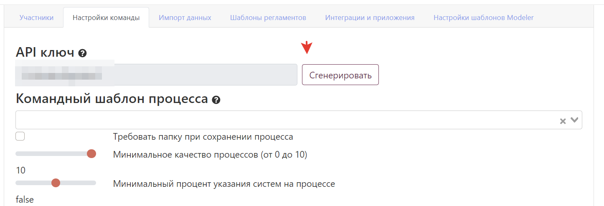

---
dir:
    order: 6
    link: true
    text: 6. REST API
    collapsible: true
index: true
order: 6
---

[[toc]]

# REST API

Система предоставляет REST API для автоматизации основных задач - получения и изменения диаграмм, управления элементами архитектуры. API работает по протоколу HTTP с сериализацией JSON.

::: warning Ограничения облачной версии
В облачной версии действуют ограничения на использование API по скорости и размеру запросов.
:::

---

## Авторизация

### Получение ключа API

Для получения ключа API выполните следующие шаги:

1. Перейдите в раздел **"Команда"**
2. Откройте вкладку **"Настройки команды"**
3. Нажмите **"Сгенерировать ключ"**



### Использование ключа

| Параметр         | Значение              | Описание                                     |
| ---------------- | --------------------- | -------------------------------------------- |
| **Заголовок**    | `X-Api-Key`           | Добавляйте ко всем API запросам              |
| **Права**        | Администратор команды | Действия выполняются от имени администратора |
| **Безопасность** | Конфиденциально       | Не передавайте ключ третьим лицам            |

---

## Ограничения облачной версии

### Лимиты по умолчанию

| Параметр               | Значение          | Описание                                      |
| ---------------------- | ----------------- | --------------------------------------------- |
| **Скорость запросов**  | 5 запросов/минуту | Проверяйте заголовок `X-Rate-Limit-Remaining` |
| **Размер запроса**     | 10 МБ             | Максимальный размер одного запроса            |
| **Диаграмм за запрос** | 20 штук           | Для методов загрузки диаграмм                 |

### Превышение лимитов

**При достижении квоты:**

```json
{
    "timestamp": "2022-06-28T12:03:03.438+00:00",
    "status": 429,
    "error": "Too Many Requests",
    "message": "You have exhausted your API Request Quota",
    "path": "/public-api/v1/upload-diagrams"
}
```

**Заголовки ответа:**

-   `X-Rate-Limit-Remaining` - оставшиеся запросы
-   `X-Rate-Limit-Retry-After-Seconds` - время ожидания до следующей попытки

::: danger Блокировка аккаунта
При превышении лимита более 3 раз за 24 часа учетная запись будет заблокирована. Обратитесь в поддержку для разблокировки.
:::

---

## Разделы справочника

- **[Диаграммы и элементы архитектуры](./diagrams.md)** — загрузка диаграмм, элементы архитектуры, получение списка/по ID, описания, согласования.
- **[Метрики процессов](./metrics.md)** — управление метриками процессов.
- **[Организационная структура](./org-structure.md)** — оргюниты, должности, сотрудники, связи.

---

## Лучшие практики

### Оптимизация запросов

| Рекомендация           | Описание                               |
| ---------------------- | -------------------------------------- |
| **Пакетная обработка** | Отправляйте до 20 диаграмм за раз      |
| **Соблюдение лимитов** | Мониторьте заголовки rate limit        |
| **Retry логика**       | Реализуйте повторные попытки с backoff |
| **Логирование**        | Сохраняйте ID запросов для отладки     |

### Безопасность

| Аспект            | Рекомендация                             |
| ----------------- | ---------------------------------------- |
| **API ключи**     | Храните в переменных окружения           |
| **HTTPS**         | Используйте только защищенные соединения |
| **Права доступа** | Ограничивайте права API ключей           |
| **Ротация**       | Регулярно обновляйте ключи               |

### Мониторинг

-   **Отслеживайте лимиты** через заголовки ответов
-   **Логируйте ошибки** для анализа проблем
-   **Мониторьте время ответа** API
-   **Анализируйте использование** квот

::: tip Интеграция с CI/CD
Интегрируйте API в пайплайны развертывания для автоматического обновления диаграмм после изменений в коде.
:::

---

## Связанные разделы

-   **[Конфигурация](/configure/README.md)** - настройка системы
-   **[Безопасность](/configure/security/)** - настройки безопасности
-   **[Поддержка](/support/README.md)** - помощь при проблемах с API
