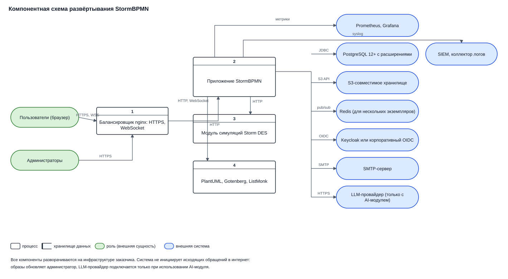

---
dir:
    order: 11
    link: true
    text: 11. Архитектурное ревью
    collapsible: true
index: true
order: 11
---

[[toc]]

# Пакет для архитектурного ревью

Перед закупкой корпоративного программного обеспечения крупные компании проводят внутреннее
архитектурное ревью: заказчик со стороны бизнеса вместе с корпоративным архитектором и службой
информационной безопасности защищают решение перед комитетом. Для защиты нужен набор артефактов —
как правило, статья во внутренней вики компании с описанием системы, схемами и требованиями.

Этот раздел собирает всё, что обычно требуется на такой защите, в готовом для копирования виде.
Материалы одинаковы для всех заказчиков: описывается сама система, а не конкретная инсталляция.
Всё, что относится к вашей организации — размер инсталляции, классификация данных, целевые
показатели восстановления, — заполняете вы; для каждого такого пункта ниже указано, где взять
исходные данные.

::: tip Как пользоваться разделом
Скопируйте нужные страницы в свою вики и дополните их данными своей инсталляции. Схемы приложены
в формате SVG — их можно вставить в документ как есть или перерисовать в принятой у вас нотации,
опираясь на таблицы потоков данных.
:::

## Что входит в пакет

| Артефакт | Страница | Что закрывает на ревью |
| --- | --- | --- |
| Процессы внутри системы и диаграммы потоков данных (DFD) | [Процессы и потоки данных](./processes.md) | «Что пользователь делает в системе», Dataflow Diagram |
| Ролевая модель, матрица привилегий, RACI | [Ролевая модель и RACI](./roles-raci.md) | Разграничение доступа, RBAC, RACI |
| Жизненный цикл учётной записи | [Управление пользователями](./user-management.md) | Процессы управления пользователями и доступом |
| Каталог функциональных требований | [Функциональные требования](./functional-requirements.md) | Functional Requirements, объём внедряемой функциональности |
| Сводная карточка решения и нефункциональные требования | [Системный дизайн и НФТ](./system-design.md) | System Design, Non-Functional и Support Requirements |
| Компонентная схема | [ниже](#компонентная-схема) | Application Components Diagram |

## Краткое описание системы

Готовый текст для раздела «Краткое описание» — можно копировать без изменений.

> **StormBPMN** — платформа для описания, согласования и поддержания в актуальном состоянии
> бизнес-процессов организации. Пользователи моделируют процессы в нотации BPMN 2.0 и других
> поддерживаемых нотациях, ведут реестр процессов с атрибутами и статусами, связывают процессы
> с организационной структурой, ролями и элементами ИТ-архитектуры, согласуют модели с
> заинтересованными лицами и публикуют утверждённые версии для чтения.
>
> Решение поставляется как веб-приложение в контейнере и разворачивается на инфраструктуре
> заказчика (on-premise или в частном облаке). Пользователи работают через браузер, отдельный
> клиент не устанавливается. Система использует внешние компоненты заказчика: реляционную базу
> данных PostgreSQL, S3-совместимое объектное хранилище, корпоративный сервер аутентификации
> по протоколу OIDC/OAuth2 и почтовый сервер.

Дополнительные сведения для карточки приложения — модель размещения, тип лицензии, состав
компонентов, версия — приведены на странице [Системный дизайн и НФТ](./system-design.md).

## Компонентная схема

| № | Компонент | Назначение | Обязательность |
| --- | --- | --- | --- |
| 1 | Балансировщик nginx | Терминация HTTPS, проксирование HTTP и WebSocket на приложение | Обязателен в продуктивной установке |
| 2 | Приложение StormBPMN | Основной сервис: интерфейс, REST API, бизнес-логика, фоновые задания | Обязателен |
| 3 | Модуль симуляций Storm DES | Имитационное моделирование процессов | Опционален, отдельная лицензия |
| 4 | PlantUML, Gotenberg, ListMonk | Генерация UML-диаграмм, конвертация документов в PDF, шаблонные рассылки | Опциональны, по функциям |
| — | PostgreSQL 12+ | Хранение всех данных платформы | Обязателен |
| — | S3-совместимое хранилище | Файлы, вложения, превью моделей | Обязательно |
| — | Redis | Совместное редактирование при нескольких экземплярах приложения | Требуется только для нескольких экземпляров |
| — | Корпоративный IdP | Аутентификация пользователей по OIDC/OAuth2 | Рекомендуется; есть встроенная аутентификация |
| — | SMTP-сервер | Письма: приглашения, согласования, уведомления | Обязателен для уведомлений |
| — | Prometheus, Grafana | Метрики и алерты | Рекомендуются |
| — | SIEM или коллектор логов | Приём журнала действий по syslog | Рекомендуется |
| — | LLM-провайдер | Работа AI-ассистента | Только при использовании AI-модуля |

Подробные требования к каждому компоненту — в разделах [Установка](/install/README.md) и
[Внешние сервисы](/install/production/components.md).

## Соответствие типовой структуре карточки приложения

Во внутренних вики компаний карточка приложения обычно построена по одной и той же схеме. Ниже —
где брать содержимое для каждого её раздела.

| Раздел карточки приложения | Где взять |
| --- | --- |
| Краткое описание | [Выше](#краткое-описание-системы) |
| Функциональные требования | [Функциональные требования](./functional-requirements.md) |
| Нефункциональные требования | [Системный дизайн и НФТ](./system-design.md#нефункциональные-требования) |
| Требования к поддержке и обслуживанию | [Системный дизайн и НФТ](./system-design.md#обслуживание-и-поддержка) |
| Диаграмма компонентов приложения | [Выше](#компонентная-схема) |
| Диаграмма потоков данных | [Процессы и потоки данных](./processes.md) |
| Системный дизайн (таблица «категория — решение») | [Системный дизайн и НФТ](./system-design.md#карточка-системного-дизайна) |
| Инфраструктурная схема | Строится заказчиком под свою площадку; исходные данные — [Схема архитектуры](/get-started.md) и [Установка](/install/README.md) |
| Сервисные учётные записи | [Системный дизайн и НФТ](./system-design.md#сервисные-учётные-записи) |
| Ограничения | [Системный дизайн и НФТ](./system-design.md#ограничения) |
| Инструкция по установке | [Установка](/install/README.md), [Быстрый старт](/install/quickstart/QUICKSTART_MANUAL.md) |
| Резервное копирование и восстановление | [Обслуживание](/operation/README.md#резервное-копирование), [Мониторинг и бэкапы](/install/production/monitoring-backup.md) |

## Что запросить у поставщика

Часть данных для ревью зависит от договора и не может быть опубликована заранее. Эти сведения
предоставляет менеджер по вашему проекту — напишите на **help@stormbpmn.com**:

- письмо о составе и сроке действия лицензии, порядке её продления;
- сведения о поддержке: режим, каналы, целевые сроки реакции;
- подтверждение состава обрабатываемых персональных данных для вашего сценария использования;
- параметры доступа к реестру контейнеров и порядок проверки подписи образов (Cosign);
- при необходимости — заполнение опросника вашей службы информационной безопасности.

## Чек-лист подготовки к ревью

1. Скопировать краткое описание и каталог функциональных требований, вычеркнуть функции,
   которые вы не внедряете в первой итерации.
2. Взять из [DFD](./processes.md) те схемы, которые соответствуют вашему сценарию, при
   необходимости перерисовать в принятой нотации.
3. Заполнить [карточку системного дизайна](./system-design.md#карточка-системного-дизайна)
   значениями своей инсталляции: версия ОС, размер, способ аутентификации, интеграции.
4. Определить классификацию данных и состав персональных данных для своего контура —
   см. [обрабатываемые данные](./system-design.md#обрабатываемые-данные).
5. Согласовать со службой эксплуатации целевые RTO и RPO и расписание резервного копирования.
6. Назначить роли по [RACI](./roles-raci.md#матрица-raci-по-процессам) и договориться,
   кто в организации выдаёт права в системе.
7. Приложить инфраструктурную схему своей площадки и перечень сервисных учётных записей.
