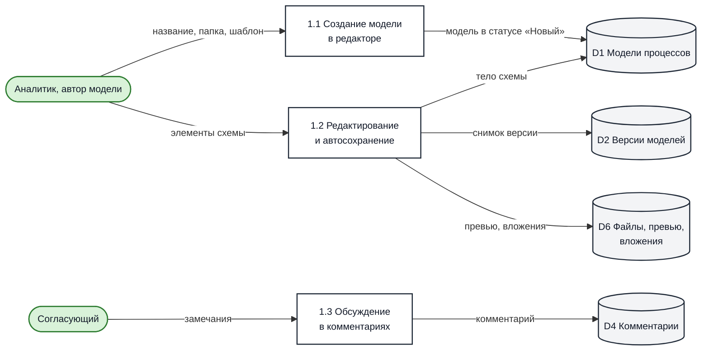
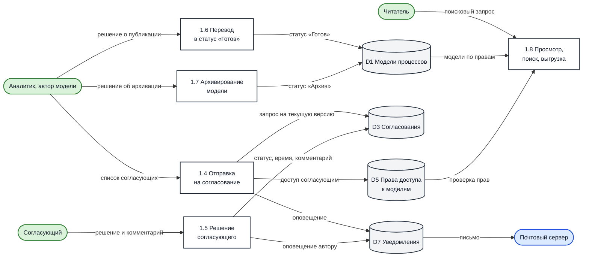
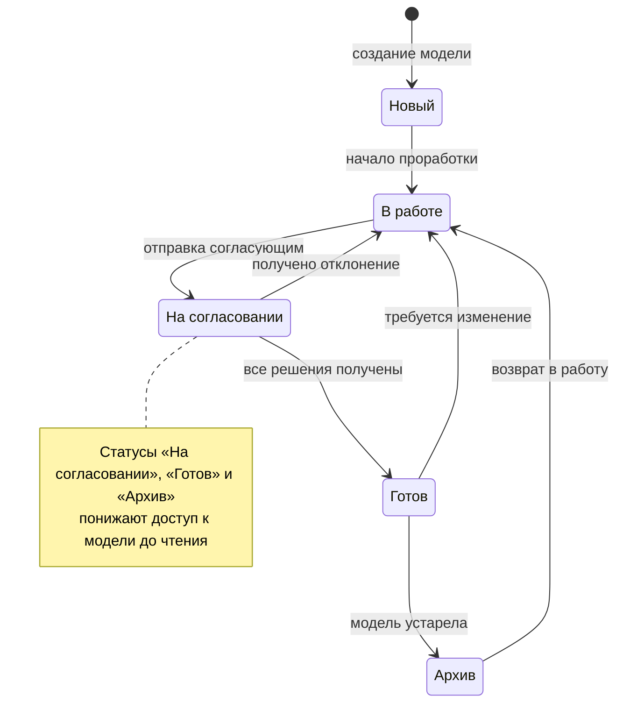
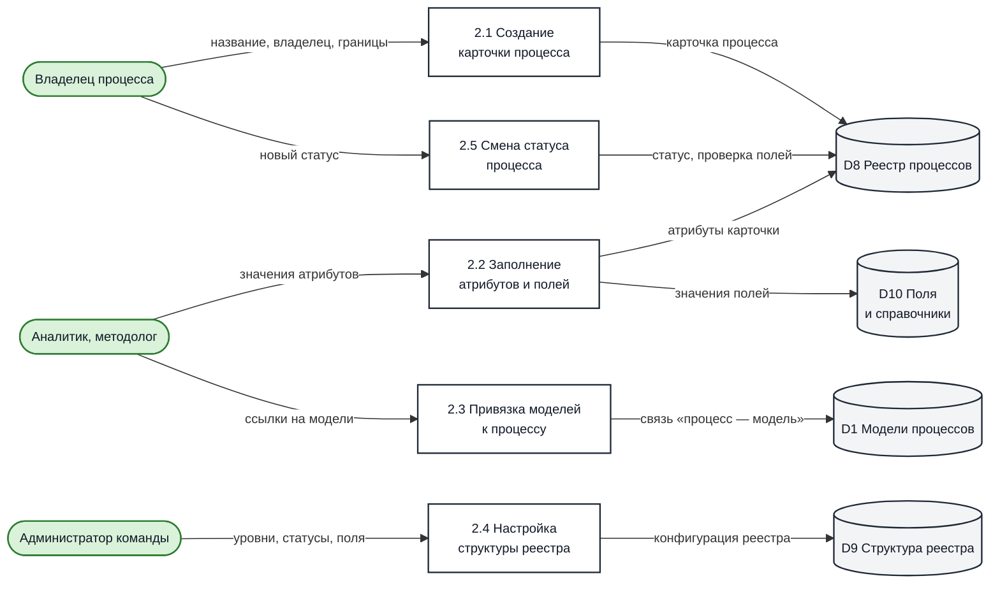
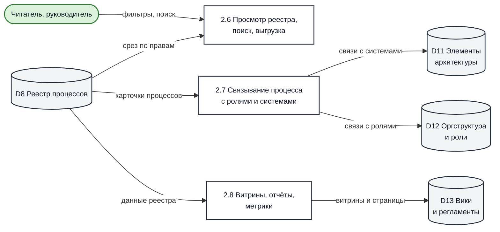
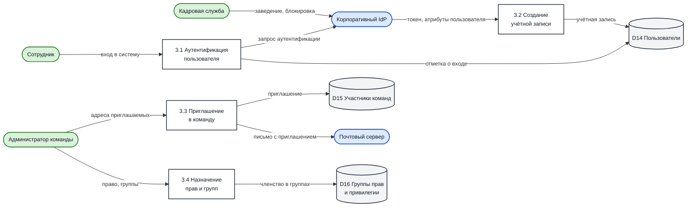
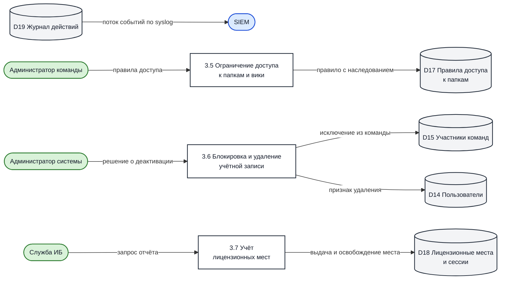

[[toc]]

# Процессы и потоки данных (DFD)

На архитектурном ревью почти всегда звучит вопрос: «Пользователь открыл систему — что он в ней
делает?» Ответ на него — не список кнопок интерфейса, а описание процессов, которые проходят
внутри системы, и данных, которые при этом перемещаются.

Здесь описаны процессы **самой платформы**: моделирование, согласование и публикация моделей,
ведение реестра процессов, управление пользователями и правами. Это те цепочки, которые
поддерживает продукт независимо от того, какие бизнес-процессы вы в нём описываете.

::: tip Что здесь не описано
Порядок работы с инструментом внутри вашей организации — кто и когда обязан моделировать, какая
методология принята, какие процессы описываются в первую очередь — определяется вашими
внутренними регламентами. Платформа поддерживает разные подходы; типовую схему внедрения
см. в [Плане внедрения](/recipes/Implementation_plan.md).
:::

## Условные обозначения

Схемы построены как диаграммы потоков данных (DFD) в упрощённых обозначениях.

| Обозначение | Смысл |
| --- | --- |
| Прямоугольник с номером | Процесс — действие, которое преобразует данные |
| Цилиндр | Хранилище данных |
| Зелёная скруглённая фигура | Внешняя сущность: роль пользователя |
| Синяя скруглённая фигура | Внешняя сущность: смежная система |
| Стрелка с подписью | Поток данных и его содержание |

::: tip Схемы можно перерисовать под свою нотацию
Если у вас принята строгая нотация DFD — Йордана — Де Марко, Гейна — Сарсона или другая, —
перерисуйте схемы в ней: состав процессов, хранилищ и потоков от этого не изменится. Исходники
диаграмм лежат прямо в тексте страницы (блоки `mermaid`) — их удобно скопировать и править.
Полный перечень потоков продублирован таблицами: по ним схему можно собрать заново в любом
редакторе.
:::

## Контекстная диаграмма (уровень 0)

Система целиком, её пользователи и смежные системы.

```mermaid
%%{init: {"flowchart": {"useMaxWidth": true, "htmlLabels": true, "nodeSpacing": 45, "rankSpacing": 60}, "themeVariables": {"fontSize": "13px", "edgeLabelBackground": "#ffffff"}} }%%
flowchart LR
    classDef role fill:#d9f2d9,stroke:#2f7d32,stroke-width:1.5px,color:#111827
    classDef system fill:#dbeafe,stroke:#1d4ed8,stroke-width:1.5px,color:#111827
    classDef proc fill:#ffffff,stroke:#1f2937,stroke-width:1.5px,color:#111827

    analyst(["Аналитик, методолог"]):::role
    approver(["Согласующий"]):::role
    reader(["Читатель"]):::role
    teamadmin(["Администратор команды"]):::role
    sysadmin(["Администратор системы"]):::role
    security(["Служба ИБ"]):::role

    storm["0. Система StormBPMN:<br/>моделирование процессов, реестр процессов,<br/>архитектура, оргструктура, вики,<br/>управление доступом"]:::proc

    idp(["Корпоративный IdP<br/>OIDC / OAuth2"]):::system
    smtp(["Почтовый сервер SMTP"]):::system
    s3(["S3-совместимое хранилище"]):::system
    pg(["PostgreSQL"]):::system
    siem(["SIEM, коллектор логов"]):::system
    mon(["Prometheus, Grafana"]):::system

    analyst -- "модели процессов, атрибуты" --> storm
    storm -- "запрос на согласование" --> approver
    approver -- "решение по согласованию" --> storm
    storm -- "модели и карточки на чтение" --> reader
    teamadmin -- "права, группы, справочники" --> storm
    sysadmin -- "конфигурация, обновления" --> storm
    storm -- "события аудита" --> security

    storm <-- "аутентификация, атрибуты пользователя" --> idp
    storm -- "письма и приглашения" --> smtp
    storm <-- "файлы, превью, вложения" --> s3
    storm <-- "данные платформы" --> pg
    storm -- "журнал действий (syslog)" --> siem
    storm -- "метрики /actuator" --> mon
```

| Внешняя сущность | Тип | Что передаёт в систему | Что получает из системы |
| --- | --- | --- | --- |
| Аналитик, методолог | Роль | Модели процессов, атрибуты карточек, справочники | Модели, реестр, результаты поиска |
| Согласующий | Роль | Решение по согласованию, комментарии | Запрос на согласование, уведомления |
| Читатель | Роль | Поисковые запросы | Модели и карточки процессов на чтение |
| Администратор команды | Роль | Права, состав групп, структура реестра | Отчёт о составе участников и правах |
| Администратор системы | Роль | Конфигурация, обновления | Метрики, журналы, состояние системы |
| Служба ИБ | Роль | Запросы на выгрузку | События аудита |
| Корпоративный IdP | Система | Токен, подтверждённые атрибуты пользователя | Запрос аутентификации |
| Почтовый сервер | Система | — | Письма: приглашения, согласования, уведомления |
| S3-совместимое хранилище | Система | Файлы по запросу | Файлы, вложения, превью моделей |
| PostgreSQL | Система | Данные по запросу | Данные платформы |
| SIEM, коллектор логов | Система | — | Журнал действий по протоколу syslog |
| Prometheus, Grafana | Система | — | Метрики по эндпоинту `/actuator` |

## DFD-1. Жизненный цикл модели процесса

Основной сценарий работы аналитика: создать модель, обсудить, согласовать, опубликовать и через
время отправить в архив.

**Создание и правка модели.**

**Согласование, публикация и чтение.**

### Процессы

| № | Процесс | Что происходит |
| --- | --- | --- |
| 1.1 | Создание модели в редакторе | Пользователь создаёт модель в выбранной папке, при необходимости из шаблона. Модель получает статус «Новый» и владельца — автора |
| 1.2 | Редактирование и автосохранение | Правка схемы, описаний элементов, связей с ролями и элементами архитектуры. Изменения сохраняются автоматически, при сохранении фиксируется версия |
| 1.3 | Обсуждение в комментариях | Участники оставляют комментарии, в том числе привязанные к конкретному элементу схемы |
| 1.4 | Отправка на согласование | Автор указывает согласующих. Создаются запросы на текущую версию модели, согласующие получают доступ на чтение и уведомление. Модель переходит в статус «На согласовании» |
| 1.5 | Решение согласующего | Согласующий отвечает «согласовано» или «отклонено» с комментарием. Решение фиксируется вместе со временем |
| 1.6 | Перевод в статус «Готов» | После получения всех решений автор публикует модель. В статусе «Готов» модель доступна только на чтение |
| 1.7 | Архивирование модели | Устаревшая модель переводится в статус «Архив» и остаётся доступной на чтение |
| 1.8 | Просмотр, поиск, выгрузка | Читатели ищут модели, открывают их и выгружают в поддерживаемые форматы в пределах своих прав |

### Потоки данных

| Поток | Источник | Приёмник | Содержание |
| --- | --- | --- | --- |
| Название, папка, шаблон | Аналитик | 1.1 | Параметры создаваемой модели |
| Новая модель | 1.1 | D1 | Модель в статусе «Новый», автор, папка |
| Элементы схемы и описания | Аналитик | 1.2 | Содержимое диаграммы |
| Тело схемы и элементы | 1.2 | D1 | Актуальное состояние модели |
| Снимок версии | 1.2 | D2 | Версия модели с автором и временем |
| Превью и вложения | 1.2 | D6 | Изображение схемы, прикреплённые файлы |
| Комментарий | 1.3 | D4 | Текст, автор, привязка к элементу |
| Список согласующих | Аналитик | 1.4 | Адреса электронной почты согласующих |
| Запрос согласования | 1.4 | D3 | Запрос, привязанный к текущей версии модели |
| Доступ согласующим | 1.4 | D5 | Право на чтение модели для согласующих |
| Оповещение о запросе | 1.4 | D7 | Уведомление в системе и письмо |
| Решение и комментарий | Согласующий | 1.5 | «Согласовано» или «отклонено», текст |
| Статус решения | 1.5 | D3 | Решение, время, комментарий |
| Оповещение о решении | 1.5 | D7 | Уведомление автору, письмо о завершении согласования |
| Статус «Готов» | 1.6 | D1 | Смена статуса, модель становится доступной только на чтение |
| Статус «Архив» | 1.7 | D1 | Смена статуса |
| Модели, доступные читателю | D1 | 1.8 | Перечень моделей с учётом прав |
| Проверка прав | D5 | 1.8 | Права конкретного пользователя на модель |
| Письмо получателю | D7 | Почтовый сервер | Письмо по шаблону |

### Статусы модели

| Статус | Что означает | Максимальный доступ |
| --- | --- | --- |
| Новый | Модель создана, работа не начиналась | По правам пользователя |
| В работе | Модель в активной проработке | По правам пользователя |
| На согласовании | Отправлена согласующим, идёт сбор решений | Только чтение |
| Готов | Согласована и опубликована | Только чтение |
| Архив | Выведена из обращения, сохранена для истории | Только чтение |

::: warning Статус сильнее прав
Статусы «На согласовании», «Готов» и «Архив» ограничивают доступ уровнем чтения независимо от
прав пользователя: даже администратор команды не изменит такую модель, не сняв статус. Это
защищает утверждённые версии от незаметной правки. Полный порядок проверки прав на конкретную
модель описан в статье [Разделение прав доступа к диаграммам](/recipes/Access_to_diagrams.md).
:::

### Правила согласования

- Запрос на согласование привязан к **конкретной версии** модели. Если после отправки модель
  изменили и отправили заново, незакрытые запросы прошлой версии закрываются, а согласующие
  получают запрос на актуальную версию — согласование «задним числом» невозможно.
- Пока хотя бы один запрос текущей версии не получил ответа, модель нельзя вывести из статуса
  «На согласовании».
- Согласующим можно указать людей, которых ещё нет в системе: запрос создаётся на адрес
  электронной почты и связывается с учётной записью, когда человек её заводит.
- Когда получены все решения, автор получает уведомление и письмо о завершении согласования.
- Решение содержит автора, время и комментарий и остаётся в системе как след для аудита.

## DFD-2. Реестр процессов и справочники

Реестр процессов — каталог процессов организации с атрибутами, статусами и связями. Модели
привязываются к карточкам процессов, а не заменяют их.

**Ведение карточек процессов.**

**Связи, представления и витрины.**

| № | Процесс | Что происходит |
| --- | --- | --- |
| 2.1 | Создание карточки процесса | Заводится карточка: наименование, владелец, место в иерархии |
| 2.2 | Заполнение атрибутов и полей | Заполняются описание, признак переиспользуемости, значения пользовательских полей и справочников |
| 2.3 | Привязка моделей к процессу | К карточке привязываются модели, описывающие процесс на разных уровнях |
| 2.4 | Настройка структуры реестра | Администратор задаёт уровни процессов, набор статусов, состав и обязательность полей |
| 2.5 | Смена статуса процесса | Перевод карточки в следующий статус; при настроенной проверке система требует заполнить обязательные поля |
| 2.6 | Просмотр реестра, поиск, выгрузка | Чтение реестра с учётом прав, фильтрация, выгрузка |
| 2.7 | Связывание процесса с ролями и системами | Связи карточек и элементов моделей с ролями, подразделениями и элементами ИТ-архитектуры |
| 2.8 | Витрины, отчёты, метрики | Сводные представления по реестру, страницы вики со ссылками на процессы |

| Поток | Источник | Приёмник | Содержание |
| --- | --- | --- | --- |
| Название, владелец, границы | Владелец процесса | 2.1 | Исходные атрибуты карточки |
| Карточка процесса | 2.1 | D8 | Новая запись реестра |
| Значения полей | 2.2 | D10 | Значения пользовательских полей и справочников |
| Связь «процесс — модель» | 2.3 | D1 | Привязка модели к карточке |
| Конфигурация реестра | 2.4 | D9 | Уровни, статусы, обязательность полей |
| Статус процесса | 2.5 | D8 | Новый статус после проверки обязательных полей |
| Связи с архитектурой | 2.7 | D11 | Связи с информационными системами и их элементами |
| Связи с оргструктурой | 2.7 | D12 | Связи с ролями и подразделениями |
| Витрины и отчёты | 2.8 | D13 | Страницы вики, сводные представления |
| Срез реестра | D8 | 2.6 | Данные реестра, отфильтрованные по правам пользователя |

::: tip Статусы реестра настраиваются
В отличие от статусов модели, набор статусов процесса не фиксирован: администратор команды
заводит собственные статусы, задаёт стартовый и при необходимости включает проверку заполнения
обязательных полей при переходе.
:::

## DFD-3. Управление пользователями и правами

**Появление пользователя и выдача прав.**

**Ограничения, отзыв доступа и учёт мест.**

Процессы 3.1–3.7 подробно описаны на отдельной странице —
[Управление пользователями](./user-management.md), включая жизненный цикл учётной записи,
подключение к корпоративному каталогу и порядок отзыва доступа.

| № | Процесс | Краткое содержание |
| --- | --- | --- |
| 3.1 | Аутентификация пользователя | Вход через корпоративный IdP по OIDC/OAuth2 либо встроенная аутентификация |
| 3.2 | Создание учётной записи | Профиль создаётся по подтверждённым атрибутам из IdP при первом входе либо по приглашению |
| 3.3 | Приглашение в команду | Администратор команды приглашает участников и задаёт их право в команде |
| 3.4 | Назначение прав и групп | Включение участника в группы прав, определяющие доступные действия |
| 3.5 | Ограничение доступа к папкам и вики | Правила «разрешить» и «запретить» на папках и страницах с наследованием |
| 3.6 | Блокировка и удаление учётной записи | Отключение доступа, исключение из команд, удаление профиля |
| 3.7 | Учёт лицензионных мест | Контроль занятых мест и одновременных сессий |

## Хранилища данных

| Код | Хранилище | Где физически | Что содержит |
| --- | --- | --- | --- |
| D1 | Модели процессов | PostgreSQL | Схемы, их атрибуты, владельцы, статусы, размещение в папках |
| D2 | Версии моделей | PostgreSQL | Снимки моделей с автором и временем изменения |
| D3 | Согласования | PostgreSQL | Запросы, решения, комментарии, привязка к версии |
| D4 | Комментарии | PostgreSQL | Обсуждения моделей, привязка к элементам |
| D5 | Права доступа к моделям | PostgreSQL | Персональные доступы, доступ по ссылке, доступы согласующих |
| D6 | Файлы, превью, вложения | S3-совместимое хранилище | Изображения схем, вложенные документы |
| D7 | Уведомления | PostgreSQL | Оповещения в интерфейсе и очередь писем |
| D8 | Реестр процессов | PostgreSQL | Карточки процессов, иерархия, статусы |
| D9 | Структура реестра | PostgreSQL | Уровни, статусы, правила заполнения |
| D10 | Поля и справочники | PostgreSQL | Пользовательские поля, справочники и их значения |
| D11 | Элементы архитектуры | PostgreSQL | Информационные системы и их элементы, связи с процессами |
| D12 | Оргструктура и роли | PostgreSQL | Подразделения, должности, сотрудники, роли |
| D13 | Вики и регламенты | PostgreSQL | Страницы вики, ссылки на процессы и модели |
| D14 | Пользователи | PostgreSQL | Профили: имя, почта, должность, локаль, дата последнего входа |
| D15 | Участники команд | PostgreSQL | Членство в командах, право в команде, статус приглашения |
| D16 | Группы прав и привилегии | PostgreSQL | Группы и наборы привилегий |
| D17 | Правила доступа к папкам и вики | PostgreSQL | Разрешения и запреты, признак наследования |
| D18 | Лицензионные места и сессии | PostgreSQL | Занятые места, активные сессии |
| D19 | Журнал действий | Консоль, SIEM по syslog, отдельная база TimescaleDB | События входа и действий пользователей |

## Термины и сокращения

| Термин | Значение |
| --- | --- |
| BPMN | Business Process Model and Notation — нотация моделирования бизнес-процессов |
| DFD | Data Flow Diagram — диаграмма потоков данных |
| Модель (диаграмма) | Схема процесса, созданная в редакторе |
| Карточка процесса | Запись реестра процессов с атрибутами, к которой привязаны модели |
| Команда | Рабочее пространство организации или подразделения: участники, папки, справочники |
| Право в команде | Базовый уровень возможностей участника: администратор, чтение и изменение, только чтение, просмотр |
| Группа прав | Именованный набор привилегий, который выдаётся участникам |
| Привилегия | Разрешение на действие с объектом системы (создание, чтение, изменение, удаление) |
| Согласование | Запрос решения по конкретной версии модели, адресованный конкретному человеку |
| Элемент архитектуры | Информационная система или её компонент, с которыми связываются процессы |
| IdP | Identity Provider — корпоративный сервер аутентификации |
| OIDC | OpenID Connect — протокол аутентификации поверх OAuth2 |
| SIEM | Security Information and Event Management — система сбора и анализа событий безопасности |
| RTO, RPO | Целевое время восстановления и допустимая потеря данных |
