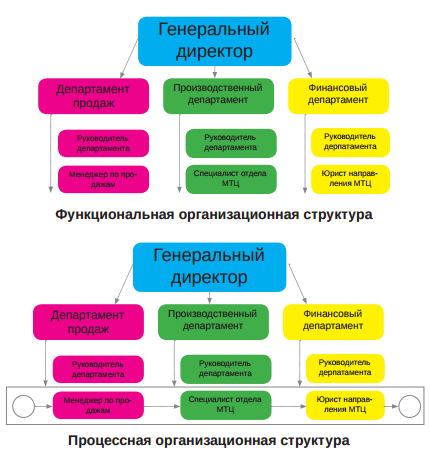
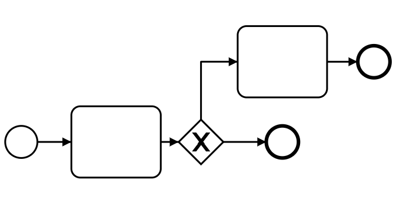
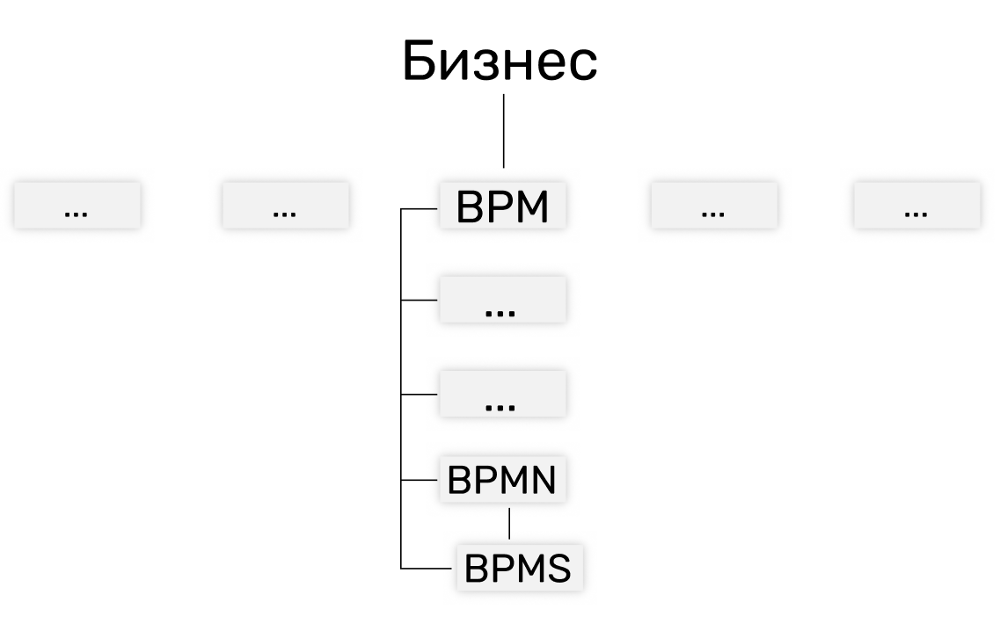

# 1 урок:  BPM, BPMN, BPMS

Привет!

Буквы почти одинаковые, а смысл разный. Сегодня разберем, что это значит и какое вам до этого дело.

## BPM, Business Process Management

Это способ вести бизнес, когда вы заставляете организацию работать в четкой последовательности и так, чтобы сотрудники внутри не спихивали ответственность друг на друга, а взаимодействовали.

Официальное определение [тут](https://abpmp.org.ru/resource/bpm-glossary/#bpm).

### BPM и проекты

Управление процессами похоже на управление проектами - есть ответственные за результат, прописаны регламенты, выделены сотрудники, есть специальный софт. 

Отличие заключается в результатах: по проекту вы делаете что-то уникальное и одно, а по процессам - много и одинаковое.

### BPM и функциональный подход

В функциональном подходе организация делится на части, которые делают строго определенную работу. Вы такое могли видеть, если работали в крупных организациях - когда в соседний отдел нужно писать служебку, чтобы вам починили мышку.

В BPM организация делится на части, которые тоже делают строго определенную работу, но уже в рамках последовательности работ, которая выстроена вокруг клиента. 

За прохождение заявки клиента через всю организацию отвечает один человек.   

BPM сконцентрирован на операционной части бизнеса - доставках, счетах, заявках. На том, что делается каждый день в большом количестве. 

Управление процессами скорее поможет сэкономить деньги, чем начать зарабатывать их больше.

## BPMN, Business Process Model and Notation

Это набор значков и правил их применения. Значки использую для описания процессов. BPMN придумали как способ общения между айтишниками и бизнесом.

Если схема процесса составлена с помощью BPMN, то она в таком же виде может быть скомпилирована программой. Таким образом бизнес  видит, как работает процесс и программа на его основе, а ИТ быстрее может вносить изменения.

BPMN - это инструмент, одного его знания не хватит для успешного управления процессами. Как наличие фотоаппарата не делает вас фотографом.

BPMN визуально выглядит простым. Кажется, что его очень легко освоить. Но если не пройти обучение, то схемы будут плохие, и основные преимущества BPMN потеряются.

## BPMS, Business Process Management Suite

Это класс программ, в которых с помощью BPMN можно моделировать процессы, компилировать схемы в приложения и постоянно эти приложения улучшать.

Например, у вас есть процесс "Заказ пиццы" из трёх задач:

- Выбрать пиццу;

- Согласовать с начальником;

- Оплатить.

Для такого процесса BPMS:

- Создаст веб-страницу с авторизацией;
- Нарисует кнопку "заказать пиццу";
- Сверстает визуальную форму для задачи "указать параметры пиццы";
- Отправит письмо ответственному за задачу "Согласовать покупку";
- Передаст данные из формы "указать параметры пиццы" в форму "Согласовать пиццу";
- Учтёт количество задач для каждого пользователя;
- Учтёт количество заказов пиццы;
- Посчитает временные интервалы - сколько времени занимает процессы и выгрузит его в Excel;
- Много других вещей: генерирует регламенты к процессам; уведомляет начальников, если кто-то не успевает вовремя; показывает визуально, где процесс и т.д.
- Часто бывает, что BPMS используют исключительно как софт, без цельного подхода к BPM.

## 3 термина вместе

Вот так соотносятся термины в мире бизнеса:

Можно прекрасно управлять процессами в Excel, использовать BPMN, чтобы рисовать схемы движения документов, программировать в BPMS складской учёт.

Но эффективнее применять всё вместе.