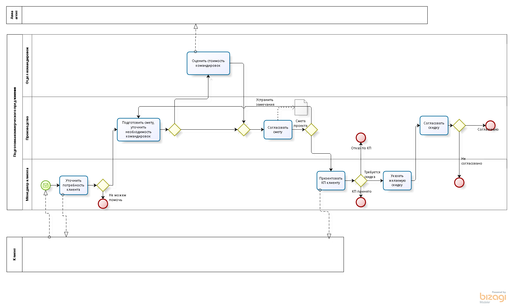
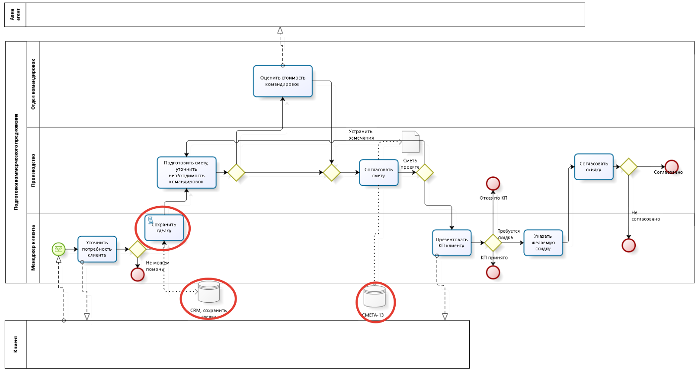

# 3 урок:  3 уровня моделирования BPMN-схем

Bpmn2 содержит ~480 элементов, которые не только описывают бизнес-процессы, но и могут использоваться для создания исполняемых программ в BPMS. При этом использование всей палитры может усложнить схему и сделать ее нечитаемой.

Авторы BPMN выделяют 3 уровня моделирования: 

- Согласовательный (описательный);

- Аналитический;

- Исполняемый.

Адаптация схемы под уровень моделирования и включение дополнительных деталей на каждом уровне помогут вам избежать проблем при согласовании и сэкономят много времени.

## Согласовательный уровень

Это уровень для руководства, которое заинтересовано в улучшении процесса. Как правило, руководителям интересны:

- результат процесса;
- основные задачи процесса;
- исполнители процесса;
- общение с внешними участниками процесса;
- KPI процесса.
- Если вы готовите такую схему, то учитывайте, что она должна быть понятна людям без опыта в BPMN.  

::: tip
Для подобных схем рекомендую использовать только элементы: пул, дорожка, задача, подпроцесс, начальное событие, промежуточное событие, завершающее событие, база данных, сообщения (про элементы еще будут письма).
:::

Схема должна показывать только один путь, приводящий процесс к ожидаемому результату.

В примере использованы подпроцессы (квадратики с плюсиками) и клиент, как внешняя, пустая сущность. Почему так сделано, вы узнаете из следующих писем, сейчас это не важно.

:::danger
Вы могли заметить **дорожки**, горизонтальные прямоугольники с названием ролей. Мы не советуем их использовать в реальной деятельности, но они хорошо подходят для обучения.
:::

## Аналитический уровень

Это уровень для непосредственных участников процесса и аналитика. Схема такого уровня может быть ежедневной инструкцией.

Для аналитиков из такой схемы интересны:

- логичность процесса в целом;
- разделение задач между системами и пользователями;
- потенциальная возможность улучшения процесса за счёт оптимизации или автоматизации.  
Для исполнителей интересно:

- что конкретно нужно делать.

В сравнении с согласовательной моделью здесь нужно:

- раскрыть подпроцессы до задач;
- указать данные, которые важны для процесса;
- указать альтернативные сценарии, если они есть.

Такую схему нужно обязательно согласовать с экспертами в предметной области, т.к. в дальнейшем эти схемы становятся базой для исполняемых моделей.  

## Исполняемый уровень
Модель этого уровня нужна для инженера BPMS. Она похожа на аналитическую модель, но должна быть дополнена следующей информацией (в том числе текстом):

- данные процесса;
- группы и роли;
- бизнес-правила;
- пользовательский интерфейс;
- KPI;
- скрипты и сервисные задачи.

Про каждый из пунктов ещё будут письма в рассылке.

## Выводы

Заранее определяйтесь с потребителями вашей схемы и используйте соответствующий уровень моделирования.