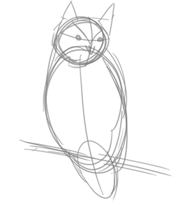

# 3 урок:  3 уровня моделирования BPMN-схем

Bpmn2 содержит ~480 элементов, которые не только описывают бизнес-процессы, но и могут использоваться для создания исполняемых программ в BPMS. При этом использование всей палитры может усложнить схему и сделать ее нечитаемой.

Авторы BPMN выделяют 3 уровня моделирования: 

- Согласовательный (описательный);

- Аналитический;

- Исполняемый.

Адаптация схемы под уровень моделирования и включение дополнительных деталей на каждом уровне помогут вам избежать проблем при согласовании и сэкономят много времени.

## Согласовательный уровень

Это уровень для руководства, которое заинтересовано в улучшении процесса. Как правило, руководителям интересны:

- результат процесса;
- основные задачи процесса;
- исполнители процесса;
- общение с внешними участниками процесса;
- KPI процесса;

Если вы готовите такую схему, то учитывайте, что она должна быть понятна людям без опыта в BPMN.  

::: tip
Для подобных схем рекомендую использовать только элементы: пул, задача, подпроцесс, начальное событие, промежуточное событие, завершающее событие.
:::

Схема должна показывать только один путь, приводящий процесс к ожидаемому результату.

В примере использованы подпроцессы (квадратики с плюсиками) и клиент, как внешняя, пустая сущность. Почему так сделано, вы узнаете из следующих писем, сейчас это не важно.

<iframe src="https://stormbpmn.com/app/diagram/e58ce143-18b1-4e2f-b808-0e56f8bd5605?overlays=eyJkdXJhdGlvbiI6ZmFsc2UsImFzc2lnbmVlcyI6dHJ1ZSwicG9zaXRpb25zIjpmYWxzZSwic3lzdGVtcyI6ZmFsc2UsImRvY3VtZW50cyI6ZmFsc2UsImxpbmtzIjpmYWxzZSwiY29tbWVudHMiOmZhbHNlLCJkZXNjcmlwdGlvbiI6ZmFsc2V9&embedded=true" style="border:1px #f2f2f2 none;" name="extAdmin" scrolling="no" frameborder="1"  height="500" width="100%" allowfullscreen></iframe>

## Аналитический уровень

Это уровень для непосредственных участников процесса и аналитика. Схема такого уровня может быть ежедневной инструкцией.

:::warning
Ежедневной инструкцией по тому, как работают процессы, но не как выполнять операции! BPMN плохо подходит для описания операций конкретной роли.
:::

Для аналитиков из такой схемы интересны:

- логичность процесса в целом;
- разделение задач между системами и пользователями;
- потенциальная возможность улучшения процесса за счёт оптимизации или автоматизации.  

Для исполнителей интересно:

- С кем общаться, когда выполняем процесс.

<iframe src="https://stormbpmn.com/app/diagram/c5ebe0b2-b8be-4a2c-974a-052cb42eccb4?overlays=eyJkdXJhdGlvbiI6dHJ1ZSwiYXNzaWduZWVzIjp0cnVlLCJwb3NpdGlvbnMiOnRydWUsInN5c3RlbXMiOnRydWUsImRvY3VtZW50cyI6dHJ1ZSwibGlua3MiOmZhbHNlLCJjb21tZW50cyI6ZmFsc2UsImRlc2NyaXB0aW9uIjpmYWxzZX0=&embedded=true" style="border:1px #f2f2f2 none;" name="extAdmin" scrolling="no" frameborder="1"  height="400" width="100%" allowfullscreen></iframe>

В сравнении с согласовательной моделью здесь нужно:

- раскрыть подпроцессы до задач;
- указать данные, которые важны для процесса;
- указать альтернативные сценарии, если они есть.

Такую схему нужно обязательно согласовать с экспертами в предметной области, т.к. в дальнейшем эти схемы становятся базой для исполняемых моделей.  

## Исполняемый уровень
Модель этого уровня нужна для инженера BPMS. Она похожа на аналитическую модель, но должна быть дополнена следующей информацией (в том числе текстом):

- данные процесса;
- группы и роли;
- бизнес-правила;
- пользовательский интерфейс;
- KPI;
- скрипты и сервисные задачи.

Про каждый из пунктов ещё будут письма в рассылке.
<iframe src="https://stormbpmn.com/app/diagram/6346b347-13b9-48f2-9cf6-b2fef7a89070?overlays=eyJkdXJhdGlvbiI6ZmFsc2UsImFzc2lnbmVlcyI6dHJ1ZSwicG9zaXRpb25zIjpmYWxzZSwic3lzdGVtcyI6dHJ1ZSwiZG9jdW1lbnRzIjp0cnVlLCJsaW5rcyI6ZmFsc2UsImNvbW1lbnRzIjpmYWxzZSwiZGVzY3JpcHRpb24iOmZhbHNlfQ==&embedded=true" style="border:1px #f2f2f2 none;" name="extAdmin" scrolling="no" frameborder="1"  height="500" width="100%" allowfullscreen></iframe>

## Выводы

Заранее определяйтесь с потребителями вашей схемы и используйте соответствующий уровень моделирования.