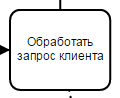
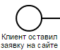
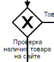
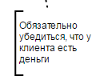
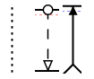
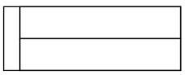

# 4 урок: BPMN для "чайников". Базовые элементы. (1/3)

Нотация BPMN делится на три части по уровню сложности - для чайников, для аналитиков и для исполняемых моделей в BPMS. Уровня "для чайников" хватит для создания согласовательных схем.

А аналитикам и инженерам нужно знать нотацию всю.

Сегодня поговорим про элементы для “чайников”, будет 3 письма на эту тему. Но сначала пару слов про BPMN в целом.

## Видеоверсия и повторение 3 урока

<iframe width="560" height="315" src="https://www.youtube.com/embed/qvXpMlXaRnQ?si=9XuIKPjr0iKMxfVD" title="YouTube video player" frameborder="0" allow="accelerometer; autoplay; clipboard-write; encrypted-media; gyroscope; picture-in-picture; web-share" referrerpolicy="strict-origin-when-cross-origin" allowfullscreen></iframe>

## BPMN развивается с 2004 года

Нотацию создавали и продолжают развивать с прицелом на:

- людей: в схемах, в основном, люди выполняют задачи.
- разрушение функционального разделения в компаниях: процессы не зависят от того, в каких департаментах числятся люди.
- потоки информации: процессы помогают понять, где, кем и когда создается важная для бизнеса информация.
- Из-за этого схемы получаются хорошо читаемые, а для базового BPMN нужно понимать всего 10-14 элементов.

## Общая схема базового BPMN

## Таблица описания элементов

|     |               |                          |                                                                                                                                                                   |
| --- | ------------- | ------------------------ | ----------------------------------------------------------------------------------------------------------------------------------------------------------------- |
| №   | **Название**  | **Как выглядит**         | **Зачем нужно**                                                                                                                                                   |
| 1   | Действие      |  | Отражает **атомарную** часть работы на схеме                                                                                                                                    |
| 2   | Событие       |  | Показывает, что что-то случилось                                                                                                                                  |
| 3   | Шлюз          |  | Разделяет или соединяет работы                                                                                                                                    |
| 4   | Артефакт      |  | Улучшает читаемость схем                                                                                                                                          |
| 5   | Поток         |  | Показывает последовательность выполнения работы или обмена сообщениями                                                                                                                  |
| 6   | Дорожка и пул |  | Дорожки предназначены для группировки задач на схеме. А пулы показывают процесс или различных участников межпроцессного взаимодействия |

:::danger
На самом BPMN предполагает указания исполнителя **В КАЖДОМ КВАДРАТИКЕ**, в специальном атрибуте. Поэтому использование дорожек для этой цели не всегда оправданно, но получило большое распространение. Мы в Stormbpmn предлагаем использовать [роли](/features/4_assignees), они более гибкие и на 100% сответствуют нотации.

<iframe width="560" height="315" src="https://www.youtube.com/embed/_2W10c0YzcI?si=jp1w8TPZx5RFOrz5" title="YouTube video player" frameborder="0" allow="accelerometer; autoplay; clipboard-write; encrypted-media; gyroscope; picture-in-picture; web-share" referrerpolicy="strict-origin-when-cross-origin" allowfullscreen></iframe>

:::

## Как выглядит процесс без исполнителей

BPMN определяет процесс, как последовательность **событий**, **шлюзов** и **действий**, соединённых **потоками** и находящихся внутри **пулов**.  

<iframe src="https://stormbpmn.com/app/diagram/4fa8602e-4c86-4f4a-bc69-af7380337160?overlays=eyJkdXJhdGlvbiI6ZmFsc2UsImFzc2lnbmVlcyI6dHJ1ZSwicG9zaXRpb25zIjpmYWxzZSwic3lzdGVtcyI6dHJ1ZSwiZG9jdW1lbnRzIjp0cnVlLCJsaW5rcyI6ZmFsc2UsImNvbW1lbnRzIjpmYWxzZSwiZGVzY3JpcHRpb24iOmZhbHNlfQ==&embedded=true" style="border:1px #f2f2f2 none;" name="extAdmin" scrolling="no" frameborder="1"  height="400" width="100%" allowfullscreen></iframe>

 Процесс начинается с того, что произошло  **начальное событие** — клиент оставил заявку на сайте.
Через **поток** работа передается дальше по процессу в **действие**. Использован **артефакт**, который поможет читателю лучше понять схему.  
 
Дальше работа передается с помощью **потока** в следующее действие. На  **разделяющем шлюзе** процесс говорит, что нужно пойти по одному из путей, это описано текстом на схеме.  

После используется **действие** и **шлюз** (в зависимости от результата), а заканчивается всё **завершающим событием**. Весь процесс “обернут” **пулом**, в котором указано название процесса.

## Факультатив

<iframe width="560" height="315" src="https://www.youtube.com/embed/ZID0FeLZQPE?si=yxn1ScxWPY4O5IAt" title="YouTube video player" frameborder="0" allow="accelerometer; autoplay; clipboard-write; encrypted-media; gyroscope; picture-in-picture; web-share" referrerpolicy="strict-origin-when-cross-origin" allowfullscreen></iframe>