# 5 урок: BPMN для "чайников". Базовые элементы. (2/3)

Я не сказал вам всей правды — в BPMN для чайников символов немного больше. Сегодня обсудим оставшиеся базовые элементы и особенности их применения.

Это большое письмо. Крепитесь.

:::tip

 В статье меньше информации о символах, чем в видео. Смотрите их, только если решили максимально проникнуть в мир BPMN :)
:::

## Уточняем базовые символы

### Действия

Действия бывают двух видов: **задача** и **подпроцесс**.
||||||
|--- |--- |--- |--- |--- |
|№|**Тип**|**Название**|**Как выглядит**|**Зачем нужно**|
|1|Действие|Задача||Отражает часть работы конкретного исполнителя. Задача не может быть разделена, она атомарна|
|2|Действие|Подпроцесс|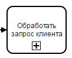|Отражает большую часть работы|
|3|Действие|Пользовательская задача|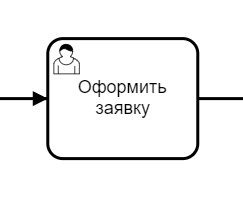|Отражает задачу, как правило выполняемую с помощью BPMS-системы|
|4|Действие|Сервисная задача|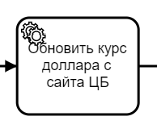|Отражает вызов некоторого внешнего сервиса или программы|

Подпроцессы помогают экономить пространство на схеме и декомпозировать, т.е. разделять на части большие процессы.

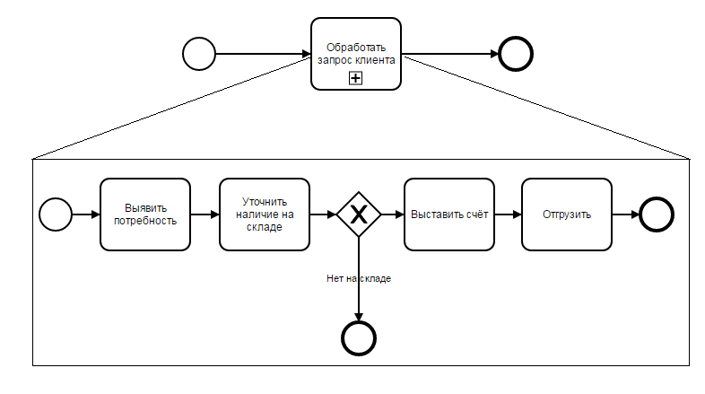

<iframe width="560" height="315" src="https://www.youtube.com/embed/dnpBTyunZ2I?si=RxeOnClgBiwAZh4g" title="YouTube video player" frameborder="0" allow="accelerometer; autoplay; clipboard-write; encrypted-media; gyroscope; picture-in-picture; web-share" referrerpolicy="strict-origin-when-cross-origin" allowfullscreen></iframe>

### События

События бывают трёх видов: **стартовое**, **промежуточное** и **завершающее**.

|     |         |                                        |                          |                                                                                             |
| --- | ------- | -------------------------------------- | ------------------------ | ------------------------------------------------------------------------------------------- |
| №   | **Тип** | **Название**                           | **Как выглядит**         | **Зачем нужно**                                                                             |
| 1   | Событие | Стартовое событие                      |  | Показывает, что что-то случилось, и нужно начать процесс                                    |
| 2   | Событие | Стартовое событие по времени           | 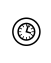 | Показывает, что пришло конкретное время (или прошёл интервал времени) и пора начать процесс |
| 3   | Событие | Стартовое событие по сообщению         |  | Показывает, что пришло сообщение от участников взаимодействия и пора начать процесс         |
| 4   | Событие | Промежуточное событие                  | 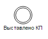 | Показывает, что что-то случилось, но делать ничего особенного не нужно                      |
| 5   | Событие | Завершающее событие                    | 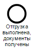 | Показывает, что что-то случилось и процесс нужно завершить                                  |
| 6   | Событие | Завершающее событие отправки сообщения |  | Показывает, что нужно завершить процесс и отправить сообщение участнику взаимодействия      |
| 7   | События | Терминальное завершающее событие       | 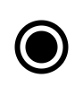 | Показывает, что нужно завершить процесс и любые прочие действия в процессе немедленно       |

<iframe width="560" height="315" src="https://www.youtube.com/embed/jOL6oQInO0k?si=mAE1mD4gmTp9vAS1" title="YouTube video player" frameborder="0" allow="accelerometer; autoplay; clipboard-write; encrypted-media; gyroscope; picture-in-picture; web-share" referrerpolicy="strict-origin-when-cross-origin" allowfullscreen></iframe>

### Шлюзы

Шлюзы бывают двух видов: **исключающий** и **параллельный**.

||||||
|--- |--- |--- |--- |--- |
|№|**Тип**|**Название**|**Как выглядит**|**Зачем нужно**|
|1|Шлюз|Исключающий шлюз||Разделяет работу исключительно на 1 поток|
|1|Шлюз|Параллельный шлюз|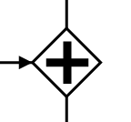|Распараллеливает работу на все исходящие потоки|

### Артефакты

Эти штуки улучшают читаемость схем.

||||||
|--- |--- |--- |--- |--- |
|№|Тип|Название|Как выглядит|Зачем нужно|
|1|Артефакт|Текстовая аннотация||Даёт информацию к одному элементу|
|2|Артефакт|Группа|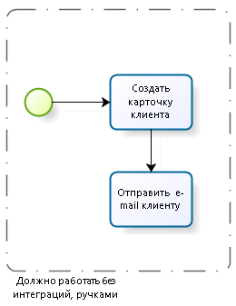|Даёт информацию к группе элементов|
|3|Артефакт|Объект данных|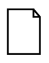|Показывает, какая информация создаётся в процессе|
|4|Артефакт|Хранилище данных|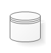|Представляет механизм для действий по получению или обновлению данных, которые хранятся независимо от процесса|

### Потоки

 Потоки используются для передачи работы или информации между участниками процесса.

 ||||||
|--- |--- |--- |--- |--- |
|№|Тип|Название|Как выглядит|Зачем нужно|
|1|Объект соединения|Поток управления|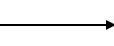|Последовательность выполнения работ|
|2|Объект соединения|Поток сообщений|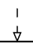|Передача информации между процессами|
|3|Объект соединения|Ассоциация|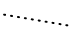|Привязка артефактов к элементам процесса|
