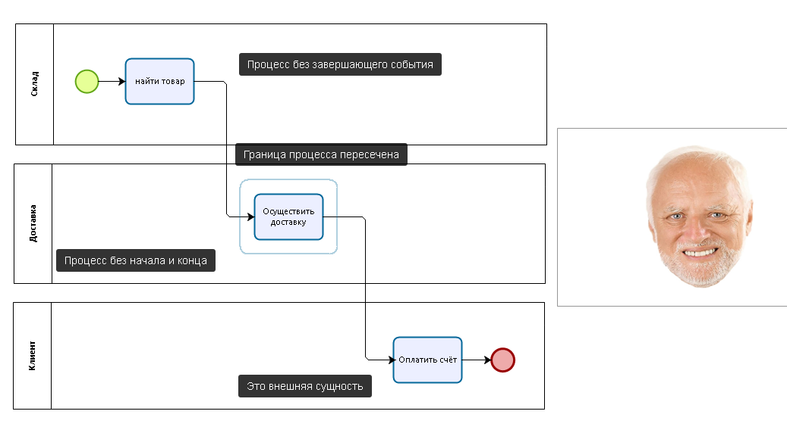

# 6 урок: BPMN для "чайников". Пулы и дорожки. (3/3)

В этом письме заканчиваем тему базовых элементов. Я расскажу, как использовать дорожки и пулы правильно и избежать ошибок.

## Пулы

Пулы отображают участников взаимодействия СНАРУЖИ процесса -  можно понимать организации, отделы, процессы — это зависит от вашей точки зрения на процесс. Как правило, если вы рисуете сквозной процесс, у вас будет один пул для вашей организации и прочие — для ваших клиентов, партнёров и так далее.

 

## Исполнители

Для того чтобы показать отдельное подразделение или роль, отвечающую за конкретный шаг, вы можете разделить использовать цвета, роли, анотации над элементами или явное указание исполнителя в названии задачи.

<iframe src="https://stormbpmn.com/app/diagram/6346b347-13b9-48f2-9cf6-b2fef7a89070?overlays=eyJkdXJhdGlvbiI6ZmFsc2UsImFzc2lnbmVlcyI6dHJ1ZSwicG9zaXRpb25zIjpmYWxzZSwic3lzdGVtcyI6ZmFsc2UsImRvY3VtZW50cyI6ZmFsc2UsImxpbmtzIjpmYWxzZSwiY29tbWVudHMiOmZhbHNlLCJkZXNjcmlwdGlvbiI6ZmFsc2V9&embedded=true" style="border:1px #f2f2f2 none;" name="extAdmin" scrolling="no" frameborder="1"  height="500" width="100%" allowfullscreen></iframe>

BPMN предполагает, что когда вы рисуете собственную организацию в процессе, вы имеете полный контроль над тем, как выполняется процесс.

## Взаимодействие исполнителей между собой

Как помните, я показывал вам 3 типа линии.

 

Линияи спользуется для соединения элементов процесса (события, задачи, подпроцессы, шлюзы) в пуле. Вы не можете начать или прервать эту линию в процессе просто так. Линии должны начинаться на стартовых событиях, а заканчиваться на завершающих событиях.

Линия НЕ может выходить за границу пула: это нарушит целостность процесса, и вы потеряете над ним контроль.

::: danger 
Вы не можете рисовать задачи, события, шлюзы другим организациям. Только своей.

<iframe width="560" height="315" src="https://www.youtube.com/embed/hCt6EJxtxpE?si=JREbAI7iUVCEQ7rW" title="YouTube video player" frameborder="0" allow="accelerometer; autoplay; clipboard-write; encrypted-media; gyroscope; picture-in-picture; web-share" referrerpolicy="strict-origin-when-cross-origin" allowfullscreen></iframe>

:::

## Взаимодействие пулов между собой

Для отображения деталей общения пулов, т.е. процессов или организаций, вы должны использовать поток сообщений.  

<iframe src="https://stormbpmn.com/app/diagram/6346b347-13b9-48f2-9cf6-b2fef7a89070?overlays=eyJkdXJhdGlvbiI6ZmFsc2UsImFzc2lnbmVlcyI6dHJ1ZSwicG9zaXRpb25zIjpmYWxzZSwic3lzdGVtcyI6ZmFsc2UsImRvY3VtZW50cyI6ZmFsc2UsImxpbmtzIjpmYWxzZSwiY29tbWVudHMiOmZhbHNlLCJkZXNjcmlwdGlvbiI6ZmFsc2V9&embedded=true" style="border:1px #f2f2f2 none;" name="extAdmin" scrolling="no" frameborder="1"  height="500" width="100%" allowfullscreen></iframe>

::: danger
Потоки сообщений допускаются только между пулами
::: 

## Типичные ошибки и способ их решения
 

Чтобы исправить эти ошибку нам нужно соединить два первых пула в один, т.к. эти задачи выполняет одна организация. 

А следом нам нужно добавить пул для отображения клиента, чтобы события получения и отправки оплаты выглядели как чёрный ящик: так называют пулы, когда реализация того, что находится внутри них, нашему процессу не интересна. 

Нам всё равно, как клиент оплачивает заказы.

::: important

Stormbpmn не позволит совершать такие (и многие другие) ошибки за счет автоматческого [контроля качества](/features/1_bpmn-editor.md#качество-бизнес-процессов-bpmn)
:::

## Факультатив

<iframe width="560" height="315" src="https://www.youtube.com/embed/EshGX0pa6_M?si=aEn1R3U4jBfpPaMw" title="YouTube video player" frameborder="0" allow="accelerometer; autoplay; clipboard-write; encrypted-media; gyroscope; picture-in-picture; web-share" referrerpolicy="strict-origin-when-cross-origin" allowfullscreen></iframe>