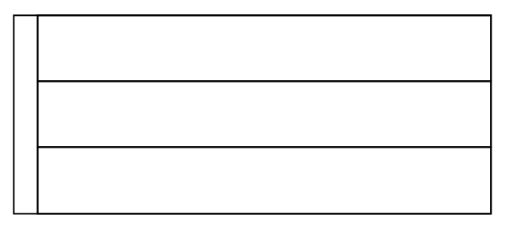
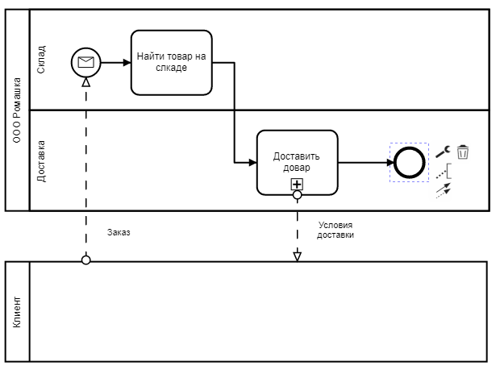
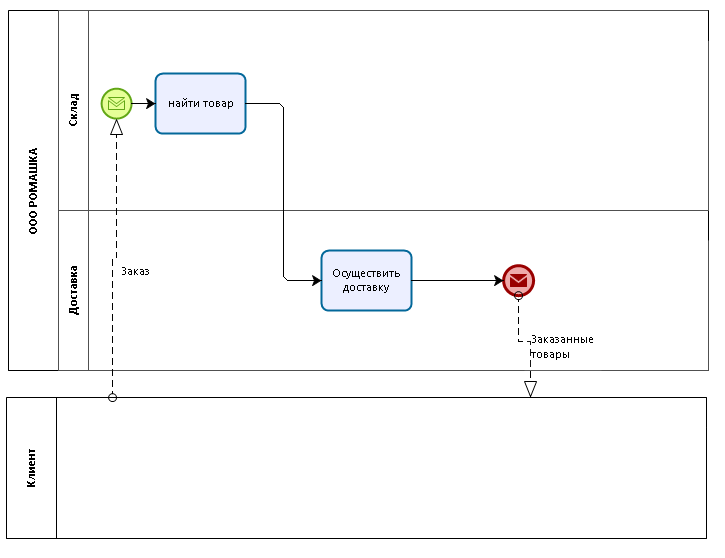

# 6 урок: BPMN для "чайников". Пулы и дорожки. (3/3)

В этом письме заканчиваем тему базовых элементов. Я расскажу, как использовать дорожки и пулы правильно и избежать ошибок.

## Пулы

Пулы отображают участников взаимодействия СНАРУЖИ процесса -  можно понимать организации, отделы, процессы — это зависит от вашей точки зрения на процесс. Как правило, если вы рисуете сквозной процесс, у вас будет один пул для вашей организации и прочие — для ваших клиентов, партнёров и так далее.  
 

## Исполнители

Для того чтобы показать отдельное подразделение или роль, отвечающую за конкретный шаг, вы можете разделить пул дорожками.

 

BPMN предполагает, что когда вы рисуете собственную организацию в процессе, вы имеете полный контроль над тем, как выполняется процесс.

## Взаимодействие исполнителей между собой

Как помните, я показывал вам 3 типа линии.

 

Линияиспользуется для соединения элементов процесса (события, задачи, подпроцессы, шлюзы) в пуле. Вы не можете начать или прервать эту линию в процессе просто так. Линии должны начинаться на стартовых событиях, а заканчиваться на завершающих событиях.

Линия НЕ может выходить за границу пула: это нарушит целостность процесса, и вы потеряете над ним контроль.

::: danger 
Вы не можете рисовать задачи, события, шлюзы другим организациям. Только своей.
:::

## Взаимодействие пулов между собой

Для отображения деталей общения пулов, т.е. процессов или организаций, вы должны использовать поток сообщений.  

 

::: danger
Потоки сообщений допускаются только между пулами
::: 

## Типичные ошибки и способ их решения
 

Чтобы исправить эти ошибку нам нужно соединить два первых пула в один и разделить его дорожками, т.к. эти задачи выполняет одна организация. 

А следом нам нужно добавить пул для отображения клиента, чтобы события получения и отправки оплаты выглядели как чёрный ящик: так называют пулы, когда реализация того, что находится внутри них, нашему процессу не интересна. 

Нам всё равно, как клиент оплачивает заказы.

 