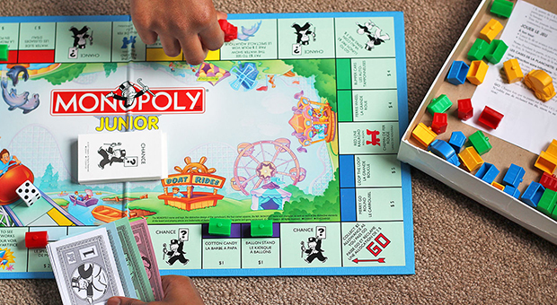
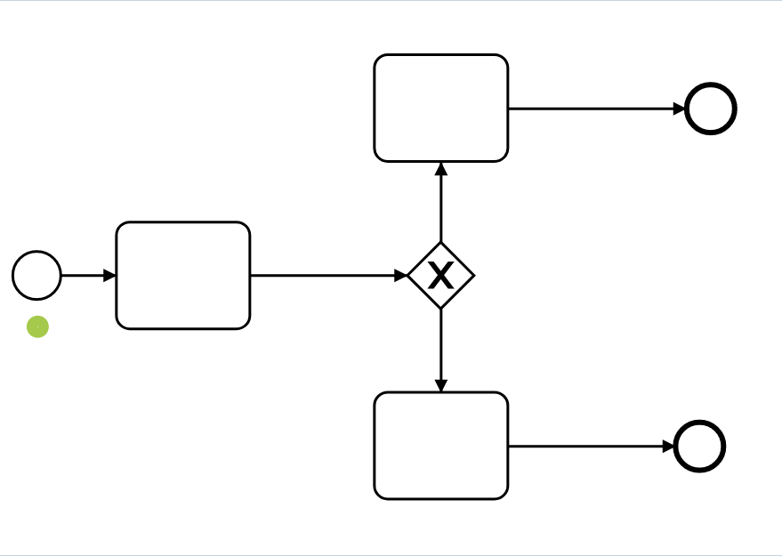
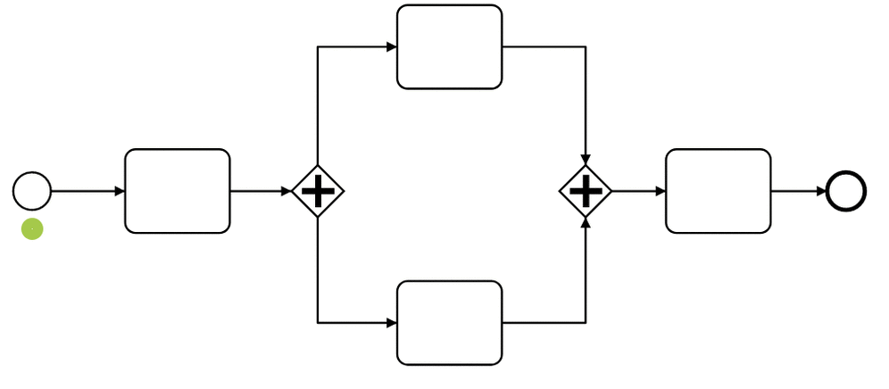
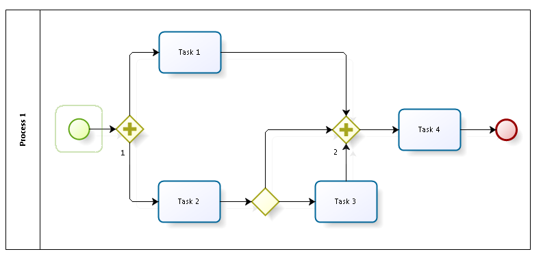
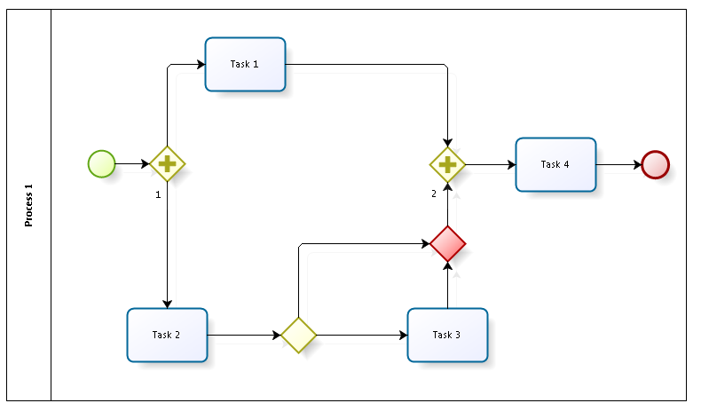

# 7 урок: Проверка BPMN-схем на корректность

Настало время научиться проверять, что схема, которую мы составили, не содержит логических ошибок. Для этого в BPMN-науке используется воображаемая игра — Token game.

## Видеоверсия

<iframe width="560" height="315" src="https://www.youtube.com/embed/44y1u8BWR6Y?si=TXVBH5u5aoHMkylN" title="YouTube video player" frameborder="0" allow="accelerometer; autoplay; clipboard-write; encrypted-media; gyroscope; picture-in-picture; web-share" referrerpolicy="strict-origin-when-cross-origin" allowfullscreen></iframe>

## Идея

Token games — это игра с жетонами, или “токенами”. Такая же, как любая настольная игра. Только вместо поля настольной игры используется поле вашего процесса.  

 

Токены появляются на стартовых событиях, по одной штуке на событие.  Количество токенов не меняется на действиях, но может меняться на развилках. Хотя бы один токен должен дойти до завершающего события, чтобы процесс считался завершённым.

По итогам прохождения процесса все токены должны исчезнуть.

## Раздвилка ИЛИ

На вход приезжает токен — на выход идёт всегда один токен, по одному из путей.

ИЛИ не увеличивает количество токенов. Эта развилка отрабатывает сразу же, как только приехал токен.

 

## Развилка И

Эта развилка хитрая:

- Развилка выпускает столько токенов, сколько исходящих потоков указано.
- Развилка срабатывает не мгновенно, а только тогда, когда на неё приходит столько токенов, сколько указано на входном шлюзе.

 

## Пример проверки схем через token game

 

Развилка №2 никогда не пропустит процесс дальше, т.к. ждёт 3 токена на вход (потому что 3 входящих потока), но ИЛИ развилка между Task 2 и Task 3 запустит токен только по одному из потоков. И

Исправляется тем, что мы добавляем исключающий шлюз, который “соберёт” токены, перед тем, как их вставить в шлюз №2.

 

## Проверка больших схем

Для валидации больших схем одной внимательности не хватит — нужно использовать специализированные средства, например, [проверку качества в stormbpmn.com](/features/1_bpmn-editor.html#качество-бизнес-процессов-bpmn).

## Факультатив

<iframe width="560" height="315" src="https://www.youtube.com/embed/GUCgr7J-Pzs?si=GteDuwUi7NVRlb4M" title="YouTube video player" frameborder="0" allow="accelerometer; autoplay; clipboard-write; encrypted-media; gyroscope; picture-in-picture; web-share" referrerpolicy="strict-origin-when-cross-origin" allowfullscreen></iframe>