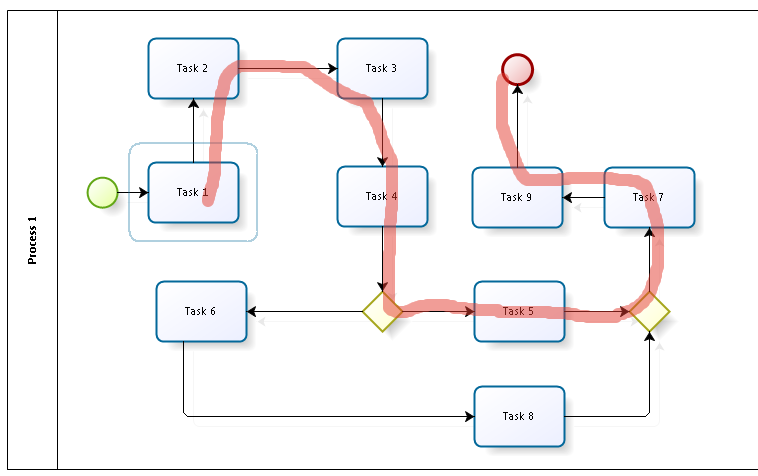
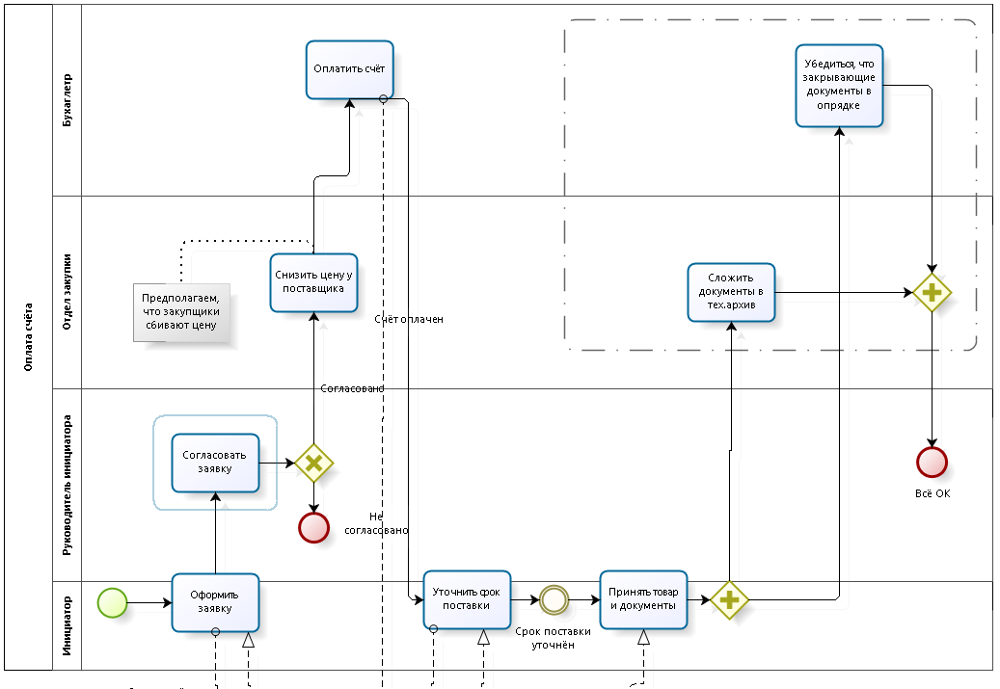
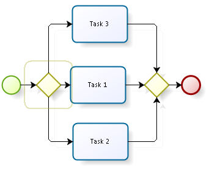
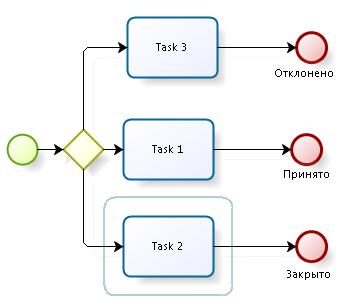

# 8 урок: Хороший стиль BPMN

Вы уже умеете использовать BPMN и знаете, как проверять корректность схем. Этого ещё недостаточно, чтобы делать адекватные и читаемые диаграммы. Сегодня поговорим про “хороший стиль” моделирования и о том, что нужно обязательно учитывать, когда делаете схемы.

## Зачем нужен хороший стиль

Ваши схемы могут видеть сотни людей — коллеги в офисе, посетители вашей страницы на Facebook, разработчики BPMS-систем. Чтобы людям было удобно работать со схемами, недостаточно соблюдать спецификацию BPMN — она не учитывает особенности человеческого восприятия.

Работая с разными схемами, я прочувствовал правила “хорошего стиля”, т.е. негласное соглашение о том, как лучше оформлять схемы. Делюсь с вами.

## Элементы хорошего стиля

### Happy path

Последовательность работ должна идти слева направо. По визуальному центру схемы должен быть расположен типичный сценарий выполнения процесса.

|  |  |
| ------------------------ | ------------------------ |

Так удобнее воспринимать схему. Она читается так же, как и текст. Читателю не нужно концентрироваться на происходящем в процессе — можно поднять взгляд до визуальной середины схемы и понять, что происходит.

### Наименование задачи “Глагол” + “Существительное”

Любая пользовательская задача для сотрудников должна именоваться по шаблону.

**Плохо**  
Заявка оформляется  
**Хорошо**  
Оформить заявку

Задачи превратятся в поручения на корпоративном портале. Сотрудникам будет понятно, что делать

### Процесс без дорожек

Рисуйте процесс без указания исполнителей. Концентрируйтесь на задачах и последовательностях.

|  |  |
| ------------------------ | ------------------------ |

Исполнители довольно просто определяются в конце работы с процессом, когда сама схема уже готова. Чтобы не создавать много пустого места дорожками исполнителей, рисуйте без использования дорожек.

### Много заверающих событий

Рисуйте схемы так, чтобы каждому варианту завершения процесса соответствовало завершающее событие.

|  |  |
| ------------------------ | ------------------------ |

В будущем вам потребуется аналитика о том, как завершаются процессы. Если все они сходятся в одно событие, то собрать такую статистику будет проблематично.

### Нумерация шлюзов

Каждый шлюз должен иметь номер, каждый поток работ (если он не один в шлюзе) должен быть подписан и пронумерован.

|  |  |
| ------------------------ | ------------------------ |

Диаграммы процесса мало для успешной автоматизации. Чтобы обсуждать шлюзы и развилки, нужно их как-то называть, а без нумерации это затруднительно.

### Путь по-умолчанию