[[toc]]

# Система авторизации (OAuth2, Keycloak, ADFS)

### OAuth2 (рекомендуется)

Корпоративная авторизация через внешние провайдеры (Keycloak, Azure AD, и др.)

| Параметр              | Описание                                | Пример значения                                                                    |
| --------------------- | --------------------------------------- | ---------------------------------------------------------------------------------- |
| **OAuthIsEnabled**    | Включение OAuth2                        | `true`                                                                             |
| **OAuthClientId**     | ID клиента в провайдере                 | `stormbpmn-client`                                                                 |
| **OAuthClientSecret** | Секрет клиента                          | `your-client-secret`                                                               |
| **OAuthAuthorizeUri** | URL авторизации                         | `https://keycloak.company.com/auth/realms/master/protocol/openid-connect/auth`     |
| **OAuthUserInfoUri**  | URL получения информации о пользователе | `https://keycloak.company.com/auth/realms/master/protocol/openid-connect/userinfo` |
| **OAuthTokenUri**     | URL получения токена                    | `https://keycloak.company.com/auth/realms/master/protocol/openid-connect/token`    |
| **OAuthButtonLabel**  | Текст на кнопке входа                   | `"Войти через корпоративный аккаунт"`                                              |
| **OAuthRedirectUri**  | URL возврата после авторизации          | `https://stormbpmn.company.com/app/signin`                                         |

::: tip Настройка Keycloak
**Пошаговая инструкция для Keycloak 26.0.7:**

1. **Создать клиента** в нужном realm
2. **Client ID:** `stormbpmn-client`
3. **Valid redirect URIs:** `https://stormbpmn.company.com/app/signin`
4. **Web origins:** `https://stormbpmn.company.com`
5. **Client authentication:** ON
6. **Standard flow:** ON, **Implicit flow:** ON
7. **Client Scopes:** email и profile должны быть default
8. **Получить Client Secret** на вкладке Credentials

:::

### Microsoft ADFS

::: warning Особенности Microsoft ADFS
Компания Microsoft имеет специфический (альтернативно-одарённый) подход к стандартам OAuth2/OpenID Connect. В частности, ADFS не возвращает информацию о пользователе через стандартную ручку `/userinfo`, что усложняет интеграцию. Также интерфейсы ADFS (особенно в русской локализации) могут показаться запутанными.
:::

Настройка авторизации через ADFS требует больше времени и внимания по сравнению с другими провайдерами.

#### Шаг 1: Настройка ADFS

##### Создание группы приложений

1. В оснастке ADFS Management создайте группу приложений:  
   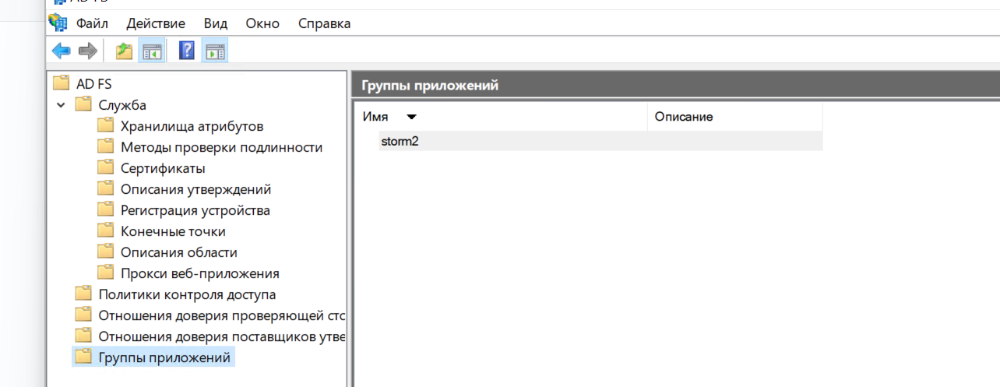

2. В группе создайте **2 приложения**:  
   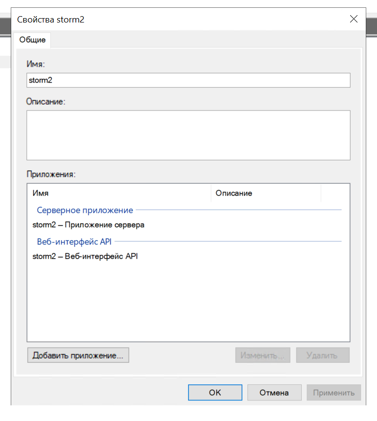

##### Настройка серверного приложения

3. **Первое приложение** - Server application (серверное приложение):  
   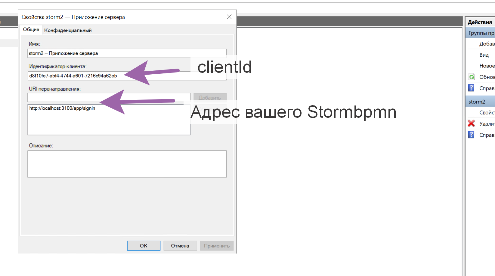

4. В настройках укажите:
    - Правильный **Redirect URI** перенаправления
    - Запомните **Client ID** и **Client Secret**
      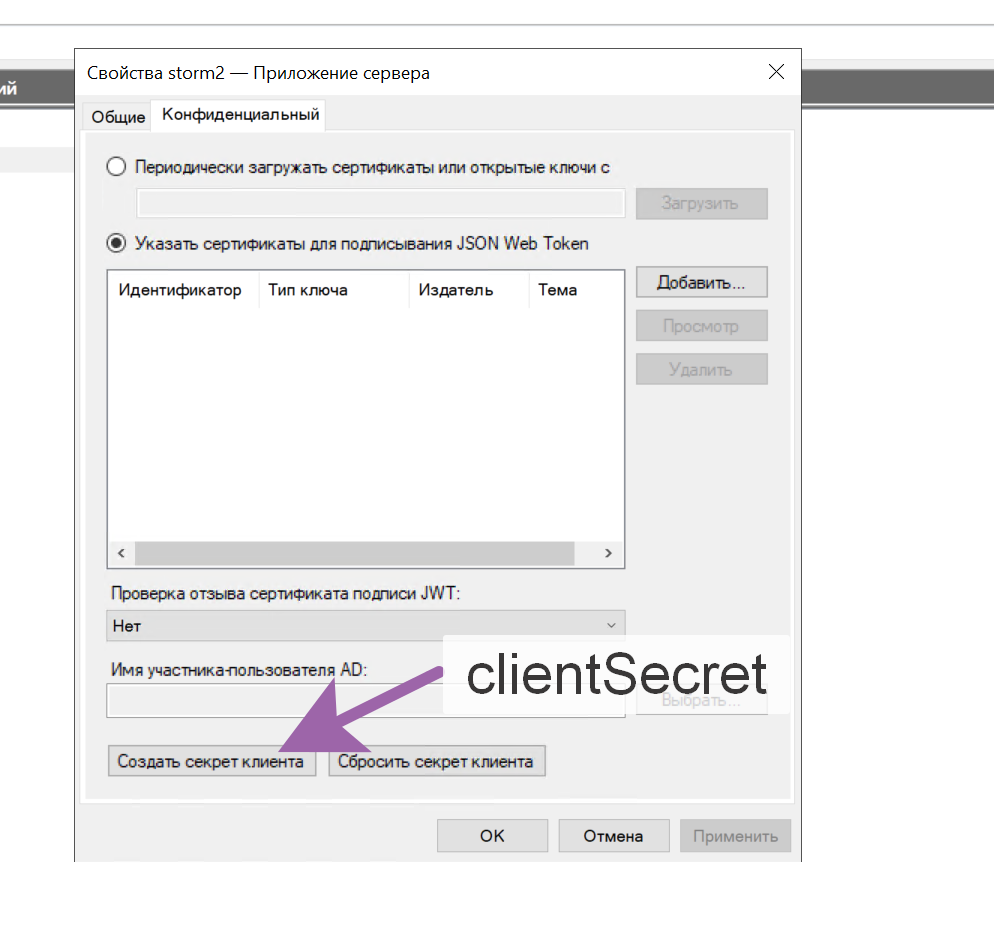

##### Настройка веб-API

5. **Второе приложение** - Web API (веб-интерфейс API):

6. Создайте **Relying party identifier** (идентификатор проверяющей стороны) и запомните его  
   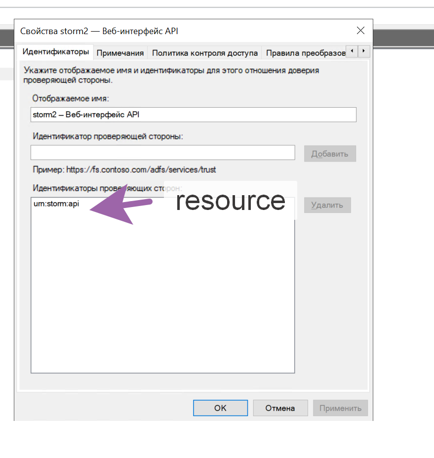

##### Настройка политик доступа

7. Выберите подходящую **Access Control Policy** (политику контроля доступа):  
   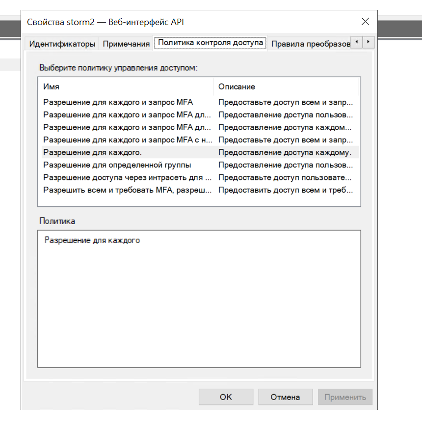

##### Настройка маппинга атрибутов

8. В разделе **Issuance Transform Rules** (Правила преобразования выдачи) настройте маппинг атрибутов:

    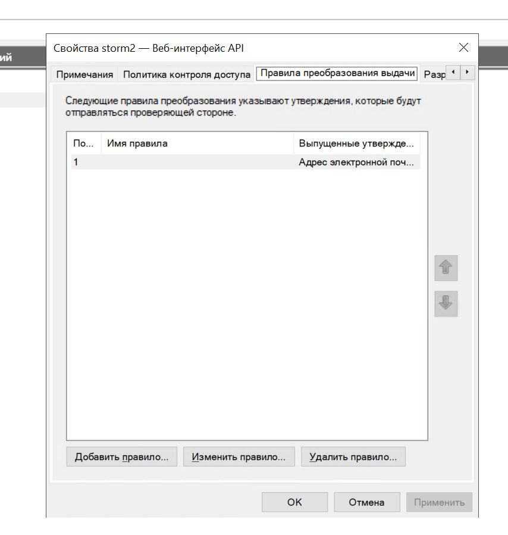
    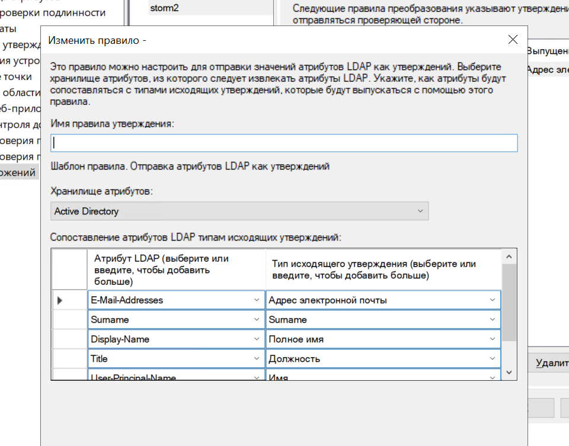

::: danger Важно: маппинг claims
StormBPMN ожидает следующие claims в токене:

| Поле StormBPMN | Ожидаемый claim | Тип         |
| -------------- | --------------- | ----------- |
| `email`        | `email`         | Стандартный |
| `firstName`    | `given_name`    | Стандартный |
| `lastName`     | `family_name`   | Стандартный |
| `fullName`     | `full_name`     | Кастомный   |
| `position`     | `position`      | Кастомный   |

**Кастомные claims** (Полное Имя, Должность) должны быть созданы и опубликованы в описании утверждений (Claims Description).  
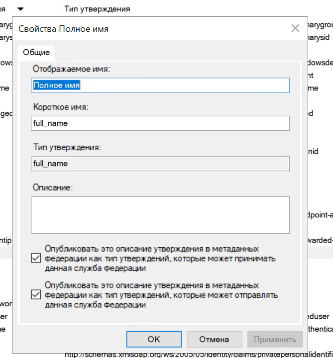

:::

##### Настройка разрешений

9. Установите разрешения клиента:

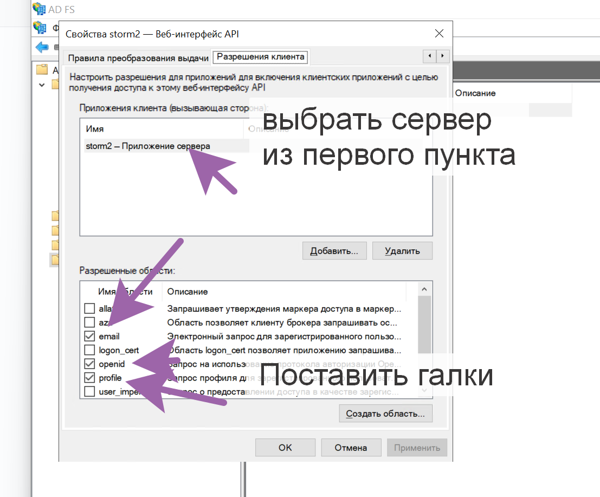

Если все шаги выполнены внимательно, настройка ADFS на стороне сервера завершена.

#### Шаг 2: Настройка StormBPMN

##### Параметры для настройки

Вам потребуются сохраненные значения:

-   **Client ID** (из серверного приложения)
-   **Client Secret** (из серверного приложения)
-   **Resource identifier** (идентификатор ресурса из Web API)

##### Настройка в административной панели

1. Перейдите в административную панель: `/app/admin` → вкладка **Безопасность**

2. Укажите следующие параметры:

| Параметр                     | Значение                            | Примечание                                                |
| ---------------------------- | ----------------------------------- | --------------------------------------------------------- |
| **OAuthClientId**            | Ваш Client ID                       | Из серверного приложения ADFS                             |
| **OAuthClientSecret**        | Ваш Client Secret                   | Из серверного приложения ADFS                             |
| **OAuthAuthorizeUri**        | `/adfs/oauth2/authorize`            | Стандартный путь ADFS                                     |
| **OAuthUserInfoUri**         | `/adfs/userinfo`                    | Для обратной совместимости (ADFS не использует эту ручку) |
| **OAuthTokenUri**            | `/adfs/oauth2/token`                | Стандартный путь ADFS                                     |
| **OAuthButtonLabel**         | `"Войти через ADFS"`                | Текст на кнопке входа                                     |
| **OAuthIsEnabled**           | `true`                              | Включение OAuth2                                          |
| **OAuthRedirectUri**         | `https://your-storm-url/app/signin` | URL вашего StormBPMN                                      |
| **OAuthResponseType**        | `code`                              | Тип ответа                                                |
| **OAuthScope**               | `openid profile email`            | Области доступа                                           |
| **OAuthCodeChallengeMethod** | `S256`                              | Метод challenge                                           |
| **OAuthFlowMode**            | `PKCE`                              | Режим потока                                              |
| **OAuthResource**            | Ваш Resource identifier             | Из Web API приложения                                     |

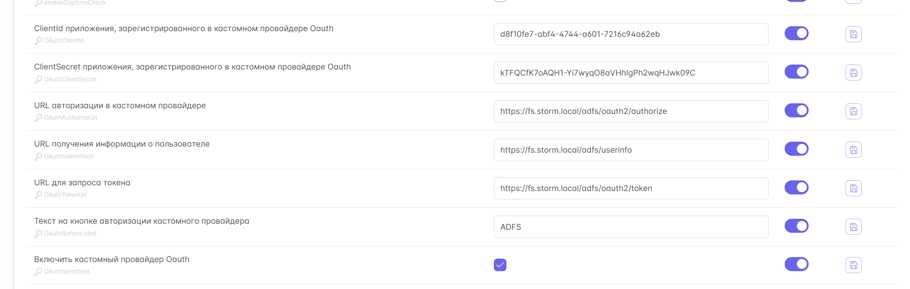
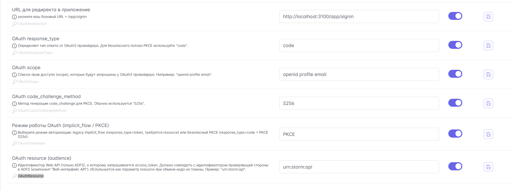

#### Дополнительные требования

::: warning Сертификаты
На самоподписанных сертификатах интеграция работать не будет. Требуется добавить доверенные сертификаты по инструкции в этом разделе.
:::

::: tip Тестирование
Настройка протестирована и гарантированно работает с:

-   **Windows Server 2022**
-   **ADFS 4.0**

Если интеграция не работает, проверьте:

-   Корректность всех параметров
-   Правильность маппинга claims
-   Наличие всех необходимых разрешений в ADFS
-   Доверенные сертификаты (если используются)

:::

### Проверка Claims

Дополнительная проверка прав в токене OAuth2:

| Параметр            | Описание           | Пример значения   |
| ------------------- | ------------------ | ----------------- |
| **OAuthCheckClaim** | Включить проверку  | `true`            |
| **OAuthClaimName**  | Название claim     | `groups`          |
| **OAuthClaimValue** | Требуемое значение | `stormbpmn-users` |

### Встроенная авторизация

::: warning Только для тестирования
Встроенная авторизация подходит только для тестовых сред. В production используйте OAuth2.
:::

**Аварийный вход:** Добавьте `?showBasicLogin=true` к URL входа для доступа к базовой форме, даже если OAuth2 включен.

### Отложенная активация пользователей

::: tip Отложенная выдача лицензий
Если в системе выключена авто-выдача лицензий, но включена регистрация новых пользователей, можно использовать механизм отложенной активации. Это позволяет новым пользователям создавать учётные записи при попытке входа, но не занимать лицензии до явного подтверждения администратором.
:::

Для включения этого режима установите параметр:

| Параметр | Описание | Рекомендация |
| --- | --- | --- |
| **createPendingEnterpriseUsers** | Создание учётных записей в статусе «ожидает активации» при первой попытке входа | `true` |

#### Процесс активации

1. **Попытка входа:** Пользователь пытается войти через OAuth2 или встроенную форму. Если учётная запись ещё не существует, она создаётся в статусе «ожидает активации».
2. **Сообщение пользователю:** При попытке входа пользователь увидит сообщение: *«Учётная запись ждёт активации администратором»*. Вход в систему будет заблокирован до активации.
3. **Активация администратором:**
   - Администратор переходит в раздел управления пользователями.
   - В списке пользователей отображается счётчик: *«Ожидают активации: N»*.
   - Для каждого пользователя в статусе ожидания отображается тултип: *«Учётная запись создана по попытке входа и ждёт активации администратором»*.
   - Администратор нажимает кнопку **«Активировать (ожидает активации, займёт лицензию)»**.
4. **Завершение:** После активации пользователь получает доступ к системе, и за ним закрепляется лицензия.

::: warning Важно
Активация пользователя происходит только после явного действия администратора. До этого момента лицензия не расходуется, даже если учётная запись создана в базе данных.
:::

---
