[[toc]]

# Система авторизации (OAuth2, Keycloak, ADFS)

### OAuth2 (рекомендуется)

Корпоративная авторизация через внешние провайдеры (Keycloak, Azure AD, и др.)

| Параметр              | Описание                                | Пример значения                                                                    |
| --------------------- | --------------------------------------- | ---------------------------------------------------------------------------------- |
| **OAuthIsEnabled**    | Включение OAuth2                        | `true`                                                                             |
| **OAuthClientId**     | ID клиента в провайдере                 | `stormbpmn-client`                                                                 |
| **OAuthClientSecret** | Секрет клиента                          | `your-client-secret`                                                               |
| **OAuthAuthorizeUri** | URL авторизации                         | `https://keycloak.company.com/auth/realms/master/protocol/openid-connect/auth`     |
| **OAuthUserInfoUri**  | URL получения информации о пользователе | `https://keycloak.company.com/auth/realms/master/protocol/openid-connect/userinfo` |
| **OAuthTokenUri**     | URL получения токена                    | `https://keycloak.company.com/auth/realms/master/protocol/openid-connect/token`    |
| **OAuthButtonLabel**  | Текст на кнопке входа                   | `"Войти через корпоративный аккаунт"`                                              |
| **OAuthRedirectUri**  | URL возврата после авторизации          | `https://stormbpmn.company.com/app/signin`                                         |
| **OAuthFlowMode**     | Режим потока: `PKCE` или `implicit_flow` | `PKCE`                                                                            |

#### Режим потока: PKCE или implicit

StormBPMN умеет работать в двух режимах, переключает их параметр **OAuthFlowMode**:

| Режим                     | Что происходит                                                                                                              | Когда выбирать                                                                       |
| ------------------------- | --------------------------------------------------------------------------------------------------------------------------- | ------------------------------------------------------------------------------------ |
| `PKCE` (рекомендуется)    | Authorization Code Flow с PKCE: провайдер возвращает `code`, сервер меняет его на токен по защищённому каналу                | Всегда, если провайдер умеет Authorization Code Flow. Implicit flow включать не нужно |
| `implicit_flow` (legacy)  | `response_type=token`, access token приходит в браузер во фрагменте URL, данные пользователя берутся из `/userinfo`          | Провайдер выдаёт непрозрачный (не JWT) access token или не поддерживает PKCE          |

Если параметр не задан, используется `implicit_flow` — это сделано ради обратной совместимости со старыми установками.

##### Параметры режима PKCE

| Параметр                     | Значение              | Примечание                                                          |
| ---------------------------- | --------------------- | -------------------------------------------------------------------- |
| **OAuthFlowMode**            | `PKCE`                | Включает Authorization Code Flow                                     |
| **OAuthResponseType**        | `code`                | Обязательно задать вместе с `OAuthFlowMode`                          |
| **OAuthScope**               | `openid profile email` | Должен давать доступ к email пользователя                           |
| **OAuthCodeChallengeMethod** | `S256`                | Оставляйте `S256`, `plain` — только для древних провайдеров          |
| **OAuthResource**            | Идентификатор Web API | Только для ADFS, остальные провайдеры параметр игнорируют            |

::: danger OAuthFlowMode и OAuthResponseType меняются вместе
Если включить `OAuthFlowMode = PKCE`, но не заполнить `OAuthResponseType`, страница входа уйдёт к провайдеру со старым `response_type=token` и будет ждать `code`, которого не будет. Вход зависнет без внятной ошибки. Для PKCE нужны оба параметра.
:::

::: warning Требования к клиенту в режиме PKCE
- Клиент должен быть **конфиденциальным**: `OAuthClientSecret` обязателен и отправляется при обмене кода на токен.
- Access token должен быть **JWT** и содержать `email` (либо `upn`, либо `unique_name`). Провайдерам с непрозрачными токенами оставляйте `implicit_flow`.
- `OAuthRedirectUri` должен совпадать с зарегистрированным у провайдера символ в символ.
:::

::: tip Настройка Keycloak
**Пошаговая инструкция для Keycloak 26.0.7:**

1. **Создать клиента** в нужном realm
2. **Client ID:** `stormbpmn-client`
3. **Valid redirect URIs:** `https://stormbpmn.company.com/app/signin`
4. **Web origins:** `https://stormbpmn.company.com`
5. **Client authentication:** ON
6. **Standard flow:** ON. **Implicit flow** оставьте OFF, если в StormBPMN выбран `OAuthFlowMode = PKCE`; включать его нужно только для legacy-режима `implicit_flow`
7. Для PKCE: вкладка **Advanced** → **Proof Key for Code Exchange Code Challenge Method** → `S256`
8. **Client Scopes:** email и profile должны быть default
9. **Получить Client Secret** на вкладке Credentials

:::

### Microsoft ADFS

::: warning Особенности Microsoft ADFS
Компания Microsoft имеет специфический (альтернативно-одарённый) подход к стандартам OAuth2/OpenID Connect. В частности, ADFS не возвращает информацию о пользователе через стандартную ручку `/userinfo`, что усложняет интеграцию. Также интерфейсы ADFS (особенно в русской локализации) могут показаться запутанными.
:::

Настройка авторизации через ADFS требует больше времени и внимания по сравнению с другими провайдерами.

#### Шаг 1: Настройка ADFS

##### Создание группы приложений

1. В оснастке ADFS Management создайте группу приложений:  
   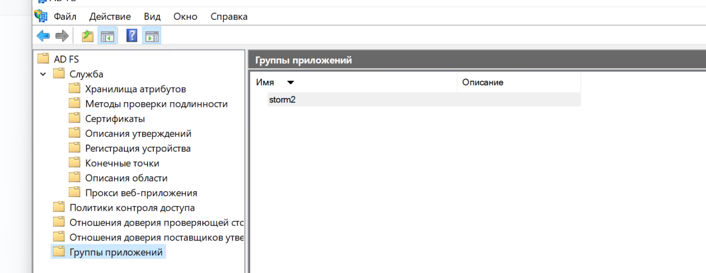

2. В группе создайте **2 приложения**:  
   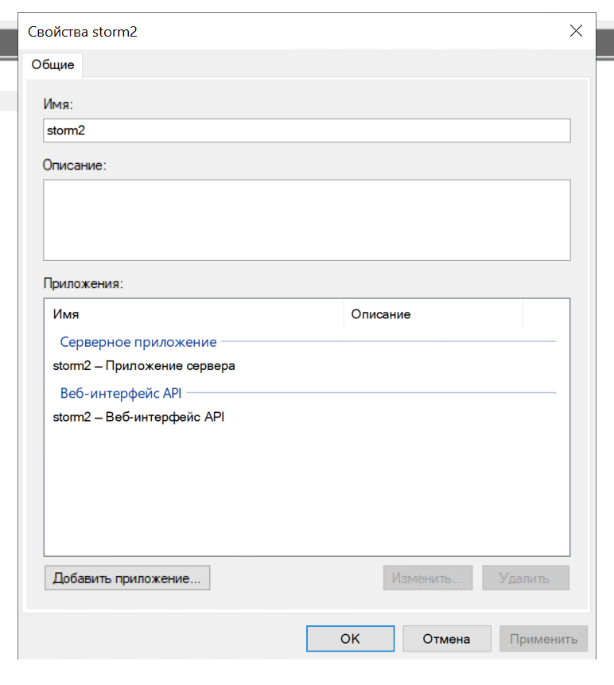

##### Настройка серверного приложения

3. **Первое приложение** - Server application (серверное приложение):  
   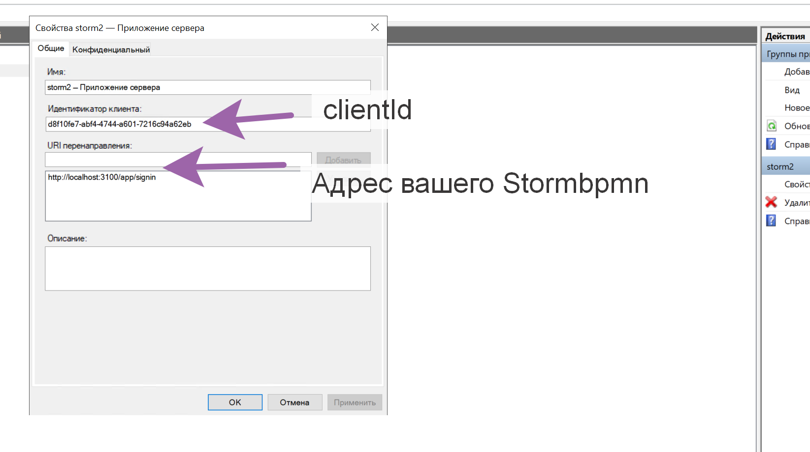

4. В настройках укажите:
    - Правильный **Redirect URI** перенаправления
    - Запомните **Client ID** и **Client Secret**
      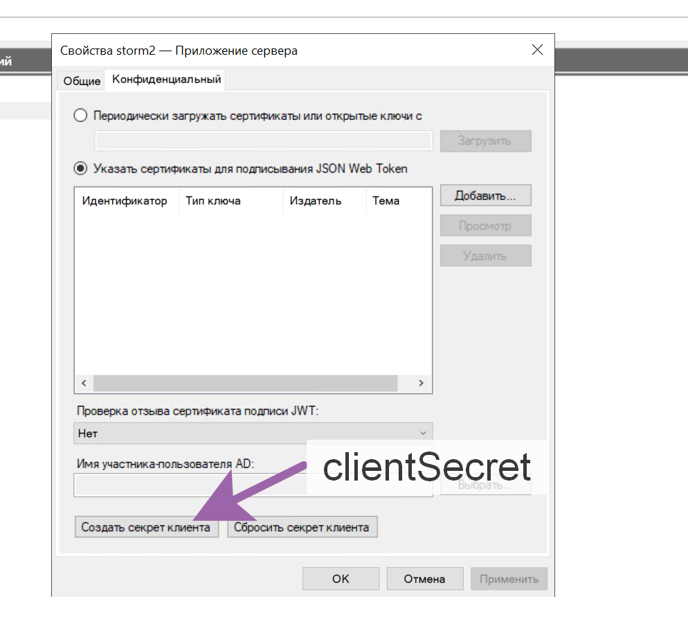

##### Настройка веб-API

5. **Второе приложение** - Web API (веб-интерфейс API):

6. Создайте **Relying party identifier** (идентификатор проверяющей стороны) и запомните его  
   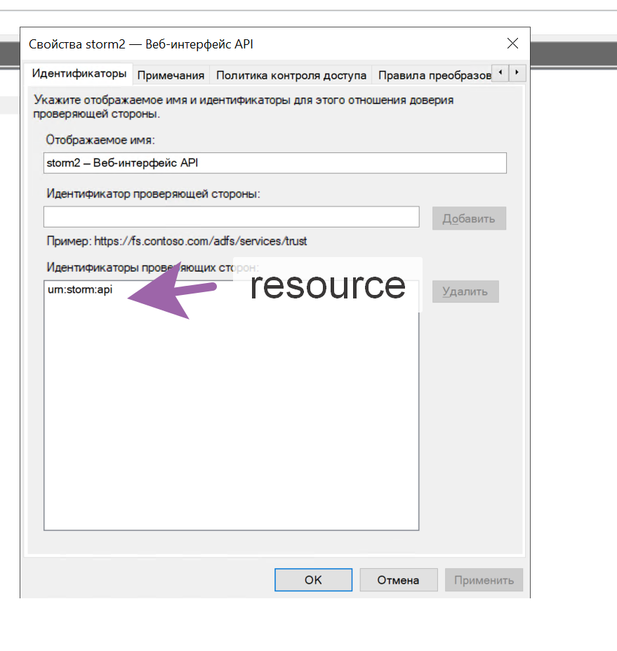

##### Настройка политик доступа

7. Выберите подходящую **Access Control Policy** (политику контроля доступа):  
   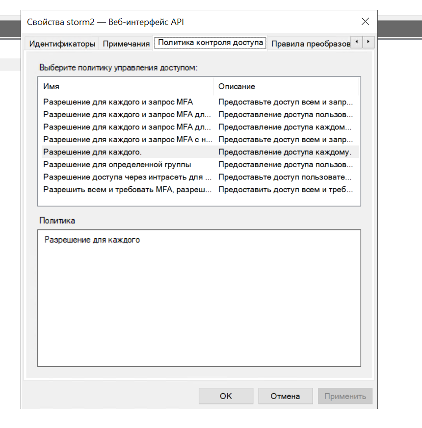

##### Настройка маппинга атрибутов

8. В разделе **Issuance Transform Rules** (Правила преобразования выдачи) настройте маппинг атрибутов:

    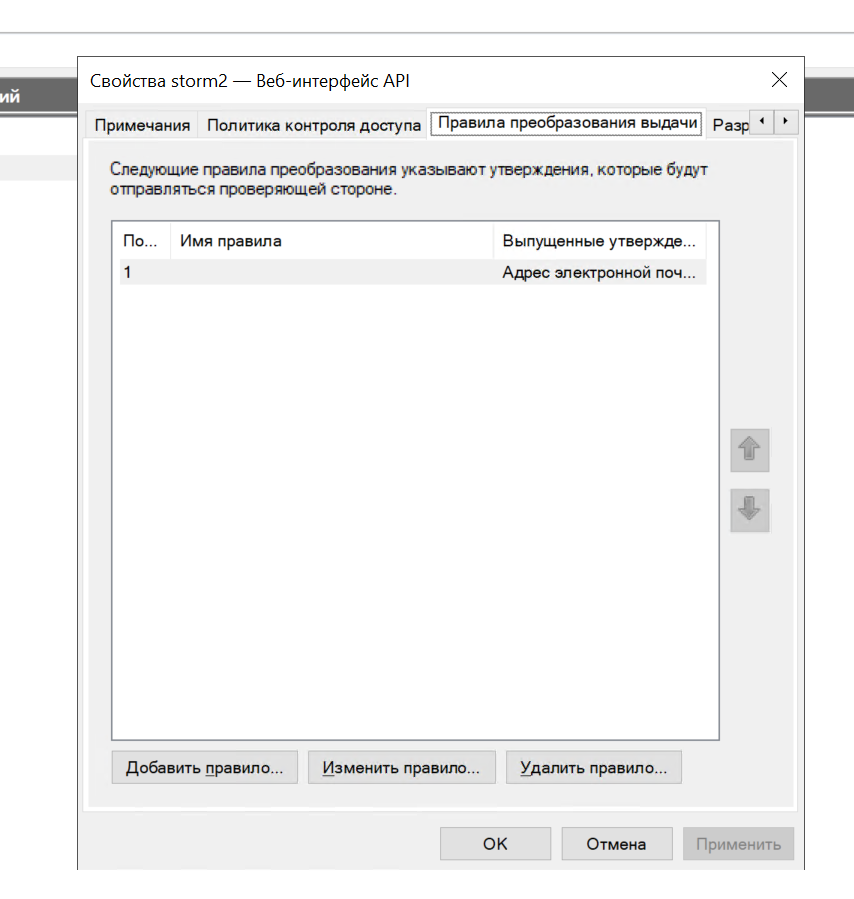
    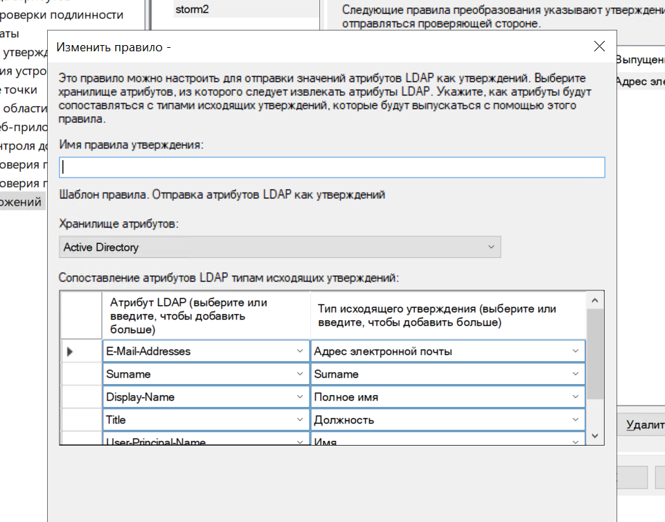

::: danger Важно: маппинг claims
StormBPMN ожидает следующие claims в токене:

| Поле StormBPMN | Ожидаемый claim | Тип         |
| -------------- | --------------- | ----------- |
| `email`        | `email`         | Стандартный |
| `firstName`    | `given_name`    | Стандартный |
| `lastName`     | `family_name`   | Стандартный |
| `fullName`     | `full_name`     | Кастомный   |
| `position`     | `position`      | Кастомный   |

**Кастомные claims** (Полное Имя, Должность) должны быть созданы и опубликованы в описании утверждений (Claims Description).  
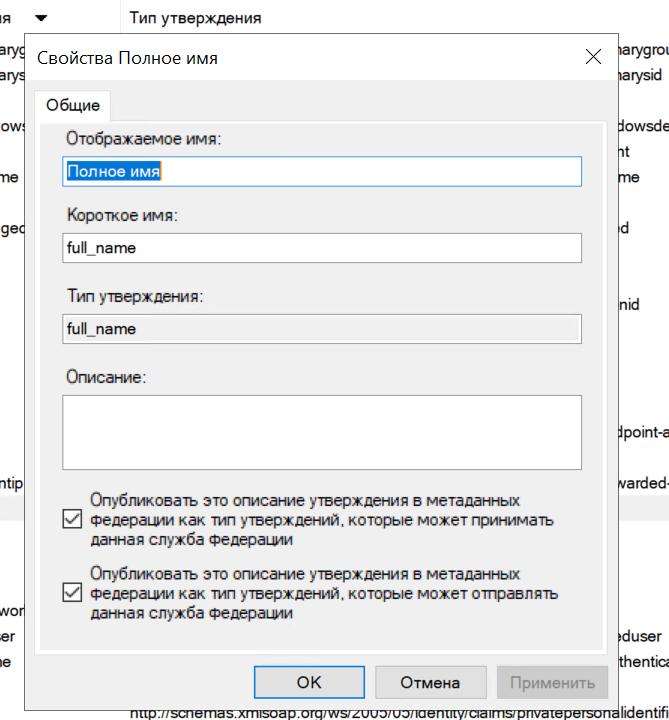

:::

##### Настройка разрешений

9. Установите разрешения клиента:

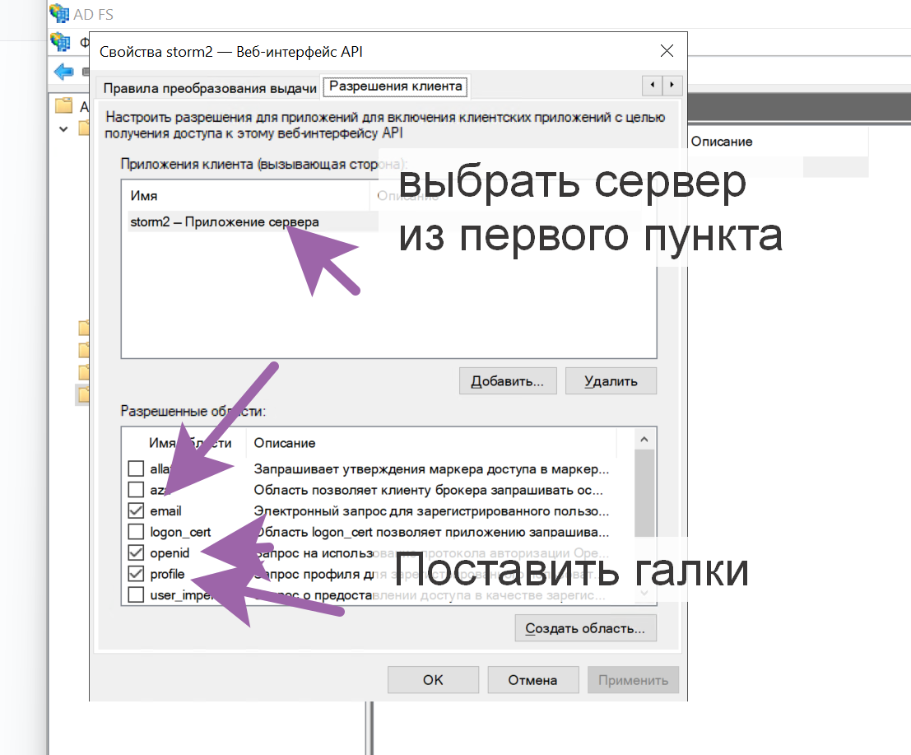

Если все шаги выполнены внимательно, настройка ADFS на стороне сервера завершена.

#### Шаг 2: Настройка StormBPMN

##### Параметры для настройки

Вам потребуются сохраненные значения:

-   **Client ID** (из серверного приложения)
-   **Client Secret** (из серверного приложения)
-   **Resource identifier** (идентификатор ресурса из Web API)

##### Настройка в административной панели

1. Перейдите в административную панель: `/app/admin` → вкладка **Безопасность**

2. Укажите следующие параметры:

| Параметр                     | Значение                            | Примечание                                                |
| ---------------------------- | ----------------------------------- | --------------------------------------------------------- |
| **OAuthClientId**            | Ваш Client ID                       | Из серверного приложения ADFS                             |
| **OAuthClientSecret**        | Ваш Client Secret                   | Из серверного приложения ADFS                             |
| **OAuthAuthorizeUri**        | `/adfs/oauth2/authorize`            | Стандартный путь ADFS                                     |
| **OAuthUserInfoUri**         | `/adfs/userinfo`                    | Для обратной совместимости (ADFS не использует эту ручку) |
| **OAuthTokenUri**            | `/adfs/oauth2/token`                | Стандартный путь ADFS                                     |
| **OAuthButtonLabel**         | `"Войти через ADFS"`                | Текст на кнопке входа                                     |
| **OAuthIsEnabled**           | `true`                              | Включение OAuth2                                          |
| **OAuthRedirectUri**         | `https://your-storm-url/app/signin` | URL вашего StormBPMN                                      |
| **OAuthResponseType**        | `code`                              | Тип ответа                                                |
| **OAuthScope**               | `openid profile email`            | Области доступа                                           |
| **OAuthCodeChallengeMethod** | `S256`                              | Метод challenge                                           |
| **OAuthFlowMode**            | `PKCE`                              | Режим потока                                              |
| **OAuthResource**            | Ваш Resource identifier             | Из Web API приложения                                     |

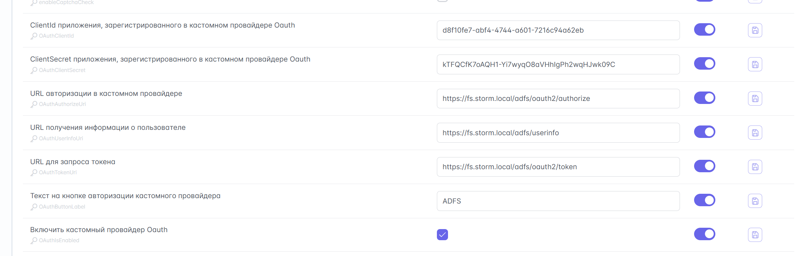
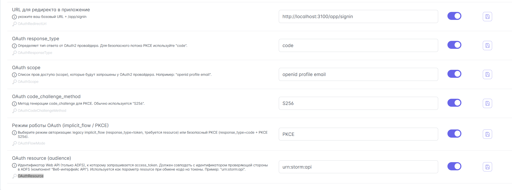

#### Дополнительные требования

::: warning Сертификаты
На самоподписанных сертификатах интеграция работать не будет. Требуется добавить доверенные сертификаты по инструкции в этом разделе.
:::

::: tip Тестирование
Настройка протестирована и гарантированно работает с:

-   **Windows Server 2022**
-   **ADFS 4.0**

Если интеграция не работает, проверьте:

-   Корректность всех параметров
-   Правильность маппинга claims
-   Наличие всех необходимых разрешений в ADFS
-   Доверенные сертификаты (если используются)

:::

### Проверка Claims

Дополнительная проверка прав в токене OAuth2:

| Параметр            | Описание           | Пример значения   |
| ------------------- | ------------------ | ----------------- |
| **OAuthCheckClaim** | Включить проверку  | `true`            |
| **OAuthClaimName**  | Название claim     | `groups`          |
| **OAuthClaimValue** | Требуемое значение | `stormbpmn-users` |

::: warning Откуда берётся claim
Источник значения зависит от режима потока: при `OAuthFlowMode = PKCE` claim читается из access token, при `implicit_flow` — из ответа `/userinfo`. Переключая режим, проверьте, что нужный claim попадает именно туда: в Keycloak за это отвечает соответствующий mapper в client scope.
:::

### Встроенная авторизация

::: warning Только для тестирования
Встроенная авторизация подходит только для тестовых сред. В production используйте OAuth2.
:::

**Аварийный вход:** Добавьте `?showBasicLogin=true` к URL входа для доступа к базовой форме, даже если OAuth2 включен.

### Смена пароля

::: warning Безопасность смены пароля
В версии продукта реализованы усиленные правила безопасности для встроенной авторизации:

1. **Проверка текущего пароля:** При смене пароля система требует указать текущий пароль. Это предотвращает захват учётной записи через украденный JWT-токен.
2. **Блокировка отключённых учётных записей:** Пользователи, отключённые администратором, не могут сменить пароль, даже если у них есть действующий токен.
3. **Ротация сессии:** После успешной смены пароля все ранее выданные токены (сессии на других устройствах) становятся недействительными. Пользователь автоматически выходит из всех устройств и должен войти снова с новым паролем.
:::

---
