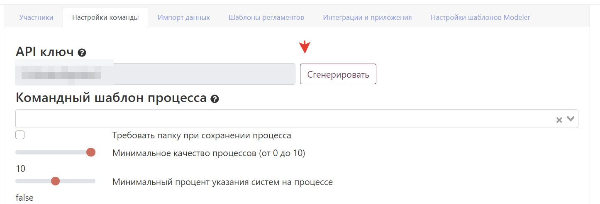

---
dir:
  order: -3
  link: true
index: true
icon: "gears"
---

:::warning
В облачном версии есть ограничения на использования API.
:::

# Rest API
Система представляет API для решения основных задач - получения и изменения диаграмм, получения и изменения элементов архитектуры. API работает по протоколу HTTP, сериализация - JSON.

## Авторизация
### Получения ключа API
Для получения ключа API перейдите в раздел команда, вкладка "Настройки команды" и сгенерируйте ключ:


### Использование ключа
Добавляйте заголовок **"X-Api-Key"** ко всем запросам, отправляемым в API. Действия внутри системы будут выполняться от имени Администратора команды.


# Ограничения API в облачной версии

- **Ограничение скорости по умолчанию**- 5 запросов в 1 минуту.  Вы можете найти оставшиеся запросы в заголовке ответа X-Rate-Limit-Remaining.

- **Размер одного запроса по умолчанию** - 10 Мб. Вы не можете загрузить больше за один запрос. 

Если вы достигнете своей квоты, вы получите это сообщение:
```js
{
    "timestamp": "2022-06-28T12:03:03.438+00:00",
    "status": 429,
    "error": "Too Many Requests", 
    "message": "You have exhausted your API Request Quota",
    "path": "/public-api/v1/upload-diagrams"
}
```
В заголовке ответа X-Rate-Limit-Retry-After-Seconds вы можете узнать, сколько секунд вам нужно подождать до следующей попытки. 

::: danger
Если вы превысите лимит более 3 раз за 24 часа, ваша учетная будет заблокирована. Обратитесь в чат, если такое произошло и вы не злоумышленник.
:::

## Методы API
### Загрузка диаграмм

Путь: **POST /public-api/v1/upload-diagrams**  
Тело запроcа: 
```js
[ //массив процессов
     {
        "id":  "Meeting Scheduling:1:1123", //внешний идентификатор процесса
        // ниже тело диаграммы в XML. сделайте escape всех символов.
        "xml": "<?xml version=\"1.0\" encoding=\"UTF-8\"?>\n<bpmn:definitions xmlns:xsi=\"http://www.w3.org/2001/XMLSchema-instance\" xmlns:bpmn=\"http://www.omg.org/spec/BPMN/20100524/MODEL\" xmlns:bpmndi=\"http://www.omg.org/spec/BPMN/20100524/DI\" xmlns:dc=\"http://www.omg.org/spec/DD/20100524/DC\" xmlns:di=\"http://www.omg.org/spec/DD/20100524/DI\" xmlns:storm=\"http://storm.bpmn2.ru/ns\" id=\"Definitions_1k3dlqi\" targetNamespace=\"http://bpmn.io/schema/bpmn\">\n  <bpmn:process id=\"Process_1\" isExecutable=\"false\">\n    <bpmn:startEvent id=\"StartEvent_1\">\n      <bpmn:outgoing>SequenceFlow_1cqyhs3</bpmn:outgoing>\n    </bpmn:startEvent>\n    <bpmn:endEvent id=\"EndEvent_0zk83sa\">\n      <bpmn:incoming>Flow_01sknpp</bpmn:incoming>\n    </bpmn:endEvent>\n    <bpmn:sequenceFlow id=\"SequenceFlow_1cqyhs3\" sourceRef=\"StartEvent_1\" targetRef=\"Activity_0yu8ycq\" />\n    <bpmn:sequenceFlow id=\"Flow_01sknpp\" sourceRef=\"Activity_0yu8ycq\" targetRef=\"EndEvent_0zk83sa\" />\n    <bpmn:userTask id=\"Activity_0yu8ycq\" storm:HTMLDescription=\"&#60;p&#62;Процесс с &#38;nbsp;описанием&#60;/p&#62;\" storm:StormUrl=\"null\">\n      <bpmn:incoming>SequenceFlow_1cqyhs3</bpmn:incoming>\n      <bpmn:outgoing>Flow_01sknpp</bpmn:outgoing>\n    </bpmn:userTask>\n  </bpmn:process>\n  <bpmndi:BPMNDiagram id=\"BPMNDiagram_1\">\n    <bpmndi:BPMNPlane id=\"BPMNPlane_1\" bpmnElement=\"Process_1\">\n      <bpmndi:BPMNEdge id=\"Flow_01sknpp_di\" bpmnElement=\"Flow_01sknpp\">\n        <di:waypoint x=\"240\" y=\"410\" />\n        <di:waypoint x=\"311\" y=\"410\" />\n        <di:waypoint x=\"311\" y=\"179\" />\n        <di:waypoint x=\"381\" y=\"179\" />\n      </bpmndi:BPMNEdge>\n      <bpmndi:BPMNEdge id=\"SequenceFlow_1cqyhs3_di\" bpmnElement=\"SequenceFlow_1cqyhs3\">\n        <di:waypoint x=\"-42\" y=\"179\" />\n        <di:waypoint x=\"49\" y=\"179\" />\n        <di:waypoint x=\"49\" y=\"410\" />\n        <di:waypoint x=\"140\" y=\"410\" />\n      </bpmndi:BPMNEdge>\n      <bpmndi:BPMNShape id=\"_BPMNShape_StartEvent_2\" bpmnElement=\"StartEvent_1\">\n        <dc:Bounds x=\"-78\" y=\"161\" width=\"36\" height=\"36\" />\n      </bpmndi:BPMNShape>\n      <bpmndi:BPMNShape id=\"EndEvent_0zk83sa_di\" bpmnElement=\"EndEvent_0zk83sa\">\n        <dc:Bounds x=\"381\" y=\"161\" width=\"36\" height=\"36\" />\n      </bpmndi:BPMNShape>\n      <bpmndi:BPMNShape id=\"Activity_13afhcv_di\" bpmnElement=\"Activity_0yu8ycq\">\n        <dc:Bounds x=\"140\" y=\"370\" width=\"100\" height=\"80\" />\n      </bpmndi:BPMNShape>\n    </bpmndi:BPMNPlane>\n  </bpmndi:BPMNDiagram>\n</bpmn:definitions>\n",
        "name": "Meetings", // имя процесса. По нему система определяет связь с процессом в системе.
        "source": "CamundaMeetingsBackend" // источник. Используется для указания описания версии, чтобы было понятно откуда взялась эта версия.
    }
    ]
```
Тело ответа:
```js
{
    "errors": { //объект с ошибками 
        "emptyName": [], // массив внешних идентификаторов, у которых пустое имя.
        "emptyDefinition": [], // массив внешних идентификаторов, у которых пустое тело.
        "notXml": [] // массив внешних идентификаторов, у которых невалидный XML .
    },
    "createdDiagrams": [], // массив созданных диаграмм, внутри такой же объект, как ниже.
    "updatedDiagrams": [ // массив обновленных диаграмм.
        {
            "stormDiagramId": "94d2e63f-f84a-40d4-b4a3-592b0cc7c7d9", //идентификактор в системе.
            "sourceDiagramId": "rhsrthsrth" // внешний идентификатор
        }
    ]
}
```

- Максимум диаграмм в одном запросе - 20.
- Диаграммы с одинаковым идентификатором обновляются в порядке запроса, поэтому вы можете загружать разные версии одной диаграммы для истории версий в одном запросе.

- Поле **Name** очень важно для обновления диаграмм, никогда не меняйте его в Storm, если вы хотите обновлять диаграммы.

:::tip 
Используйте этот shell-script, если используйте Camunda и хотите обновлять версии ваших диаграмм в Stormbpmn после успешного деплоя:
```
#!/bin/bash
# Going to build folder and reading all bpmn file
files=($(ls ./src/main/resources/bpmn/*.bpmn))
size=${#files[@]}
echo '[' > temp.json
counter=1
# Starting temp curl body file
echo Starting loop
# taking file by file
for file in ${files[*]}; do
  id="$(grep -Po '(?<=<bpmn:process\sid=")[^"]+' $file)"
  content="$(cat $file | sed 's/"/\\"/g;')"
  name="$(basename $file .bpmn)"
  echo '{"id":"'$id'","xml":"'$content'", "name": "'$name'", "source": "app"}' >> temp.json
  # Commas between objects shouldn't go at the end of the list
  if ((counter % 20)) && ((size != counter)) ; then
    echo ',' >> temp.json
  fi
  # The limit of the API is 20 diagrams for request
  if ! ((counter % 20)); then
    echo ']' >> temp.json
    curl -X POST -H "X-Api-Key: API-KEY" -H "Content-Type: application/json" -d @temp.json stormbpmn.com/public-api/v1/upload-diagrams -i
    rm temp.json
    echo '[' > temp.json
  fi
  ((counter=counter+1))
  # Limitation of the API, no more then 5 request per minute
  if ((counter > 100)); then
    sleep 60
  fi
done
# Starting temp curl body file
# In cases when number of diagrams is not even to 20 we have to send the rest
echo ']' >> temp.json
curl -X POST -H "X-Api-Key: API_KEY" -H "Content-Type: application/json" -d @temp.json stormbpmn.com/public-api/v1/upload-diagrams -i
rm temp.json
```
:::

### Загрузка и\или обновление элементов архитектуры
Для некоторых случаев использования (например, единый источник правды обо всех ваших элементах архитектуры в компании) вы можете легко загрузить их из вашего бэкенда в Stormbpmn.  
Путь: **POST /public-api/v1/assets**  
Тело запроcа:   

```js
[ 
  {
    "id": null,  // ID элемента в системе. 
    "externalId": null,  //ID элемент во внешней системе.
    "name": "B2C USER", // Название.
    "description": "", // Описание. Ожидается unescaped html, для отображения на UI.
    "externalUrl": null, // ссылка на внешнюю систему, можно прислать с плейсхолдером, например https://mywiki.corp.com/entity/${externalId}
    "type": "CLIENT" // тип элемент архитектуры. Возможные значения UNSPECIFIED, DOCUMENT, SYSTEM, COMMUNCATION, CLIENT, ENTITY, ACTION, OTHER
    "status": "NEW" // статус элемента архитектуры. Возможные значения NEW, TRIAL, PRODUCTION, DECOMMISSIONING, ARCHIVE 
  }
]
```

Тело ответа:
```js
[ 
  {
    "id": 234234,  // ID элемента в системе. 
    "externalId": null,  //ID элемент во внешней системе.
    "name": "B2C USER", // Название.
    "description": "", // Описание. Ожидается unescaped html, для отображения на UI.
    "externalUrl": null, // ссылка на внешнюю систему, можно прислать с плейсхолдером, например https://mywiki.corp.com/entity/${externalId}
    "type": "CLIENT", // тип элемент архитектуры. Возможные значения UNSPECIFIED, DOCUMENT, SYSTEM, COMMUNCATION, CLIENT, ENTITY, ACTION, OTHER.
    "status": "NEW", // статус элемента архитектуры. Возможные значения NEW, TRIAL, PRODUCTION, DECOMMISSIONING, ARCHIVE.
    "createdOn": "2024-05-02T17:19:41.459888", // Дата создания.
    "updatedOn ": "2024-05-02T17:19:41.459888" // Дата обновления.
    "updatedBy  ": "kotov@bpmn2.ru" // Дата обновления.
  }
]
```

- Если **id** или **externalId** не указаны, будет создан новый ЭА. Если вы укажете **externalId**, Storm обновит этот актив. Если вы укажете **id**, Storm обновит этот актив. Если вы укажете **externalId** и **id**, будет обновлен актив с **id**. Тип по умолчанию - UNSPECIFIED.
- Максимум элементов архитектуры в одном запросе - 20.

### Получение списка диаграмм команды
Полученный список диаграмм будет зависить от прав на диаграммы у администратора команды.

Путь: **GET /public-api/v1/get-diagram-list**  
Query-параметры: **page** - указание на текущую страницу, отсчет с 0. Обязателен.

Тело ответа:
```js
{
    "totalElements": 223,  //всего элементов
    "page": 0,  //текущая страница
    "size": 20, // элементов на страницу
    "returnDiagrams": [ //объект диаграммы, назначение полей определяется по смыслу
        {
            "id": "6b547a8f-a78f-4375-b39e-59c4afd9388e",
            "createdOn": "2024-05-02T17:19:41.459888",
            "updatedOn": "2024-05-02T17:28:07.695362",
            "secureCreateDate": null,
            "secureType": null,
            "secureId": null,
            "userFolderName": null,
            "teamFolderName": "Root folder",
            "teamFolderId": null,
            "public": true,
            "favoritesCount": 0,
            "versionNumber": 3,
            "name": "Draft",
            "status": "NEW",
            "updatedBy": "kotov@bpmn2.ru",
            "authorUsername": "kotov@bpmn2.ru",
            "you": true,
            "description": "Created automatically",
            "totalCommentsCount": null,
            "unreadCommentsCountByYou": null,
            "type": "BCM",
            "tags": [],
            "teamName": "Мои кредиты",
            "quality": null,
            "processType": null,
            "linkedDiagramId": null,
            "linkedDiagramName": null,
            "lastVersionComment": null,
            "label": null
        },
      ...
    ]
}
```

### Получение конкретной диаграммы с телом по ID 
Получение диаграммы будет зависить от прав администатора команды на диаграмму.

Путь: **GET /public-api/v1/get-diagram-by-id**  
Query-параметры: **diagramId** - уникальный идентификатор диаграммы, которую вы хотите получить. UUID. Обязателен.
Тело ответа:

:::warning
В будущем контракт изменится. Рекомендуем использовать tolerant reader для получения интересующих вас полей, скорее всего это body.
:::

```js
{
    "id": "c2865631-ac51-4674-8ff1-cc7d099248f4", //все по смыслу, вас вероятно интересует body
    "createdOn": "2023-06-08T11:07:02.478261",
    "updatedOn": "2024-05-02T12:58:35.038259",
    "updateBy": "kotov@bpmn2.ru",
    "userFolderName": null,
    "teamFolderName": "Onsite customer journey",
    "userFolderId": null,
    "teamFolderId": 382847,
    "body": "<?xml version=\"1.0\" encoding=\"UTF-8\"?>\n<bpmn:definitions xmlns:xsi=\"http://www.w3.org/2001/XMLSchema-instance\" xmlns:bpmn=\"http://www.omg.org/spec/BPMN/20100524/MODEL\" xmlns:bpmndi=\"http://www.omg.org/spec/BPMN/20100524/DI\" xmlns:dc=\"http://www.omg.org/spec/DD/20100524/DC\" xmlns:di=\"http://www.omg.org/spec/DD/20100524/DI\" xmlns:storm=\"http://storm.bpmn2.ru/ns\" id=\"Definitions_0k1j9yz\" targetNamespace=\"http://bpmn.io/schema/bpmn\" exporter=\"bpmn-js (https://demo.bpmn.io)\" exporterVersion=\"12.0.0\">\n  <bpmn:collaboration id=\"Collaboration_18v4tc3\">\n    <bpmn:participant id=\"Participant_0xz6sxz\" name=\"Заправка транспортных средств на АЗС\" processRef=\"Process_15riz2w\" />\n  </bpmn:collaboration>\n  <bpmn:process id=\"Process_15riz2w\" isExecutable=\"false\">\n    <bpmn:laneSet id=\"LaneSet_1qu9996\">\n      <bpmn:lane id=\"Lane_09tacso\" name=\"\">\n        <bpmn:flowNodeRef>Activity_0ey72g8</bpmn:flowNodeRef>\n        <bpmn:flowNodeRef>Gateway_0ufrcd1</bpmn:flowNodeRef>\n        <bpmn:flowNodeRef>Gateway_0amqdnc</bpmn:flowNodeRef>\n        <bpmn:flowNodeRef>StartEvent_1owa3gz</bpmn:flowNodeRef>\n        <bpmn:flowNodeRef>Event_13tbaq5</bpmn:flowNodeRef>\n        <bpmn:flowNodeRef>Activity_0arw1za</bpmn:flowNodeRef>\n        <bpmn:flowNodeRef>Gateway_1x5uko4</bpmn:flowNodeRef>\n        <bpmn:flowNodeRef>Gateway_0gsea4f</bpmn:flowNodeRef>\n        <bpmn:flowNodeRef>Event_0q3l1ve</bpmn:flowNodeRef>\n        <bpmn:flowNodeRef>Gateway_0ja7apz</bpmn:flowNodeRef>\n        <bpmn:flowNodeRef>Activity_1k0nqu3</bpmn:flowNodeRef>\n        <bpmn:flowNodeRef>Activity_1x7dy71</bpmn:flowNodeRef>\n        <bpmn:flowNodeRef>Gateway_0hl51m1</bpmn:flowNodeRef>\n        <bpmn:flowNodeRef>Activity_1ncakky</bpmn:flowNodeRef>\n        <bpmn:flowNodeRef>Activity_0y00e6g</bpmn:flowNodeRef>\n        <bpmn:flowNodeRef>Event_0tqgfv3</bpmn:flowNodeRef>\n        <bpmn:flowNodeRef>Activity_0zqi22l</bpmn:flowNodeRef>\n        <bpmn:flowNodeRef>Activity_09tjath</bpmn:flowNodeRef>\n        <bpmn:flowNodeRef>Event_0y18e5s</bpmn:flowNodeRef>\n        <bpmn:flowNodeRef>Activity_0azk7it</bpmn:flowNodeRef>\n        <bpmn:flowNodeRef>Activity_1n1yuin</bpmn:flowNodeRef>\n        <bpmn:childLaneSet id=\"LaneSet_0mycmnq\">\n          <bpmn:lane id=\"Lane_0opua0c\">\n            <bpmn:flowNodeRef>Activity_0ey72g8</bpmn:flowNodeRef>\n            <bpmn:flowNodeRef>Activity_1n1yuin</bpmn:flowNodeRef>\n          </bpmn:lane>\n          <bpmn:lane id=\"Lane_1dwh7p7\">\n            <bpmn:flowNodeRef>Gateway_0ufrcd1</bpmn:flowNodeRef>\n            <bpmn:flowNodeRef>Gateway_0amqdnc</bpmn:flowNodeRef>\n            <bpmn:flowNodeRef>StartEvent_1owa3gz</bpmn:flowNodeRef>\n            <bpmn:flowNodeRef>Event_13tbaq5</bpmn:flowNodeRef>\n            <bpmn:flowNodeRef>Activity_0arw1za</bpmn:flowNodeRef>\n            <bpmn:flowNodeRef>Gateway_1x5uko4</bpmn:flowNodeRef>\n            <bpmn:flowNodeRef>Gateway_0gsea4f</bpmn:flowNodeRef>\n            <bpmn:flowNodeRef>Event_0q3l1ve</bpmn:flowNodeRef>\n            <bpmn:flowNodeRef>Gateway_0ja7apz</bpmn:flowNodeRef>\n            <bpmn:flowNodeRef>Activity_1k0nqu3</bpmn:flowNodeRef>\n            <bpmn:flowNodeRef>Activity_1x7dy71</bpmn:flowNodeRef>\n            <bpmn:flowNodeRef>Gateway_0hl51m1</bpmn:flowNodeRef>\n            <bpmn:flowNodeRef>Activity_1ncakky</bpmn:flowNodeRef>\n            <bpmn:flowNodeRef>Activity_0y00e6g</bpmn:flowNodeRef>\n            <bpmn:flowNodeRef>Event_0tqgfv3</bpmn:flowNodeRef>\n            <bpmn:flowNodeRef>Activity_0zqi22l</bpmn:flowNodeRef>\n            <bpmn:flowNodeRef>Activity_09tjath</bpmn:flowNodeRef>\n            <bpmn:flowNodeRef>Event_0y18e5s</bpmn:flowNodeRef>\n            <bpmn:flowNodeRef>Activity_0azk7it</bpmn:flowNodeRef>\n          </bpmn:lane>\n          <bpmn:lane id=\"Lane_04pcekg\" />\n        </bpmn:childLaneSet>\n      </bpmn:lane>\n    </bpmn:laneSet>\n    <bpmn:sequenceFlow id=\"Flow_05o1t7g\" sourceRef=\"Activity_0ey72g8\" targetRef=\"Gateway_0ja7apz\" />\n    <bpmn:sequenceFlow id=\"Flow_0tay24k\" sourceRef=\"StartEvent_1owa3gz\" targetRef=\"Gateway_0ufrcd1\" />\n    <bpmn:sequenceFlow id=\"Flow_1k5t878\" name=\"нет\" sourceRef=\"Gateway_0ufrcd1\" targetRef=\"Gateway_0amqdnc\" />\n    <bpmn:sequenceFlow id=\"Flow_1t6ptii\" name=\"да\" sourceRef=\"Gateway_0ufrcd1\" targetRef=\"Gateway_0ja7apz\" />\n    <bpmn:sequenceFlow id=\"Flow_01iqiq7\" name=\"да\" sourceRef=\"Gateway_0amqdnc\" targetRef=\"Activity_0ey72g8\" />\n    <bpmn:sequenceFlow id=\"Flow_00ci6za\" name=\"нет\" sourceRef=\"Gateway_0amqdnc\" targetRef=\"Gateway_1x5uko4\" />\n    <bpmn:sequenceFlow id=\"Flow_1kcgm0r\" name=\"нет\" sourceRef=\"Gateway_1x5uko4\" targetRef=\"Event_13tbaq5\" />\n    <bpmn:sequenceFlow id=\"Flow_1mle07z\" name=\"да\" sourceRef=\"Gateway_1x5uko4\" targetRef=\"Activity_0arw1za\" />\n    <bpmn:sequenceFlow id=\"Flow_1gg9s1v\" sourceRef=\"Activity_0arw1za\" targetRef=\"Gateway_0gsea4f\" />\n    <bpmn:sequenceFlow id=\"Flow_119pyr5\" name=\"нет\" sourceRef=\"Gateway_0gsea4f\" targetRef=\"Event_0q3l1ve\" />\n    <bpmn:sequenceFlow id=\"Flow_0gnbd02\" name=\"да\" sourceRef=\"Gateway_0gsea4f\" targetRef=\"Gateway_0ja7apz\" />\n    <bpmn:sequenceFlow id=\"Flow_0fxfoej\" sourceRef=\"Gateway_0ja7apz\" targetRef=\"Activity_1k0nqu3\" />\n    <bpmn:sequenceFlow id=\"Flow_1gj41sz\" name=\"нет\" sourceRef=\"Gateway_0hl51m1\" targetRef=\"Event_0tqgfv3\" />\n    <bpmn:sequenceFlow id=\"Flow_0mmahtf\" name=\"да\" sourceRef=\"Gateway_0hl51m1\" targetRef=\"Activity_1ncakky\" />\n    <bpmn:sequenceFlow id=\"Flow_0u52mb0\" sourceRef=\"Activity_1x7dy71\" targetRef=\"Gateway_0hl51m1\" />\n    <bpmn:sequenceFlow id=\"Flow_1jn4hpu\" sourceRef=\"Activity_1ncakky\" targetRef=\"Activity_0y00e6g\" />\n    <bpmn:sequenceFlow id=\"Flow_05fta26\" sourceRef=\"Activity_0y00e6g\" targetRef=\"Activity_0azk7it\" />\n    <bpmn:sequenceFlow id=\"Flow_1l2bhl9\" sourceRef=\"Activity_0azk7it\" targetRef=\"Activity_0zqi22l\" />\n    <bpmn:sequenceFlow id=\"Flow_0w0p1yy\" sourceRef=\"Activity_0zqi22l\" targetRef=\"Activity_09tjath\" />\n    <bpmn:sequenceFlow id=\"Flow_10kz52m\" sourceRef=\"Activity_09tjath\" targetRef=\"Event_0y18e5s\" />\n    <bpmn:task id=\"Activity_0ey72g8\" name=\"Организовать внеочередное обслуживание клиента\">\n      <bpmn:incoming>Flow_01iqiq7</bpmn:incoming>\n      <bpmn:outgoing>Flow_05o1t7g</bpmn:outgoing>\n    </bpmn:task>\n    <bpmn:sequenceFlow id=\"Flow_0q5pmcd\" sourceRef=\"Activity_1k0nqu3\" targetRef=\"Activity_1x7dy71\" />\n    <bpmn:exclusiveGateway id=\"Gateway_0ufrcd1\" name=\"есть свободная колонка?\">\n      <bpmn:incoming>Flow_0tay24k</bpmn:incoming>\n      <bpmn:outgoing>Flow_1k5t878</bpmn:outgoing>\n      <bpmn:outgoing>Flow_1t6ptii</bpmn:outgoing>\n    </bpmn:exclusiveGateway>\n    <bpmn:exclusiveGateway id=\"Gateway_0amqdnc\" name=\"машина клиента спец. назначения?\">\n      <bpmn:incoming>Flow_1k5t878</bpmn:incoming>\n      <bpmn:outgoing>Flow_01iqiq7</bpmn:outgoing>\n      <bpmn:outgoing>Flow_00ci6za</bpmn:outgoing>\n    </bpmn:exclusiveGateway>\n    <bpmn:startEvent id=\"StartEvent_1owa3gz\" name=\"клиент приехал на заправку\">\n      <bpmn:outgoing>Flow_0tay24k</bpmn:outgoing>\n    </bpmn:startEvent>\n    <bpmn:endEvent id=\"Event_13tbaq5\" name=\"отъезд клиента\">\n      <bpmn:incoming>Flow_1kcgm0r</bpmn:incoming>\n    </bpmn:endEvent>\n    <bpmn:task id=\"Activity_0arw1za\" name=\"Встать в очередь\">\n      <bpmn:incoming>Flow_1mle07z</bpmn:incoming>\n      <bpmn:outgoing>Flow_1gg9s1v</bpmn:outgoing>\n    </bpmn:task>\n    <bpmn:exclusiveGateway id=\"Gateway_1x5uko4\" name=\"клиент готов ждать?\">\n      <bpmn:incoming>Flow_00ci6za</bpmn:incoming>\n      <bpmn:outgoing>Flow_1kcgm0r</bpmn:outgoing>\n      <bpmn:outgoing>Flow_1mle07z</bpmn:outgoing>\n    </bpmn:exclusiveGateway>\n    <bpmn:exclusiveGateway id=\"Gateway_0gsea4f\" name=\"клиент готов ждать своей очереди?\">\n      <bpmn:incoming>Flow_1gg9s1v</bpmn:incoming>\n      <bpmn:outgoing>Flow_119pyr5</bpmn:outgoing>\n      <bpmn:outgoing>Flow_0gnbd02</bpmn:outgoing>\n    </bpmn:exclusiveGateway>\n    <bpmn:endEvent id=\"Event_0q3l1ve\" name=\"отъезд клиента\">\n      <bpmn:incoming>Flow_119pyr5</bpmn:incoming>\n    </bpmn:endEvent>\n    <bpmn:exclusiveGateway id=\"Gateway_0ja7apz\">\n      <bpmn:incoming>Flow_0gnbd02</bpmn:incoming>\n      <bpmn:incoming>Flow_05o1t7g</bpmn:incoming>\n      <bpmn:incoming>Flow_1t6ptii</bpmn:incoming>\n      <bpmn:outgoing>Flow_0fxfoej</bpmn:outgoing>\n    </bpmn:exclusiveGateway>\n    <bpmn:task id=\"Activity_1k0nqu3\" storm:ExternalUrl=\"111\" storm:HTMLDescription=\"\" storm:StormUrl=\"null\" name=\"Подъехать к свободной колонке\" storm:StormAssignee=\"5151573\">\n      <bpmn:incoming>Flow_0fxfoej</bpmn:incoming>\n      <bpmn:outgoing>Flow_0q5pmcd</bpmn:outgoing>\n    </bpmn:task>\n    <bpmn:task id=\"Activity_1x7dy71\" name=\"Выбрать топливо\">\n      <bpmn:incoming>Flow_0q5pmcd</bpmn:incoming>\n      <bpmn:outgoing>Flow_0u52mb0</bpmn:outgoing>\n    </bpmn:task>\n    <bpmn:exclusiveGateway id=\"Gateway_0hl51m1\" name=\"есть необходимое топливо?\">\n      <bpmn:incoming>Flow_0u52mb0</bpmn:incoming>\n      <bpmn:outgoing>Flow_1gj41sz</bpmn:outgoing>\n      <bpmn:outgoing>Flow_0mmahtf</bpmn:outgoing>\n    </bpmn:exclusiveGateway>\n    <bpmn:task id=\"Activity_1ncakky\" storm:HTMLDescription=\"\" storm:StormUrl=\"null\" name=\"Открыть топливный бак\" storm:StormEdgeId=\"3925481\">\n      <bpmn:incoming>Flow_0mmahtf</bpmn:incoming>\n      <bpmn:outgoing>Flow_1jn4hpu</bpmn:outgoing>\n    </bpmn:task>\n    <bpmn:task id=\"Activity_0y00e6g\" name=\"Установить пистолет в топливный бак\">\n      <bpmn:incoming>Flow_1jn4hpu</bpmn:incoming>\n      <bpmn:outgoing>Flow_05fta26</bpmn:outgoing>\n    </bpmn:task>\n    <bpmn:endEvent id=\"Event_0tqgfv3\" name=\"отъезд клиента\">\n      <bpmn:incoming>Flow_1gj41sz</bpmn:incoming>\n    </bpmn:endEvent>\n    <bpmn:task id=\"Activity_0zqi22l\" name=\"Закрыть топливный бак\">\n      <bpmn:incoming>Flow_1l2bhl9</bpmn:incoming>\n      <bpmn:outgoing>Flow_0w0p1yy</bpmn:outgoing>\n    </bpmn:task>\n    <bpmn:task id=\"Activity_09tjath\" name=\"Установить пистолет на колонку\">\n      <bpmn:incoming>Flow_0w0p1yy</bpmn:incoming>\n      <bpmn:outgoing>Flow_10kz52m</bpmn:outgoing>\n    </bpmn:task>\n    <bpmn:endEvent id=\"Event_0y18e5s\" name=\"машина клиента заправлена\">\n      <bpmn:incoming>Flow_10kz52m</bpmn:incoming>\n    </bpmn:endEvent>\n    <bpmn:subProcess id=\"Activity_0azk7it\" name=\"Оплата топлива\">\n      <bpmn:incoming>Flow_05fta26</bpmn:incoming>\n      <bpmn:outgoing>Flow_1l2bhl9</bpmn:outgoing>\n      <bpmn:startEvent id=\"Event_1ivhz3u\">\n        <bpmn:outgoing>Flow_1dho7cp</bpmn:outgoing>\n      </bpmn:startEvent>\n      <bpmn:task id=\"Activity_067oxok\">\n        <bpmn:incoming>Flow_1dho7cp</bpmn:incoming>\n      </bpmn:task>\n      <bpmn:sequenceFlow id=\"Flow_1dho7cp\" sourceRef=\"Event_1ivhz3u\" targetRef=\"Activity_067oxok\" />\n    </bpmn:subProcess>\n    <bpmn:callActivity id=\"Activity_1n1yuin\" storm:HTMLDescription=\"\" storm:StormUrl=\"{&#34;id&#34;:&#34;3b036dd7-bd8b-40ec-865e-52602444f8ba&#34;,&#34;createdOn&#34;:&#34;2022-10-26T10:52:58.599515&#34;,&#34;updatedOn&#34;:&#34;2023-05-03T13:39:57.24165&#34;,&#34;secureCreateDate&#34;:null,&#34;secureType&#34;:null,&#34;secureId&#34;:null,&#34;userFolderName&#34;:null,&#34;teamFolderName&#34;:&#34;ЧАЗОВА 1. Обеспечение контроля качества медицинской помощи&#34;,&#34;teamFolderId&#34;:&#34;778180&#34;,&#34;public&#34;:true,&#34;favoritesCount&#34;:0,&#34;versionNumber&#34;:1,&#34;name&#34;:&#34;1.1 Чазова Процесс организации внутреннего контроля качества оказания медицинской помощи&#34;,&#34;status&#34;:&#34;NEW&#34;,&#34;updatedBy&#34;:&#34;kotov@bpmn2.ru&#34;,&#34;authorUsername&#34;:&#34;kotov@bpmn2.ru&#34;,&#34;you&#34;:true,&#34;description&#34;:&#34;&#60;h2&#62;Общая информация&#60;/h2&#62;&#60;hr&#62;&#60;h3&#62;Владелец процесса&#60;/h3&#62;&#60;ul&#62;&#60;li&#62;Котов Д.Г &#60;a href=\\&#34;mailto:kotov@bpmn2.ru\\&#34;&#62;kotov@bpmn2.ru&#60;/a&#62;&#60;/li&#62;&#60;li&#62;владелец продукта&#60;/li&#62;&#60;li&#62;центр принятия решений&#60;/li&#62;&#60;/ul&#62;&#60;h3&#62;Назначение процесса&#60;/h3&#62;&#60;p&#62;Процесс предназначен для квалификации входящих лидов и продажи лидам продукта &#60;strong&#62;Stormbpmn Enterprise&#60;/strong&#62;.&#60;/p&#62;&#60;h3&#62;Начало процесса&#60;/h3&#62;&#60;p&#62;Одно из:&#60;/p&#62;&#60;ul&#62;&#60;li&#62;Входящее письмо на ящик &#60;a href=\\&#34;mailto:sales@bpmn2.ru\\&#34;&#62;sales@bpmn2.ru&#60;/a&#62;&#60;/li&#62;&#60;li&#62;Телефонный звонок&#60;/li&#62;&#60;li&#62;Завершение триала&#38;nbsp;&#60;/li&#62;&#60;li&#62;Прямые контакты из маркетинга&#38;nbsp;&#60;/li&#62;&#60;/ul&#62;&#60;h3&#62;Завершение процесса&#60;/h3&#62;&#60;p&#62;Одно из:&#60;/p&#62;&#60;ul&#62;&#60;li&#62;Информация от клиента о готовности заключать договор на конкретных условиях &#60;span style=\\&#34;color:hsl(120,75%,60%);\\&#34;&#62;(успех)&#60;/span&#62;&#60;/li&#62;&#60;li&#62;Отказ клиента от взаимодействия &#60;span style=\\&#34;color:hsl(0,75%,60%);\\&#34;&#62;(не успех)&#60;/span&#62;&#60;/li&#62;&#60;/ul&#62;&#60;hr&#62;&#60;h2&#62;Термины и определения&#60;/h2&#62;&#60;ul&#62;&#60;li&#62;&#60;strong&#62;Квалификация -&#60;/strong&#62; оценка потенциального клиента как подходящего под продукт, направленная на понимание того, какой сценарий &#38;nbsp;продажи использовать и нужен ли вообще клиенту продукт.&#60;/li&#62;&#60;li&#62;&#60;strong&#62;Лид &#60;/strong&#62;- интерес юр.лица к продукту&#60;/li&#62;&#60;li&#62;&#60;strong&#62;Сделка&#38;nbsp;&#60;/strong&#62; - потенциальный договор с клиентом&#60;/li&#62;&#60;/ul&#62;&#60;hr&#62;&#60;h2&#62;Метрики процесса&#60;/h2&#62;&#60;p&#62;Процесс направлен на быстрое и удобное выставление и согласование коммерческих предложений клиентам.&#60;/p&#62;&#60;figure class=\\&#34;table\\&#34;&#62;&#60;table&#62;&#60;thead&#62;&#60;tr&#62;&#60;th&#62;№&#60;/th&#62;&#60;th&#62;Название метрики&#60;/th&#62;&#60;th&#62;Способ расчёта&#60;/th&#62;&#60;th&#62;Плановые значения q4 2022&#60;/th&#62;&#60;th&#62;Фактические значение q4 2022&#60;/th&#62;&#60;/tr&#62;&#60;/thead&#62;&#60;tbody&#62;&#60;tr&#62;&#60;td&#62;1&#60;/td&#62;&#60;td&#62;Количество экземпляров&#38;nbsp;&#60;/td&#62;&#60;td&#62;&#60;i&#62;Вручную, CRM&#60;/i&#62;&#60;/td&#62;&#60;td&#62;50 шт&#60;/td&#62;&#60;td&#62;&#38;nbsp;&#60;/td&#62;&#60;/tr&#62;&#60;tr&#62;&#60;td&#62;2&#60;/td&#62;&#60;td&#62;Количество успешных экземпляров&#60;/td&#62;&#60;td&#62;&#60;i&#62;Вручную, CRM&#60;/i&#62;&#60;/td&#62;&#60;td&#62;15 шт&#60;/td&#62;&#60;td&#62;&#38;nbsp;&#60;/td&#62;&#60;/tr&#62;&#60;tr&#62;&#60;td&#62;3&#60;/td&#62;&#60;td&#62;Результативность процесса (конверсия)&#60;/td&#62;&#60;td&#62;&#60;i&#62;Вручную, CRM&#60;/i&#62;&#60;/td&#62;&#60;td&#62;30 %&#60;/td&#62;&#60;td&#62;&#38;nbsp;&#60;/td&#62;&#60;/tr&#62;&#60;tr&#62;&#60;td&#62;4&#60;/td&#62;&#60;td&#62;Средняя сумма сделки&#60;/td&#62;&#60;td&#62;&#60;i&#62;Вручную, CRM&#60;/i&#62;&#60;/td&#62;&#60;td&#62;&#38;nbsp;1 500 000 &#38;nbsp;руб.&#60;/td&#62;&#60;td&#62;&#38;nbsp;&#60;/td&#62;&#60;/tr&#62;&#60;tr&#62;&#60;td&#62;5&#60;/td&#62;&#60;td&#62;Сумма сделок&#38;nbsp;&#60;/td&#62;&#60;td&#62;&#60;i&#62;Вручную, CRM&#60;/i&#62;&#60;/td&#62;&#60;td&#62;22 500 000 руб.&#60;/td&#62;&#60;td&#62;&#38;nbsp;&#60;/td&#62;&#60;/tr&#62;&#60;tr&#62;&#60;td&#62;6&#60;/td&#62;&#60;td&#62;Себестоимость экземпляра&#60;/td&#62;&#60;td&#62;&#60;i&#62;Вручную&#60;/i&#62;&#60;/td&#62;&#60;td&#62;15 000 руб&#60;/td&#62;&#60;td&#62;&#38;nbsp;&#60;/td&#62;&#60;/tr&#62;&#60;tr&#62;&#60;td&#62;7&#60;/td&#62;&#60;td&#62;Расходы за период&#60;/td&#62;&#60;td&#62;&#60;i&#62;Вручную&#60;/i&#62;&#60;/td&#62;&#60;td&#62;750 000 руб&#60;/td&#62;&#60;td&#62;&#38;nbsp;&#60;/td&#62;&#60;/tr&#62;&#60;tr&#62;&#60;td&#62;8&#60;/td&#62;&#60;td&#62;Lead time&#60;/td&#62;&#60;td&#62;&#60;i&#62;Вручную, CRM&#60;/i&#62;&#60;/td&#62;&#60;td&#62;40 &#38;nbsp;дней&#60;/td&#62;&#60;td&#62;&#38;nbsp;&#60;/td&#62;&#60;/tr&#62;&#60;tr&#62;&#60;td&#62;9&#60;/td&#62;&#60;td&#62;Cycle time&#60;/td&#62;&#60;td&#62;&#60;i&#62;Вручную, CRM&#60;/i&#62;&#60;/td&#62;&#60;td&#62;0 дней&#60;/td&#62;&#60;td&#62;&#38;nbsp;&#60;/td&#62;&#60;/tr&#62;&#60;tr&#62;&#60;td&#62;10&#60;/td&#62;&#60;td&#62;Запасы процесса&#60;/td&#62;&#60;td&#62;&#60;i&#62;Вручную, CRM&#60;/i&#62;&#60;/td&#62;&#60;td&#62;5 шт&#60;/td&#62;&#60;td&#62;&#38;nbsp;&#60;/td&#62;&#60;/tr&#62;&#60;tr&#62;&#60;td&#62;11&#60;/td&#62;&#60;td&#62;Полезное время &#38;nbsp;процесса&#60;/td&#62;&#60;td&#62;&#60;i&#62;Вручную&#60;/i&#62;&#60;/td&#62;&#60;td&#62;5 дней&#60;/td&#62;&#60;td&#62;&#38;nbsp;&#60;/td&#62;&#60;/tr&#62;&#60;tr&#62;&#60;td&#62;12&#60;/td&#62;&#60;td&#62;Время ожидания заказчика&#60;/td&#62;&#60;td&#62;&#60;i&#62;Вручную&#60;/i&#62;&#60;/td&#62;&#60;td&#62;3 дня&#60;/td&#62;&#60;td&#62;&#38;nbsp;&#60;/td&#62;&#60;/tr&#62;&#60;tr&#62;&#60;td&#62;13&#60;/td&#62;&#60;td&#62;Степень бюрократизации&#60;/td&#62;&#60;td&#62;&#60;i&#62;Вручную&#60;/i&#62;&#60;/td&#62;&#60;td&#62;0%&#60;/td&#62;&#60;td&#62;&#38;nbsp;&#60;/td&#62;&#60;/tr&#62;&#60;tr&#62;&#60;td&#62;14&#60;/td&#62;&#60;td&#62;Уровень брака&#60;/td&#62;&#60;td&#62;&#60;i&#62;Вручную&#60;/i&#62;&#60;/td&#62;&#60;td&#62;0%&#60;/td&#62;&#60;td&#62;&#38;nbsp;&#60;/td&#62;&#60;/tr&#62;&#60;tr&#62;&#60;td&#62;15&#60;/td&#62;&#60;td&#62;Доля самообслуживания&#60;/td&#62;&#60;td&#62;&#60;i&#62;Вручную&#60;/i&#62;&#60;/td&#62;&#60;td&#62;10%&#60;/td&#62;&#60;td&#62;&#38;nbsp;&#60;/td&#62;&#60;/tr&#62;&#60;tr&#62;&#60;td&#62;16&#60;/td&#62;&#60;td&#62;Uptime&#60;/td&#62;&#60;td&#62;&#60;i&#62;Вручную&#60;/i&#62;&#60;/td&#62;&#60;td&#62;99%&#60;/td&#62;&#60;td&#62;&#38;nbsp;&#60;/td&#62;&#60;/tr&#62;&#60;tr&#62;&#60;td&#62;17&#60;/td&#62;&#60;td&#62;Оценка потребительских усилий&#60;/td&#62;&#60;td&#62;&#60;i&#62;Вручную&#60;/i&#62;&#60;/td&#62;&#60;td&#62;50 баллов (10 баллов на касание)&#60;/td&#62;&#60;td&#62;&#38;nbsp;&#60;/td&#62;&#60;/tr&#62;&#60;tr&#62;&#60;td&#62;18&#60;/td&#62;&#60;td&#62;Стоимость взаимодействия&#60;/td&#62;&#60;td&#62;&#60;i&#62;Вручную&#60;/i&#62;&#60;/td&#62;&#60;td&#62;10 000 р&#60;/td&#62;&#60;td&#62;&#38;nbsp;&#60;/td&#62;&#60;/tr&#62;&#60;/tbody&#62;&#60;/table&#62;&#60;/figure&#62;&#60;p&#62;&#38;nbsp;&#60;/p&#62;&#34;,&#34;totalCommentsCount&#34;:null,&#34;unreadCommentsCountByYou&#34;:null,&#34;type&#34;:&#34;BPMN&#34;,&#34;tags&#34;:[],&#34;teamName&#34;:&#34;Мои кредиты&#34;,&#34;quality&#34;:null,&#34;processType&#34;:null,&#34;linkedDiagramId&#34;:null,&#34;linkedDiagramName&#34;:null,&#34;lastVersionComment&#34;:null,&#34;label&#34;:&#34;1.1 Чазова Процесс организации внутреннего контроля качества оказания медицинской помощи&#34;}\" name=\"1.1 Чазова Процесс организации внутреннего контроля качества оказания медицинской помощи\" />\n    <bpmn:textAnnotation id=\"TextAnnotation_147505o\">\n      <bpmn:text>А как мы это узнали? Нет задачи чтобы узнать</bpmn:text>\n    </bpmn:textAnnotation>\n    <bpmn:association id=\"Association_0091rdo\" sourceRef=\"Gateway_1x5uko4\" targetRef=\"TextAnnotation_147505o\" />\n    <bpmn:textAnnotation id=\"TextAnnotation_1ic1b67\">\n      <bpmn:text>А как мы это узнали?</bpmn:text>\n    </bpmn:textAnnotation>\n    <bpmn:association id=\"Association_0xpzn7a\" sourceRef=\"Gateway_0amqdnc\" targetRef=\"TextAnnotation_1ic1b67\" />\n    <bpmn:textAnnotation id=\"TextAnnotation_1vehbw6\">\n      <bpmn:text>Кому подьехать?</bpmn:text>\n    </bpmn:textAnnotation>\n    <bpmn:textAnnotation id=\"TextAnnotation_1b0b809\">\n      <bpmn:text>Тоже самое, очень мелко. + представление со стороны клиента, а в задаче - со стороны собственника АЗС. Здесь, далее и везде</bpmn:text>\n    </bpmn:textAnnotation>\n    <bpmn:textAnnotation id=\"TextAnnotation_0yll0b1\">\n      <bpmn:text>Кому подьехать? 2 задачи мелковаты для процесса</bpmn:text>\n    </bpmn:textAnnotation>\n    <bpmn:association id=\"Association_1c20fg2\" sourceRef=\"Activity_1k0nqu3\" targetRef=\"TextAnnotation_1vehbw6\" />\n    <bpmn:association id=\"Association_0ve0zxf\" sourceRef=\"Activity_1x7dy71\" targetRef=\"TextAnnotation_0yll0b1\" />\n    <bpmn:association id=\"Association_00h6rad\" sourceRef=\"Activity_1ncakky\" targetRef=\"TextAnnotation_1b0b809\" />\n  </bpmn:process>\n  <bpmndi:BPMNDiagram id=\"BPMNDiagram_1\">\n    <bpmndi:BPMNPlane id=\"BPMNPlane_1\" bpmnElement=\"Collaboration_18v4tc3\">\n      <bpmndi:BPMNShape id=\"Participant_0xz6sxz_di\" bpmnElement=\"Participant_0xz6sxz\" isHorizontal=\"true\">\n        <dc:Bounds x=\"160\" y=\"70\" width=\"1860\" height=\"870\" />\n        <bpmndi:BPMNLabel />\n      </bpmndi:BPMNShape>\n      <bpmndi:BPMNShape id=\"Lane_09tacso_di\" bpmnElement=\"Lane_09tacso\" isHorizontal=\"true\">\n        <dc:Bounds x=\"190\" y=\"70\" width=\"1830\" height=\"870\" />\n      </bpmndi:BPMNShape>\n      <bpmndi:BPMNShape id=\"Lane_04pcekg_di\" bpmnElement=\"Lane_04pcekg\" isHorizontal=\"true\">\n        <dc:Bounds x=\"220\" y=\"646\" width=\"1800\" height=\"294\" />\n      </bpmndi:BPMNShape>\n      <bpmndi:BPMNShape id=\"Lane_1dwh7p7_di\" bpmnElement=\"Lane_1dwh7p7\" isHorizontal=\"true\">\n        <dc:Bounds x=\"220\" y=\"363\" width=\"1800\" height=\"283\" />\n      </bpmndi:BPMNShape>\n      <bpmndi:BPMNShape id=\"Lane_0opua0c_di\" bpmnElement=\"Lane_0opua0c\" isHorizontal=\"true\">\n        <dc:Bounds x=\"220\" y=\"70\" width=\"1800\" height=\"293\" />\n      </bpmndi:BPMNShape>\n      <bpmndi:BPMNShape id=\"Activity_0ey72g8_di\" bpmnElement=\"Activity_0ey72g8\">\n        <dc:Bounds x=\"570\" y=\"100\" width=\"100\" height=\"230\" />\n        <bpmndi:BPMNLabel />\n      </bpmndi:BPMNShape>\n      <bpmndi:BPMNShape id=\"Gateway_0ufrcd1_di\" bpmnElement=\"Gateway_0ufrcd1\" isMarkerVisible=\"true\">\n        <dc:Bounds x=\"305\" y=\"365\" width=\"50\" height=\"50\" />\n        <bpmndi:BPMNLabel>\n          <dc:Bounds x=\"291\" y=\"336\" width=\"80\" height=\"27\" />\n        </bpmndi:BPMNLabel>\n      </bpmndi:BPMNShape>\n      <bpmndi:BPMNShape id=\"Gateway_0amqdnc_di\" bpmnElement=\"Gateway_0amqdnc\" isMarkerVisible=\"true\">\n        <dc:Bounds x=\"395\" y=\"365\" width=\"50\" height=\"50\" />\n        <bpmndi:BPMNLabel>\n          <dc:Bounds x=\"377\" y=\"418\" width=\"86\" height=\"40\" />\n        </bpmndi:BPMNLabel>\n      </bpmndi:BPMNShape>\n      <bpmndi:BPMNShape id=\"_BPMNShape_StartEvent_2\" bpmnElement=\"StartEvent_1owa3gz\">\n        <dc:Bounds x=\"241\" y=\"372\" width=\"36\" height=\"36\" />\n        <bpmndi:BPMNLabel>\n          <dc:Bounds x=\"219\" y=\"415\" width=\"81\" height=\"27\" />\n        </bpmndi:BPMNLabel>\n      </bpmndi:BPMNShape>\n      <bpmndi:BPMNShape id=\"Event_13tbaq5_di\" bpmnElement=\"Event_13tbaq5\">\n        <dc:Bounds x=\"491\" y=\"462\" width=\"36\" height=\"36\" />\n        <bpmndi:BPMNLabel>\n          <dc:Bounds x=\"470\" y=\"505\" width=\"80\" height=\"14\" />\n        </bpmndi:BPMNLabel>\n      </bpmndi:BPMNShape>\n      <bpmndi:BPMNShape id=\"Activity_0arw1za_di\" bpmnElement=\"Activity_0arw1za\">\n        <dc:Bounds x=\"570\" y=\"350\" width=\"100\" height=\"80\" />\n        <bpmndi:BPMNLabel />\n      </bpmndi:BPMNShape>\n      <bpmndi:BPMNShape id=\"Gateway_1x5uko4_di\" bpmnElement=\"Gateway_1x5uko4\" isMarkerVisible=\"true\">\n        <dc:Bounds x=\"484\" y=\"365\" width=\"50\" height=\"50\" />\n        <bpmndi:BPMNLabel>\n          <dc:Bounds x=\"476\" y=\"328\" width=\"65\" height=\"27\" />\n        </bpmndi:BPMNLabel>\n      </bpmndi:BPMNShape>\n      <bpmndi:BPMNShape id=\"Gateway_0gsea4f_di\" bpmnElement=\"Gateway_0gsea4f\" isMarkerVisible=\"true\">\n        <dc:Bounds x=\"690\" y=\"365\" width=\"50\" height=\"50\" />\n        <bpmndi:BPMNLabel>\n          <dc:Bounds x=\"682\" y=\"315\" width=\"65\" height=\"40\" />\n        </bpmndi:BPMNLabel>\n      </bpmndi:BPMNShape>\n      <bpmndi:BPMNShape id=\"Event_0q3l1ve_di\" bpmnElement=\"Event_0q3l1ve\">\n        <dc:Bounds x=\"697\" y=\"462\" width=\"36\" height=\"36\" />\n        <bpmndi:BPMNLabel>\n          <dc:Bounds x=\"676\" y=\"505\" width=\"80\" height=\"14\" />\n        </bpmndi:BPMNLabel>\n      </bpmndi:BPMNShape>\n      <bpmndi:BPMNShape id=\"Gateway_0ja7apz_di\" bpmnElement=\"Gateway_0ja7apz\" isMarkerVisible=\"true\">\n        <dc:Bounds x=\"775\" y=\"365\" width=\"50\" height=\"50\" />\n      </bpmndi:BPMNShape>\n      <bpmndi:BPMNShape id=\"Activity_1k0nqu3_di\" bpmnElement=\"Activity_1k0nqu3\">\n        <dc:Bounds x=\"1003\" y=\"350\" width=\"100\" height=\"80\" />\n        <bpmndi:BPMNLabel />\n      </bpmndi:BPMNShape>\n      <bpmndi:BPMNShape id=\"Activity_1x7dy71_di\" bpmnElement=\"Activity_1x7dy71\">\n        <dc:Bounds x=\"1123\" y=\"350\" width=\"100\" height=\"80\" />\n        <bpmndi:BPMNLabel />\n      </bpmndi:BPMNShape>\n      <bpmndi:BPMNShape id=\"Gateway_0hl51m1_di\" bpmnElement=\"Gateway_0hl51m1\" isMarkerVisible=\"true\">\n        <dc:Bounds x=\"1245\" y=\"365\" width=\"50\" height=\"50\" />\n        <bpmndi:BPMNLabel>\n          <dc:Bounds x=\"1235\" y=\"315\" width=\"69\" height=\"40\" />\n        </bpmndi:BPMNLabel>\n      </bpmndi:BPMNShape>\n      <bpmndi:BPMNShape id=\"Activity_1ncakky_di\" bpmnElement=\"Activity_1ncakky\">\n        <dc:Bounds x=\"1330\" y=\"350\" width=\"100\" height=\"80\" />\n        <bpmndi:BPMNLabel />\n      </bpmndi:BPMNShape>\n      <bpmndi:BPMNShape id=\"Activity_0y00e6g_di\" bpmnElement=\"Activity_0y00e6g\">\n        <dc:Bounds x=\"1450\" y=\"350\" width=\"100\" height=\"80\" />\n        <bpmndi:BPMNLabel />\n      </bpmndi:BPMNShape>\n      <bpmndi:BPMNShape id=\"Event_0tqgfv3_di\" bpmnElement=\"Event_0tqgfv3\">\n        <dc:Bounds x=\"1252\" y=\"462\" width=\"36\" height=\"36\" />\n        <bpmndi:BPMNLabel>\n          <dc:Bounds x=\"1231\" y=\"505\" width=\"80\" height=\"14\" />\n        </bpmndi:BPMNLabel>\n      </bpmndi:BPMNShape>\n      <bpmndi:BPMNShape id=\"Activity_0zqi22l_di\" bpmnElement=\"Activity_0zqi22l\">\n        <dc:Bounds x=\"1690\" y=\"350\" width=\"100\" height=\"80\" />\n        <bpmndi:BPMNLabel />\n      </bpmndi:BPMNShape>\n      <bpmndi:BPMNShape id=\"Activity_09tjath_di\" bpmnElement=\"Activity_09tjath\">\n        <dc:Bounds x=\"1810\" y=\"350\" width=\"100\" height=\"80\" />\n        <bpmndi:BPMNLabel />\n      </bpmndi:BPMNShape>\n      <bpmndi:BPMNShape id=\"Event_0y18e5s_di\" bpmnElement=\"Event_0y18e5s\">\n        <dc:Bounds x=\"1952\" y=\"372\" width=\"36\" height=\"36\" />\n        <bpmndi:BPMNLabel>\n          <dc:Bounds x=\"1928\" y=\"415\" width=\"86\" height=\"27\" />\n        </bpmndi:BPMNLabel>\n      </bpmndi:BPMNShape>\n      <bpmndi:BPMNShape id=\"Activity_0azk7it_di\" bpmnElement=\"Activity_0azk7it\">\n        <dc:Bounds x=\"1570\" y=\"350\" width=\"100\" height=\"80\" />\n        <bpmndi:BPMNLabel />\n      </bpmndi:BPMNShape>\n      <bpmndi:BPMNShape id=\"Activity_1jj3fdh_di\" bpmnElement=\"Activity_1n1yuin\">\n        <dc:Bounds x=\"900\" y=\"175\" width=\"203\" height=\"95\" />\n      </bpmndi:BPMNShape>\n      <bpmndi:BPMNShape id=\"TextAnnotation_147505o_di\" bpmnElement=\"TextAnnotation_147505o\">\n        <dc:Bounds x=\"580\" y=\"680\" width=\"100\" height=\"200\" />\n      </bpmndi:BPMNShape>\n      <bpmndi:BPMNShape id=\"TextAnnotation_1ic1b67_di\" bpmnElement=\"TextAnnotation_1ic1b67\">\n        <dc:Bounds x=\"310\" y=\"820\" width=\"100\" height=\"41\" />\n      </bpmndi:BPMNShape>\n      <bpmndi:BPMNShape id=\"TextAnnotation_1vehbw6_di\" bpmnElement=\"TextAnnotation_1vehbw6\">\n        <dc:Bounds x=\"1003\" y=\"680\" width=\"100\" height=\"171\" />\n      </bpmndi:BPMNShape>\n      <bpmndi:BPMNShape id=\"TextAnnotation_1b0b809_di\" bpmnElement=\"TextAnnotation_1b0b809\">\n        <dc:Bounds x=\"1390\" y=\"644\" width=\"100\" height=\"286\" />\n      </bpmndi:BPMNShape>\n      <bpmndi:BPMNShape id=\"TextAnnotation_0yll0b1_di\" bpmnElement=\"TextAnnotation_0yll0b1\">\n        <dc:Bounds x=\"1140\" y=\"820\" width=\"100\" height=\"84\" />\n      </bpmndi:BPMNShape>\n      <bpmndi:BPMNEdge id=\"Flow_05o1t7g_di\" bpmnElement=\"Flow_05o1t7g\">\n        <di:waypoint x=\"670\" y=\"140\" />\n        <di:waypoint x=\"800\" y=\"140\" />\n        <di:waypoint x=\"800\" y=\"365\" />\n      </bpmndi:BPMNEdge>\n      <bpmndi:BPMNEdge id=\"Flow_0tay24k_di\" bpmnElement=\"Flow_0tay24k\">\n        <di:waypoint x=\"277\" y=\"390\" />\n        <di:waypoint x=\"305\" y=\"390\" />\n      </bpmndi:BPMNEdge>\n      <bpmndi:BPMNEdge id=\"Flow_1k5t878_di\" bpmnElement=\"Flow_1k5t878\">\n        <di:waypoint x=\"355\" y=\"390\" />\n        <di:waypoint x=\"395\" y=\"390\" />\n        <bpmndi:BPMNLabel>\n          <dc:Bounds x=\"361\" y=\"372\" width=\"18\" height=\"14\" />\n        </bpmndi:BPMNLabel>\n      </bpmndi:BPMNEdge>\n      <bpmndi:BPMNEdge id=\"Flow_1t6ptii_di\" bpmnElement=\"Flow_1t6ptii\">\n        <di:waypoint x=\"330\" y=\"415\" />\n        <di:waypoint x=\"330\" y=\"540\" />\n        <di:waypoint x=\"800\" y=\"540\" />\n        <di:waypoint x=\"800\" y=\"415\" />\n        <bpmndi:BPMNLabel>\n          <dc:Bounds x=\"337\" y=\"413\" width=\"13\" height=\"14\" />\n        </bpmndi:BPMNLabel>\n      </bpmndi:BPMNEdge>\n      <bpmndi:BPMNEdge id=\"Flow_01iqiq7_di\" bpmnElement=\"Flow_01iqiq7\">\n        <di:waypoint x=\"420\" y=\"365\" />\n        <di:waypoint x=\"420\" y=\"140\" />\n        <di:waypoint x=\"570\" y=\"140\" />\n        <bpmndi:BPMNLabel>\n          <dc:Bounds x=\"429\" y=\"349\" width=\"13\" height=\"14\" />\n        </bpmndi:BPMNLabel>\n      </bpmndi:BPMNEdge>\n      <bpmndi:BPMNEdge id=\"Flow_00ci6za_di\" bpmnElement=\"Flow_00ci6za\">\n        <di:waypoint x=\"445\" y=\"390\" />\n        <di:waypoint x=\"484\" y=\"390\" />\n        <bpmndi:BPMNLabel>\n          <dc:Bounds x=\"452\" y=\"374\" width=\"18\" height=\"14\" />\n        </bpmndi:BPMNLabel>\n      </bpmndi:BPMNEdge>\n      <bpmndi:BPMNEdge id=\"Flow_1kcgm0r_di\" bpmnElement=\"Flow_1kcgm0r\">\n        <di:waypoint x=\"509\" y=\"415\" />\n        <di:waypoint x=\"509\" y=\"462\" />\n        <bpmndi:BPMNLabel>\n          <dc:Bounds x=\"514\" y=\"415\" width=\"18\" height=\"14\" />\n        </bpmndi:BPMNLabel>\n      </bpmndi:BPMNEdge>\n      <bpmndi:BPMNEdge id=\"Flow_1mle07z_di\" bpmnElement=\"Flow_1mle07z\">\n        <di:waypoint x=\"534\" y=\"390\" />\n        <di:waypoint x=\"570\" y=\"390\" />\n        <bpmndi:BPMNLabel>\n          <dc:Bounds x=\"542\" y=\"374\" width=\"13\" height=\"14\" />\n        </bpmndi:BPMNLabel>\n      </bpmndi:BPMNEdge>\n      <bpmndi:BPMNEdge id=\"Flow_1gg9s1v_di\" bpmnElement=\"Flow_1gg9s1v\">\n        <di:waypoint x=\"670\" y=\"390\" />\n        <di:waypoint x=\"690\" y=\"390\" />\n      </bpmndi:BPMNEdge>\n      <bpmndi:BPMNEdge id=\"Flow_119pyr5_di\" bpmnElement=\"Flow_119pyr5\">\n        <di:waypoint x=\"715\" y=\"415\" />\n        <di:waypoint x=\"715\" y=\"462\" />\n        <bpmndi:BPMNLabel>\n          <dc:Bounds x=\"721\" y=\"414\" width=\"18\" height=\"14\" />\n        </bpmndi:BPMNLabel>\n      </bpmndi:BPMNEdge>\n      <bpmndi:BPMNEdge id=\"Flow_0gnbd02_di\" bpmnElement=\"Flow_0gnbd02\">\n        <di:waypoint x=\"740\" y=\"390\" />\n        <di:waypoint x=\"775\" y=\"390\" />\n        <bpmndi:BPMNLabel>\n          <dc:Bounds x=\"747\" y=\"373\" width=\"13\" height=\"14\" />\n        </bpmndi:BPMNLabel>\n      </bpmndi:BPMNEdge>\n      <bpmndi:BPMNEdge id=\"Flow_0fxfoej_di\" bpmnElement=\"Flow_0fxfoej\">\n        <di:waypoint x=\"825\" y=\"390\" />\n        <di:waypoint x=\"1003\" y=\"390\" />\n      </bpmndi:BPMNEdge>\n      <bpmndi:BPMNEdge id=\"Flow_1gj41sz_di\" bpmnElement=\"Flow_1gj41sz\">\n        <di:waypoint x=\"1270\" y=\"415\" />\n        <di:waypoint x=\"1270\" y=\"462\" />\n        <bpmndi:BPMNLabel>\n          <dc:Bounds x=\"1274\" y=\"414\" width=\"18\" height=\"14\" />\n        </bpmndi:BPMNLabel>\n      </bpmndi:BPMNEdge>\n      <bpmndi:BPMNEdge id=\"Flow_0mmahtf_di\" bpmnElement=\"Flow_0mmahtf\">\n        <di:waypoint x=\"1295\" y=\"390\" />\n        <di:waypoint x=\"1330\" y=\"390\" />\n        <bpmndi:BPMNLabel>\n          <dc:Bounds x=\"1301\" y=\"374\" width=\"13\" height=\"14\" />\n        </bpmndi:BPMNLabel>\n      </bpmndi:BPMNEdge>\n      <bpmndi:BPMNEdge id=\"Flow_0u52mb0_di\" bpmnElement=\"Flow_0u52mb0\">\n        <di:waypoint x=\"1223\" y=\"390\" />\n        <di:waypoint x=\"1245\" y=\"390\" />\n      </bpmndi:BPMNEdge>\n      <bpmndi:BPMNEdge id=\"Flow_1jn4hpu_di\" bpmnElement=\"Flow_1jn4hpu\">\n        <di:waypoint x=\"1430\" y=\"390\" />\n        <di:waypoint x=\"1450\" y=\"390\" />\n      </bpmndi:BPMNEdge>\n      <bpmndi:BPMNEdge id=\"Flow_05fta26_di\" bpmnElement=\"Flow_05fta26\">\n        <di:waypoint x=\"1550\" y=\"390\" />\n        <di:waypoint x=\"1570\" y=\"390\" />\n      </bpmndi:BPMNEdge>\n      <bpmndi:BPMNEdge id=\"Flow_1l2bhl9_di\" bpmnElement=\"Flow_1l2bhl9\">\n        <di:waypoint x=\"1670\" y=\"390\" />\n        <di:waypoint x=\"1690\" y=\"390\" />\n      </bpmndi:BPMNEdge>\n      <bpmndi:BPMNEdge id=\"Flow_0w0p1yy_di\" bpmnElement=\"Flow_0w0p1yy\">\n        <di:waypoint x=\"1790\" y=\"390\" />\n        <di:waypoint x=\"1810\" y=\"390\" />\n      </bpmndi:BPMNEdge>\n      <bpmndi:BPMNEdge id=\"Flow_10kz52m_di\" bpmnElement=\"Flow_10kz52m\">\n        <di:waypoint x=\"1910\" y=\"390\" />\n        <di:waypoint x=\"1952\" y=\"390\" />\n      </bpmndi:BPMNEdge>\n      <bpmndi:BPMNEdge id=\"Flow_0q5pmcd_di\" bpmnElement=\"Flow_0q5pmcd\">\n        <di:waypoint x=\"1103\" y=\"390\" />\n        <di:waypoint x=\"1123\" y=\"390\" />\n      </bpmndi:BPMNEdge>\n      <bpmndi:BPMNEdge id=\"Association_0091rdo_di\" bpmnElement=\"Association_0091rdo\">\n        <di:waypoint x=\"516\" y=\"408\" />\n        <di:waypoint x=\"629\" y=\"680\" />\n      </bpmndi:BPMNEdge>\n      <bpmndi:BPMNEdge id=\"Association_0xpzn7a_di\" bpmnElement=\"Association_0xpzn7a\">\n        <di:waypoint x=\"417\" y=\"412\" />\n        <di:waypoint x=\"363\" y=\"820\" />\n      </bpmndi:BPMNEdge>\n      <bpmndi:BPMNEdge id=\"Association_1c20fg2_di\" bpmnElement=\"Association_1c20fg2\">\n        <di:waypoint x=\"1056\" y=\"430\" />\n        <di:waypoint x=\"1069\" y=\"680\" />\n      </bpmndi:BPMNEdge>\n      <bpmndi:BPMNEdge id=\"Association_0ve0zxf_di\" bpmnElement=\"Association_0ve0zxf\">\n        <di:waypoint x=\"1176\" y=\"430\" />\n        <di:waypoint x=\"1210\" y=\"820\" />\n      </bpmndi:BPMNEdge>\n      <bpmndi:BPMNEdge id=\"Association_00h6rad_di\" bpmnElement=\"Association_00h6rad\">\n        <di:waypoint x=\"1413\" y=\"430\" />\n        <di:waypoint x=\"1510\" y=\"550\" />\n        <di:waypoint x=\"1490\" y=\"726\" />\n      </bpmndi:BPMNEdge>\n    </bpmndi:BPMNPlane>\n  </bpmndi:BPMNDiagram>\n  <bpmndi:BPMNDiagram id=\"BPMNDiagram_0ta0c0h\">\n    <bpmndi:BPMNPlane id=\"BPMNPlane_09lvm7u\" bpmnElement=\"Activity_0azk7it\">\n      <bpmndi:BPMNShape id=\"Event_1ivhz3u_di\" bpmnElement=\"Event_1ivhz3u\">\n        <dc:Bounds x=\"302\" y=\"242\" width=\"36\" height=\"36\" />\n      </bpmndi:BPMNShape>\n      <bpmndi:BPMNShape id=\"Activity_067oxok_di\" bpmnElement=\"Activity_067oxok\">\n        <dc:Bounds x=\"380\" y=\"220\" width=\"100\" height=\"80\" />\n      </bpmndi:BPMNShape>\n      <bpmndi:BPMNEdge id=\"Flow_1dho7cp_di\" bpmnElement=\"Flow_1dho7cp\">\n        <di:waypoint x=\"338\" y=\"260\" />\n        <di:waypoint x=\"380\" y=\"260\" />\n      </bpmndi:BPMNEdge>\n    </bpmndi:BPMNPlane>\n  </bpmndi:BPMNDiagram>\n</bpmn:definitions>\n",
    "favoritesCount": 0,
    "favored": false,
    "name": "1) Заправка ТС на АЗС",
    "status": "NEW",
    "authorUsername": "kotov@bpmn2.ru",
    "you": true,
    "versionNumber": 4,
    "description": "<p>На вход то</p><p>&nbsp;</p><p>На выход эито</p>",
    "public": true,
    "type": "BPMN",
    "tags": null,
    "totalApprovals": null,
    "trueApprovals": null,
    "falseApprovals": null,
    "outcommingLinks": [
        {
            "name": null,
            "toDiagramId": "c2865631-ac51-4674-8ff1-cc7d099248f4",
            "toItemId": null,
            "toItemName": null,
            "fromDiagramId": "562a8c9f-8667-40cb-97d3-c14de31d5974",
            "fromItemId": "Activity_1xg1f6c",
            "fromItemName": "1) Заправка ТС на АЗС",
            "description": null,
            "type": "CALL_ACTIVITY",
            "id": "a035b795-a4e0-40e0-95bb-84f98dc18dfb",
            "toDiagramName": "1) Заправка ТС на АЗС",
            "fromDiagramName": "Draft",
            "createdOn": "2023-11-03T17:38:49.542491",
            "updatedOn": "2023-11-03T17:38:49.542422",
            "updatedBy": "kotov@bpmn2.ru"
        },
        {
            "name": null,
            "toDiagramId": "c2865631-ac51-4674-8ff1-cc7d099248f4",
            "toItemId": null,
            "toItemName": null,
            "fromDiagramId": "a5b9bd33-d193-41f3-bfe6-39df1e689453",
            "fromItemId": "Activity_1ypqpy7",
            "fromItemName": null,
            "description": null,
            "type": "CALL_ACTIVITY",
            "id": "5d6da77b-c338-48c8-8a98-4ed2dd6d5034",
            "toDiagramName": "1) Заправка ТС на АЗС",
            "fromDiagramName": "Процесс возмещения кпупнного дохода по ОТС СДЕЛКАМ",
            "createdOn": "2023-06-28T15:47:00.664525",
            "updatedOn": "2023-06-28T15:47:00.664509",
            "updatedBy": "kotov@bpmn2.ru"
        },
        {
            "name": null,
            "toDiagramId": "c2865631-ac51-4674-8ff1-cc7d099248f4",
            "toItemId": null,
            "toItemName": null,
            "fromDiagramId": "c28c9d0a-874f-48a0-b9c8-efe8d8a22334",
            "fromItemId": "Activity_1lbefvv",
            "fromItemName": "Сформировать бюджеты с учетом запросов от соседей",
            "description": null,
            "type": "CALL_ACTIVITY",
            "id": "f8acf15a-2945-41da-aad2-aad9db7e4129",
            "toDiagramName": "1) Заправка ТС на АЗС",
            "fromDiagramName": "Draft",
            "createdOn": "2023-08-17T13:18:03.551992",
            "updatedOn": "2023-08-17T13:18:03.55184",
            "updatedBy": "kotov@bpmn2.ru"
        },
        {
            "name": null,
            "toDiagramId": "c2865631-ac51-4674-8ff1-cc7d099248f4",
            "toItemId": null,
            "toItemName": null,
            "fromDiagramId": "b68fe359-741d-4d19-be5d-c1e260635c8d",
            "fromItemId": "Activity_19uynya",
            "fromItemName": "1) Заправка ТС на АЗС",
            "description": null,
            "type": "CALL_ACTIVITY",
            "id": "3ca4c265-0d4e-4077-96f0-6366c8770236",
            "toDiagramName": "1) Заправка ТС на АЗС",
            "fromDiagramName": "Процесс согласования акта",
            "createdOn": "2024-03-02T22:21:53.998634",
            "updatedOn": "2024-03-02T22:21:53.998619",
            "updatedBy": "kotov@bpmn2.ru"
        },
        {
            "name": null,
            "toDiagramId": "c2865631-ac51-4674-8ff1-cc7d099248f4",
            "toItemId": null,
            "toItemName": null,
            "fromDiagramId": "0855ae10-6ef8-4a23-9df0-f7d6cef12722",
            "fromItemId": "Task_0vj0aft",
            "fromItemName": "1) Заправка ТС на АЗС",
            "description": null,
            "type": "CALL_ACTIVITY",
            "id": "4c77d796-021a-4f45-a3f6-c2e6357a9d99",
            "toDiagramName": "1) Заправка ТС на АЗС",
            "fromDiagramName": "Обработка заказа в интернет-магазине",
            "createdOn": "2024-03-05T13:39:21.607575",
            "updatedOn": "2024-03-13T15:22:43.922834",
            "updatedBy": "kotov@bpmn2.ru"
        },
        {
            "name": null,
            "toDiagramId": "c2865631-ac51-4674-8ff1-cc7d099248f4",
            "toItemId": null,
            "toItemName": null,
            "fromDiagramId": "c497ed83-71d0-4677-ab8c-4c4ce2cfea0a",
            "fromItemId": "Activity_16esk0s",
            "fromItemName": "1) Заправка ТС на АЗС",
            "description": null,
            "type": "CALL_ACTIVITY",
            "id": "eabfb0a3-bb2d-446f-94da-9125be08812b",
            "toDiagramName": "1) Заправка ТС на АЗС",
            "fromDiagramName": "16_Административное что-то там",
            "createdOn": "2024-03-26T11:32:10.923301",
            "updatedOn": "2024-03-26T11:32:10.923285",
            "updatedBy": "kotov@bpmn2.ru"
        },
        {
            "name": null,
            "toDiagramId": "c2865631-ac51-4674-8ff1-cc7d099248f4",
            "toItemId": null,
            "toItemName": null,
            "fromDiagramId": "c497ed83-71d0-4677-ab8c-4c4ce2cfea0a",
            "fromItemId": "Activity_1t2ajyw",
            "fromItemName": "1) Заправка ТС на АЗС",
            "description": null,
            "type": "CALL_ACTIVITY",
            "id": "4562cf88-710e-477a-95d5-0717e8782f06",
            "toDiagramName": "1) Заправка ТС на АЗС",
            "fromDiagramName": "16_Административное что-то там",
            "createdOn": "2024-03-26T11:29:18.326744",
            "updatedOn": "2024-04-20T13:09:17.920853",
            "updatedBy": "kotov@bpmn2.ru"
        }
    ],
    "incommingLinks": [
        {
            "name": null,
            "toDiagramId": "3b036dd7-bd8b-40ec-865e-52602444f8ba",
            "toItemId": null,
            "toItemName": null,
            "fromDiagramId": "c2865631-ac51-4674-8ff1-cc7d099248f4",
            "fromItemId": "Activity_1n1yuin",
            "fromItemName": "1.1 Чазова Процесс организации внутреннего контроля качества оказания медицинской помощи",
            "description": null,
            "type": "CALL_ACTIVITY",
            "id": "7ad6382c-ac80-461c-8bbf-86c8fb388281",
            "toDiagramName": "1.1 Чазова Процесс организации внутреннего контроля качества оказания медицинской помощи",
            "fromDiagramName": "1) Заправка ТС на АЗС",
            "createdOn": "2024-03-26T11:32:33.877767",
            "updatedOn": "2024-03-26T11:32:33.877761",
            "updatedBy": "kotov@bpmn2.ru"
        }
    ],
    "autosaveIndex": 55,
    "processType": null,
    "linkedDiagramId": null,
    "linkedDiagramName": null
}
```