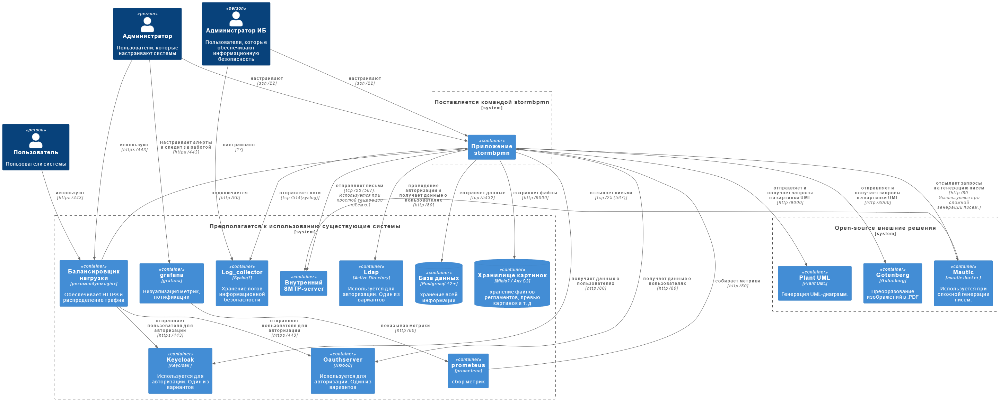

# Установка

Stormbpmn поставляется как docker-контейнер из приватного репозитория, который включается в себя и front, и back. Установка заключается в правильном указании .ENV-перменных внутрь контейнера, поднятии смежных контейнеров (если необходимо), и манипуляции в административном интерфейсе. 

::: tip
Контейнер расположен в приватном репозитории, запросите доступ к нему через менеджера, с которым работаете.
:::

## Верхнеуровневая архитектура
Если использовать все возможности системы, то компонентная архитектура будет выглядеть так:




Подробнее по [ссылке.](https://stormbpmn.com/app/diagram/f3af4a00-b1dd-4666-ad10-82f89705c74e?embedded=true)
## Get started 

Для минимальной работы приложения вам нужно всего 2 контейнера - сам контейнер приложения и база данных.


### Требования к ресурсам
Контейнер stormbmn:
- vCPU - 4 
- vRAM - 8 GB
Прочие контейнеры не требуют серьезных ресурсов - если вы будете создавать их с нуля (а не переиспользовать существующие сервисы компании), то ориентируетесь на минимальные требования из документации соответствующих контейнеров.


### Настройка базы
- Разверните в докере Postgresql (12 или старше версии) или воспользуйтесь существующей инфраструктурой в компании.
- Создайте схему (не обязательно, будет использоваться public по умолчанию). Запомните название.
- Создайте базу. Запомните название.
- Создайте пользователя с полными правами доступа к базе (и схему). Запомните логин и пароль.
- Узнайте порт, на котором работает сервер БД. Запомните его.
- Обеспечьте сетевую доступность между базой и предполагаемым местом установки основного контейнера.

### Настройка приложения через .ENV-переменные
- Скачайте образ приложения из репозитория (запросите ссылку и параметры авторизации у нас).
- Передайте значения в ENV переменные
    - **JDBC_URL** - строка подключения к базе. Ожидается значение, похожее на __jdbc:postgresql://192.168.0.6:5432/storm__, где **192.168.0.6** - адрес сервера БД, **5432** - порт сервера БД,  **storm** - название базы. Если требуется указать схему, то значение будет выглядеть так jdbc:postgresql://localhost:5432/mydatabase?currentSchema=myschema
    - **JDBC_USERNAME** - название учетной записи.
    - **JDBC_PASSWORD** - пароль учетной записи.
    - **JAVA_OPTS** -  значение оперативки, которое выделили контейнеру. Ожидается значение, похожее на "-Xmx8g"
    - **SPRING_PROFILES_ACTIVE** - установить prod.
    - **LICENSE_KEY** - лицензионный ключ. Запросите его у нас.
    - **JWTSECRET** - соль для шифрования паролей. Укажите не меньше 15 символов, желательно случайных.
- Запустите контейнер, если всё ок, то миграции в базу данных выполнятся автоматически.
- Пропишите порт, по которому хотите ходить в приложение. Контейнер выставляет наружу порт 8080.
::: tip
Вот и всё, минимальная установка готова! Вы сможете попасть в приложение через веб интерфейс по порту, который прописали выше.
:::

## Создание административной учетной записи
- Зайдите в приложение по адресу **/app/signup**
- Зарегистрируйтесь с логином и паролем
- Войдите в систему 
- Перейдите по ссылке **/app/team**
- Создайте команду
- Выполните в базе данных запрос
```sql
update sm_teams set full_access = true
```
Теперь учетная запись является административной и все последующие учетные записи в этой команде тоже будут административными. Перезайдите в систему, чтобы получить доступ в административный интерфейс. Не используйте эту учетную запись в работе.

### Настройка авторизации 
Для настройки входа в систему прочитайте [отдельную инструкцию по обеспечению информационной безопасности](/enterprise/security.md) и выберите подходящий для себя вариант. 


## Полноценная установка
Установка выше позволит убедиться что все базово работает, но не является production-ready. Для полноценной работы необходимо:
- Поставить балансер и настроить SSL.
- Развернуть S3-хранилище для хранения картинок и шаблонов документов.
- Развернуть Plantuml-сервер.
- Развернуть сервис конвертации файлов.
- Подключить Storm к системам мониторинга и алертов.
- Обеспечить резервное копирование.
- "Захардендить" настройки безопасности.
- Подключить SIEM-логирование.
- Выбрать провайдер почты и настроить его.
- Настроить бизнес-параметры в административном интерфейсе


### Балансер
Снимать SSL, а так же обеспечивать отказоустойчивость и скейлинг предлагается путем установки балансера перед нодами приложения. Stormbpmn-ноды stateless. Воспользуйтесь любым, который вам нравится и подходит под вашу архитектуру, мы предпочитаем **nginx**. Вот [отличный мануал](https://docs.nginx.com/nginx/admin-guide/security-controls/securing-http-traffic-upstream/).

Мы советуем настроить на балансере добавление заголовков для кеширования статический ресурсов. Вот так выглядит конфиг для NGINX:
```
    # Настройка кеширования для статических ресурсов
    location ~* \.(ico|css|js|woff2?|eot|ttf)$ {
        # Включаем заголовки кеширования
        expires 30d; # Срок кеширования 30 дней
        add_header Cache-Control "public, max-age=2592000, immutable"; # 2592000 секунд = 30 дней

        # Если нужно сбросить заголовки по умолчанию
        add_header Pragma public;
        add_header Vary Accept-Encoding;
    }
```


### S3-хранилище
В S3-хранилище хранятся картинки бизнес-процессов, аватары пользователей, шаблоны для генерации документов. Можно использовать любое, мы советуем **minio**. Вот [отличный мануал](https://min.io/docs/minio/linux/index.html).
После установки укажите значения в ENV-переменные storm:
- **MINIO_ENDPOINT** - URL хранилища, ожидается значение, похожее на "http://192.168.0.4:9000"
- **MINIO_ACCESSKEY** - название учетной записи с правами на создание бакетов и запись файлов.
- **MINIO_SECRETKEY** - пароль учетной записи с правами на создание бакетов и запись файлов.
- **MINIO_DEFAULTBUCKET** - бакет для файлов по умолчанию. Значение по умолчанию - storm-uploads.
После установки параметров при сохранении версии диаграммы должна отображаться ее миниатюра в карточном представлении.


### Plantuml-сервер
Этот компонент позволяет генерировать UML-диаграммы в интерфейсе. Если эта функция нужна, то установите сервер командой:
```
docker run -d -p 8080:8080 plantuml/plantuml-server:jetty
```
И укажите адрес сервера в ENV-переменную storm:
- **PLANTUML_SERVER** - ожидаемое значение похоже на http://192.168.0.5:8080/

### Сервис конвератации документов
Этот компонент обеспечивает подготовку PDF-файлов. Установите его командой:

```
docker run --rm -d -p 3000:3000 gotenberg/gotenberg:8
```
И укажите адрес сервера в ENV-переменную storm:
- **GOTENBERG_URL** - ожидаемое значение похоже на 	http://192.168.0.5:3000


### Подключить STORM к системам мониторинга и обеспечить резервное копирование
Мы предоставляем метрики в формате Prometeus, [подробности о подключении и обеспечении резервного копирования](/support/README.md).

### Хардендинг и SIEM
Мы предоставляет возможности по глубокой настройки безопасности и сбору событий информации в SIEM-лог-коллекторах, [подробности](/enterprise/security.md).

### Выбрать провайдер почты
На текущий момент существует 2 варианта работы с почтой под разные задачи:
 - **Нужны красивые письма и мы готовы их составлять** - тогда используется сервис Mautic, сторонее statefull docker-приложение с базой на Percona, PG Не поддерживается. Грустно, переезд на нормальное решение в будущем.
 - **Нужные любые письма или некому составлять красивые** - тогда используется встроенный SMTP-клиент, дополнительных сервисов не требуется.

 Установите значение в административном интерфейсе:
 - **baserUrl** - используется для формирований правильных ссылок в письмах. Ожидается значение, похожее на https://stormbpmn.com

 #### Нужны красивые письма
 - Установите Mautic на последний релиз версии v.4.xxx (например v.4.2.1) из [докера](https://hub.docker.com/r/mautic/mautic)
 - Залогиньтесь в веб-интерфес и подключитесь в вашему SMTP-серверу
 - Создайте дополнительную учетную запись
 - Включите API и Basic Auth в настройках.
 - Перезапустите контейнер.
 - Установите значения переменных в Stormbpmn:
    - **MAUTIC_URL** - URL API mautic, ожидается https://marketing.local/api
    - **MAUTIC_USERNAME** - имя отдельной учетной записи
    - **MAUTIC_PASSWORD** - пароль отдельной учетной записи
 - Создайте шаблонных красивых писем с использованием плейсхолдеров, вставляйте текст в скобках на места, куда система подставит актуальные значения
 
 | № 	| Тема шаблона 	| Доступные плейсхолдеры 	| Когда шлется 	| Название настройки в административном интерфейсе 	|
|---	|---	|---	|---	|---	|
| 1 	| Password recover 	| {restoreCode} 	| Когда пользователь запросил восстановление пароля 	| restorePasswordTemplateId 	|
| 2 	| You have been invited by {invite_author} to work together on business processes 	| {invite_author},  {diagram_url}, {register_url} 	| Отправляется после того как поделились диаграммой и у получателя ЕСТЬ учетка в системе 	| inviteDiagramAndRegisterTemplateId 	|
| 3 	| New comment from {comment_author} 	| {comment_author}, {html_text}, {diagram_url} 	| Отправляется после отправки комментария 	| commentEmailTemplateId 	|
| 4 	| The version of the {diagram_name} diagram has been updated {change_author} 	| {change_author},{diagram_name},{diagram_description},{version_comment} ,{diagram_url} 	| Отправляется при обновлении версии 	| diagramVersionUpdateEmailTemplateId 	|
| 5 	| {invite_author} invited you to {team_name} and REGISTER 	| {invite_author},{team_name}, {invite_author}, {team_name}, {register_url} 	| Отправляется при приглашении в команду и когда у получателя НЕТ учетной записи 	| teamInviteAndRegisterTemplateId 	|
| 6 	| {invite_author} invited you to {team_name}  (USER PRESENTED IN STORM) 	| {invite_author},{team_name}, 	| Отправляется когда поделились папкой 	| folderTemplateId 	|
| 7 	| Приглашение в команду 	| {invite_author}, "{team_name} 	| Отправляется при приглашении в команду и когда у получателя есть учетная запись и он НЕ состоит в команде 	| teamInviteTemplateId 	|
| 8 	| Согласование 	| {invite_author},      {diagram_url},         {diagram_name} 	| Отправляется, когда запросили согласовании 	| approvalTemplateId 	|
| 9 	| Предоставлен доступ 	| {invite_author},      {diagram_url},         {diagram_name}, {settings} 	| Отправляется, когда изменили правда доступа к диаграмме 	| secureUpdateTemlateId 	|

-  Запомните идентификаторы шаблонов и установите их в административном интерфейсе в соответсвующую настройку

 #### Не нужны красивые письма
 Установите следующие настройки в административном интерфейсе:
 - **simpleEmailEnabled** - включен простой отправитель писем. (изменения применяется ТОЛЬКО после перезагрузки приложения). Установите true
- **simpleSmtpHost** - SMTP хост. (изменения применяется ТОЛЬКО после перезагрузки приложения) 	  
- **simpleSmtpPort**- SMTP порт. TLS протокол установлен по умолчанию. (изменения применяется ТОЛЬКО после перезагрузки приложения)
- **simpleSmtpUsername** - SMTP пользователь (аутентификация и отправка “ОТ”). (изменения применяется ТОЛЬКО после перезагрузки приложения)
- **simpleSmtpPassword** - SMTP пароль.(изменения применяется ТОЛЬКО после перезагрузки приложения)

Будет отсылаться информация об изменении версии, о комментариях, о новой задаче на согласовании, о завершении согласований.

Какой вариант вы бы не выбрали, проверить отправку писем можно оставит комментарий с содержимым @<ваш_емейл> test , например "@kotov@bpmn2.ru test". 

### Настройка бизнес-параметров
Управлять бизнес-параметрами может администратор системы, они доступы по ссылке **/app/admin**, во вкладке "настройки приложения".
- **enableCommonAssets** - разрешить всем командам использовать все элементы архитектуры всех команд.
- **enableCommonRoles** - разрешить всем командам использовать все роли всех команд.
- **enableCommonUsers** - разрешить всем командам использовать общую оргструктуру.
- **enableCommonUsers** - разрешить всем командам использовать общую оргструктуру.
- **allDiagramsAnonAccess** - разрешить анонимный доступ ко всем диаграммам по умолчанию.
- **enableAnonSearchPage** - заменить главную страницу для аноимных пользователей на поиск по диаграммам.
- **autoEnableEnterpriseLicense** - разрешить автоматическую выдачу лицензий.
- **autoJoinTeamId** - автоматически подключать всех новых пользователей в команду, ID которой указан в настройке.
- **disableTeamPopUp** - запретить отображение окна с предложением создать команду.
- **disableTeamCreation** - запретить создание команд.
Настройте эти параметры исходя из ваших требований и сценария работы.

::: tip
Напишите по почте help@stormbpmn.com или вашему менджеру, если у вас что-то не получилось. Мы с радостью поможем.
:::
