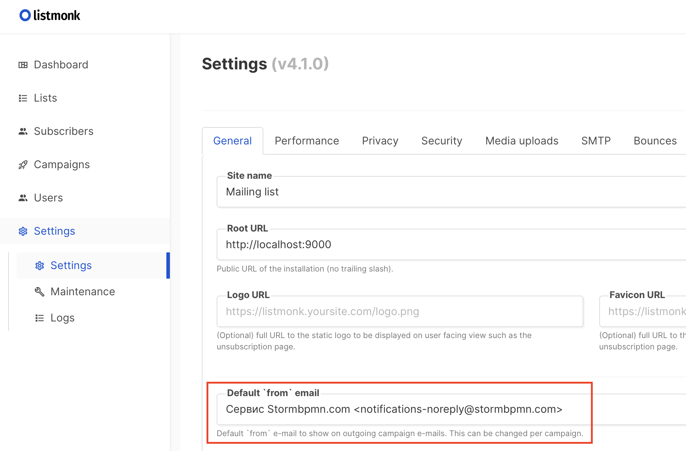
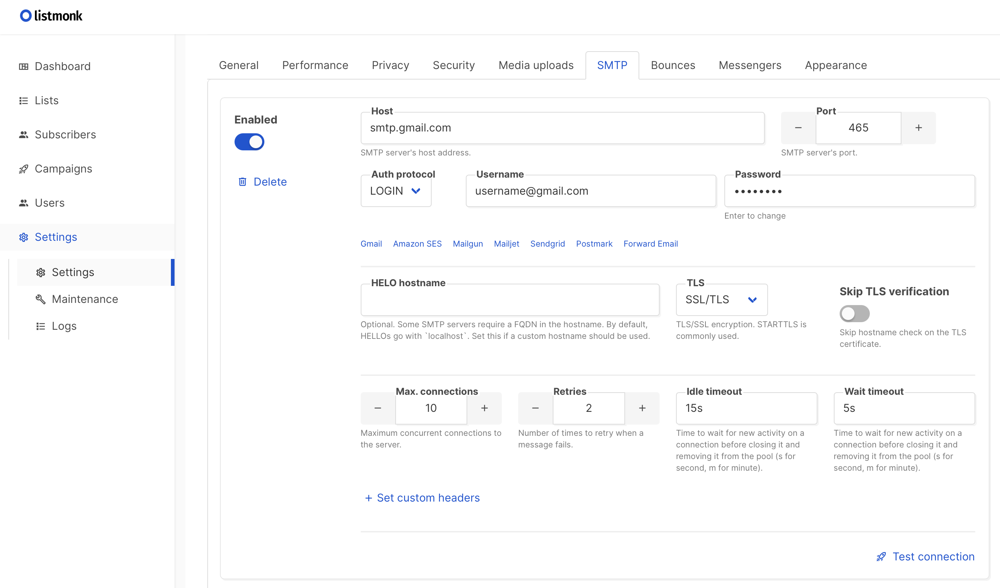
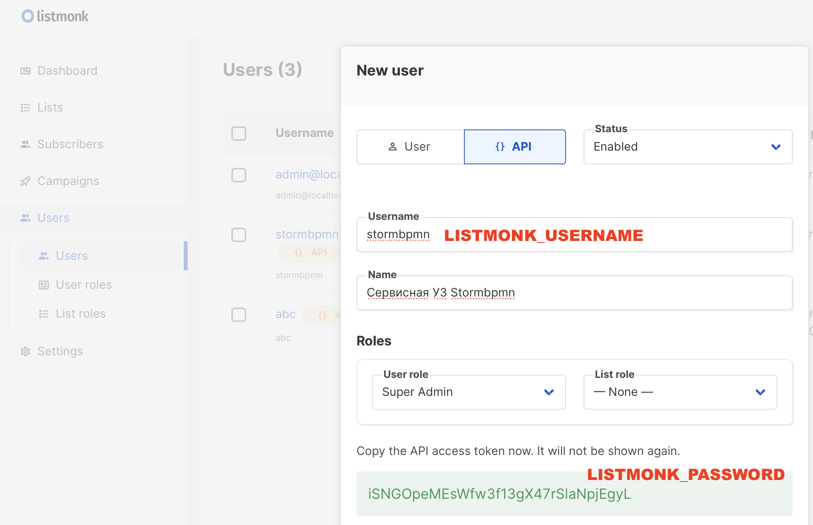

# Prodution-ready установка
Для полноценной работы необходимо:
- Поставить балансер и настроить SSL.
- Развернуть S3-хранилище для хранения картинок и шаблонов документов.
- Развернуть Plantuml-сервер.
- Развернуть сервис конвертации файлов.
- Подключить Storm к системам мониторинга и алертов.
- Обеспечить резервное копирование.
- "Захардендить" настройки безопасности.
- Подключить SIEM-логирование.
- Выбрать провайдер почты и настроить его.
- Настроить бизнес-параметры в административном интерфейсе


## Балансер
Снимать SSL, а так же обеспечивать отказоустойчивость и скейлинг предлагается путем установки балансера перед нодами приложения. Stormbpmn-ноды stateless. Воспользуйтесь любым, который вам нравится и подходит под вашу архитектуру, мы предпочитаем **nginx**. Вот [отличный мануал](https://docs.nginx.com/nginx/admin-guide/security-controls/securing-http-traffic-upstream/).

Мы советуем настроить на балансере добавление заголовков для кеширования статический ресурсов. Вот так выглядит конфиг для NGINX:
```
    # Настройка кеширования для статических ресурсов
    location ~* \.(ico|css|js|woff2?|eot|ttf)$ {
        # Включаем заголовки кеширования
        expires 30d; # Срок кеширования 30 дней
        add_header Cache-Control "public, max-age=2592000, immutable"; # 2592000 секунд = 30 дней

        # Если нужно сбросить заголовки по умолчанию
        add_header Pragma public;
        add_header Vary Accept-Encoding;
    }
```


## S3-хранилище
В S3-хранилище хранятся картинки бизнес-процессов, аватары пользователей, шаблоны для генерации документов. Можно использовать любое, мы советуем **minio**. Вот [отличный мануал](https://min.io/docs/minio/linux/index.html).
После установки укажите значения в ENV-переменные storm:
- **MINIO_ENDPOINT** - URL хранилища, ожидается значение, похожее на "http://192.168.0.4:9000"
- **MINIO_ACCESSKEY** - название учетной записи с правами на создание бакетов и запись файлов.
- **MINIO_SECRETKEY** - пароль учетной записи с правами на создание бакетов и запись файлов.
- **MINIO_DEFAULTBUCKET** - бакет для файлов по умолчанию. Значение по умолчанию - storm-uploads.
После установки параметров при сохранении версии диаграммы должна отображаться ее миниатюра в карточном представлении.


## Plantuml-сервер
Этот компонент позволяет генерировать UML-диаграммы в интерфейсе. Если эта функция нужна, то установите сервер командой:
```
docker run -d -p 8080:8080 plantuml/plantuml-server:jetty
```
И укажите адрес сервера в ENV-переменную storm:
- **PLANTUML_SERVER** - ожидаемое значение похоже на http://192.168.0.5:8080/

## Сервис конвератации документов
Этот компонент обеспечивает подготовку PDF-файлов. Установите его командой:

```
docker run --rm -d -p 3000:3000 gotenberg/gotenberg:8
```
И укажите адрес сервера в ENV-переменную storm:
- **GOTENBERG_URL** - ожидаемое значение похоже на 	http://192.168.0.5:3000
В некоторых ситуациях (балансеры, сложности с SSL и так далее) может потребоваться указать внутренний хост контейнера, на котором развернут STORM, чтобы сервис конвертации обращался к нему напрямую, минуя балансеры.
Для этого в административном интерфейсе укажите значение:
- **gotenbergOverrideBaseUrl** - прямой адрес контейнера, ожидается значение http://corp.storm.internal

## Подключить STORM к системам мониторинга и обеспечить резервное копирование
Мы предоставляем метрики в формате Prometeus, [подробности о подключении и обеспечении резервного копирования](/support/README.md).

## Хардендинг и SIEM
Мы предоставляет возможности по глубокой настройки безопасности и сбору событий информации в SIEM-лог-коллекторах, [подробности](/enterprise/security.md).


## Обеспечение высокой доступности
Контейнеры stateless. Обеспечить высокую доступность возможно просто развернув второй контейнер приложения и поставив балансер перед двумя контейнерами. 
Возможно использование базовых инструментов k8s.

Пример [конфигурации nginx](https://nginx.org/en/docs/http/load_balancing.html) для 2 контейнеров:
```
upstream storm {
    server 10.0.0.3:80 weight=5 max_conns=500;
    server 10.0.0.4:80 weight=5 max_conns=500;

  }

  location ~ ^/ {
        limit_conn two 30;
        proxy_pass      http://storm;
}
```
Вряд ли вы достигните необходимости масштабировать базу данных, но если потребуется, то вот [хорошая инструкция](https://www.percona.com/blog/setting-up-and-deploying-postgresql-for-high-availability/).

## Выбрать провайдер почты
На текущий момент существует 2 варианта работы с почтой под разные задачи:
 - **Нужны красивые письма и мы готовы их составлять** - тогда используется сервис ListMonk, сторонее  docker-приложение с базой на PG. 
 - **Нужные любые письма или некому составлять красивые** - тогда используется встроенный SMTP-клиент, дополнительных сервисов не требуется.

 Установите значение в административном интерфейсе:
 - **baserUrl** - используется для формирований правильных ссылок в письмах. Ожидается значение, похожее на https://stormbpmn.com

 ### Нужны красивые письма
 - Скачайте актуальную версию docker-compose 
 ```
 curl -LO https://github.com/knadh/listmonk/raw/master/docker-compose.yml
```
 - (Опционально) Правим содержимое. По-умолчанию в контейнере listmonk поднимаются два сервиса: само приложение на порте 9000 и его база данных на порте 5432. Если какие-то из этих портов заняты, их можно обновить на удобные вам в параметрах services.app.ports и services.db.ports соответственно.
Обратите внимание, что менять требуется только внешний порт. Например, если на localhost порт 5432 уже занят другим инстансом Postgres, то в docker-compose можно обновить параметр services.db.ports на "127.0.0.1:{НЕЗАНЯТЫЙ_ПОРТ}:5432"
 - Поднимаем контейнер:
 ```
docker compose up -d
 ```
 - Заходим в панель администратора (по умолчанию http://localhost:9000), создаем учетную запись супер пользователя и логинимся.
 - В Settings-General указываем email по умолчанию для отправки писем, например:

 - В Settings-SMTP указываем настройки вашего корпоративного SMTP сервера. По кнопке "Test connection" можно отправить тестовое письмо с адреса, указанного в предыдущем шаге, на любой корпоративный email.
 
 - Далее создаем сервисную УЗ для Storm. В Users нажимаем на New, выбираем тип учетки API, указываем ее имя (например, stormbpmn) и роль Super Admin (при желании можно кастомизировать и создать выделенную роль во вкладке User roles). Сохраняем и получаем наш API токен.
 
 - В env-переменных Stormbpmn указываем следующие значения:
```
EMAIL_PROVIDER: listmonk
LISTMONK_BASE_URL: http://localhost:9000/api (изменить на ваш кастомный внешний URL/порт при необходимости)
LISTMONK_USERNAME: username сервисной УЗ (см. скрин выше)
LISTMONK_PASSWORD: API токен сервисной УЗ (см. скрин выше)
```
- Перезапускаем контейнер Stormbpmn
- Создаем [шаблоны для писем в listmonk](https://listmonk.app/docs/templating/) и запоминаем их идентификаторы.
- При создании шаблонов можно использовать следующие подстановки:

| Смысл шаблона                     | Название настройки в административном интерфейсе     | Возможный заголовок                                                      | Возможные подстановки                                              |
|----------------------------------|-------------------------------------------------------|---------------------------------------------------------------------------|--------------------------------------------------------------------|
| NEW_COMMENT                      | commentEmailTemplateId                                | Комментарий от {comment_author} к процессу {diagram_name}                | {comment_author}, {diagram_url}, {diagram_name}, {html_text}      |
| NEW_APPROVAL                     | approvalTemplateId                                    | {invite_author} запросил согласование бизнес-процесса {diagram_name}     | {invite_author}, {diagram_url}, {diagram_name}                    |
| RESTORE_PASSWORD                 | restorePasswordTemplateId                             | Восстановление пароля на stormbpmn.com                                   | {restoreCode}                                                     |
| APPROVAL_COMPLETED              | approvalCompletedTemplateId                           | По процессу {diagram_name} завершены все согласования                    | {diagram_name}, {diagram_url}                                     |
| USER_ACTIVATION                 | userActivationTemplateId                              | Всё почти готово! Подтвердите ваш e-mail                                 | {activation_token}                                                |
| INVITE_TO_DIAGRAM               | secureUpdateTemlateId                                 | {invite_author} предоставил доступ к бизнес-процессу {diagram_name}      | {invite_author}, {diagram_url}, {diagram_name}                    |
| INVITE_TO_DIAGRAM_AND_REGISTER  | inviteDiagramAndRegisterTemplateId                    | {invite_author} предоставил доступ к бизнес-процессу {diagram_name}      | {invite_author}, {diagram_url}, {diagram_name}, {register_url}    |
| INVITE_TO_TEAM                  | teamInviteTemplateId                                  | {invite_author} пригласил вас в команду {team_name}                      | {invite_author}, {team_name}                                      |
| INVITE_TO_TEAM_AND_REGISTER     | teamInviteAndRegisterTemplateId                       | {invite_author} пригласил вас в команду {team_name}                      | {invite_author}, {team_name}, {register_url}                      |


-  Запомните идентификаторы шаблонов и установите их в административном интерфейсе Storm.

 ### Не нужны красивые письма
 Установите следующие настройки в административном интерфейсе:
 - **simpleEmailEnabled** - включен простой отправитель писем. (изменения применяется ТОЛЬКО после перезагрузки приложения). Установите true
- **simpleSmtpHost** - SMTP хост. (изменения применяется ТОЛЬКО после перезагрузки приложения) 	  
- **simpleSmtpPort**- SMTP порт. TLS протокол установлен по умолчанию. (изменения применяется ТОЛЬКО после перезагрузки приложения)
- **simpleSmtpUsername** - SMTP пользователь (аутентификация и отправка “ОТ”). (изменения применяется ТОЛЬКО после перезагрузки приложения)
- **simpleSmtpPassword** - SMTP пароль.(изменения применяется ТОЛЬКО после перезагрузки приложения)
- **simpleSmtpFrom** - Электронная почта, от которой будут слаться письма. Может совпадать с simpleSmtpUsername, или не совпадать. Зависит от настроек почтового сервиса. Требование этого поля так же может зависить от настроек почтового сервиса(изменения применяется ТОЛЬКО после перезагрузки приложения).
Будет отсылаться информация об изменении версии, о комментариях, о новой задаче на согласовании, о завершении согласований.

Какой вариант вы бы не выбрали, проверить отправку писем можно оставит комментарий с содержимым @<ваш_емейл> test , например "@kotov@bpmn2.ru test". 

## Настройка бизнес-параметров
Управлять бизнес-параметрами может администратор системы, они доступы по ссылке **/app/admin**, во вкладке "настройки приложения".
- **enableCommonAssets** - разрешить всем командам использовать все элементы архитектуры всех команд.
- **enableCommonRoles** - разрешить всем командам использовать все роли всех команд.
- **enableCommonUsers** - разрешить всем командам использовать общую оргструктуру.
- **enableCommonUsers** - разрешить всем командам использовать общую оргструктуру.
- **allDiagramsAnonAccess** - разрешить анонимный доступ ко всем диаграммам по умолчанию.
- **enableAnonSearchPage** - заменить главную страницу для аноимных пользователей на поиск по диаграммам.
- **autoEnableEnterpriseLicense** - разрешить автоматическую выдачу лицензий.
- **autoJoinTeamId** - автоматически подключать всех новых пользователей в команду, ID которой указан в настройке.
- **disableTeamPopUp** - запретить отображение окна с предложением создать команду.
- **disableTeamCreation** - запретить создание команд.
Настройте эти параметры исходя из ваших требований и сценария работы.


Настройка видимости в “настройке” разрешает возвращать настройку на фронт, т.е. делает доступным просмотр для клиента. Не устанавливаете ее для паролей и прочих вещей, которые не влияют на поведение приложения на фронте.


::: tip
Напишите по почте help@stormbpmn.com или вашему менджеру, если у вас что-то не получилось. Мы с радостью поможем.
:::
