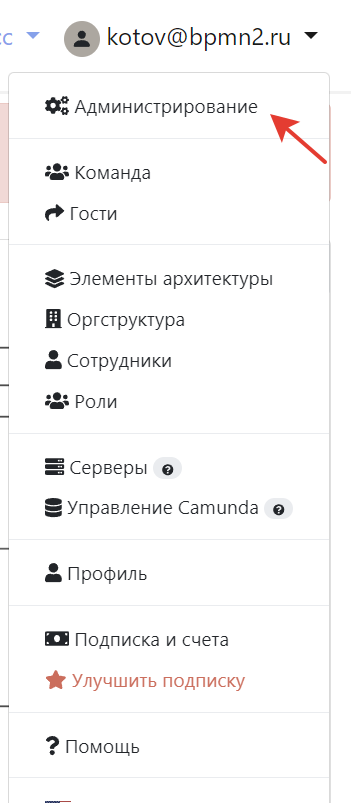

# Get started 

Для минимальной работы приложения вам нужно всего 2 контейнера - сам контейнер приложения и база данных.

## Настройка базы
- Разверните в докере Postgresql (12 или старше версии) или воспользуйтесь существующей инфраструктурой в компании.
- Создайте схему (не обязательно, будет использоваться public по умолчанию). Запомните название.
- Создайте базу. Запомните название.
- Создайте пользователя с полными правами доступа к базе (и схему). Запомните логин и пароль.
- Узнайте порт, на котором работает сервер БД. Запомните его.
- Обеспечьте сетевую доступность между базой и предполагаемым местом установки основного контейнера.

## Настройка приложения через .ENV-переменные
- Скачайте образ приложения из репозитория (запросите ссылку и параметры авторизации у нас).
- Передайте значения в ENV переменные
    - **JDBC_URL** - строка подключения к базе. Ожидается значение, похожее на __jdbc:postgresql://192.168.0.6:5432/storm__, где **192.168.0.6** - адрес сервера БД, **5432** - порт сервера БД,  **storm** - название базы. Если требуется указать схему, то значение будет выглядеть так jdbc:postgresql://localhost:5432/mydatabase?currentSchema=myschema
    - **JDBC_USERNAME** - название учетной записи.
    - **JDBC_PASSWORD** - пароль учетной записи.
    - **JAVA_OPTS** -  значение оперативки, которое выделили контейнеру. Ожидается значение, похожее на "-Xmx8g"
    - **SPRING_PROFILES_ACTIVE** - установить prod.
    - **LICENSE_KEY** - лицензионный ключ. Запросите его у нас.
    - **JWTSECRET** - соль для шифрования паролей. Укажите не меньше 15 символов, желательно случайных.
- Запустите контейнер, если всё ок, то миграции в базу данных выполнятся автоматически.
- Пропишите порт, по которому хотите ходить в приложение. Контейнер выставляет наружу порт 8080.
::: tip
Вот и всё, минимальная установка готова! Вы сможете попасть в приложение через веб интерфейс по порту, который прописали выше.
:::

## Создание административной учетной записи
- Зайдите в приложение по адресу **/app/signup**
- Зарегистрируйтесь с логином и паролем
- Войдите в систему 
- Перейдите по ссылке **/app/team**
- Создайте команду
- Выполните в базе данных запрос
```sql
update sm_teams set full_access = true
```
Теперь учетная запись является административной и все последующие учетные записи в этой команде тоже будут административными. Перезайдите в систему, чтобы получить доступ в административный интерфейс. Не используйте эту учетную запись в работе.



## Настройка авторизации 
Для настройки входа в систему прочитайте [отдельную инструкцию по обеспечению информационной безопасности](/enterprise/security.md) и выберите подходящий для себя вариант. 