# Бизнес-процессы в BPMN

Наш редактор имеет множество функций и все они направлены на обеспечение удобства работы с BPMN диаграммами.  
Рассмотрим подробнее все возможности:

## Описание всех меню

### Левое меню

Левое меню предназначено для выбора и использования элементов BPMN и обеспечения удобства использования редактора.

::: warning Не все элементы
В левом меню не все элементы BPMN, но это не значит их нет в системе :) Типы элементов меняются в контекстном меню.
:::

Советуем обратить внимание на кнопки, обеспечивающие удобство работы:

Для понимания того, в какие элементы можно превратить элементы, нужно понимать [BPMN](/bpmn/) - сервис старается защитить вас от ошибок и не дать использовать элементы, которые невозможны по нотации.

### Меню сохранения

#### Сохранение диаграммы

В этом меню вы можете:

- Указать название диаграммы
- Указать [папку](#папки)
- Добавить [теги](#теги)
- Указать тип-процесса (AS-IS / TO-BE) и связать со вторым процессом для [сравнения](#сравнение-as-is-и-to-be)
- Указать комментарий к текущей версии
- Оценить [качество] вашей диаграммы

::: tip
При сохранении создается [версия](#версионирование), к которой можно откатиться или выполнить сравнение
:::

В этом же меню сохранить **чужую диаграмму**, к которой вы не имеете доступа на редактирование, в свои диаграммы.

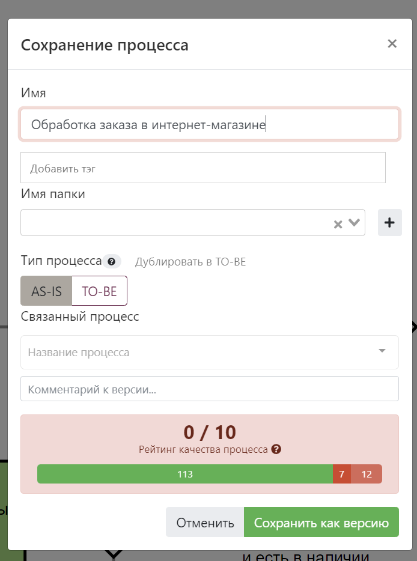

#### Скачать

В этом меню можно скачать диаграмму в нужном формате, включая [.docx](#регламенты)
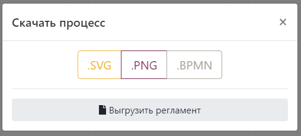

:::tip
Скачивание картинки с [оверлеями](#меню-оверлеев) доступно по другой кнопке
:::

#### Поделиться диаграммой

В этом меню можно предоставить/отзовать доступ на диаграмму:

- Анонимно (не требует учетной записи в системе)
- Конкретному человеку по e-mail с указанием прав (просматривать/редактировать)
- Получить код для встраивания диаграммы, она будет выглядеть вот так:
<iframe src="https://stormbpmn.com/app/diagram/0855ae10-6ef8-4a23-9df0-f7d6cef12722?embedded=true" style="border:1px #f2f2f2 none;" name="extAdmin" scrolling="yes" frameborder="1"  height="500" width="100%" allowfullscreen></iframe>

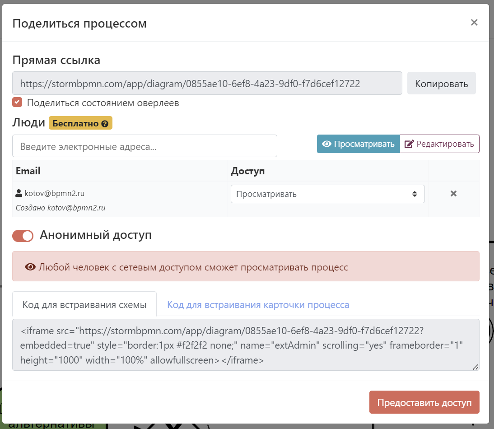

Больше о [совместной работе](../team-work/)

#### Сменить статус

Для информирования коллег о состоянии работы над процессом можно использовать статусы.

- **Новый** - процесс еще не трогали, просто создали.
- **В работе** - над процессом активно идет работа.
- **На согласовании** - процесс согласуется с кем-то, менять схему **нельзя**. Подробнее в [согласованиях](#согласование)
- **Готов** - процесс готов к работе. Меня схему нельзя.
  

::: warning
Сейчас менять или добавлять статусы нельзя.
:::

#### AS-IS и TO-BE

Если в [меню сохранения](#меню-сохранения) вы указали тип процесса и связанный процесс, то появится возможность быстро перемещаться между версиями AS-IS и TO-BE, а так же визуально сравнить их.
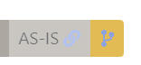

### Верхнее меню

Верхнее меню предназначено для работы с конкретной диаграммой и предоставляет возможности:  
 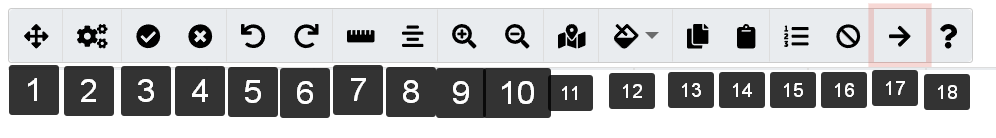

1. Развернуть диаграмму на полный экран
2. Открыть панель свойств BPMN/свойств Camunda.
3. Включить [проверку ошибок](#оценка-качества).
4. Отключить проверку ошибок.
5. Отменить последнее дейсвтие.
6. Повторить последнее действие.
7. Распределить выделенные элементы по горизонтали.
8. Выровнять выделенные элементы по центру.
9. Приблизить.
10. Отдалить.
11. Включить или выключить миникарту.
12. Сменить цвет выбранным элементам.
13. Скопировать выделенные элементы для вставки между вкладками.
14. Вставить выделенные элементы из другой вкладки.
15. Включить автонумерацию элементов.
16. Отключить автонумерацию элементов.
17. Открыть [правое меню](#правое-меню) с доп.функциям.
18. Открыть встроенную справку по [BPMN](../bpmn/) и горячим клавишам.

### Контекстное меню

Контекстное меню открывается при клике на элемент и предоставляет возможности в зависимости от того, на какой элемент вы кликнули:  
 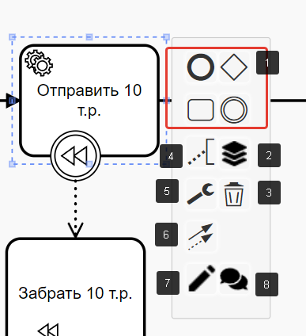

1.  Смена типа элемента.
2.  Открытие меню для управления [ролями](#роли) и [элементами архитектуры](#элементы-архитектуры).
3.  Удаление элемента.
4.  Текстовая аннотация к элементу.
5.  Изменение атрибутов текущего элемента.
6.  Соеденение текущего элементв с другим.
7.  Открытие [подробностей элемента](#меню-подробностеи-элемента).
8.  Открытие [комментариев к элементу](#комментирование)

### Меню подробностей элемента

В этом меню предоставляется возможность указывать всю ключевую информацию об элементе:

- Название
- [Роль](#роли) (_только для задач_)
- [Элементы архитектуры](#элементы-архитектуры) (_только для задач_)
- [Связанный процесс](#связь-процессов) (_только для Call Activity или Participant_) 
- [Плановую длительность](#расчет-длительности-сценарией)
- Описание
- [Элемент отправки сообщения](#связь-процессов)  (_только для Catch Event_)
- Внешняя ссылка (_отображается на схеме_)

 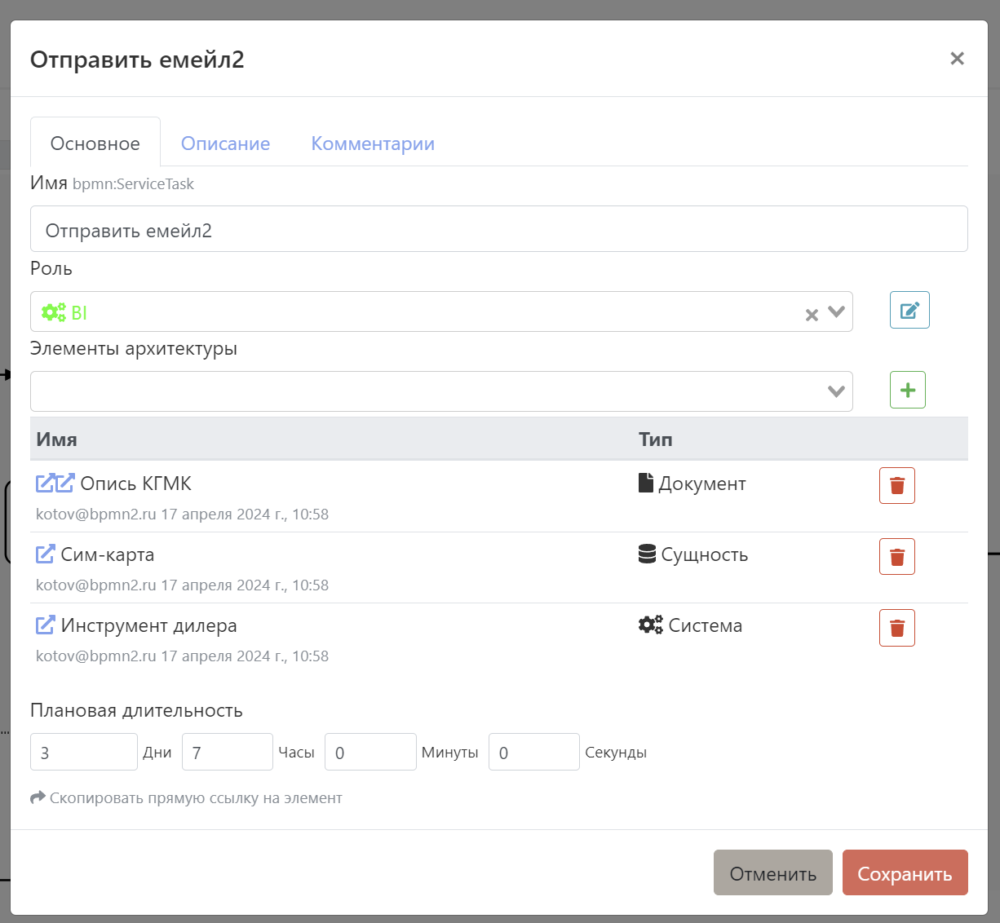
Так же это меню позволяет:
- Просматривать версии описания
- Скопировать прямую ссылку на элемент
- Просмотреть комментарии к элементу

### Меню оверлеев
Одним из ключевых удобств системы является возможность быстро и удобно включать и выключать отображение информации на диаграмме.
Меню оверлеев предоставляет возможность включать отображение:
- Плановой длительности
- Ролей
- Должностей (_первой должности в [оргструктуре](#редактор-оргструктуры), назначенной на роль_ )
- Систем (один из типов [элементов архитектруы](#элементы-архитектуры))
- Документов (один из типов [элементов архитектруы](#элементы-архитектуры))
- [Связей](#связи-процесса)
- [Комментариев](#комментирование)
- Описание задач

Кроме того, это меню позволяет скачать в виде .PNG диаграмму со включенными овереляеми.
 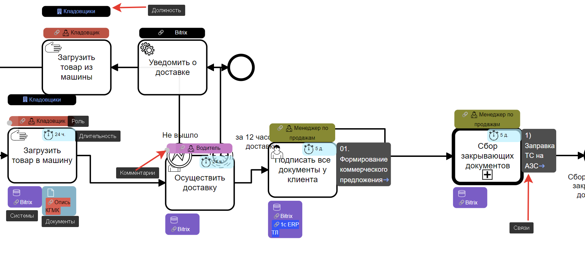

::: tip

Включенные оверлеи автоматически вставляются в ссылку, которой вы делитесь с коллегами! Заказчикам ничего дополнительного нажимать не надо.

:::

### Меню представлений

Описание процесса в системе можно посмотреть сразу в нескольких представлениях, в зависимости от ваших задач.

- __В виде схемы BPMN__ - подходит для анализа последовательнности процесса
- __В виде таблицы__ - подходит для уточнения задач, исполнителей, используемых систем и документов
- __В виде регламента__ - подходит для последовательного изучения всей информации о процессе

#### Табличное представление
Табличное представление выводит информацию о:
 - Названии задачи
 - Пуле, в котором расположена задача
 - Роль, исполняющая задачу
 - Должности, привязанные к роли
 - Системы, используемые в задаче
 - Документы, используемые в задачи
 - Описание задачи

 Так же это представление дает возможность скачать таблицу в .xls и осуществить поиск по содеримому, например если написать __кладовщик__ то выдаст только те задачи, где упоминается это слово в любом из столбцов.  
 

#### Представление в виде регламента
Это представление позволяет просмотреть на процесс последовательно, со всех сторон и предоставляет возможности:
1. Просмотреть и ввести общее описание.
 
2. Указать состав рабочей группы - владельцев, спонсоров и тд.
3. Посмотреть на схему.
4. Посмотреть и отредактировать описание задач в разрезе ролей
 
5. Историю согласований.
6. Связь процессов, потребителей и поставщиков процесса.
7. Используемые элементы архитектуры.
8. Карту архитектуры относительно процесса.
9. Все комментарии процесса.

### Правое меню

Правое меню отображает дополнительную информацию к диаграмме в зависимости от выбранного отображения.

1. Включить отображение всех [ролей](#роли).
2. Включить отображение [деталей задачи по клику](#детали-по-клику).
3. Сравнить текущую [версию](#версионирование) с предидущими
4. Включить отображение всех элементов архитектуры.
5. Включить отображение связей процесса.
6. Включить комментарии.

### Детали по клику

После включения соответсвующей настройки в правом меню появляется возможность:

- Поделиться ссылкой на конкретный элемент
- Найти выбранный элемент на схеме
- Установить [связь](#связь-процессов) с Call Activity
- Установить роль
- Установить элементы архитектуры
- Прочитать описание выбранной задачи
- Просмотреть и написать комментарий к выбранной задачи

::: tip
В этом представлении отображается схема выбранного Call Activity! Это удобный способ просматривать их содержимое с той же диаграммы, на которой оно используется.
:::

## Обеспечение удобства работы

### Горячие клавиши

Редактор поддерживает работу с горячими клавишами, то сильно ускоряет работу при моделировании процессов:

- **ctrl + z** отменить последнее действие
- **ctrl + y** - выполнить последнее действие
- **ctrl + a** - выделить всё
- **ctrl + scroll** - изменение масштаба
- **scroll** - перемещение по вертикали
- **shift + scroll** - перемещение по горизонтали
- **shift + click** - выбрать элементы группой
- **ctrl + click** - выделять элементы по одному в группу
- **alt + 1...8** - Включить отображение соответствующих оверлеев
- **ctrl+f** - Открыть меню поиска элементов

## Качество бизнес-процессов BPMN
Система предоставляет мощные средства для управления качеством ваших диаграмм в BPMN, создаваемых по вашему соглашению о моделировании.  

Качественные диаграммы гарантируют минимальное время на обсуждение формальных признаков описания и позволяют сразу переходить к сути.

### Оценка 
Система предоставляет ~30 правил проверки BPMN, которые система проверяет автоматически при каждом сохранении.  
Выявленные ошибки бывают трех типов:
- __Информационная ошибка__ - можно моделировать лучше.
- __Предупреждение__ - лучше поправить.
- __Фатальная ошибка__ - серьезное нарушение BPMN, лучше не показывать такие диаграммы коллегам.  

Включение и выключение проверки осуществляется в [верхнем меню](#верхнее-меню).

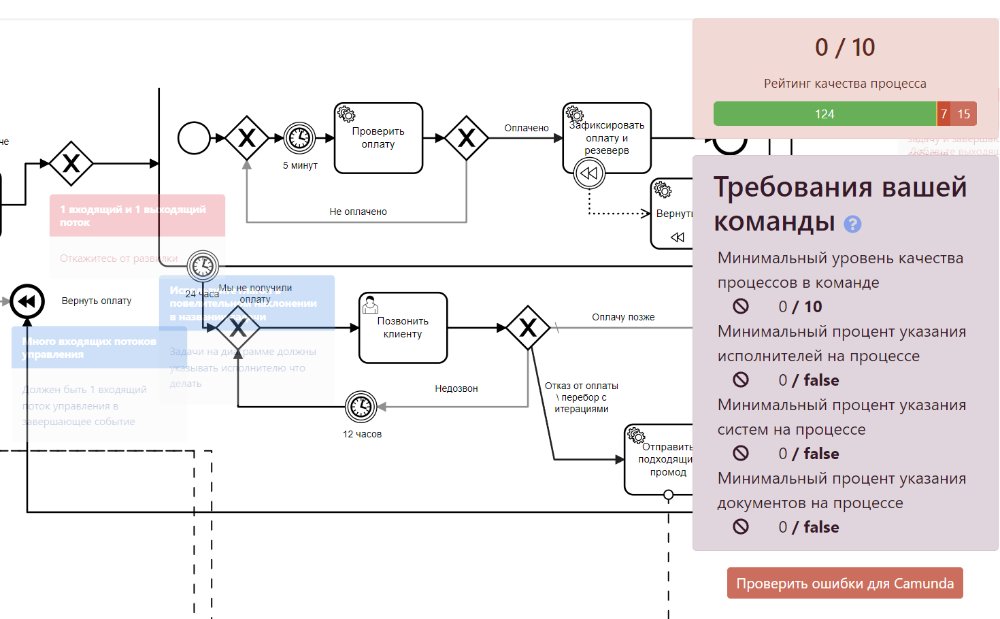
#### Ошибки для Camunda
Это функция позволяет проверить атрибуты автоматизации Camunda 7, задавемые в процессе и сразу найти те ошибки, которые Camunda 7 скажет вам при попытке загрузить ваш XML на сервер.

#### Настройка правил проверки

:::tip 
Данная функция работает только на тарифе TEAM и выше.
:::

Вы так же можете настроить трактовку каждого из правил уникальным убразом для своей команды, а так же:  
- Настройть минимальную среднюю оценку, которая требует ваша команда. При нарушении этого показателя члены команды постоянно будут видить уведомление о низком качестве процессов.
- Указать минимальный процент указания систем, ролей, документов на схеме.
- Исключить часть действий на левой панели, _например запретить создавать хранилище данных_.
- Задать используемость, заголовок, описание, важность, дополнительную ссылку для каждого из правил.  

Настраивается в разделе [команды](../team-work/README.md#прочие-настроики-команды).
### Симуляция токена
Вы так же можете выполнить проверку проходимости процесса __токеном__. Посмотрите это видео, если не знаете что это такое:

<iframe width="560" height="315" src="https://www.youtube.com/embed/Gfx5atU3YDY?si=ARC0B7o3i9K1DCey" title="YouTube video player" frameborder="0" allow="accelerometer; autoplay; clipboard-write; encrypted-media; gyroscope; picture-in-picture; web-share" referrerpolicy="strict-origin-when-cross-origin" allowfullscreen></iframe>

:::danger
Симуляция токена поддерживает не все элементы. Вы получите соответсвующее уведомление __Not supported__, если воспользуетесь таким элементов. Замените его.
:::

Для включения симуляции токена нажмите кнопку, приблизьтесь к любому стартовому событию и нажмите на символ Play. Используйте переключатель на шлюзах, чтобы вести Token по выбранному направлению:  
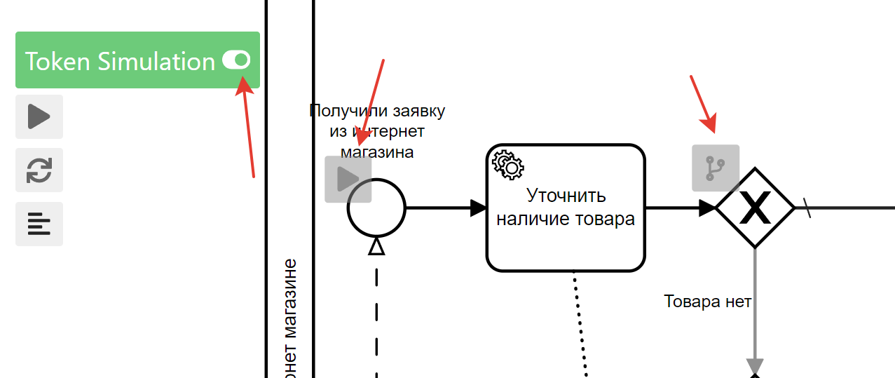

### Расчет длительности сценария
Если вы указывали [длительность в задачах](#меню-подробностеи-элемента), то система может посчитать время, за которое выполнится конкретный проход токена при симуляции токена, указав самые длительные операции:

## Версионирование

Система автоматически создает версии диаграмм вот по таким поводам:

- Прошло больше 30 изменений диаграммы
- Кто-то (не владелец процесса и не пред.автор изменения) внес изменения в диаграмму
  Это позволяет **всегда** восстановить пред.версию и посмотреть разницу. Автор диаграммы получает е-мейл уведомление, если в его диаграмме создали новую версию.

Так же система сохраняет версии описания задач.  
### Как вернуть версию процесса

1.  Если вы хотите вернуть версию процесса, то найдите на главной странице карточку процесса и нажмите в верхний правый угол, выберите "Все версии":
    
2.  Выберете интересующую версию и нажмите **посмотреть версию**.
3.  В открывшемся окне нажмите **"установить как текущую"**.

### Сравнение версий
Сравнение версий доступно в двух вариантах:
1. __Вычисление изменений текущий версии относительно старой__ - включается через [правое меню](#правое-меню):
    
2. __Просто сравнение со старой версией__ - включается через меню и нажатие кнопки __сравнить__:
 

## Согласование

Система позволяет __согласовывать процессы__ с любыми пользователями системы - т.е получить и зафиксировать мнение человека о вашем процессе.

::: tip
Согласующему необязательно быть участником команды, вы можете отправить согласование на любой e-mail - человек получит соответствующее уведомление.
::: 

### Отправка на согласование
Для отправки процесса на согласование смените ему статус на __на согласовании__ и укажите e-mail согласующих, нажмите __отправить на согласование__:
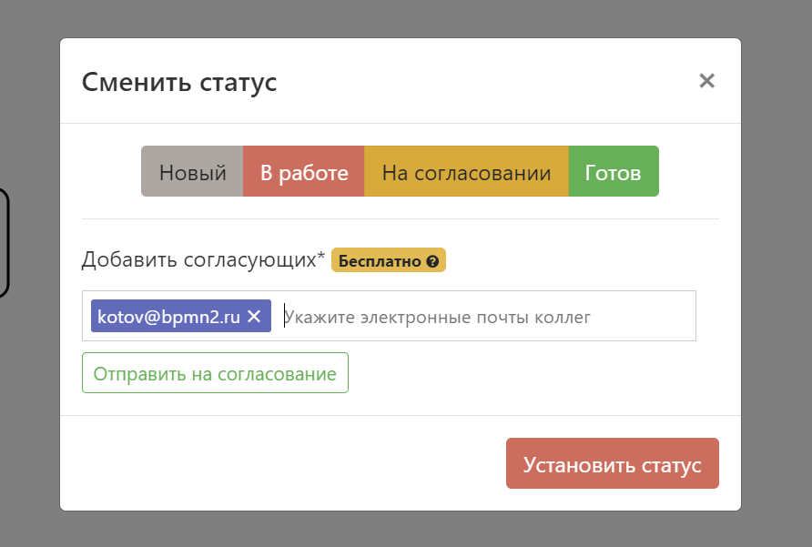

После этого диаграмму нельзя будет редактировать или менять статус, пока ВСЕ запрошенные согласования не будут получены.

::: tip

Советуем снабдить ваше первое согласование вот [такой ссылкой](https://www.youtube.com/watch?v=tKGegGh15oc&ab_channel=BPMN2ru), людям будет сильно проще разобраться в системе и они быстрее отожмут все кнопки. 

<iframe width="560" height="315" src="https://www.youtube.com/embed/tKGegGh15oc?si=pam4af5M82dYhPKw" frameborder="0" allow="autoplay; encrypted-media" allowfullscreen></iframe>

:::

### Выполнение согласования
После получения ссылки и авторизации в системе, согласующий увидет такое меню и сможет поделиться своим мнением:

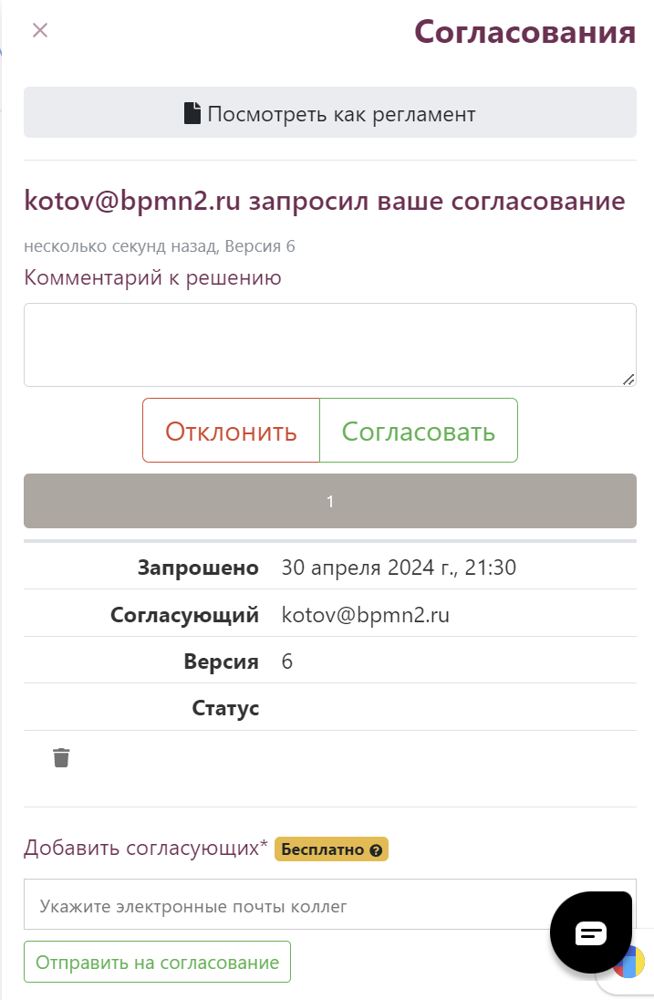

### Удаление согласования
Если согласование перестало быть актуальным, то согласующий или автор диаграммы может удалить запрошенное согласование, если по нему еще не высказались. Для этого нажмите на __мусорную корзину__ в левом нижем углу.

## Импорт процессов из других системы
Система поддерживает полноценный BPMN - это значит, что если система источник производит XML-файл в спецификации BPMN, то Stormbpmn сможет его загрузить.

Загрузить можно диаграммы из ==Cawemo, Camunda Modeler, Bizagi Modeler== и так далее.

Загрузить диаграммы из ==Visio, Draw.io, Miro== __нельзя__.

Для загрузки нажмите  кнопку:  

Для импорта в конкретную папку нажмите:  
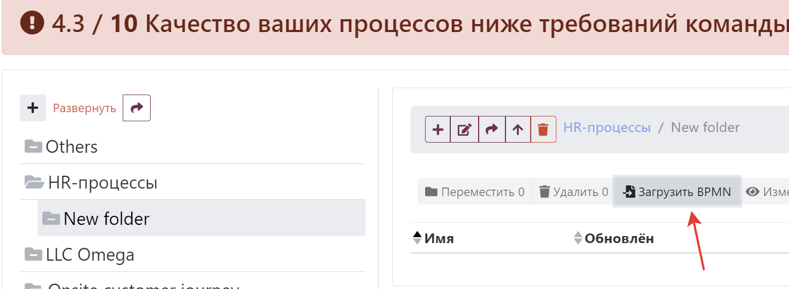

## Сравнение AS-IS и TO-BE
Одна из удобных возможностей - это визуально сравнить 2 диаграммы, для того чтобы представить визуальную разницу между версиями AS-IS и TO-BE.  

### Установление связи между двумя моделями

Для установления связи в [меню сохранения](#меню-сохранения) установить тип процесса и связанный процесс:  

::: tip
Советуем для начала хорошенько проработать модель AS-IS, тогда ее можно будет дублировать и на базе дубля сделать TO-BE. Так же это сделает возможным автоматическое сравнение схем (когда оно будет готово).
:::

## Связь процессов
Бизнес-процессы редко работают в одиночку - в целях декомпозиции и управляемости их часто разделяют на разные процессы, которые могут быть даже описаываться разными людями, департаментами, управлениями.

Система поддерживает возможность связи процессов друг с другом с целью удобной навигации и построения графов связности.

Просматривать связи можно через [меню оверлеев](#меню-оверлеев) или [правое меню](#правое-меню).

### Связь через Call activity и Participant

Для установления связи через Call activity\Participant откройте [меню подробностей](#меню-подробностей-элемента) и укажите соотвествующий связанный бизнес-процесс:  

### Связь через Message Catch Events \ Message Catch Task

Для установления связи через откройте [меню подробностей](#меню-подробностей-элемента) и укажите соотвествующий связанный элемент отправки сообщения:  
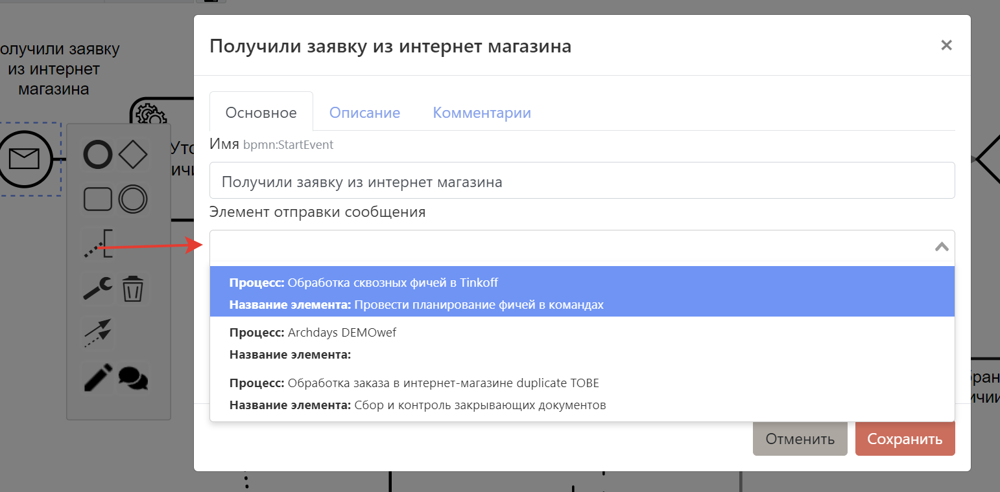

