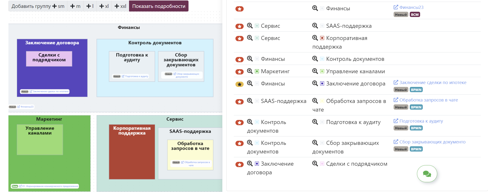
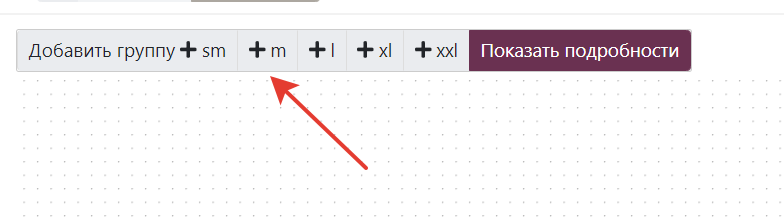
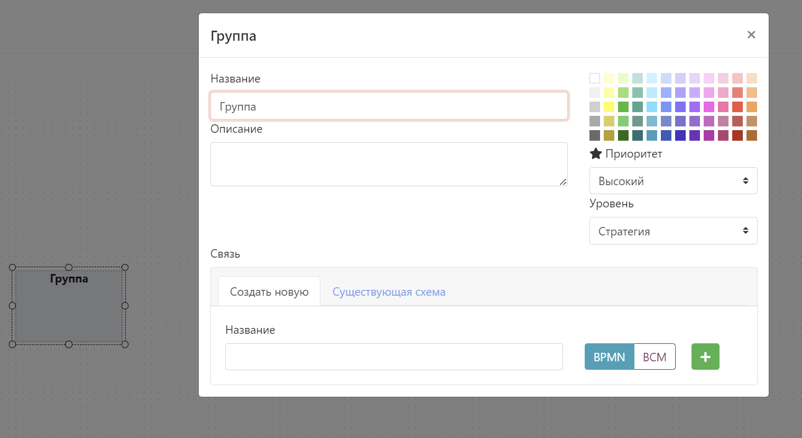
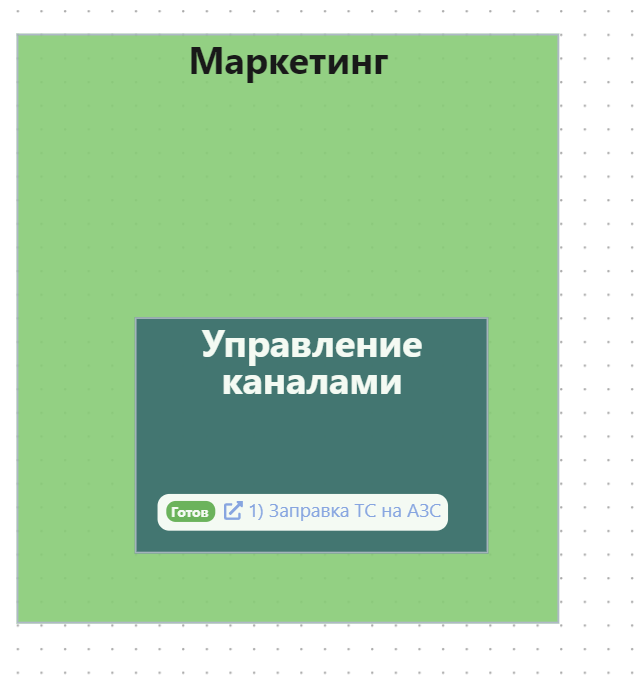
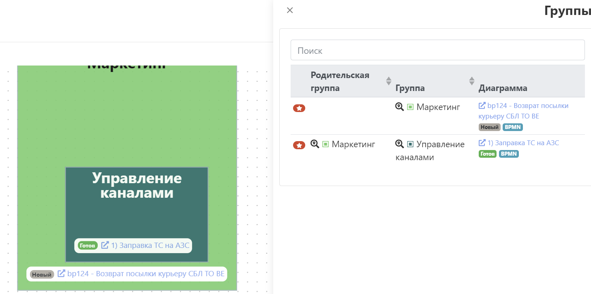

# Редактор групп процессов

::: warning

Группы процессов работают только на тарифах TEAM и выше.

:::

::: danger
Функционал недавно выпущен и может содержать ошибки. Сообщайте о любых ошибках в чат в приложении, мы оперативно их устраним.
:::

Группы процессов это отличная возможность моделировать процессы сверху-вниз. Вы можете смотреть на группы процессов как на простую иерархию, бизнес-возможности(Business Capability) или бизнес-функции.

::: tip
Вложенность групп неограничена, но по практике лучше не использовать больше 3-4 уровней, а сложные структуры проектировать через вложенность диаграммы групп в диаграммы групп.
:::

## Создание группы процессов

Создать группу процессов можно так:

::: tip

Групп процессов может быть сколько угодно! Это значит что вы можете формировать разные иерархии для разных целей. И этими группами можно так же [делиться по ссылке](#поделиться-диаграммои). А еще работаю [комментарии](#комментирование).
:::

## Как работать с группами

1. Добавьте группу нужного размера:  
   
2. Двойным кликом на группу откройте меню редактирования группы:
   
3. Укажите информацию о группе:
   - Название
   - Цвет
   - Описание
   - Приоритет (возможно использовать для фильтрации)
   - Уровень (возможно использовать для фильтрации)
4. Укажите связь группы с реализацией. Тут 2 возможности:
   - **Создать новую** - создастся "заглушка" процесса (если выбрать BPMN) или группы процессов (если выбрать BCM). Отличная возможность приступить к реализации позднее или раздать задачи бизнес-аналиткам для моделирования.
   - **Существующая схема** - позволяет выбрать уже существующую реализацию процесса или группы процессов. Отлично подойдет, если вы из существующих процессов формируете иерархию. **Существующая схема может быть привязана к любому количеству групп**.

::: tip
Привязка реализации позволяет отслеживать статус работы над реализацией и визуализировать ваш процесс по моделированию всей иерархии!

::: 

5. Формируйте группы и перемещайте их друг в друга, чтобы отобразить иерархию. Чтобы вытащить группы другой группы, зажмите **CTRL** и перемещайте ее за границу родителя.

6. Используйте правое меню для навигации или просмотра фильтра групп. В фильтре работают:
   - Фильтр по названию группы
   - Фильтр по названию родительской группы
   - Фильтр по статусу привязанного процесса (new, progress, approve, done )
   - Фильтр по типу (BPMN, BCM)
   - Фильтр по названию связанного процесса
7. Используйте фильтр и навигируйтесь по иерархии кликом на симол лупы с картой.  
   

## Горячие клавиши

Редактор групп поддерживает горячие клавиши:

- **CTRL+Z** - отменить последнее действие.
- **CTRL+Y** - повторить последнее действие.
- **CTRL+C** - скопировать группу (без дочерних).
- **CTRL+V** - вставить группу.
- **DEL** - удалить группу с дочерними.
