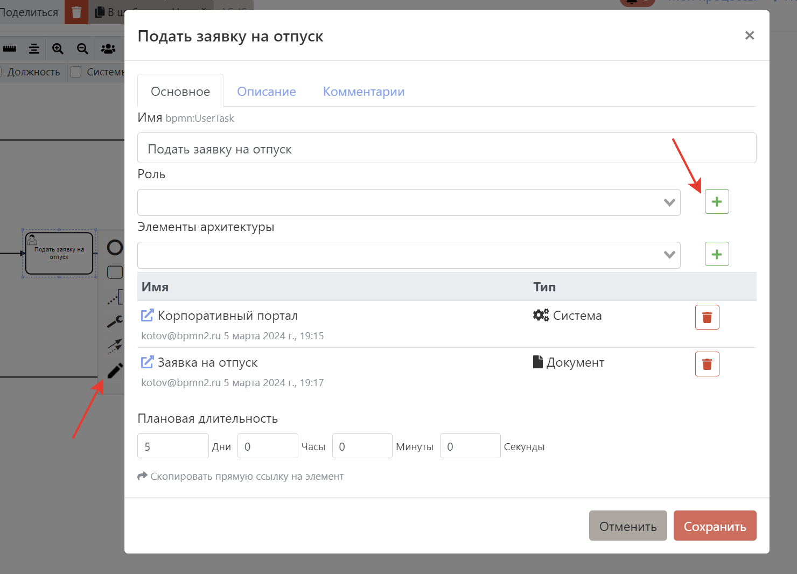

# Роли

Роли это отличный инструмент для указания исполнителей задач. Под ролью понимается исполнитель конкретной задачи в процессе или процессах (т.к. Роли - это справочник, который можно переиспользовать). Роли это правильная и хорошая альтернатива дорожкам.

<iframe width="560" height="315" src="https://www.youtube.com/embed/_2W10c0YzcI?si=Br3u2STg2zdWwIQ8" frameborder="0" allow="autoplay; encrypted-media" allowfullscreen></iframe>

### Создание ролей

::: warning
Создавать роли может только **администратор команды**. Роли - это часть платной подписки TEAM или Enterprise. Без подписки использовать их не получится.
:::

С интерфейса процесса в [контекстом меню](#контекстное-меню):

С интерфейса процесса в [меню подробностей](#меню-подробностеи-элемента):

C отдельного представления

По [ссылке](https://stormbpmn.com/app/team/assignees/):  

 C помощью загрузки из .csv (разделитель - запятая):

По [ссылке](https://stormbpmn.com/app/team):  

### Редактирование ролей

Редактирование ролей так же доступно в контекстом меню или с отдельного представления по [ссылке](https://stormbpmn.com/app/team/assignees/).

### Удаление ролей

Удалять роли можно только с отдельного представления по [ссылке](https://stormbpmn.com/app/team/assignees/).

:::warning
Удалить роли не получится, пока они привязаны к задачам на процессах. Отвяжите их перед удалением.
:::
