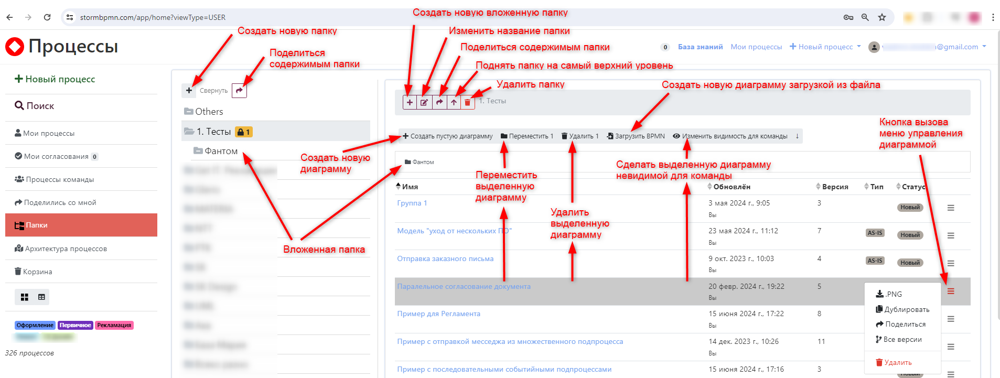
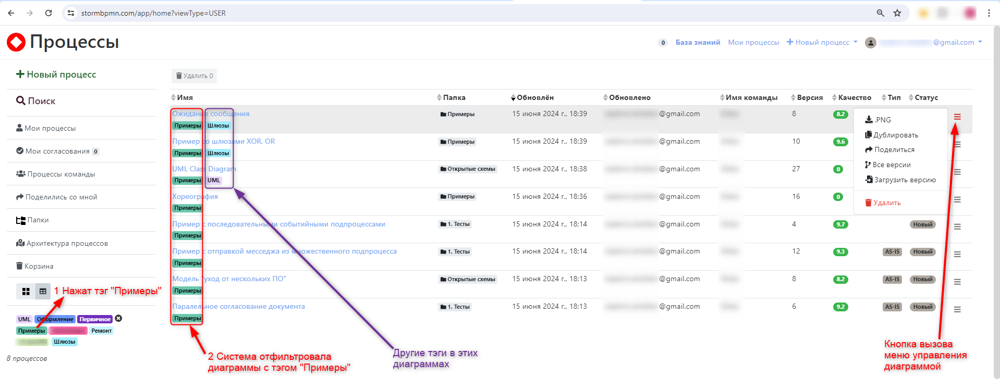
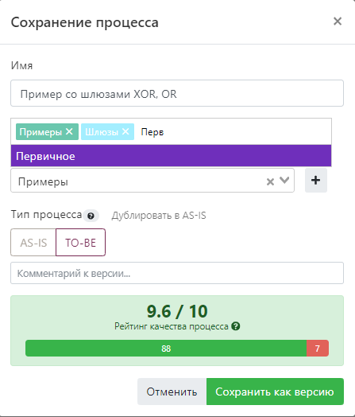

# Папки и теги

Папки и тэги - предназначены для организации хранения диаграмм бизнес-процессов и их структурирования по общему признаку. 
Таким признаком может быть принадлежность к направлению деятельности, продукту, функции, подразделению компании, владельцу процесса и т.п.
Что является таким признаком Вы определяете сами, исходя из своих целей.
Папки и тэги помогают группировать связанные диаграммы процессов под "общим флагом". Это облегчает их поиск, управление ими. 
И особенно полезно при работе с большим количеством схем и сложной связанностью между ними.

::: warning
Папки  - это часть платной подписки TEAM или Enterprise. Без подписки их использование невозможно.
:::

## Создание новой папки, тэга

Создать новую папку, тэг можно при сохранении диаграммы [меню сохранения диаграммы](/features/1_bpmn-editor.html#сохранение-диаграммы) или в меню управления папками

## Управление папками

В меню управление папками доступны действия:
  1) с папками:
    - создавать новые и вложенные в них;
    - удалить, переименовать;
    - переместить на самый верхний уровень;
    - поделиться содержимым;
  2) с диаграммами:
    - создать новую или загрузив её из файла *.bpmn (xml)
    - удалить;
    - переместить в другую папку;
    - сделать диаграмму невидимой для команды;
    - вызвать меню управления диаграммой и из него дублировать, поделиться или просмотреть версии диаграммы.

  

## Использование тэгов

Тэги позволяют быстро отфильтровать, найти диаграммы, которым присвоен этот тэг.

  

Одной диаграмме можно присваивать несколько тэгов. 
Это позволяет гибко структурировать информацию - одна диаграмма может относиться сразу к нескольким группам, каждая из которых задана своим тэгом

  