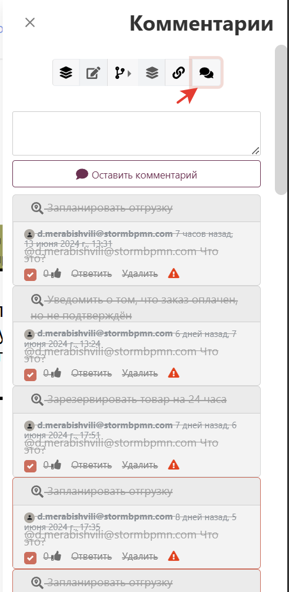
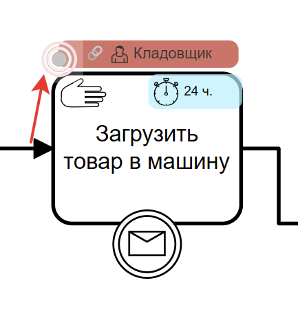
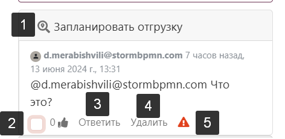
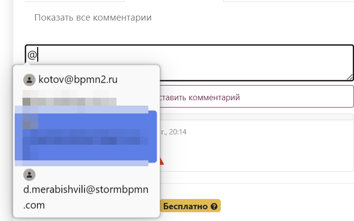

# Комментарии

Комментарии - это отличный способ для экономии вашего времени и обсуждения процессов, как в рабочем режиме, так и в режиме согласования. Время экономится за счет того, что не нужно собирать бесконечные встречи, люди делятся своим мнением асинхронно, по возможности.

## Как оставлять комментарий
Оставлять комментарии можно как ко всей диаграмме, так и к ее элементам.

1 вариант - использовать [правое меню](/features/1_bpmn-editor.html#правое-меню). Так оставится комментарий ко всей диаграмме: 

 

2 вариант - использовать контекстное меню: 

 

## Как посмотреть комментарий

По-умолчанию комментарии выключены и никак не отображаются на схеме. Вы можете включить их с помощью [оверлея](/features/1_bpmn-editor.html#меню-оверлеев).

 

Еще вариант - нажать на символ в контекстом меню:  
 

Третий вариант (покажет все комментарии) - использовать [правое меню](/features/1_bpmn-editor.html#правое-меню): 

 

## Важность и другие кнопки
Карточка комментария имеет полезные функции:  

1. Покажет элемент, в которому оставлен комментарий, на диаграмме.
2. Пометит комментарий как "выполненный", он будет занимать меньше места.
3. Позволяет ответить на комментарий.
4. Позволяет удалить комментарий.
5. Позволяет пометить комментарий как "важный", он ярче отображается в списке и попадает в меню [согласований](/features/1_bpmn-editor.html#просмотр-согласовании). 

## Нотификации по почте и упоминания

По-умолчанию нотификацию по почте получает автор диаграммы. Если комментарий является ответом на другой, то автор родительского комментария тоже получит уведомление.

Если вы хотите, чтобы комментарий получит кто-то из членов вашей команды или тех, кто работает над диаграммой, то используйте символ @: 

## Комментарии при согласовании
При согласовании овелей комментариев включается автоматически и в панеле согласований появляется аналог комментарий из правого меню: 

Если согласующему требуется оставить комментарий к элементу, у которого еще не было комментариев, то пока едиственный вариант - нажать на элемент правой кнопкой мышки и перейти во вкладку:

