# FAQ - ответы на часто задаваемые вопросы

## Тип_элемента
### Как изменить тип (маркер) элемента?
1) встаньте на элемент
2) нажмите на кнопку изменения типа/вида (гаечный ключ)
3) выберите необходимый тип (маркер)

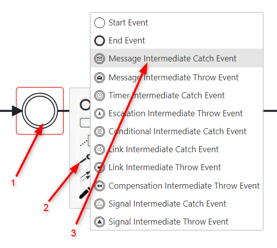

## Копирование
### Как скопировать элементы из одной схемы в другую?
Для копирования элементов и их вставку в другую модель (между вкладками браузера)
используйте кнопки верхнего меню 

## Изменение цвета
### Как изменить цвет?
1) встаньте на элемент, чей цвет вы хотите изменить
2) в верхнем меню нажмите на кнопку изменения цвета
3) нажмите на окно выбора что меняете: заливку или границу
4) выберите что меняете: заливку или границу
5) нажмите на цвет, в который хотите покрасить

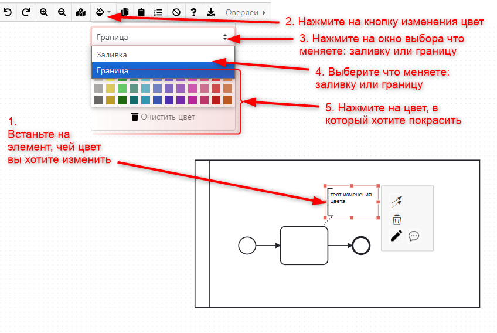

## Выравнивание
### Как выровнять элементы по горизонтали?
### Как сделать стрелки одинаковой длины?

1) выделите несколько элементов
2) в появившемся справа контексном меню выберите кнопку выравнивания и откроется подменю с типами выравнивания
3) в подменю нажмите на выравнивание по горизонтали или по вертикали 

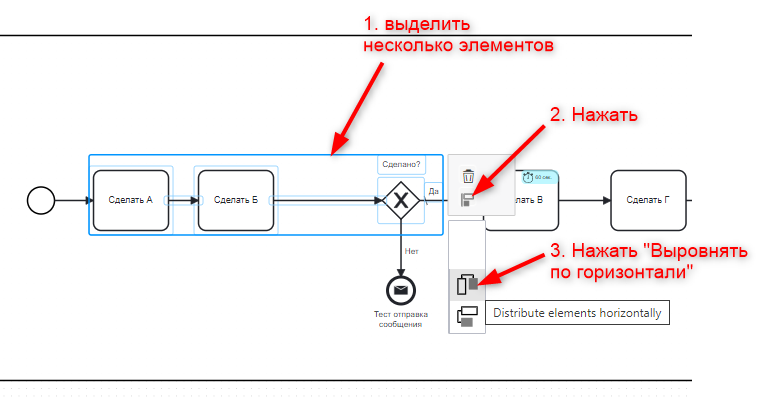

## Восстановление
### Как восстановить процесс?

::: warning
Версионирование  - это часть платной подписки PersonalPro, TEAM или Enterprise. Без подписки её использование невозможно.
:::

Зайдите в меню Мои процессы или [Папки](#папки) и найдите искомую модель
1) нажмите на кнопку в виде трёх горизонтальных линий (находится в правом углу)
2) нажмите "Все версии"

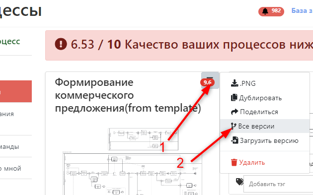

3) система откроет список всех версий, в котором вы сможете просмотреть каждую, нажав на соответствующую кнопку

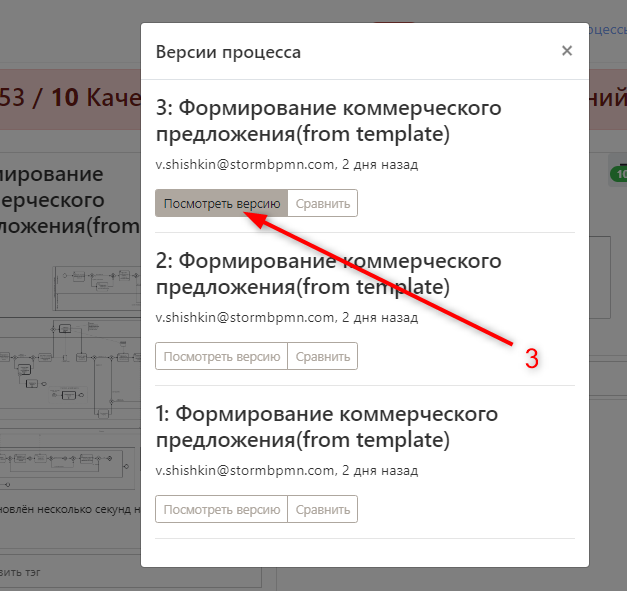

4) Выберите ту версию, из которой хотите восстановить свою модель. Нажмите в левом верхнем углу зеленую кнопку "Установить как текущую"

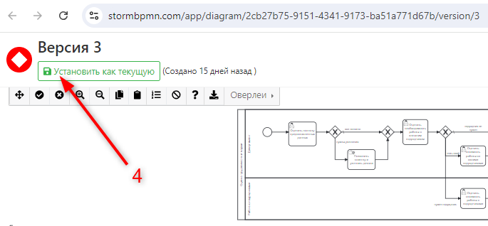

## Cвязи: создание, удаление связи
### создание связи у call-activity
1) встаньте на элемент call-activity
2) нажмите на кнопку расширенных настроек (карандаш)
3) в поле "Название процесса" заполните название схемы call-activity 
   (начните набирать любое слово из его названия и система автоматически предложит вам схемы из имеющихся)

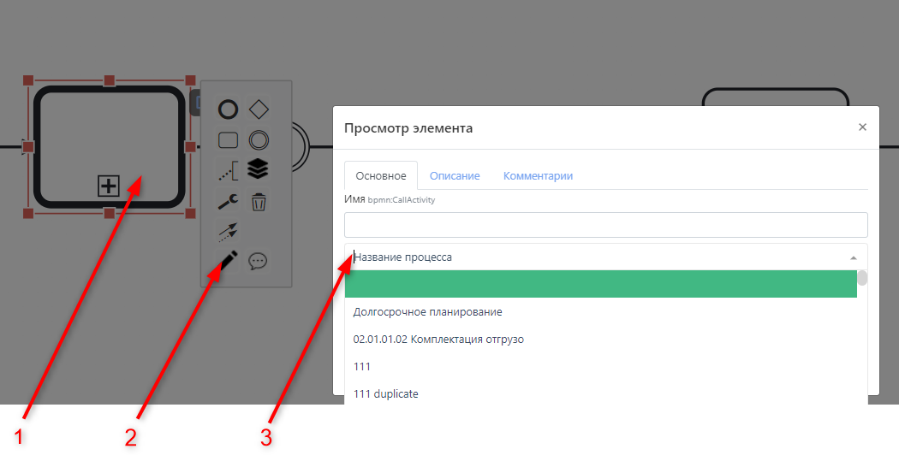

### создание связи через отправку, получение месседжа
1) встаньте на элмент "отправка месседжа"
2) нажмите на кнопку расширенных настроек (карандаш)
3) нажмите кнопку "Создать событие отправки"
4) система присвоит название этому событию 

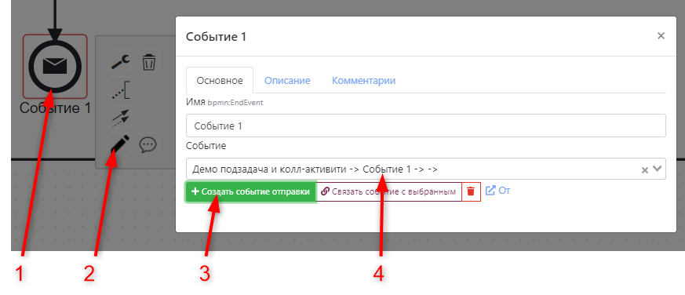

5) встаньте на элмент "получение месседжа"
6) нажмите на кнопку расширенных настроек (карандаш); 
7) поставьте курсов в поле "Событие"; система откроет список доступных событий отправки месседжа
8) выберите событие от которого получаем месседж
9) нажмите кнопку "Связать событие с выбранным"
10) система создаст линк связи

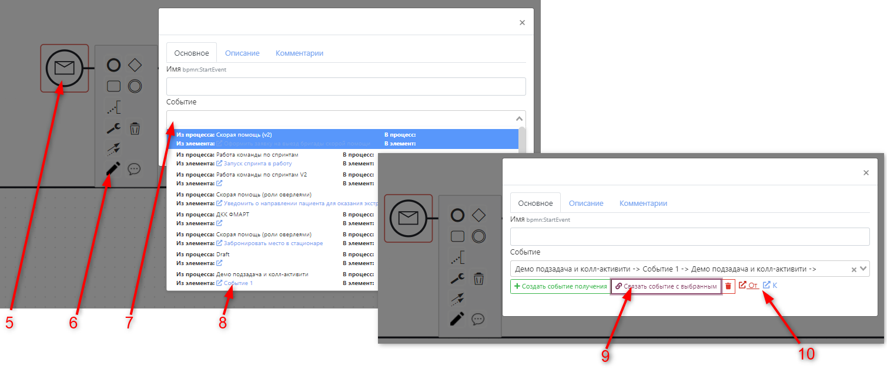

### удаление связи
1) перейдите на вкладку "Регламент"
2) выберите пункт "Связи процессов"
3) удалите связь, нажав кнопку справа от названия связанной схемы

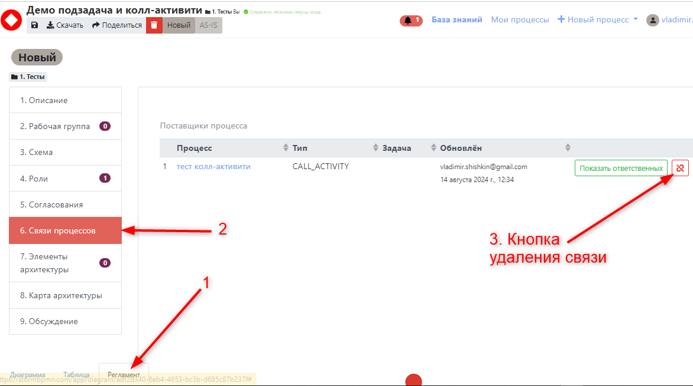

## Отображение оверлеев по умолчанию

Чтобы оверлей отображался сразу при открытии схемы, как у Вас, так и у людей с которыми Вы ей поделились:
1) откройте [страницу профиля](https://stormbpmn.com/app/profile)
2) перейдите на вкладку Настройки
3) проставьте флаги у тех оверлеев, которые желаете отображать сразу при открытии схемы

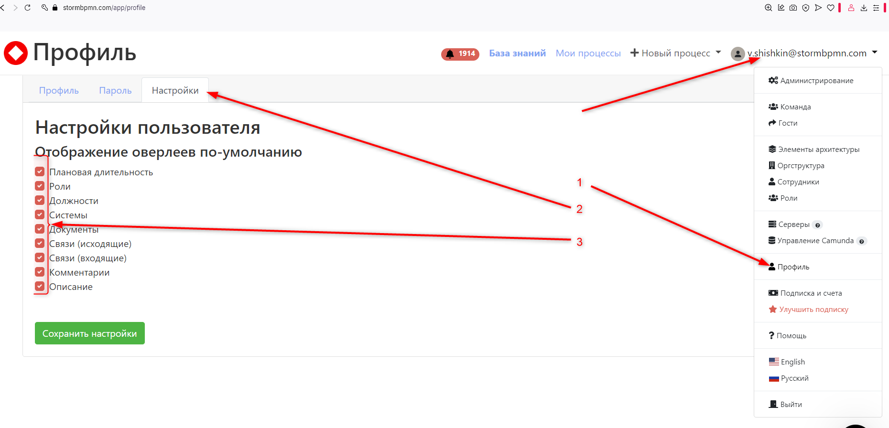

## Ошибка предоставления доступа к схеме 
## some business exception happen
При предоставлении доступа к схеме система может вывести сообщение об ошибке (*желтый стикер внизу посередине экрана*):
"some business exception happen".
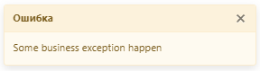

Это означает, что Вам стала недоступна возможность поделиться новыми схемами, так как Вы достигли ограничения в 5 предоставлений доступа на вашем тарифе
Чтобы поделиться новой схемой возможны 2 варианта:
1) перейти на тариф где бесконечное количество предоставлений доступа к схемам - [PersonalPro или Team](https://stormbpmn.com/pricing/)
2) удалить один из ранее предоставленных доступов. Их перечень находится на странице [Гости](https://stormbpmn.com/app/guests)

## Счёт на оплату от юридического лица
Для создания счёта на оплату от юридического лица:
1) откройте страницу [улучшения тарифа](https://stormbpmn.com/app/upgrade)
2) в колонке тарифа Теам нажмите на ссылку ["Оплатить по счёту"](https://stormbpmn.com/app/generateInvoice) 
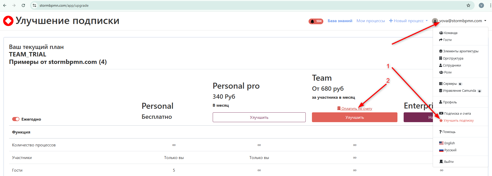

Откроется страница [создания счёта](https://stormbpmn.com/app/generateInvoice)
В ней укажите:
1) Название, ИНН компании
2) Количество лицензий
::: warning
Минимальная сумма по счёту расчитана на количество участников вашей команды на момент формирования счёта.
:::
3) Срок использования в месяцах
4) нажмите на кнопку "Скачать счёт"

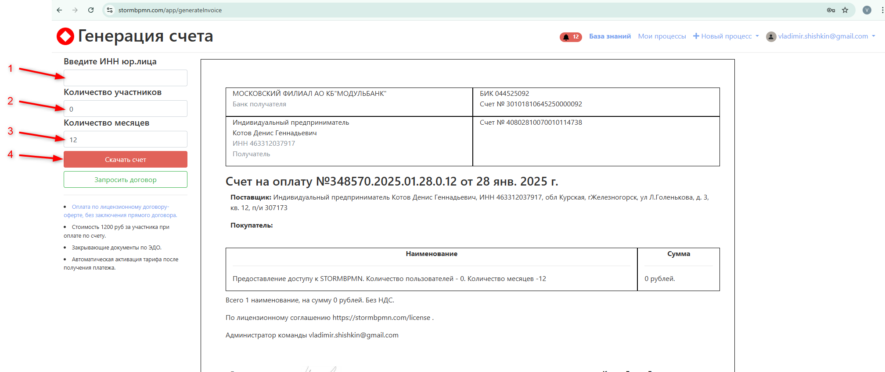

При оплате по такому счёту лицензии активируются автоматически, а поступление платежа будет отражено на странице ["Подписка и счета"](https://stormbpmn.com/app/billing)