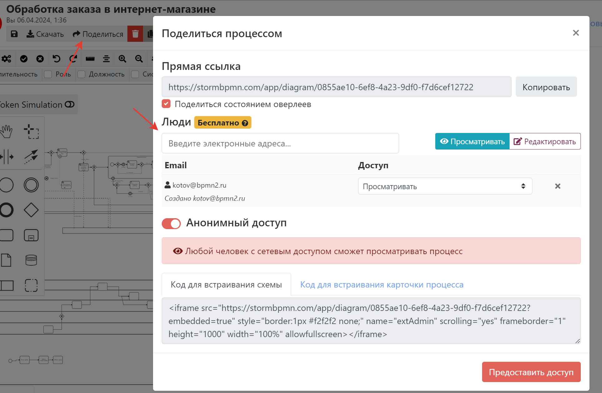
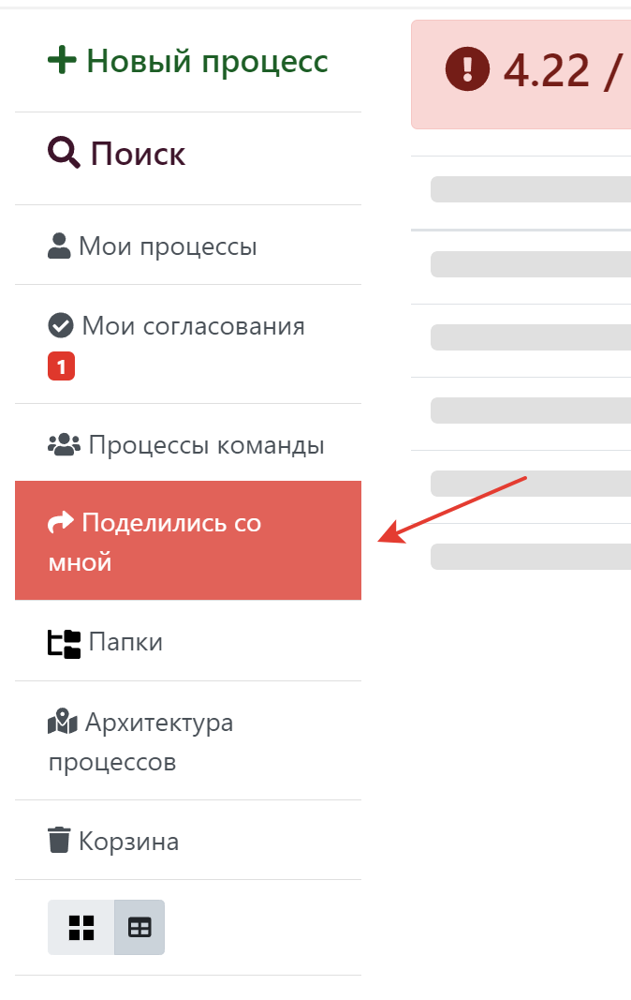
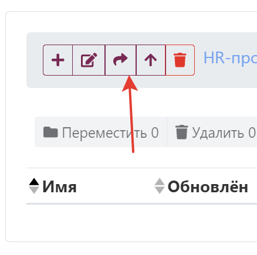
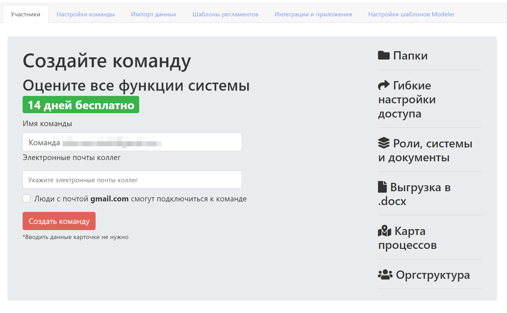

---
dir:
  order: 11
  link: true
  text: Работа в команде и общий доступ
  collapsible: false
index: true
icon: "user-group"
---

# Совместная работа
:::danger
Раздел в разработке. Одновременная работа с одной диаграммой из нескольких вкладок или браузеров пока не поддерживается.
:::

Совместная работа в система в работе предназначена для того, чтобы экономить ваше время за счет:
- Все видят одни и теже процессы
- Все процессы в актуальном состоянии
- Не надо пересылать файлы и ссылки
- Все изменения версионируются и можно откатиться к пред. версиям, если кто-то что-то сломал
- Можно посмотреть, чем текущая версия отличается от предыдущей.

## 4 типа совместной работы
В системе существует несколько способов поделиться своей работой с коллегами - на уровне процесса, на уровне папки, на уровне команды и на уровне предприятия.  

 Чем ближе выданы права к диаграмме, тем они сильнее. Т.е. права на уровне процесса сильнее прав на уровне папки. А на уровне папки - сильнее чем на уровне команды.

### На уровне процесса - поделиться конкретным процессом 
Вы можете поделиться конкретной диаграммой с конкретными пользователями. Это хорошо работает, когда вам нужно просто поделиться одной диаграммой.

::: tip
Используйте этот способ, если хотите поделиться процессом не заставляя регистрироваться в системе. Включите галочку анонимный доступ.
:::

На этом экране можно настраивать:
- Отображение [оверлеев](../features/#меню-оверлеев)  по ссылке
- Просматривать, редактировать или удалять права конкретных пользователей на диаграмму
- Предоставлять анонимный доступ 
- Предоставлять доступ к диаграмме для организации (только ENTERPRISE-версия)
- Просматривать код для встраивания диаграммы в системы типа Confluence

Чтобы посмотреть и массово управлять такими выданными правами, нужно перейти в раздел [гости](https://stormbpmn.com/app/guests). 

::: warning

Такое предоставление доступа не делает получателя доступа членом вашей команды. Такое предоставление доступа потребяет лимит бесплатных доступов на тарифе Personal.

::: 

При выдаче доступа человек получит уведомление по почте с предложением зарегистрироваться (если не было учетной записи в системе) или с тем, что ему предоставлен доступ (если учетная запись была).
Все диаграммы, которыми когда либо делились с человеком, доступы на главной странице в разделе "Поделились со мной":  

### На уровне папки

В тарифе TEAM существует возможность поделится конкретной папкой с конкретным человеком. По смыслу работает точно так же  - отображается в "поделились со мной", шлется нотификация. При этом человек НЕ увидит внутреннюю структуру папок, а просто увидит их все скопом.  Анонимный доступ до папок невозможен.  

::: tip
Этот вариант хорошо работает, когда вы не хотите приглашать человека в вашу команду, но вам нужно поделиться с ним группой каких-то процессов.
::: 

## Управление командой
Команда - это группа людей, которые вместе работают над одними процессами. _Например, у вас есть команда "Кредитные карты", в которой 10 человек и все они работают с продуктом "Кредитная карта"_.  
Участники команды, в отличии от всех других способов совместной работы, получают такие приемущества:
- Видят все диаграммы всех участников команды автоматически, без необходимости предоставлять права
- Видят структуру папок 
- У них общие [элементы архитектуры](../features/#элементы-архитектуры-1) и [роли](../features/#роли)
- Видят общие шаблоны регламентов
- Имеют общие требования по качеству описания процессов
- Видят общую [оргструктуру](../features/#огрструктура)

::: warning
Доступность диаграмм для членов команды определяется по ее участникам. Участник входит в команду - его диаграммы всем видны. Участник уволился и его убрали из команды - диаграммы не видны.  
Чтобы избежать недоступности диаграмм после увольнения сотрудников используйте кнопку "забрать авторство диаграмм" перед тем, как удалить участника.
:::

### Cоздание команды
Создать команду может любой пользователь системы по [ссылке](https://stormbpmn.com/app/team/)  

::: tip
Создание команды в первый раз включает тестовый период со всеми функциями системы, попробуйте!
:::

### Приглашение в команду
Чтобы команда работала, люди должны иметь уточные записи в системе и вступить в команду. Есть несколько способов вступить в команду:
#### По почте
При создании команды или по [ссылке](https://stormbpmn.com/app/team/) при нажатии на кнопку __"пригласить по почте"__ вы можете указать почтовые ящики ващих коллег. Если у них есть аккаунт в системе и они не входят в команды, от они сразу же будут добавлены в вашу команду. Если у них нет аккаунтов, то сначала они получат приглашение зарегистрироваться.

::: danger 
Поскольку приглашение по почте связано с отправкой писем от нашего имени, у нас встроена защита от спама. Не отправляйте больше 5 приглашений за раз.
::: 

#### По ссылке
Самый удобный вариант - получить ссылку по кнопке __"пригласить по ссылке"__ и отправить его коллегам. Перейдя по ней они смогут зарегистрироваться или присоедениться к команде. В этом случае у них будут права на чтение, их можно будет сменить позднее.  

::: warning
Если участник уже член команды, то вступить по ссылке у него не получится - сначала надо выйти из команды или удалить команду.
:::

#### По домену
Если ваша организация имеет свой домен, например __stormbpmn.com__  , то вы можете указать его в настройках команды. Тогдай любой человек с такой почтой, например __d.kotov@stormbpmn.com__, получат возможность вступить в вашу команду.  Тоже хороший способ собрать всех коллег вместе. Указываете домен и говорите "Регистрируемся с рабочих почт и вступаем в команду!".

### Управление правами
Сейчас существует 3 типа прав:
- __Администратор__ - может создавать роли и элементы архитектуры и делать вообще все с командой.
- __Чтение\редактирование__ - НЕ может создавать роли и элементы архитектуры, НЕ может менять настройки команды. Может редактировать папки и диаграммы коллег.
- __Чтение__ - Не может редактировать диаграммы коллег, не может трогать папки. Может создавать диаграммы.

Управляение правами осуществяется путем выбора участников и нажатия на кнопку **"Сменить права"**.

### Прочие настройки команды
### Выход из команды
### Удаление команды

## Поделиться процессом
## Встроить процесс
## Поделиться папкой
## Гости
