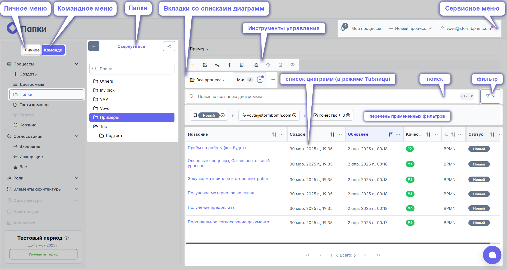
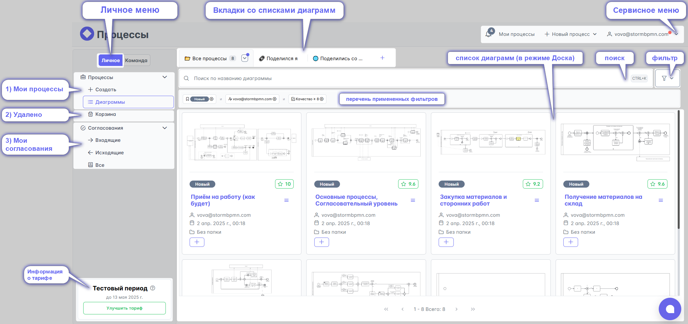
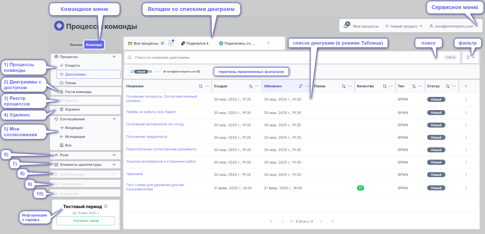
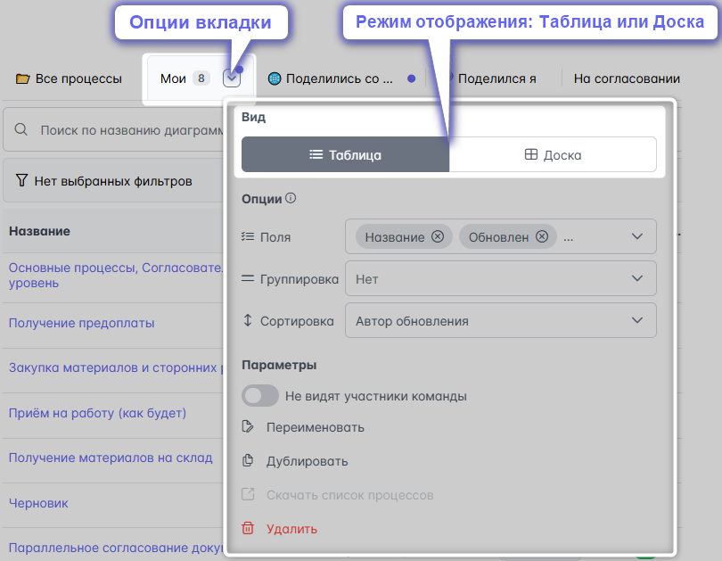

# Главная страница

На главной странице есть несколько объектов:
- Личное / командное меню
- Список диаграмм 
- Сервисное меню

## Личное меню
[Личное меню](../0_home-page/pesonal_menu.html) содержит подменю:
  1) Мои процессы
  2) Список диаграмм к которым отрыт доступ
  3) Избранные диаграммы
  4) Диаграммы, которые были удалены
  5) Мои согласования
  
  **И вкладки со списком диаграмм в виде доски, [таблицы](../0_home-page/table.html)** 

## Командное меню
[Командное  меню](../0_home-page/command_menu.html) содержит подменю:
  1) Процессы команды
  2) Диаграммы к которым команда предоставила доступ другим людям
  3) Реестр процессов
  4) Диаграммы, которые были удалены
  5) Мои согласования
  6) [Роли](../4_assignees.html)
  7) [Элементы архитектуры](../5_elements-architecture/)
  8) Редактор оргструктуры
  9) Архитектура
  10) Аналитика
  
  **И вкладки со списком диаграмм в виде доски, [таблицы](../0_home-page/table.html)** 
  

## Список диаграмм
## [Таблица диаграмм](../0_home-page/table.html)
Основную часть главной страницы занимают вкладки со списками диаграмм. \
У списков два режима отображения: доска и [таблицы](../0_home-page/table.html)

В режиме "Доска" список диаграмм выглядит как их превью с атрибутами: статус, название, кто внёс последние изменения, время сохранения последней версии, название папки.

**Больше всего возможностей предоставляет пользователям режим ["таблица"](../0_home-page/table.html).** \
В нём пользователь самостоятельно настраивает перечень атрибутов, условия фильтрации, поиска. Эти настройки можно сохранить, а также поделиться ими с другими участниками команды

## Сервисное меню
[Сервисное меню](../0_home-page/service_menu.html)