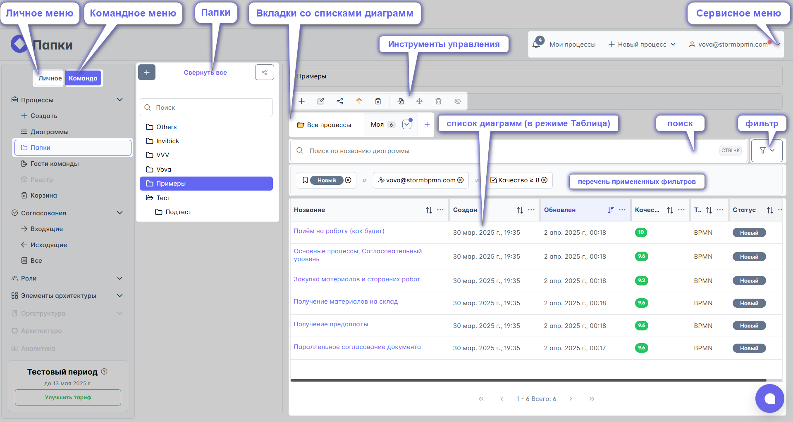
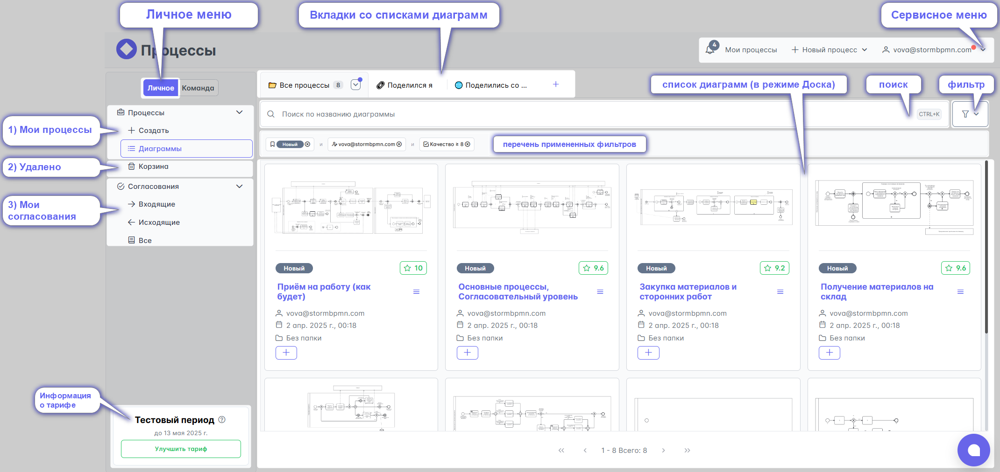

# Главная страница

На главной странице есть несколько объектов:
- Личное / командное меню
- Список диаграмм 
- Сервисное меню

## Личное меню
[Личное меню](../0_home-page/pesonal_menu.html) содержит подменю:
  1) Мои процессы
  2) Список диаграмм к которым отрыт доступ
  3) Избранные диаграммы
  4) Диаграммы, которые были удалены
  5) Мои согласования

## Командное меню
[Командное  меню](../0_home-page/command_menu.html) содержит подменю:
  1) Процессы команды
  2) Диаграммы к которым команда предоставила доступ другим людям
  3) Реестр процессов
  4) Диаграммы, которые были удалены
  5) Мои согласования
  6) [Роли](../4_assignees.html)
  7) [Элементы архитектуры](../5_elements-architecture/)
  8) Редактор оргструктуры
  9) Архитектура
  10) Аналитика

## Список диаграмм
Основную часть главной страницы занимает список диаграмм. У этого списка два режима отображения: карточки и таблица _(переключатель в левом нижнем углу)_

В режиме "карточки" список диаграмм выглядит как их превью с атрибутами: статус, название, кто внёс последние изменения, время сохранения последней версии, название папки.

В режиме ["таблица"](../0_home-page/table.html) система позволяет самостоятельно настраивать перечень атрибутов, условия фильтрации, поиска. Эти настройки можно сохранить, а также поделиться ими с командой

## Сервисное меню
[Сервисное меню](../0_home-page/service_menu.html)