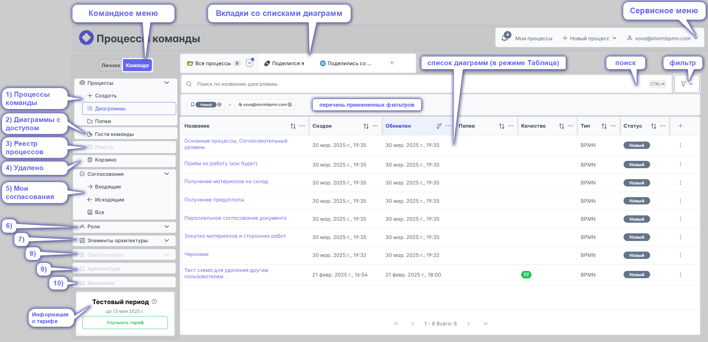

# Командное меню

[Командное  меню](../0_home-page/command_menu.html) содержит подменю:
  1) Процессы команды
  2) Диаграммы к которым команда предоставила доступ другим людям
  3) Реестр процессов
  4) Диаграммы, которые были удалены
  5) Мои согласования
  6) [Роли](../4_assignees.html)
  7) [Элементы архитектуры](../5_elements-architecture/)
  8) Редактор оргструктуры
  9) Архитектура
  10) Аналитика

