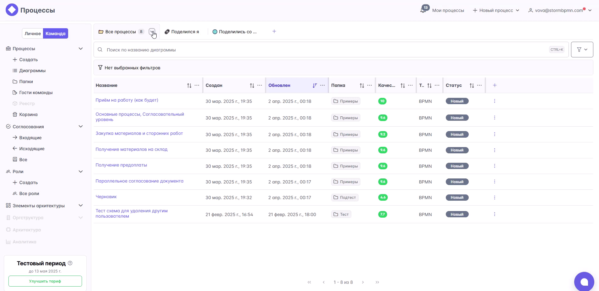
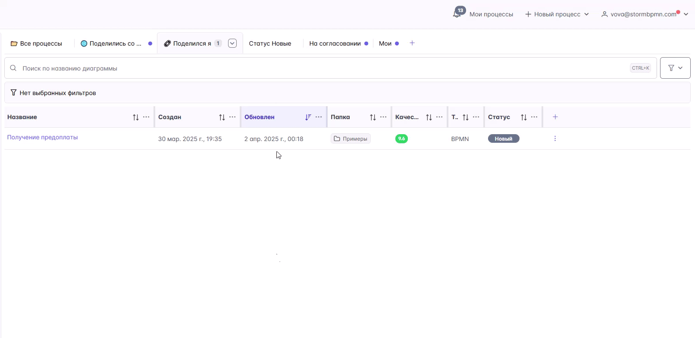
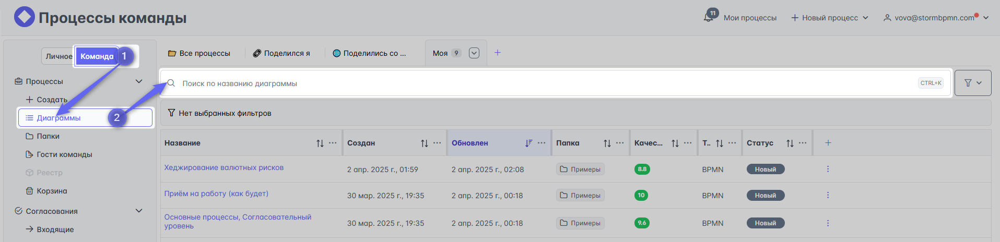
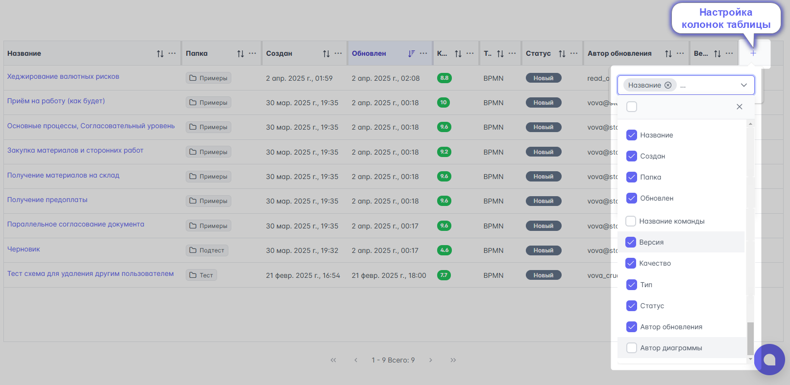
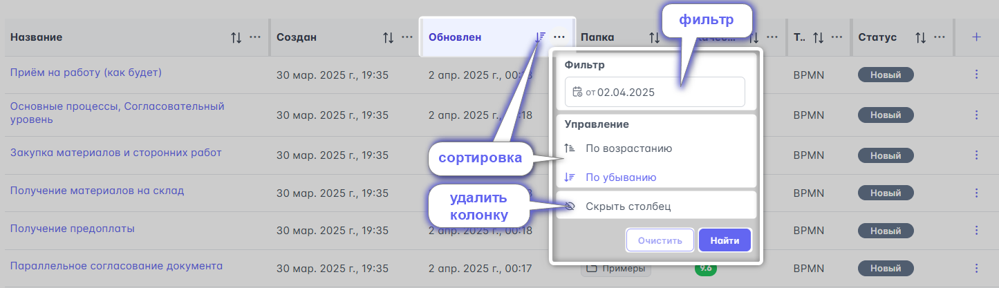
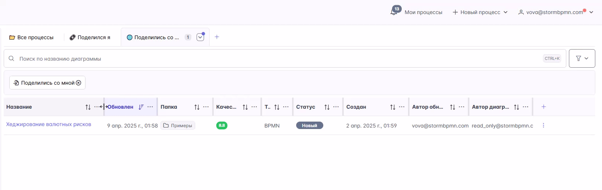
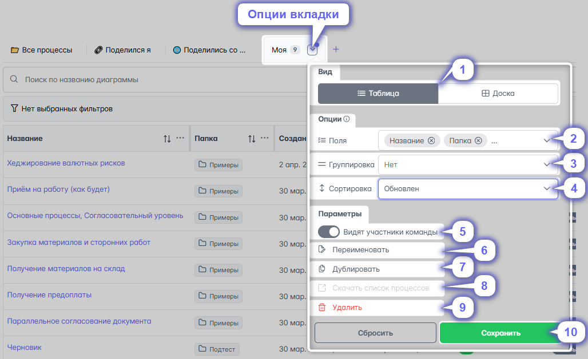

# Таблица списка диаграмм

## Базовые таблицы (вкладки)
В меню со списками диаграмм есть три базовых вкладки:
- Все процессы:
   - _в меню "Личное" отображаются диаграммы, которые создали Вы_;
   - _в меню "Команда" - диаграммы, созданные всеми участниками команды (кроме скрытых автором)_;
- Поделился я  - _диаграммы к которым я предоставил доступ другим людям_;
- Поделились со мной - _диаграммы к которым мне дали доступ_.

::: warning Удаление базовых вкладок
Если удалить все три базовые вкладки, то они автоматически восстановятся - появятся вновь.
Пока остаётся хотя бы одна из базовых вкладок, то восстановление не происходит

:::

## Возможности таблиц, вкладок
**В каждой вкладке у пользователя есть возможности:**

## Перетаскивание вкладок
Вкладки можно менять местами

### - Поиск по названию диаграммы

### - Фильтр:
   1) тегам, _присвоенным диаграмме_;
   2) папке - _месте хранения диаграммы_;
   3) элементам архитектуры: _документам, системам, клиентам, коммуникациям, сущностям, действиям, прочим и кастомным типам элементов_;
   4) ролям _- исполнителям задач процесса_;
   5) статусу диаграммы: _новый, в работе, согласование, готов, архив_;
   6) содержимому процесса - _поиск по слову в названии элементов диаграмм_;
   7) автору диаграммы;
   8) должностям, _исполняющим роли в процессе_;
   9) сотрудникам -_по фамилии, имени отчеству человека, работающего в должности_;
   10) качеству диаграммы - _оценке, проверке ошибок по правилам команды_;
   11) дате создания диаграммы;
   12) дате обновления - _дате сохранения последней версии_;
   13) автору обновления - _кто последний внёс изменения_;
   14) типу диаграммы: BPMN _(процесс)_, BCM _(группа процессов)_;
   15) поделился я - _диаграммы к которым я предоставил доступ другим людям_;
   16) поделились со мной - _диаграммы к которым мне дали доступ_.

### - Настройка колонок

Перечень колонок можно настраивать.
Установка галочки добавляет колонку, а снятие - убирает её

В колонках доступно:
- задать фильтр;
- сделать сортировку _(по возрастанию или убыванию)_;
- скрыть её.

Также с колонками можно производить следующие операции
- изменять их ширину;
- менять местами.

### - Опции вкладки:
1) режим отображения списка диаграмм: таблика или доска с карточками _(картинками)_;
2) перечень колонок таблицы;
3) настройка группировки диаграмм;
4) сортировка диаграмм;
5) добавить в шаблоны команды - для использования другими участниками
::: tip Использование шаблонов:
- Никакой пользователь не может сделать так, чтобы новая вкладка появилась у всей команды (ни в диаграммах, ни в папках). 
- Пользователь может сделать себе вкладку с настройками и добавить её в шаблоны команды. Тогда другой участник команды может сделать свою собственную вкладку на основе этого шаблона. И потом изменять её как хочет. 
- Исходная вкладка, ставшая прототипом шаблона, не будет изменяться от действий владельцев копий. И наоборот, изменение исходной вкладки не будет влиять на ранее созданные вкладки из этого шаблона.
- Если владелец вкладки-шаблона меняет вкладку, то шаблон тоже обновляется. То есть происходит копирование настроек вкладки в момент создания новой вкладки с выбранным шаблоном, а не в момент, когда был нажат ползунок "Добавить в шаблоны команды".
:::
6) переименование вкладки;
7) дублирование вкладки;
8) скачивание списка процессов этой вкладки;
9) удаление вкладки;
10) сохранение настроек опций

## Создание вкладки

## Создание вкладки по шаблону команды