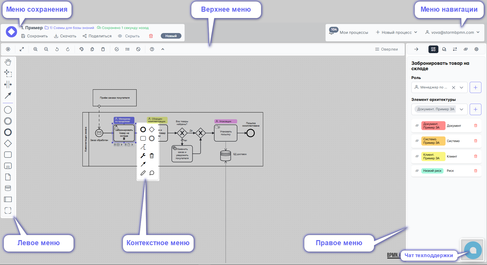
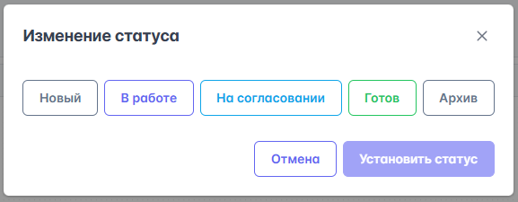
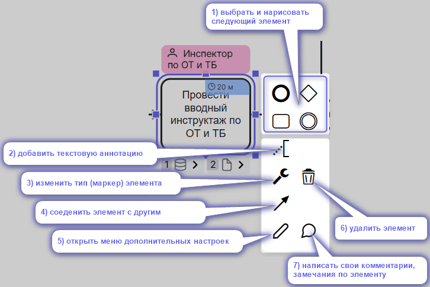
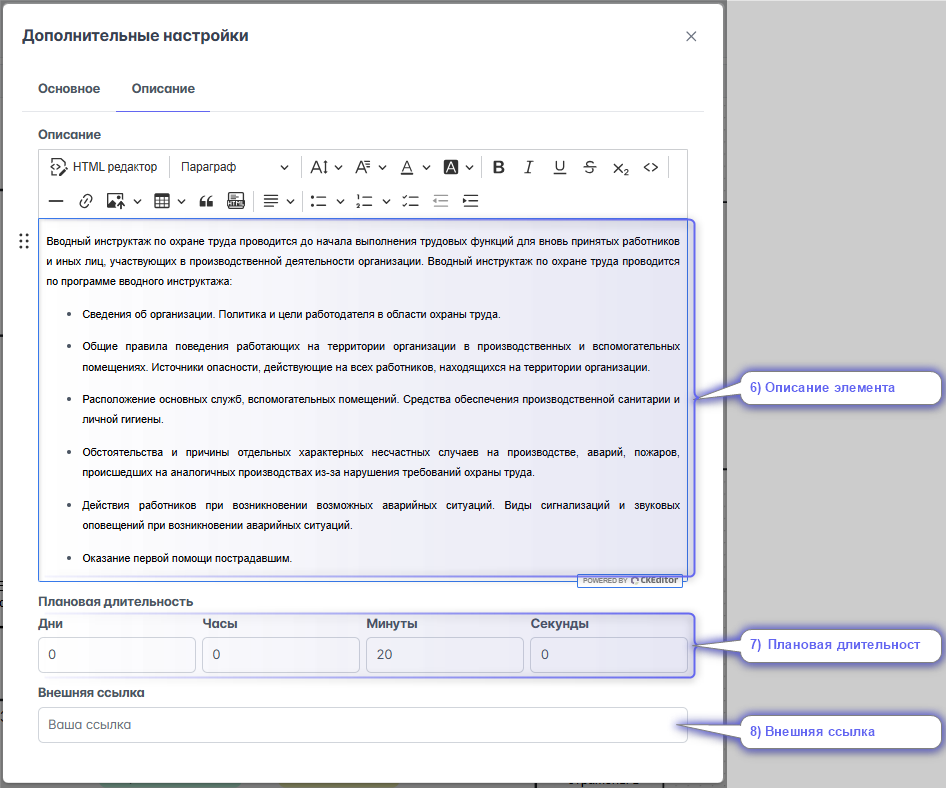
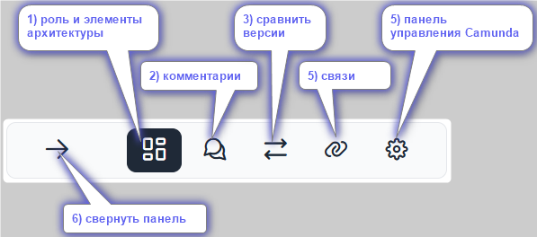
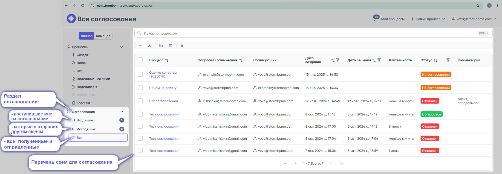
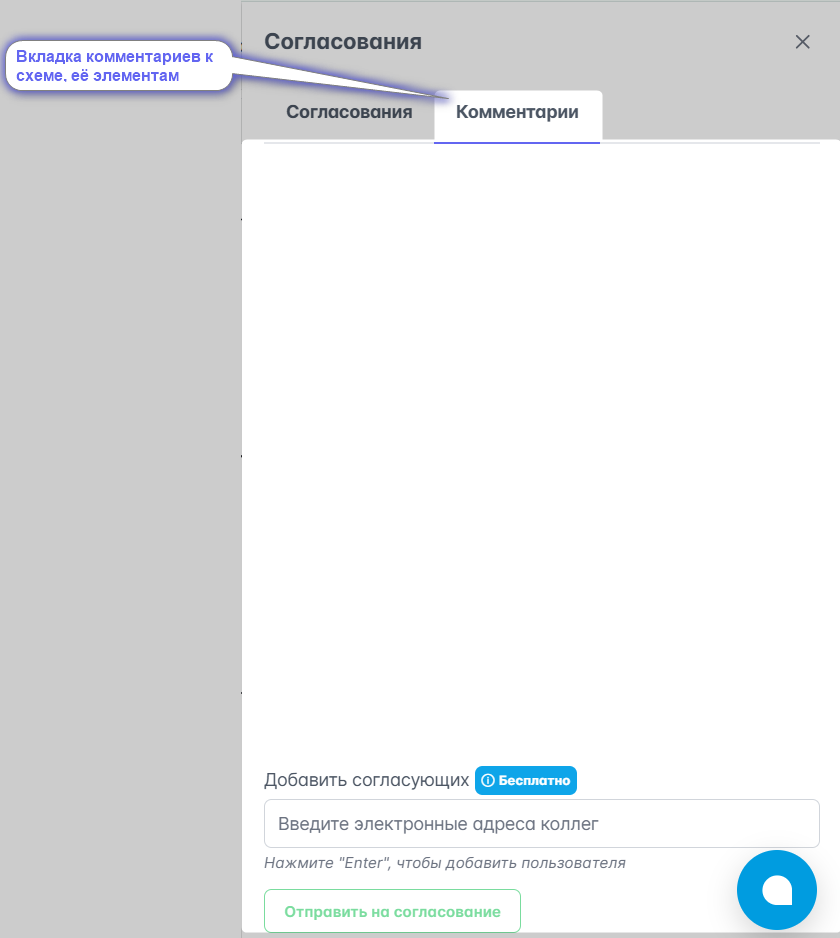
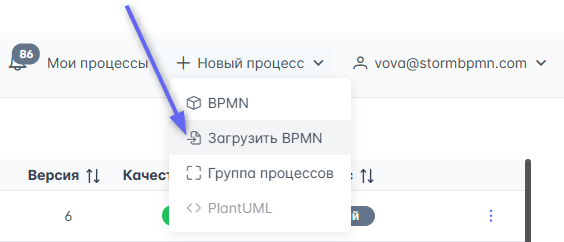
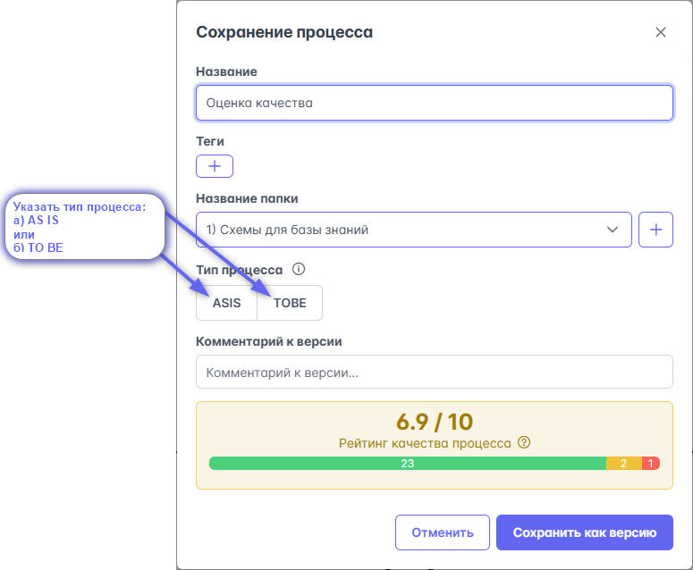
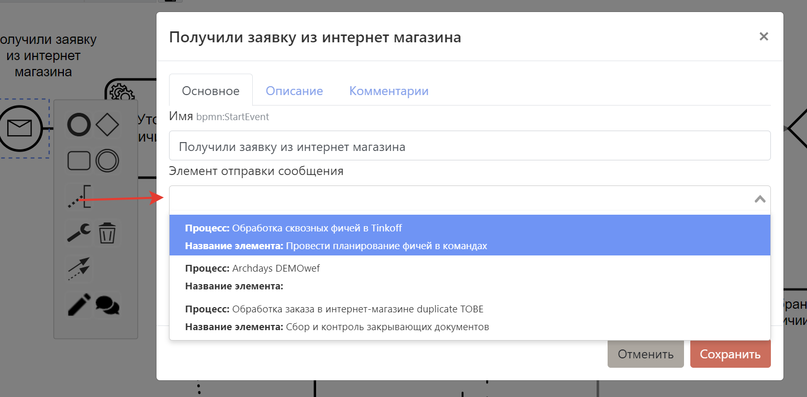

# Редактор диаграмм BPMN

Наш редактор BPMN имеет несколько меню для удобства работы с BPMN диаграммами.  

## Описание всех меню

### Меню навигации

:::danger ОПИСАТЬ
::::

### Меню действий

В этом меню возможно:
-   1)  Вернуться на главную страницу (Мои процессы);

- Увидеть:

   2)  название диаграммы;
   3)  название папки в которой хранится диаграмма;
   4)  кто сохранил эту версию диаграммы;
   5)  дату и время версии;
   6)  сравнительный вид диаграммы: As Is или To Be
   12) статус диаграммы (новая, в работе, на согласовании, готова, архив);

- Выполнить действия:

   7)  вызвать меню сохранения;
   8)  вызвать меню выгрузки: в регламент (docx) или графический файл (png, svg, pdf);
   9)  вызвать меню предоставления доступа другому пользователю Шторма или любому человеку
   10) скрыть диаграмму от всех
   11) удалить диаграмму
   12) изменить статус

#### Сохранение диаграммы

В этом меню вы можете:

1) Указать название диаграммы
2) Добавить [теги](#теги)
3) Указать [папку](#папки)
4) Указать сравнительный вид диаграммы (AS-IS / TO-BE) и связать со вторым процессом для [сравнения](#сравнение-as-is-и-to-be)
5) Оставить комментарий к текущей версии
6) Увидеть [качество] вашей диаграммы

::: tip
При сохранении создаётся [версия](#версионирование), к которой можно откатиться или выполнить сравнение
:::

В этом же меню можно сохранить **чужую диаграмму**, к которой вы не имеете доступа на редактирование, в свои диаграммы.

#### Скачать (экспорт SVG, PNG, PDF, BPMN и .DOCX)

В меню Скачать процесс есть 2 вкладки:  
А. ***Файлы***  
Б. ***Регламенты***

На вкладке ***Файлы*** можно скачать диаграмму 
- как картинку (SVG, PNG);
- машиночитаемый файл XML (BPMN);
- как документ с оверлеями (PDF).

.png)

:::tip
Для сохранения картинки с [оверлеями](#меню-оверлеев) используйте скачивание в PDF
:::

На вкладке ***Регламенты*** доступно:
1) загрузка своего шаблона регламента;
2) выбрать шаблон из списка загруженных;
3) выгрузить в шаги процесса только задачи (убрать события, развилки и другие объекты диаграммы процесса)
4) скачать регламент процесса по базовому шаблону;
5) скачать регламент по своему выбранному шаблону

 .png)

#### Поделиться диаграммой

В этом меню можно предоставить/отозвать доступ на диаграмму:

1) Конкретному человеку по e-mail с указанием прав (просматривать/редактировать)
2) Анонимно (не требует учетной записи в системе)
3) Получить код для встраивания диаграммы, она будет выглядеть вот так:
<iframe src="https://new.stormbpmn.com/app/diagram/ed955b21-8019-48ed-abc4-3fa7b0f491d5?embedded=true" style="border:1px #f2f2f2 none;" name="extAdmin" scrolling="yes" frameborder="1"  height="400" width="100%" allowfullscreen></iframe>

Больше о [совместной работе](../team-work/)

#### Сменить статус

Для информирования коллег о состоянии работы над процессом можно использовать статусы:

- **Новый** - процесс ещё не трогали, просто создали
- **В работе** - над процессом активно идёт работа
- **На согласовании** - процесс согласуется с кем-то, менять схему **нельзя**. Подробнее в [согласованиях](#согласование)
- **Готов** - процесс готов к работе, менять схему нельзя
- **Архив** - процесс в архиве

  

#### AS-IS и TO-BE

Если в [меню сохранения](#меню-сохранения) вы указали тип процесса и связанный процесс, то появится возможность быстро перемещаться между версиями AS-IS и TO-BE, нажав на кнопку верхнего меню с типом диаграммы

::: danger Ещё в разработке
А также визуально [сравнить их](#сравнение-as-is-и-to-be).
:::

### Левое меню

Левое меню предназначено для выбора элементов BPMN, управления ими и обеспечения удобства использования редактора.

::: warning Не все элементы
В левом меню находятся не все разновидности элементов BPMN, но это не значит, что их нет в системе :) Выбор типа (маркера) элемента производится в контекстном меню нажатием на кнопку .
:::

Советуем обратить внимание на кнопки, обеспечивающие удобство работы:

Для понимания того, в какие элементы можно превратить значки, нужно разбираться в [BPMN](/bpmn/), т.к. сервис старается защитить вас от ошибок и не дать использовать элементы, которые невозможны по нотации.

### Верхнее меню

Верхнее меню предназначено для работы с конкретной диаграммой и предоставляет возможности:  

1. Включить симулятор токена.
2. Развернуть диаграмму на полный экран.
3. включить, отключить миникарту
4. Приблизить.
5. Отдалить.
6. Отменить последнее действие.
7. Вернуть отмененное действие.
8. Сменить цвет выбранным элементам.
9. Скопировать выделенные элементы для вставки между вкладками.
10. Вставить выделенные элементы из другой вкладки.
11. Включить [проверку ошибок](#оценка-качества).
12. Выполнить автонумерацию элементов.
13. Очистить автонумерацию.
14. Открыть справку по верхнему меню, горячим клавишам и элементам [BPMN](https://new.stormbpmn.com/bpmn/elements) с примерами.
15. Скрыть шапку: меню действий и меню навигации.
16. Раскрыть [меню оверлеев](#меню-оверлеев).

### Контекстное меню

Контекстное меню открывается при клике на элемент и предоставляет следующие возможности в зависимости от того, на какой элемент вы кликнули:  

1.  Выбрать и нарисовать следующий элемент.
2.  Открытие меню для управления [ролями](#роли) и [элементами архитектуры](#элементы-архитектуры).
3.  Удаление элемента.
4.  Текстовая аннотация к элементу.
5.  Изменение атрибутов текущего элемента.
6.  Соеденение текущего элементв с другим.
7.  Открытие меню [дополнительных настроек элемента](#меню-дополнительных-настроек-элемента).

 

### Меню дополнительных настроек элемента

В этом меню предоставляется возможность указывать всю ключевую информацию об элементе:
1) Название
2) [Роль](#роли) (_только для задач_)\
  _(назначить роль на задачу, удалить связь роли с задачей, создать новую роль)_
3) [Элементы архитектуры](#элементы-архитектуры) (_только для задач_)\
  _(связать элемент архитектуры с задачей, создать новый, удалить связь с задачей)_

 

::: danger Ещё в разработке
4) [Связанный процесс](#связь-процессов) (_только для Call Activity или Participant_) 
5) [Создание события отправки сообщения](#связь-процессов)  (_только для Throw Event_)
 или [Связывание события получения сообщения с его отправкой](#связь-процессов)   (_только для Catch Event_)
:::

6) Описание элемента
7) [Плановую длительность](#расчет-длительности-сценарией)
8) Внешняя ссылка

 

### Меню оверлеев

Одним из ключевых удобств системы является возможность быстро и удобно включать и выключать отображение информации на диаграмме.
Меню оверлеев предоставляет возможность:
1) включить отображение
- [Ролей](#роли)
- Должностей (_первой должности в [оргструктуре](#редактор-оргструктуры), назначенной на роль_ )
- Систем (один из типов [элементов архитектуры](#элементы-архитектуры))
- Документов (один из типов [элементов архитектуры](#элементы-архитектуры))
2) развернуть список оверлеев Системы; Документы (_по умолчанию они свёрнуты в оверлей-группу, показывающий их наличие_)
3) отобразить значки, обозначающих, что у элемента есть
- Описание
- [Комментарии](#комментирование)
4) показать длительность
5) отобразить значки наличия у элементов:
- [Связи](#связи-процесса) (исходящие) 
- [Связи](#входящие-связи-процесса) (входящие)
6) включить отображение оверлеев кастомных [элементов архитектуры](#элементы-архитектуры)
7) развернуть список оверлеев всех кастомных ЭА
8) использовать горячие клавиши для отображения оверлеев и разворачивания их списков

 

::: tip
Включенные оверлеи автоматически вставляются в ссылку, которой вы делитесь с коллегами! Заказчикам ничего дополнительного нажимать не надо.
А еще, если вы включали оверлеи в настройках пользователя (Профиль -> настройки) то на диаграммах вашего авторства они будут отображаться автоматически, даже ссылку делать не надо будет.
:::

::: danger Ещё в разработке
### Меню представлений

Описание процесса в системе можно посмотреть сразу в нескольких представлениях, в зависимости от ваших задач.

- __В виде схемы BPMN__ - подходит для анализа последовательности процесса
- __В виде таблицы__ - подходит для уточнения задач, исполнителей, используемых систем и документов
- __В виде регламента__ - подходит для последовательного изучения всей информации о процессе

#### Табличное представление
Табличное представление выводит информацию о:
 - Названии задачи
 - Пуле, в котором расположена задача
 - Роль, исполняющая задачу
 - Должности, привязанные к роли
 - Системы, используемые в задаче
 - Документы, используемые в задаче
 - Описание задачи

 Также это представление даёт возможность скачать таблицу в .xls и осуществить поиск по содержимому. Например, если написать __кладовщик__, то система выдаст только те задачи, где упоминается это слово в любом из столбцов.  
 

#### Представление в виде регламента
Это представление позволяет просмотреть на процесс последовательно, со всех сторон и предоставляет возможности:
1. Просмотреть и ввести общее описание.
 
2. Указать состав рабочей группы: владельцев, спонсоров и т.д.
3. Посмотреть на схему.
4. Посмотреть и отредактировать описание задач в разрезе ролей
 
5. Историю согласований.
6. Связь процессов, потребителей и поставщиков процесса.
7. Используемые элементы архитектуры.
8. Карту архитектуры относительно процесса.
9. Все комментарии процесса.
:::

### Правое меню

Правое меню даёт дополнительные возможности работы с диаграммой в зависимости от выбранного заголовка:
1) отобразить [роли](#роли) и все [элементов архитектуры](#элементы-архитектуры) для каждого элемента диаграммы;
2) показать [комментарии](#комментирование) к диаграмме и отдельным её элементам;
::: danger Ещё в разработке
3) сравнить текущую [версию](#версионирование) диаграммы с предыдущими
4) отобразить [связи](#связи-процесса) диаграммы с другими и её элементов 
5) вывести панель упраления Camunda

:::

Цвет активной вкладки тёмный.
И в правом меню отображается соответствующая информация

::: danger Кнопка в отпуске
### Детали по клику

После включения соответствующей настройки в правом меню появляется возможность:

- Поделиться ссылкой на конкретный элемент
- Найти выбранный элемент на схеме
- Установить [связь](#связь-процессов) с Call Activity
- Установить роль
- Установить элементы архитектуры
- Прочитать описание выбранной задачи
- Просмотреть и написать комментарий к выбранной задаче

::: tip
В этом представлении отображается схема выбранного Call Activity! Это удобный способ просматривать их содержимое с той же диаграммы, на которой оно используется.
:::
:::

## Обеспечение удобства работы

### Горячие клавиши

Редактор поддерживает работу с горячими клавишами, что сильно ускоряет работу при моделировании процессов:

- **F2** - изменить название выбранного элемента
- **F3** или **ctrl + f** - открыть меню поиска элементов
- **F5** или **ctrl + F5** - обновить страницу браузера
- **F11** - перейти в полноэкранный режим
- **ctrl + z** - отменить последнее действие
- **ctrl +shift + z** или **ctrl + y** - вернуть отмененное действие
- **ctrl + a** - выделить всё
- **ctrl + scroll** - изменение масштаба
- **scroll** - перемещение по вертикали
- **shift + scroll** - перемещение по горизонтали
- **ctrl + click** - выделять элементы по одному в группу
- **shift + click** - выбрать элементы группой
- **alt + 1...8** - включить отображение соответствующих оверлеев
- **alt + shift + 3, 4** - изменить свёрнутость списка оверлеев Системы, Документы
- **alt + a** - включить отображение всех оверлеев
- **alt + sift + a** - изменить свёрнутость списка всех оверлеев

## Качество бизнес-процессов BPMN
Система предоставляет мощные средства для управления качеством ваших диаграмм в BPMN, создаваемых по вашему соглашению о моделировании. \  
Качественные диаграммы гарантируют минимальное время на обсуждение формальных признаков описания и позволяют сразу переходить к сути.

### Оценка 
Система предоставляет ~30 правил проверки BPMN, которые система проверяет автоматически при каждом сохранении.  \
__Включение__, отключение проверки осуществляется кнопкой в [верхнем меню](#верхнее-меню).

Выявленные ошибки бывают трех типов:
1) __Рекомендация__ (_стикер синего цвета_) - рекомендуем моделировать лучше
2) __Предупреждение__ (_желтого цвета_)- лучше исправить
3) __Фатальная ошибка__ (_красного цвета_) - серьёзное нарушение BPMN, обязательно исправить.

#### Ошибки для Camunda
Это функция позволяет проверить атрибуты автоматизации Camunda 7, задаваемые в процессе, и сразу найти те ошибки, на которые Camunda 7 укажет вам при попытке загрузить ваш XML на сервер.

#### Настройка правил проверки

:::tip 
Данная функция работает только на тарифе TEAM и выше.
:::

Вы так же можете настроить трактовку каждого из правил уникальным образом для своей команды, а также:  
- Настроить минимальную среднюю оценку, которую требует ваша команда. При нарушении этого показателя члены команды постоянно будут видеть уведомление о низком качестве процессов.
- Указать минимальный процент указания (задействования) систем, ролей, документов на схеме.
- Включить или отключить; изменить заголовок, описание, важность, дополнительную ссылку для каждого из правил.  

Настраивается в разделе [команды](../team-work/README.md#прочие-настроики-команды).
### Симуляция токена
Вы так же можете выполнить проверку проходимости процесса __токеном__. Посмотрите это видео, если не знаете, что это такое:

<iframe width="560" height="315" src="https://www.youtube.com/embed/Gfx5atU3YDY?si=ARC0B7o3i9K1DCey" title="YouTube video player" frameborder="0" allow="accelerometer; autoplay; clipboard-write; encrypted-media; gyroscope; picture-in-picture; web-share" referrerpolicy="strict-origin-when-cross-origin" allowfullscreen></iframe>

Для включения симуляции токена:
1) нажмите кнопку включения симуляции токена
2) приблизьтесь к любому стартовому событию и нажмите на символ Play для запуска токена
3) используйте переключатель на шлюзах, чтобы вести токена по выбранному направлению:  

:::danger В разработке
### Расчет длительности сценария
Если вы указывали [длительность в задачах](#меню-дополнительных-настроек-элемента), то система может посчитать время, за которое выполнится конкретный проход токена при симуляции токена, указав самые длительные операции:

:::

:::danger В разработке
## Версионирование

Система автоматически создает версии диаграмм вот по таким поводам:

- Прошло больше 30 изменений диаграммы
- Кто-то (не владелец процесса и не пред.автор изменения) внёс изменения в диаграмму

Это позволяет **всегда** восстановить пред.версию и посмотреть разницу. Автор диаграммы получает e-mail уведомление, если в его диаграмме создали новую версию.
Также система сохраняет версии описания задач.  
### Как вернуть версию процесса

1.  Если вы хотите вернуть версию процесса, то найдите на главной странице карточку процесса и нажмите в верхний правый угол, выберите "Все версии":
    
2.  Выберете интересующую версию и нажмите **посмотреть версию**.
3.  В открывшемся окне нажмите **"установить как текущую"**.

### Сравнение версий
Сравнение версий доступно в двух вариантах:
1. __Вычисление изменений текущей версии относительно старой__ - включается через [правое меню](#правое-меню):
    
2. __Просто сравнение со старой версией__ - включается через меню и нажатие кнопки __сравнить__:
 

:::

## Согласование

Система позволяет __согласовывать процессы__ с любыми пользователями системы - т.е. получить и зафиксировать мнение человека о вашем процессе.

::: important
Согласующему необязательно быть участником команды, вы можете отправить согласование на любой e-mail - человек получит соответствующее уведомление. **Согласования бесплатны.**
::: 

### Просмотр согласований

Для просмотра согласований на главной странице есть соответствующий раздел:  

### Отправка на согласование
Для отправки процесса на согласование
1) смените ему статус на __на согласовании__ ;
2) укажите e-mail согласующих (_в конце ввода е-мейла нажмите клавишу Enter_);
3) нажмите __отправить на согласование__
4) сохраните изменение статуса
:::warning
Если дополнительно отправляете ещё кому-то схему уже находящуюся в статусе  схема уже в статусе __на согласовании__, то пункты 1 и 4 можно не выполнять
:::

:::warning Внимание
После отправки схемы на согласование диаграмму нельзя будет редактировать или менять её статус, пока не будут получены результаты по ВСЕМ отправленным запросам на согласование.
::: tip

Советуем снабдить ваше первое согласование вот [такой ссылкой](https://www.youtube.com/watch?v=tKGegGh15oc&ab_channel=BPMN2ru), людям будет сильно проще разобраться в системе и они быстрее нажмут все кнопки для согласования. 

<iframe width="560" height="315" src="https://www.youtube.com/embed/tKGegGh15oc?si=pam4af5M82dYhPKw" frameborder="0" allow="autoplay; encrypted-media" allowfullscreen></iframe>

:::

### Выполнение согласования
После получения ссылки и авторизации в системе, согласующий увидит такое меню и сможет поделиться своим мнением:

Во вкладке **комментарии** согласующий сможет оставить комментарии. Для оставления комментария к конкретному элементу достаточно на него нажать.

:::warning
По-умолчанию отображаются согласования только по последней версии. Нажмите "Посмотреть историю", если хотите посмотреть предыдущие согласования.
:::

### Удаление согласования
Если согласование перестало быть актуальным, то автор согласования может удалить запрошенное согласование, пока по нему ещЁ не высказались. Для этого нажмите на __мусорную корзину__ в левом нижем углу.

## Импорт процессов из других систем
Система поддерживает полноценный BPMN - это значит, что если система-источник производит XML-файл в спецификации BPMN, то Stormbpmn сможет его загрузить.

Загрузить можно диаграммы из ==Cawemo, Camunda Modeler, Bizagi Modeler== и так далее.

Загрузить диаграммы из ==Visio, Draw.io, Miro== __нельзя__.

Для загрузки нажмите кнопку в меню навигации:  

Для импорта в конкретную папку нажмите кнопку в меню папки:  

:::danger В разработке
## Сравнение AS-IS и TO-BE
Одна из удобных возможностей - это визуально сравнить 2 диаграммы, для того чтобы представить визуальную разницу между версиями AS-IS и TO-BE.  

:::

### Установление связи между двумя моделями

Для установления связи в [меню сохранения](#меню-сохранения) установить тип процесса и связанный процесс:  

::: tip
Советуем для начала хорошенько проработать модель AS-IS, тогда её можно будет дублировать и на базе дубля сделать TO-BE. Также это сделает возможным автоматическое сравнение схем (когда оно будет готово).
:::

:::danger В разработке

## Связь процессов
Бизнес-процессы редко работают в одиночку. В целях декомпозиции и управляемости их часто разделяют на разные процессы, которые даже могут описываться разными людьми, департаментами, компаниями.

Система поддерживает возможность связи процессов друг с другом с целью удобной навигации и построения графов связности.

Просматривать связи можно через [меню оверлеев](#меню-оверлеев) или [правое меню](#правое-меню).

### Связь через Call activity и Participant

Для установления связи через Call activity\Participant откройте [меню подробностей](#меню-подробностей-элемента) и укажите соответствующий связанный бизнес-процесс:  

### Связь через Message Catch Events \ Message Catch Task

Для установления такой связи откройте [меню подробностей](#меню-подробностей-элемента) и укажите соответствующий связанный элемент отправки сообщения:  

:::

### Декомпозиция через Subprocess

Еще один вариант декомпозиции - использование Subprocess. В этом случае вы получаете возможность на одном листе проваливаться в подпроцессы.

#### Как использовать Subprocess

1. Установите с помощью контексного меню тип активности "Свернутый подпроцесс":

2. Нажмите на значок перехода к схеме декомпозии подпроцесса:   

3. Вернитесь на уровень выше при необходимости:  

::: warning
По нотации BPMN Свернутый подпроцесс (subrocess) является непосредственной частью текущей схемы, поэтому переиспользовать его в других диаграммах (или даже в этой 2 раза) нельзя. Это не ярлык, а средство декомпозии. Такие связи не будут участвовать в графе связности.
:::

