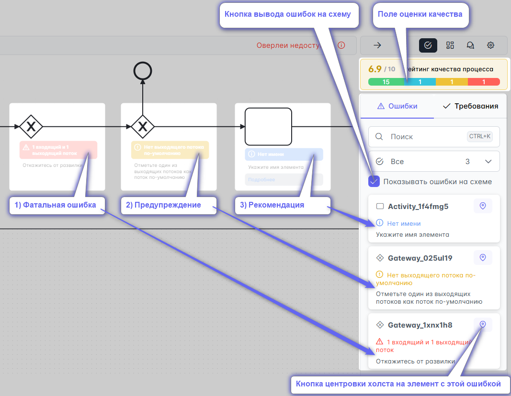
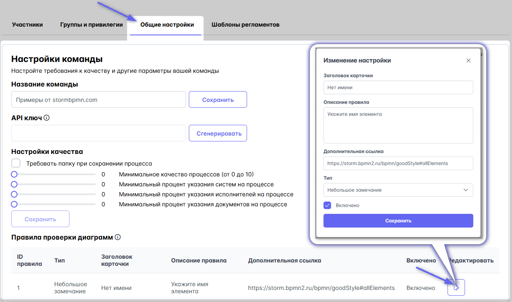
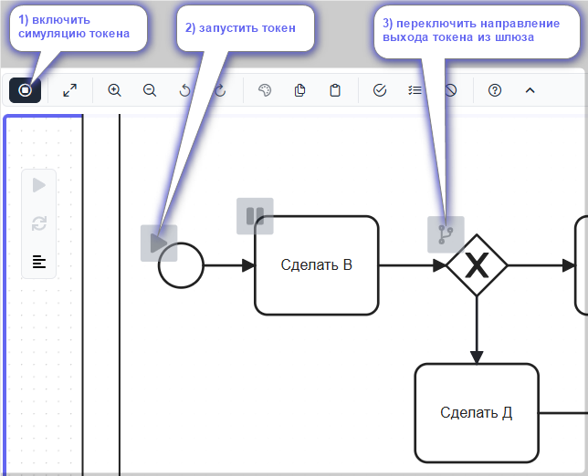
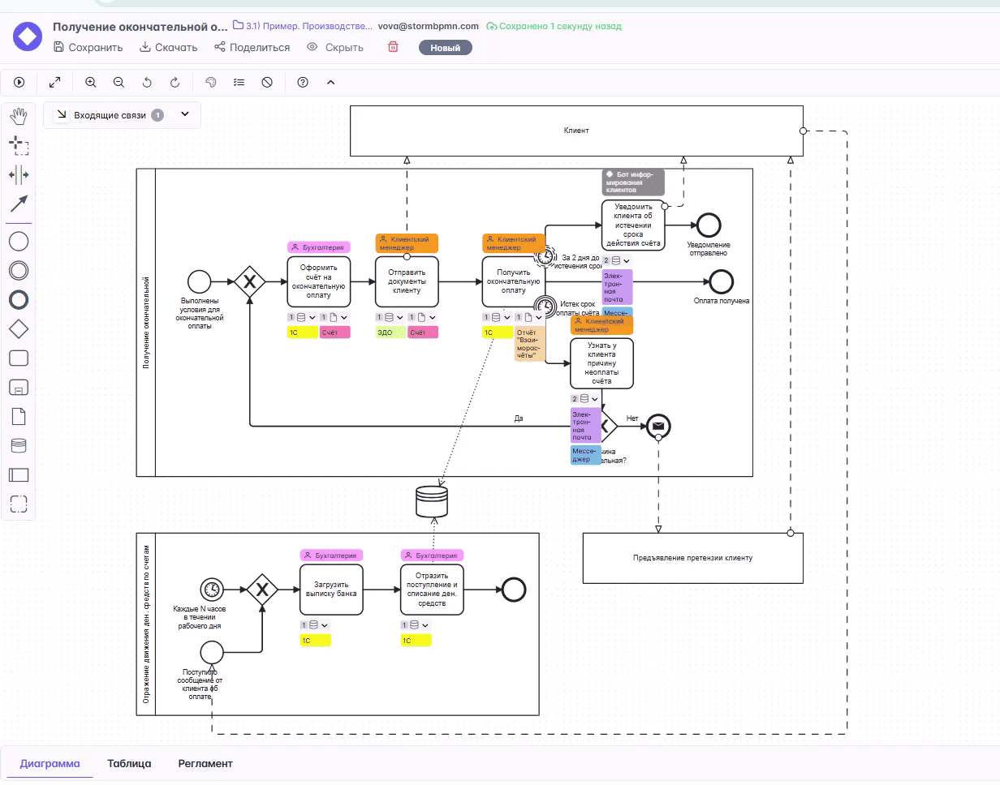

# Оценка качества

## Качество диаграмм BPMN
Система предоставляет мощные средства для управления качеством ваших диаграмм в BPMN, создаваемых по вашему соглашению о моделировании. \  
Качественные диаграммы гарантируют минимальное время на обсуждение формальных признаков описания и позволяют сразу переходить к сути.

Система предоставляет ~30 правил проверки BPMN, которые система проверяет автоматически при каждом сохранении.  \
__Включение__, отключение проверки осуществляется кнопкой в [верхнем меню](#верхнее-меню).

Выявленные ошибки бывают трех типов:
1) __Фатальная ошибка__ (_красного цвета_) - серьёзное нарушение BPMN, обязательно исправить.
2) __Предупреждение__ (_желтого цвета_)- лучше исправить
3) __Рекомендация__ (_стикер синего цвета_) - рекомендуем моделировать лучше

## Проверка ошибок
Доступна в правом меню на одноименной вкладке
У каждой ошибки есть кнопка, центрующая холст на элемент жиаграммы с этой ошибкой.

Для отображения подсказок обо всех ошибках на схеме установите галочку "Показывать ошибки на схеме"

## Настройка правил проверки

:::tip 
Данная функция работает только на тарифе TEAM и выше.
:::

Вы так же можете настроить трактовку каждого из правил уникальным образом для своей команды, а также:  
- Настроить минимальную среднюю оценку, которую требует ваша команда. При нарушении этого показателя члены команды постоянно будут видеть уведомление о низком качестве процессов.
- Указать минимальный процент указания (задействования) систем, ролей, документов на схеме.
- Включить или отключить; изменить заголовок, описание, важность, дополнительную ссылку для каждого из правил.  

Настраивается в разделе [команды](../team-work/README.md#прочие-настроики-команды).

## Симуляция токена
Вы так же можете выполнить проверку проходимости процесса __токеном__. Посмотрите это видео, если не знаете, что это такое:

<iframe width="560" height="315" src="https://www.youtube.com/embed/Gfx5atU3YDY?si=ARC0B7o3i9K1DCey" title="YouTube video player" frameborder="0" allow="accelerometer; autoplay; clipboard-write; encrypted-media; gyroscope; picture-in-picture; web-share" referrerpolicy="strict-origin-when-cross-origin" allowfullscreen></iframe>

Для включения симуляции токена:
1) нажмите кнопку включения симуляции токена
2) приблизьтесь к любому стартовому событию и нажмите на символ Play для запуска токена
3) используйте переключатель на шлюзах, чтобы вести токена по выбранному направлению:  

Видео с примером:

