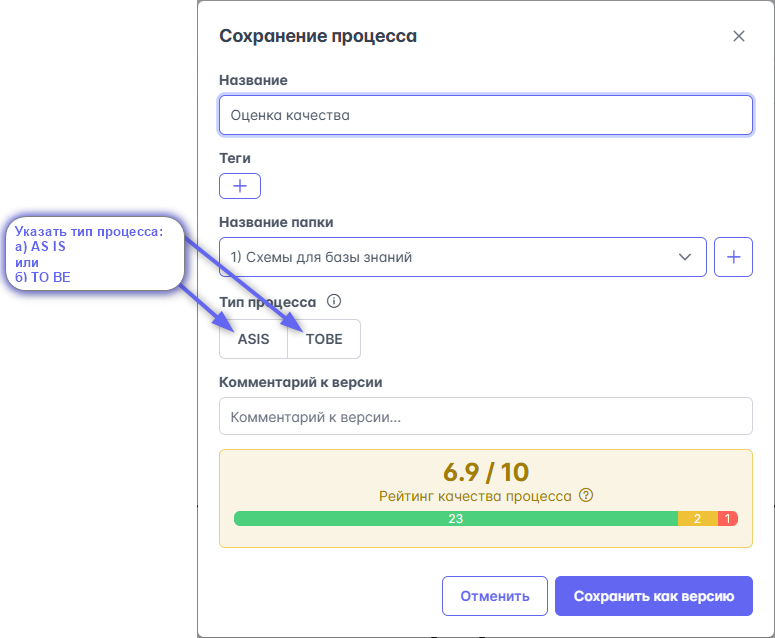
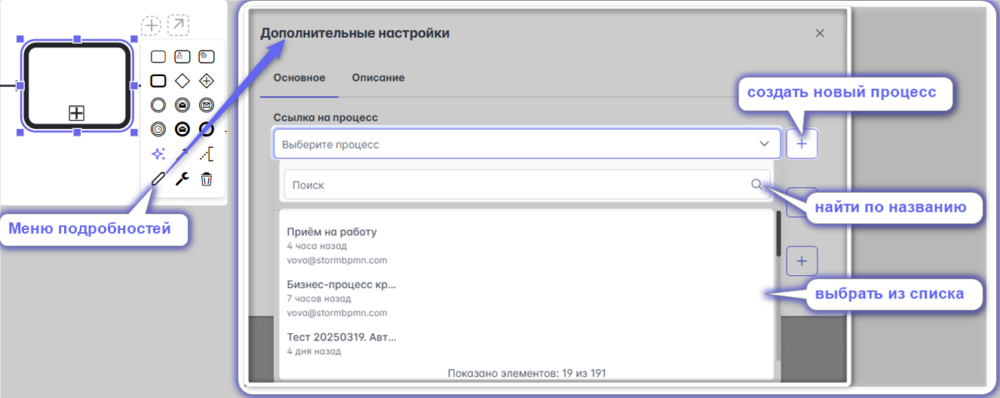
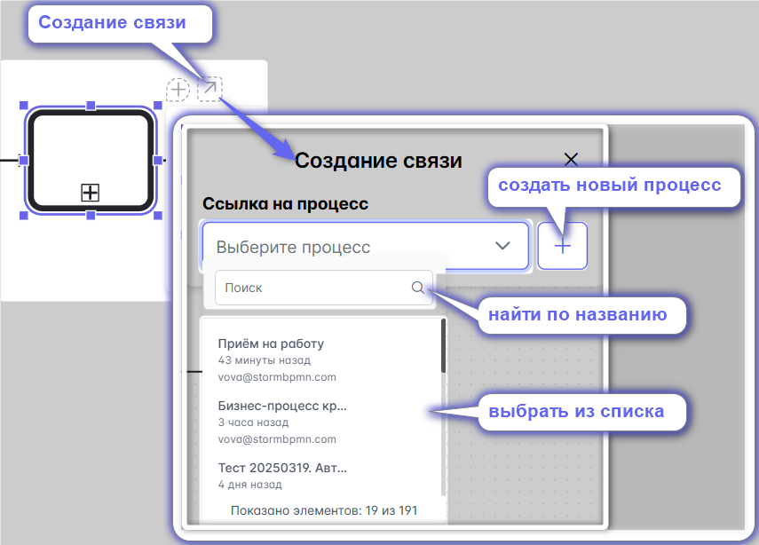
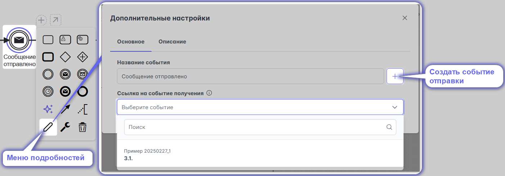
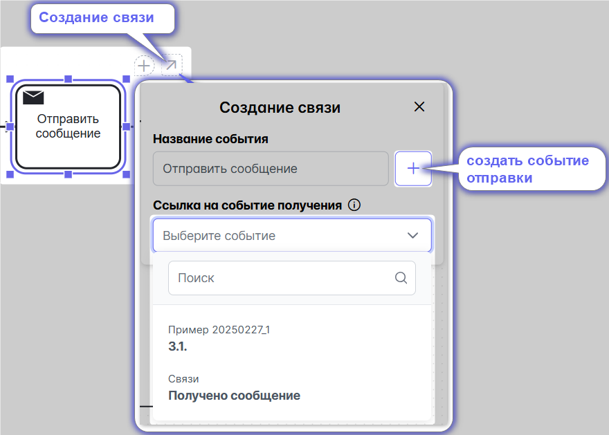
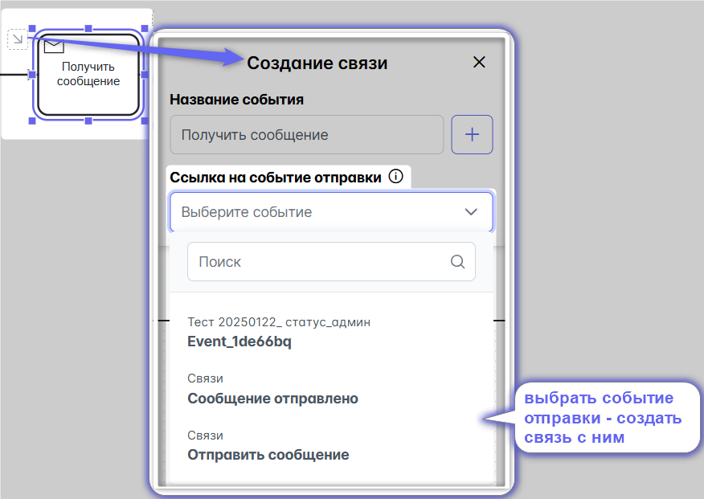
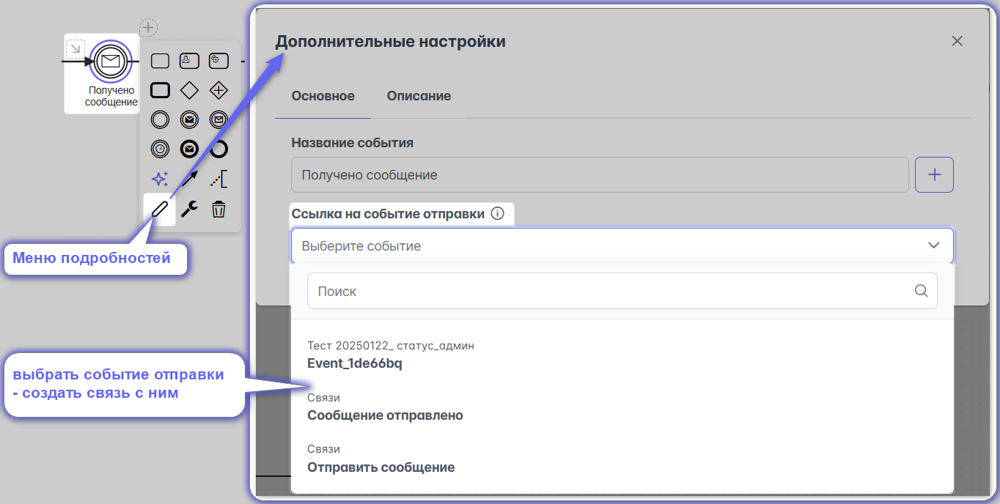

# Связь между диаграммами

## Cвязь между AS-IS и TO-BE

Для установления связи в [меню сохранения](#меню-сохранения) установить тип процесса и связанный процесс:  

::: tip
Советуем для начала хорошенько проработать модель AS-IS, тогда её можно будет дублировать и на базе дубля сделать TO-BE. Также это сделает возможным автоматическое сравнение схем (когда оно будет готово).
:::

## Связь процессов
Бизнес-процессы редко работают в одиночку. В целях декомпозиции и управляемости их часто разделяют на разные процессы, которые даже могут описываться разными людьми, департаментами, компаниями.

Система поддерживает возможность связи процессов друг с другом с целью удобной навигации и построения графов связности.

Просматривать связи можно через [меню оверлеев](#меню-оверлеев) или [правое меню](#правое-меню).

## Связь через вызов переиспользуемого подпроцесса (Call activity)
## Связь для свернутого пула (Empty pool)

Установить связь Call activity с диаграммой его "раскрытия" возможно двумя способами:
1) в [меню подробностей](/features_new_storm/1_bpmn-editor/#меню-подробностеи): создать, найти или выбрать из списка соответствующую связанную диаграмму процесса:

2) с помощью **призрачного оверлея "Создание связи:"**

**Для свернутого пула (Empty pool) создание связи аналогично**

## Связь через отправку, получение сообщения 
## Link Message Throw Event (Task), Message Catch Event (Task)

::: warning Напоминаем
Отправку сообщения можно обозначать как событием (Message Throw Event), так и задачей (Message Throw Task). Аналогично и получение сообщения может быть как событием (Message Catch Event), так и задачей (Message Catch Task). \
При этом, допустимо показать отправку событием, получение - задачей и наоборот, отправку - задачей, получение - событием
:::

Для установления связи между отправкой сообщения (Message Throw Event/Task) и его получением (Message Catch Event/Task) необходимо сперва создать одно из событий: отправки или получения.

Например, создать сперва отправку сообщения в [меню подробностей](/features_new_storm/1_bpmn-editor/#меню-подробностеи)

Аналогично отправку сообщения можно создать с помощью **призрачного оверлея "Создание связи:"**

После этого создать получение сообщения и связать с ним отправку:
- в [меню подробностей](/features_new_storm/1_bpmn-editor/#меню-подробностеи)

- с помощью **призрачного оверлея "Создание связи:"**

Допустимо делать и наоборот - сперва создать получения сообщения, а потом связать с ним отправку