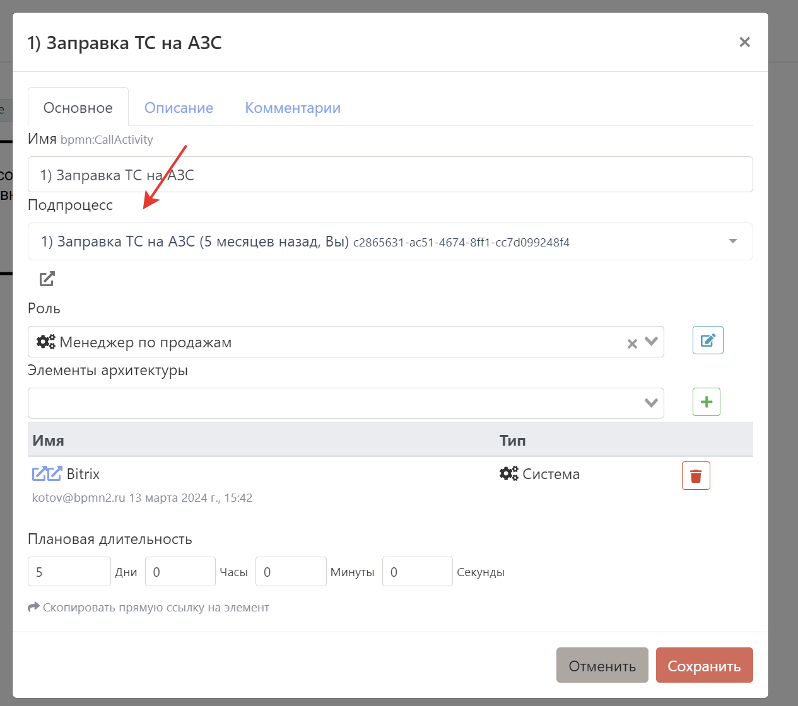
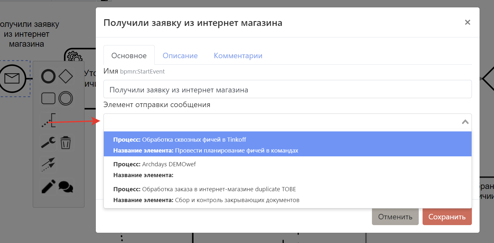

# Связь между диаграммами

## Cвязь между AS-IS и TO-BE

Для установления связи в [меню сохранения](#меню-сохранения) установить тип процесса и связанный процесс:  

::: tip
Советуем для начала хорошенько проработать модель AS-IS, тогда её можно будет дублировать и на базе дубля сделать TO-BE. Также это сделает возможным автоматическое сравнение схем (когда оно будет готово).
:::

:::danger В разработке

## Связь двух процессов
Бизнес-процессы редко работают в одиночку. В целях декомпозиции и управляемости их часто разделяют на разные процессы, которые даже могут описываться разными людьми, департаментами, компаниями.

Система поддерживает возможность связи процессов друг с другом с целью удобной навигации и построения графов связности.

Просматривать связи можно через [меню оверлеев](#меню-оверлеев) или [правое меню](#правое-меню).

### Связь через Call activity и Participant

Для установления связи через Call activity\Participant откройте [меню подробностей](#меню-подробностеи) и укажите соответствующий связанный бизнес-процесс:  

### Связь через Message Catch Events \ Message Catch Task

Для установления такой связи откройте [меню подробностей](#меню-подробностеи) и укажите соответствующий связанный элемент отправки сообщения:  

:::
