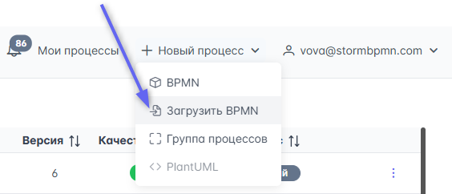
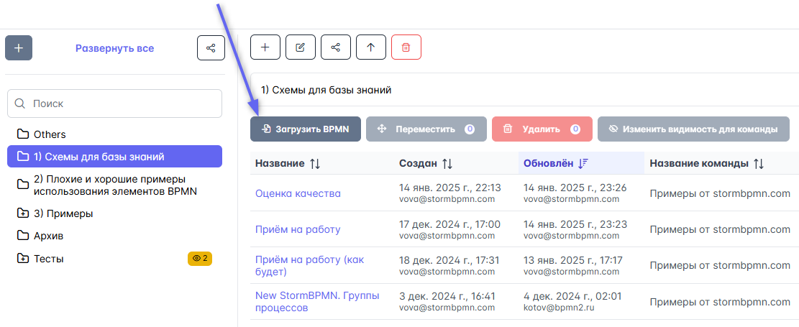

# Импорт диаграмм

Система поддерживает полноценный BPMN - это значит, что если система-источник производит XML-файл в спецификации BPMN, то Stormbpmn сможет его загрузить.

Загрузить можно диаграммы из ==Cawemo, Camunda Modeler, Bizagi Modeler== и так далее.

Загрузить диаграммы из ==Visio, Draw.io, Miro== __нельзя__.

Для загрузки нажмите кнопку в меню навигации:  

Для импорта в конкретную папку нажмите кнопку в меню папки:  

