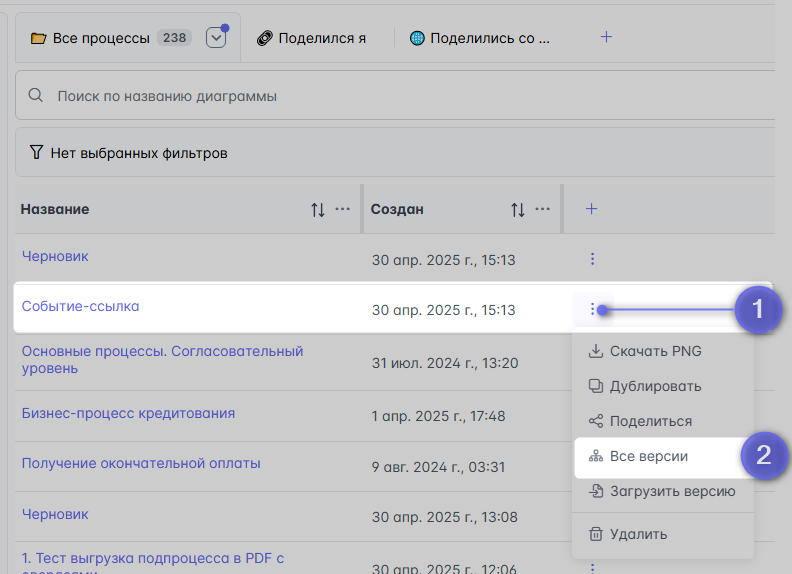
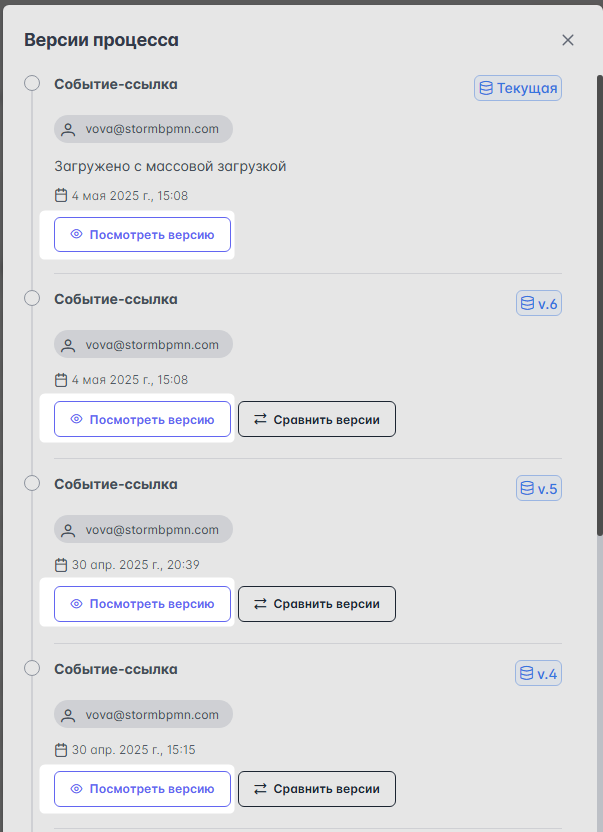
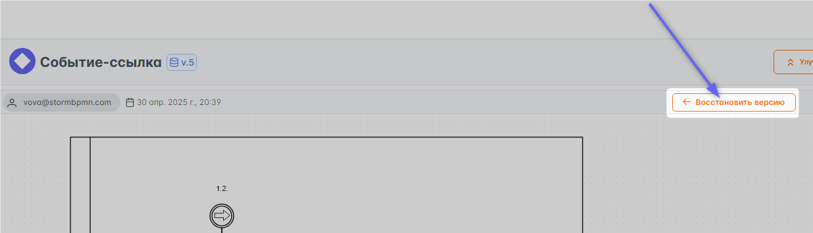
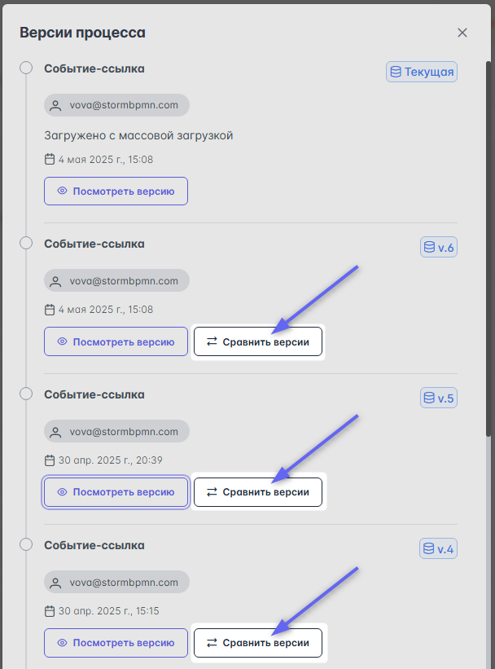

# Версионирование

Система автоматически создает версии диаграмм вот по таким поводам:

- Прошло больше 30 изменений диаграммы
- Кто-то (не владелец процесса и не пред.автор изменения) внёс изменения в диаграмму

Это позволяет **всегда** восстановить пред.версию и посмотреть разницу. Автор диаграммы получает e-mail уведомление, если в его диаграмме создали новую версию.
Также система сохраняет версии описания задач.  
## Просмотр версий процесса

1.  Если вы хотите вернуть версию процесса, то найдите на главной странице карточку процесса и нажмите в верхний правый угол, выберите "Все версии":

    

2.  В открывшемся списке версий выберете интересующую версию и нажмите **посмотреть версию**:

    

## Восстановление процесса из предыдущей версии
В просматриваемой версии нажмите **"Восстановить"**: \
    

## Видео с примером просмотра версии, восстановление схемы из версии:

ВК-видео: 
<iframe src="https://vkvideo.ru/video_ext.php?oid=-227313390&id=456239167&hd=2&autoplay=1" width="853" height="480" allow="autoplay; encrypted-media; fullscreen; picture-in-picture; screen-wake-lock;" frameborder="0" allowfullscreen></iframe>

Youtube: 
<iframe width="560" height="315" src="https://www.youtube.com/embed/s3X7z3WttIs" frameborder="0" allow="autoplay; encrypted-media" allowfullscreen></iframe>

## Сравнение версий
Сравнение версий изменений текущей версии относительно выбранной предыдущей:
    