---
dir:
  order: 2
  text: "Редактор BPMN"
  link: true
  index: true
  icon: null
collapsible: true
collapsed: false
order: 2
---

# Бизнес-процессы в BPMN

Наш редактор BPMN имеет несколько меню для удобства работы с BPMN диаграммами.  
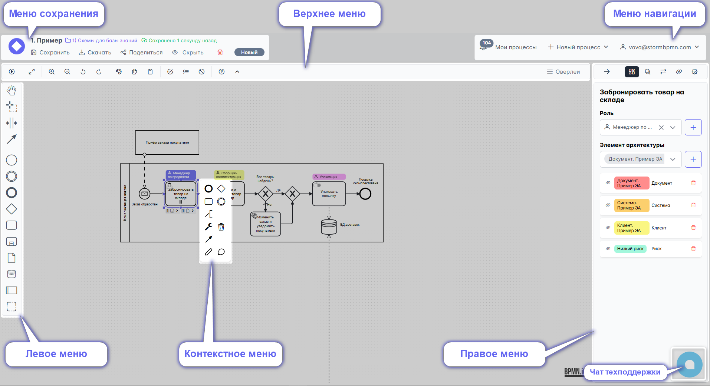

**Описание всех меню**

## Сервисное меню

О нём рассказано в описании [главной](/features_new_storm/0_home-page/service_menu.html) страницы

## Меню действий

В этом меню возможно:
-   1)  Вернуться на главную страницу (Мои процессы);

- Увидеть:

   2)  название диаграммы;
   3)  название папки в которой хранится диаграмма;
   4)  кто сохранил эту версию диаграммы;
   5)  дату и время версии;
   6)  сравнительный вид диаграммы: As Is или To Be
   12) статус диаграммы (новая, в работе, на согласовании, готова, архив);

- Выполнить действия:

   7)  вызвать меню сохранения;
   8)  вызвать меню выгрузки: в регламент (docx) или графический файл (png, svg, pdf);
   9)  вызвать меню предоставления доступа другому пользователю Шторма или любому человеку
   10) скрыть диаграмму от всех
   11) удалить диаграмму
   12) изменить статус

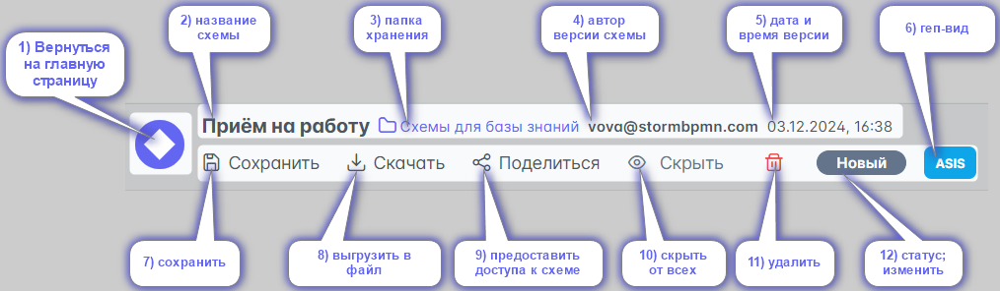

### Сохранение диаграммы

В этом меню вы можете:

1) Дать, изменить название диаграммы
2) Добавить [теги](/team-work/7_folders.html)
3) Указать [папку](/team-work/7_folders.html)
4) Указать сравнительный вид диаграммы (AS-IS / TO-BE) и связать со вторым процессом для [сравнения](#сравнение-as-is-и-to-be)
5) Оставить комментарий к текущей версии
6) Увидеть [качество] вашей диаграммы

::: tip
При сохранении создаётся [версия](/features_new_storm/1_bpmn-editor/2_versioning.html), к которой можно откатиться или выполнить сравнение
:::

В этом же меню можно сохранить **чужую диаграмму**, к которой вы не имеете доступа на редактирование, в свои диаграммы.

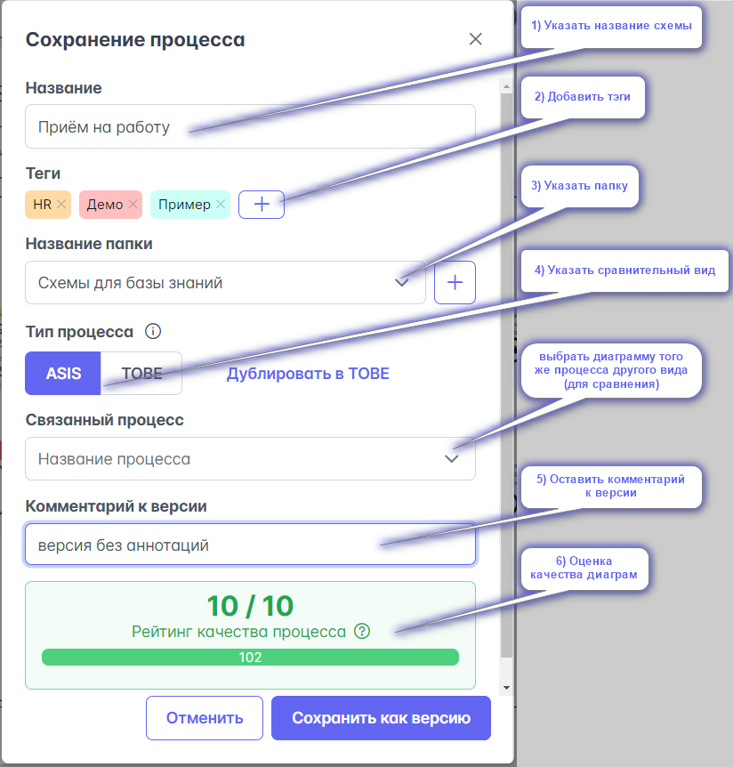

### Скачать (экспорт SVG, PNG, PDF, BPMN и .DOCX)

В меню Скачать процесс есть 2 вкладки:  
А. ***Файлы***  
Б. ***Регламенты***

На вкладке ***Файлы*** можно скачать диаграмму 
- как картинку (SVG, PNG);
- машиночитаемый файл XML (BPMN);
- как документ с оверлеями (PDF).

.png)

:::tip
Для сохранения картинки с [оверлеями](#меню-оверлеев) используйте скачивание в PDF
:::

На вкладке ***Регламенты*** доступно:
1) загрузка своего шаблона регламента;
2) выбрать шаблон из списка загруженных;
3) выгрузить в шаги процесса только задачи (убрать события, развилки и другие объекты диаграммы процесса)
4) [скачать регламент процесса](/team-work/6_reglaments/process_reglament.html) по базовому шаблону;
5) [скачать регламент](/team-work/6_reglaments/process_reglament.html) по своему выбранному шаблону

 .png)

### Поделиться диаграммой

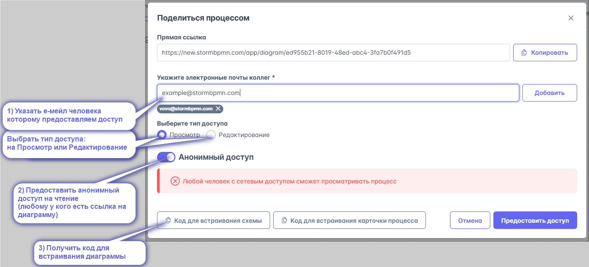

В этом меню можно предоставить/отозвать доступ на диаграмму:

**1)** Конкретному человеку по e-mail с указанием прав (просматривать/редактировать)
**2)** Анонимно (не требует учетной записи в системе)
::: tip
Используйте этот способ, если хотите поделиться процессом не заставляя регистрироваться в системе. Включите галочку анонимный доступ.
:::
::: warning
Такое предоставление доступа не делает получателя участником вашей команды. Оно потребляет лимит 5 бесплатных доступов на тарифе Personal.
При превышении этого лимита появится ошибка \
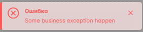 \
Чтобы поделиться другой схемой возможны 2 варианта: \
а) удалить один из ранее предоставленных доступов. \
б) [Улучшить тариф до Team](https://stormbpmn.com/app/plan/upgrade) c бесконечным количеством доступов и возможностью работать командой 
::: 
Больше о [командной работе и возможностях на Team тарифе](/team-work/)

При выдаче доступа человек получит уведомление по почте с предложением зарегистрироваться (если не было учетной записи в системе) или с тем, что ему предоставлен доступ (если учетная запись была). \
Все диаграммы, которыми когда либо делились с этим человеком, доступы ему на главной странице в таблице \
 **Поделились со мной** \
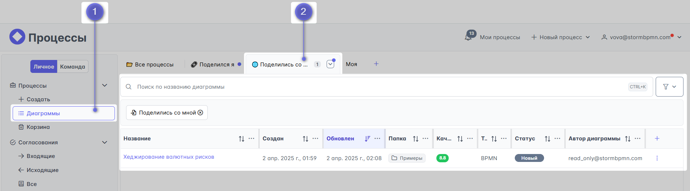

Просмотр и удаление доступов, которые выдали Вы, возможно в таблице **Поделился я**. \
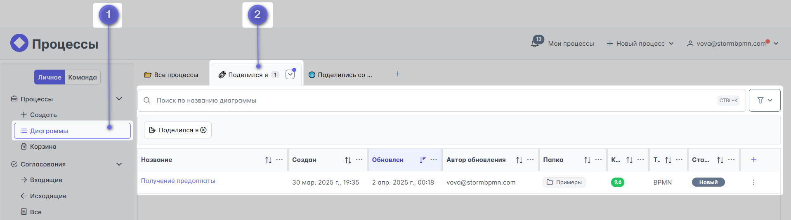

**3)** Получить iframe-код для встраивания диаграммы в Wiki-системы _(типа Confluence)_. 
В Wiki-системе ваша диаграмма будет выглядеть так:
<iframe src="https://new.stormbpmn.com/app/diagram/ed955b21-8019-48ed-abc4-3fa7b0f491d5?embedded=true" style="border:1px #f2f2f2 none;" name="extAdmin" scrolling="yes" frameborder="1"  height="400" width="100%" allowfullscreen></iframe>

**4)** Предоставить доступ к диаграмме для работников организации (только в ENTERPRISE-версии)

### Сменить статус

Для информирования коллег о состоянии работы над процессом можно использовать статусы:

- **Новый** - процесс ещё не трогали, просто создали
- **В работе** - над процессом активно идёт работа
- **Согласование** - диаграмму процесса согласуем с кем-то, менять диаграмму **нельзя**. Подробнее в [согласованиях](/features_new_storm/1_bpmn-editor/2_appruval.html)
- **Готов** - процесс готов к работе, менять схему нельзя
- **Архив** - процесс в архиве

  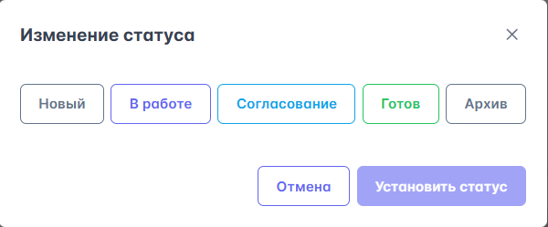

### Тип диаграммы: AS-IS и TO-BE

Если в [меню сохранения](#меню-сохранения) вы указали тип процесса и связанный процесс, то появится возможность быстро перемещаться между версиями AS-IS и TO-BE, нажав на кнопку верхнего меню с типом диаграммы

::: danger Ещё в разработке
А также визуально [сравнить их](#сравнение-as-is-и-to-be).
:::

## Левое меню

Левое меню предназначено для выбора элементов BPMN, управления ими и обеспечения удобства использования редактора.

::: warning Не все элементы
В левом меню находятся не все разновидности элементов BPMN, но это не значит, что их нет в системе :) Выбор типа (маркера) элемента производится в контекстном меню нажатием на кнопку .
:::

Советуем обратить внимание на кнопки, обеспечивающие удобство работы:

Для понимания того, в какие элементы можно превратить значки, нужно разбираться в [BPMN](/bpmn/), т.к. сервис старается защитить вас от ошибок и не дать использовать элементы, которые невозможны по нотации.

## Верхнее меню

Верхнее меню предназначено для работы с конкретной диаграммой и предоставляет возможности:  

1. Включить симулятор токена.
2. Развернуть диаграмму на полный экран.
3. включить, отключить миникарту
4. Приблизить.
5. Отдалить.
6. Отменить последнее действие.
7. Вернуть отмененное действие.
8. Сменить цвет выбранным элементам.
9. Скопировать выделенные элементы для вставки между вкладками.
10. Вставить выделенные элементы в другую схему.
11. Включить [проверку ошибок](/features_new_storm/1_bpmn-editor/2_bpmn_scoring.html).
12. Выполнить автонумерацию элементов.
13. Очистить автонумерацию.
14. Открыть справку по верхнему меню, горячим клавишам и элементам [BPMN](https://new.stormbpmn.com/bpmn/elements) с примерами.
15. Скрыть шапку: меню действий и меню навигации.
16. Раскрыть [меню оверлеев](#меню-оверлеев).

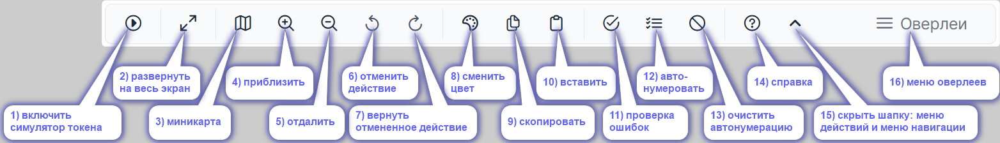

## Контекстное меню

Контекстное меню открывается при клике на элемент и предоставляет следующие возможности в зависимости от того, на какой элемент вы кликнули:  

1. Выбрать и нарисовать следующий элемент.
2. Нарисовать следующий шаг процесса с [помощью искуственного интелекта](/features_new_storm/1_bpmn-editor/2_ai.html)
3. Открыть [меню подробностей](#меню-подробностеи) - _для создания связей, управления [ролями](/team-work/4_assignees.html) и [элементами архитектуры](/team-work/5_elements-architecture/), описанием подробностей задачи, планового времени выполнения, внешней ссылки._
4. Изменить тип (маркер) элемента
5. Соеденить текущий элемент с другим.
6. Написать примечание, текстовую аннотацию к элементу
7. Удалить элемент.

 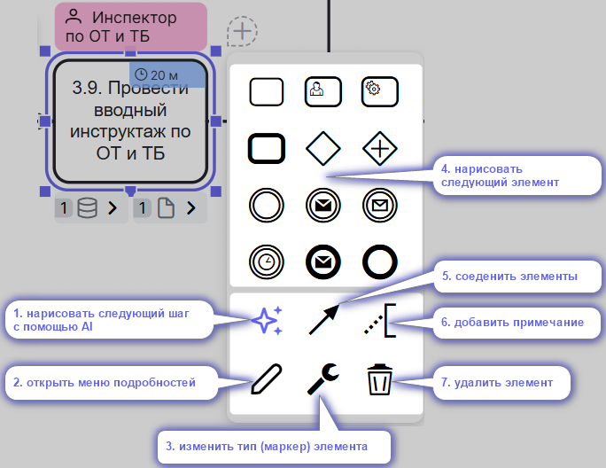

## Меню подробностей

В этом меню доступны функции:
1) Просмотра, изменения названия элемента _(кроме примечаний)_
2) Создать, установить, снять [роль](/team-work/4_assignees.html) (_только для задач_) - _назначить роль на задачу_
3) Создать, установить, снять [элементы архитектуры](/team-work/5_elements-architecture/) (_только для задач_)- _связать элемент архитектуры с задачей_
 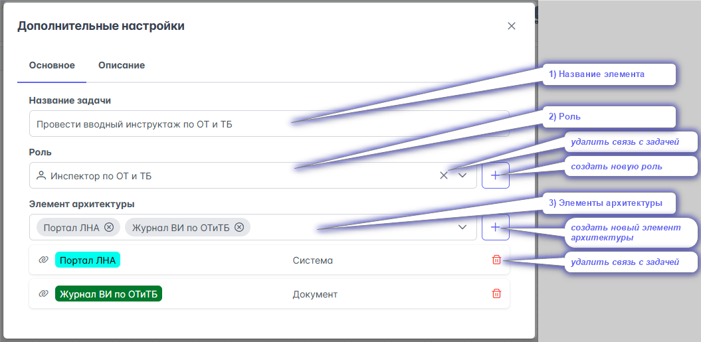
4) Создать, удалить [связь для Call activity или свернутого пула](/features_new_storm/1_bpmn-editor/2_connection_diagram.html#связь-через-вызов-переиспользуемого-подпроцесса-call-activity)
5) Создать, удалить [отправку сообщения](/features_new_storm/1_bpmn-editor/2_connection_diagram.html#связь-через-отправку-получение-сообщения) _(Throw Event)_ и [Связывание события получения сообщения с его отправкой](/features_new_storm/1_bpmn-editor/2_connection_diagram.html#связь-через-отправку-получение-сообщения) _(Catch Event)_
6) Внести, отредактировать Описание элемента
7) Указать [плановую длительность](features_new_storm/1_bpmn-editor/2_bpmn_calc_duration.html)
8) Внешнюю ссылку

 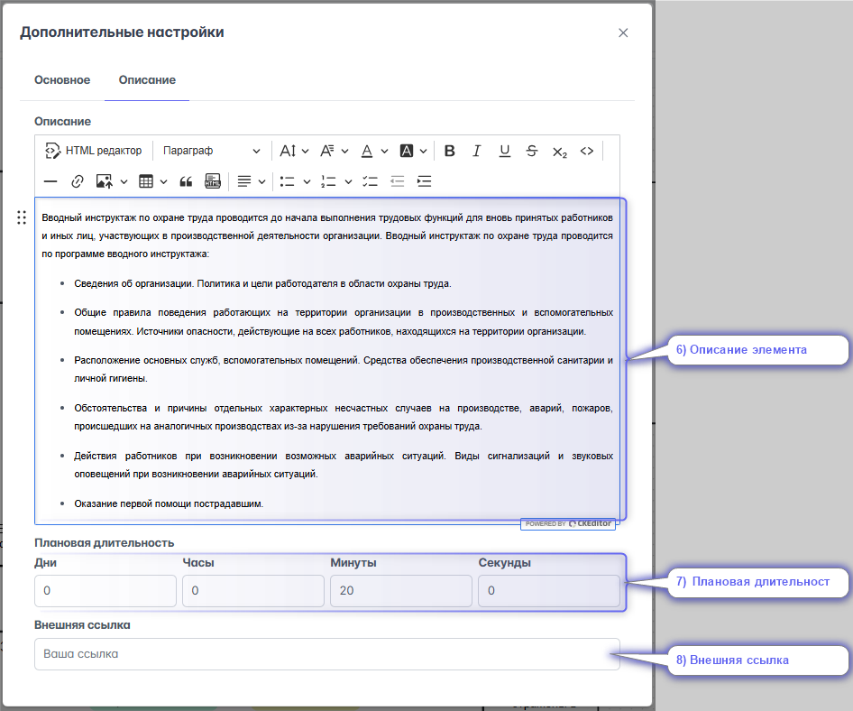

## Меню оверлеев

### отображение оверлеев на схеме, разворачивание их списка

Одним из ключевых удобств системы является возможность быстро и удобно включать и выключать отображение информации на диаграмме.
Меню оверлеев предоставляет возможность:

1) Показать на схеме оверлеи:
- [ролей](/team-work/4_assignees.html)
- должностей _(первой должности в [оргструктуре](/team-work/3_org-chart-editor.html), назначенной на роль)_
- систем _(один из типов [элементов архитектуры](/team-work/5_elements-architecture/))_
- документов _(один из типов [элементов архитектуры](/team-work/5_elements-architecture/))_
2) Развернуть список оверлеев Системы, Документы
_(по умолчанию они свёрнуты в группу)_
3) Отобразить оверлеи
- описания
- [комментариев](#комментирование)
4) Показать длительность
5) Отобразить связи с другими диаграммами:
- [связи](/features_new_storm/1_bpmn-editor/2_connection_diagram.html#связь-процессов) (исходящие) 
- [связи](/features_new_storm/1_bpmn-editor/2_connection_diagram.html#связь-процессов) (входящие)
6) Включить оверлеи кастомных [элементов архитектуры](/team-work/5_elements-architecture/)
7) Развернуть список оверлеев всех кастомных ЭА
8) использовать горячие клавиши для отображения оверлеев и разворачивания их списков

 

::: tip
Включенные оверлеи автоматически вставляются в ссылку, которой вы делитесь с коллегами! Заказчикам ничего дополнительного нажимать не надо.
А еще, если вы включали оверлеи в настройках пользователя (Профиль -> настройки) то на диаграммах вашего авторства они будут отображаться автоматически, даже ссылку делать не надо будет.
:::

## Меню представлений

Описание процесса в системе можно посмотреть сразу в нескольких представлениях, в зависимости от ваших задач.

- __В виде схемы BPMN__ - подходит для анализа последовательности процесса
- __В виде таблицы__ - подходит для уточнения задач, исполнителей, используемых систем и документов
::: danger Ещё в разработке
- __В виде регламента__ - подходит для последовательного изучения всей информации о процессе
:::

### Схема

### Табличное представление
Табличное представление выводит информацию о:
 - Названии задачи
 - Пуле, в котором расположена задача
 - Роль, исполняющая задачу
 - Должности, привязанные к роли
 - Системы, используемые в задаче
 - Документы, используемые в задаче
 - Описание задачи

 Это представление даёт возможность скачать таблицу в .xls и осуществить поиск по содержимому. Например, если написать __кладовщик__, то система выдаст только те задачи, где упоминается это слово в любом из столбцов.  
 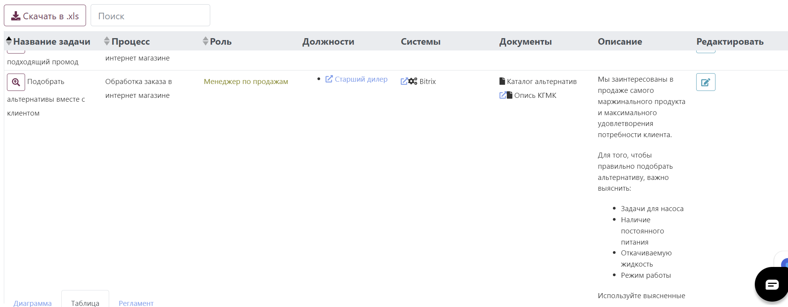

::: danger Ещё в разработке
### Представление в виде регламента
Это представление позволяет просмотреть на процесс последовательно, со всех сторон и предоставляет возможности:
1. Просмотреть и ввести общее описание.
 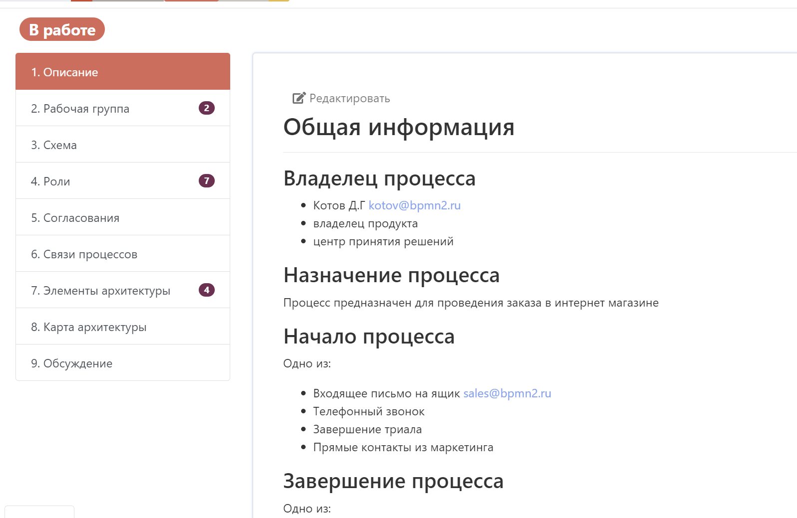
2. Указать состав рабочей группы: владельцев, спонсоров и т.д.
3. Посмотреть на схему.
4. Посмотреть и отредактировать описание задач в разрезе ролей
 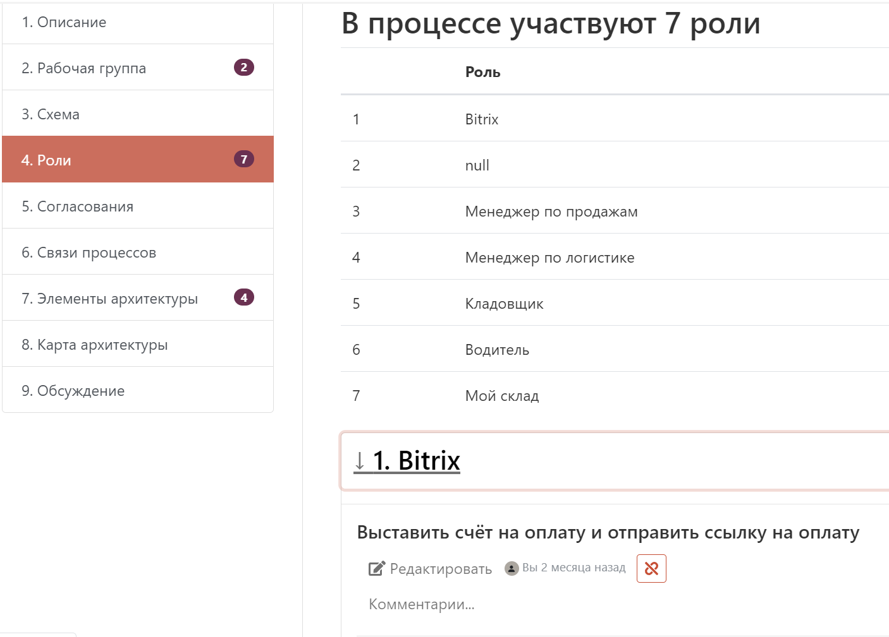
5. Историю согласований.
6. Связь процессов, потребителей и поставщиков процесса.
7. Используемые элементы архитектуры.
8. Карту архитектуры относительно процесса.
9. Все комментарии процесса.
:::

## Правое меню

Правое меню даёт дополнительные возможности работы с диаграммой:
1) [оценка качества](/features_new_storm/1_bpmn-editor/2_bpmn_scoring.html)
2) отправить диаграмму на [согласование](/features_new_storm/1_bpmn-editor/2_appruval.html), просмотреть кому отправлено и результат
3) создать, установить, снять [роль](/team-work/4_assignees.html) и все [элементы архитектуры](/team-work/5_elements-architecture/) для каждого элемента диаграммы;
4) показать [комментарии](/features_new_storm/8_comments.html) к диаграмме и отдельным её элементам;
::: danger Ещё в разработке
5) сравнить текущую [версию](/features_new_storm/1_bpmn-editor/2_versioning.html) диаграммы с предыдущими
6) отобразить [связи](/features_new_storm/1_bpmn-editor/2_connection_diagram.html#связь-процессов) диаграммы с другими диаграммами, событиями, задачамив 
7) вывести панель упраления Camunda
:::

**Цвет активной вкладки тёмный.**

### - панель управления Camunda
::: danger В разработке
:::

## Обеспечение удобства работы
### Горячие клавиши

Редактор поддерживает работу с горячими клавишами, что сильно ускоряет работу при моделировании процессов:

- **F2** - изменить название выбранного элемента
- **F3** или **ctrl + f** - открыть меню поиска элементов
- **F5** или **ctrl + F5** - обновить страницу браузера
- **F11** - перейти в полноэкранный режим
- **ctrl + z** - отменить последнее действие
- **ctrl +shift + z** или **ctrl + y** - вернуть отмененное действие
- **ctrl + a** - выделить всё
- **ctrl + scroll** - изменение масштаба
- **scroll** - перемещение по вертикали
- **shift + scroll** - перемещение по горизонтали
- **ctrl + click** - выделять элементы по одному в группу
- **shift + click** - выбрать элементы группой
- **alt + 1...8** - включить отображение соответствующих оверлеев
- **alt + shift + 3, 4** - изменить свёрнутость списка оверлеев Системы, Документы
- **alt + a** - включить отображение всех оверлеев
- **alt + sift + a** - изменить свёрнутость списка всех оверлеев
