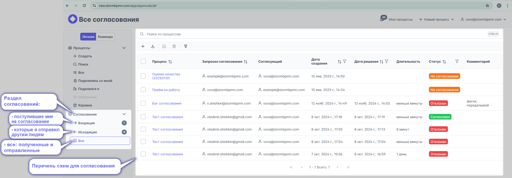
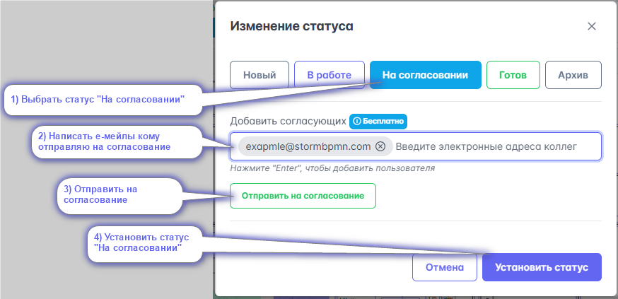
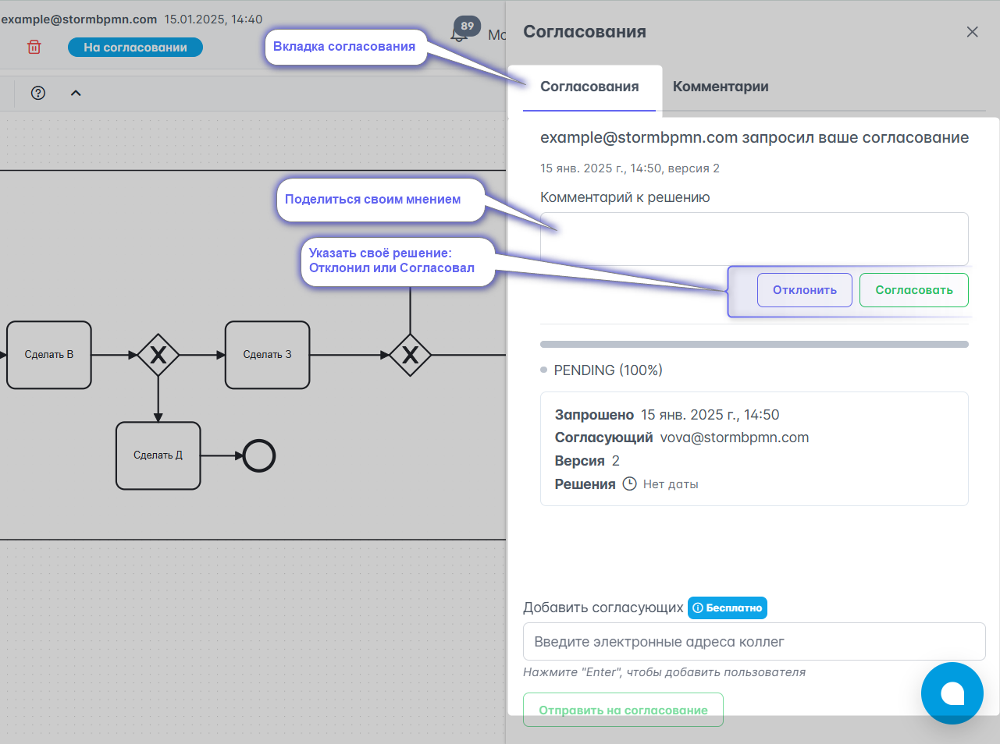
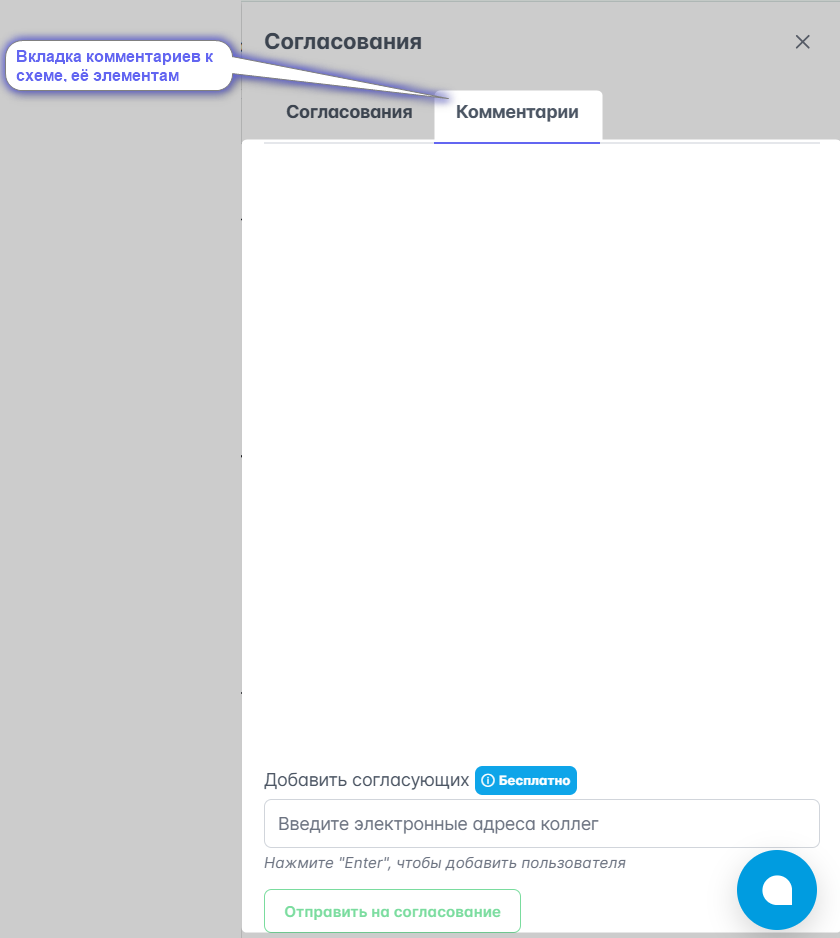

# Согласование

Система позволяет __согласовывать процессы__ с любыми пользователями системы - т.е. получить и зафиксировать мнение человека о вашем процессе.

::: important
Согласующему необязательно быть участником команды, вы можете отправить согласование на любой e-mail - человек получит соответствующее уведомление. **Согласования бесплатны.**
::: 

## Просмотр согласований

Для просмотра согласований на главной странице есть соответствующий раздел:  

## Отправка на согласование
Для отправки процесса на согласование
1) смените ему статус на __на согласовании__ ;
2) укажите e-mail согласующих (_в конце ввода е-мейла нажмите клавишу Enter_);
3) нажмите __отправить на согласование__
4) сохраните изменение статуса
:::warning
Если дополнительно отправляете ещё кому-то схему уже находящуюся в статусе  схема уже в статусе __на согласовании__, то пункты 1 и 4 можно не выполнять
:::

:::warning Внимание
После отправки схемы на согласование диаграмму нельзя будет редактировать или менять её статус, пока не будут получены результаты по ВСЕМ отправленным запросам на согласование.
::: tip

Советуем снабдить ваше первое согласование вот [такой ссылкой](https://www.youtube.com/watch?v=tKGegGh15oc&ab_channel=BPMN2ru), людям будет сильно проще разобраться в системе и они быстрее нажмут все кнопки для согласования. 

<iframe width="560" height="315" src="https://www.youtube.com/embed/tKGegGh15oc?si=pam4af5M82dYhPKw" frameborder="0" allow="autoplay; encrypted-media" allowfullscreen></iframe>

:::

## Выполнение согласования
После получения ссылки и авторизации в системе, согласующий увидит такое меню и сможет поделиться своим мнением:

Во вкладке **комментарии** согласующий сможет оставить комментарии. Для оставления комментария к конкретному элементу достаточно на него нажать.

:::warning
По-умолчанию отображаются согласования только по последней версии. Нажмите "Посмотреть историю", если хотите посмотреть предыдущие согласования.
:::

## Удаление согласования
Если согласование перестало быть актуальным, то автор согласования может удалить запрошенное согласование, пока по нему ещЁ не высказались. Для этого нажмите на __мусорную корзину__ в левом нижем углу.