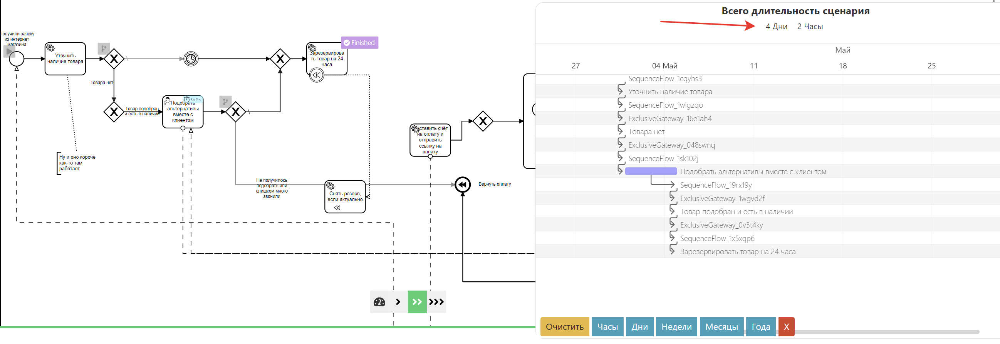

# Расчёт длительности сценария

:::danger В разработке

Если вы указывали [длительность в задачах](#меню-подробностеи), то система может посчитать время, за которое выполнится конкретный проход токена при симуляции токена, указав самые длительные операции:

:::