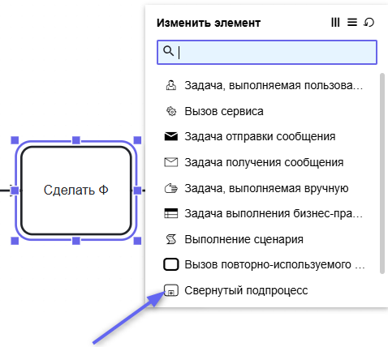
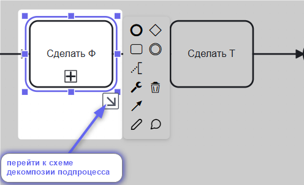
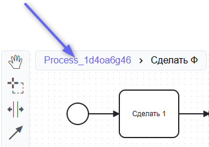

# Декомпозиция, Подпроцесс

Еще один вариант декомпозиции - использование Subprocess. В этом случае вы получаете возможность на одном листе проваливаться в подпроцессы.

## Как использовать Подпроцесс (Subprocess)

1. Установите с помощью контексного меню тип активности "Свернутый подпроцесс":

2. Нажмите на значок перехода к схеме декомпозии подпроцесса:   

3. Вернитесь на уровень выше при необходимости:  

::: warning
По нотации BPMN Свернутый подпроцесс (subrocess) является непосредственной частью текущей схемы, поэтому переиспользовать его в других диаграммах (или даже в этой 2 раза) нельзя. Это не ярлык, а средство декомпозии. Такие связи не будут участвовать в графе связности.
:::
