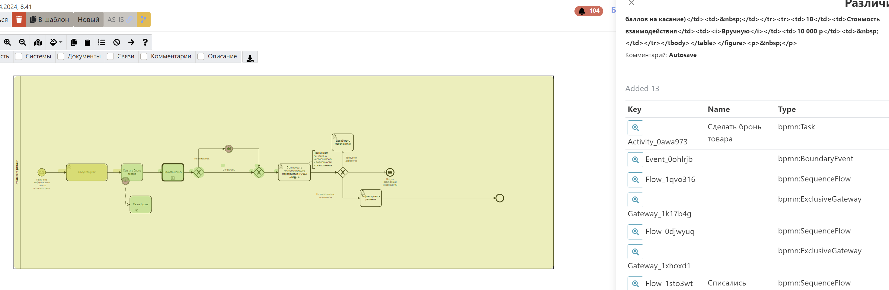

# Версионирование

:::danger В разработке

Система автоматически создает версии диаграмм вот по таким поводам:

- Прошло больше 30 изменений диаграммы
- Кто-то (не владелец процесса и не пред.автор изменения) внёс изменения в диаграмму

Это позволяет **всегда** восстановить пред.версию и посмотреть разницу. Автор диаграммы получает e-mail уведомление, если в его диаграмме создали новую версию.
Также система сохраняет версии описания задач.  
## Как вернуть версию процесса

1.  Если вы хотите вернуть версию процесса, то найдите на главной странице карточку процесса и нажмите в верхний правый угол, выберите "Все версии":
    
2.  Выберете интересующую версию и нажмите **посмотреть версию**.
3.  В открывшемся окне нажмите **"установить как текущую"**.

## Сравнение версий
Сравнение версий доступно в двух вариантах:
1. __Вычисление изменений текущей версии относительно старой__ - включается через [правое меню](#правое-меню):
    
2. __Просто сравнение со старой версией__ - включается через меню и нажатие кнопки __сравнить__:
 

:::