# Редактор групп процессов

::: warning

Группы процессов работают только на тарифах TEAM и выше.

:::

::: danger
Функционал недавно выпущен и может содержать ошибки. Сообщайте о любых ошибках в чат в приложении, мы оперативно их устраним.
:::

Группы процессов – это отличная возможность моделировать процессы сверху-вниз. Вы можете смотреть на группы процессов как на простую иерархию, бизнес-возможности (Business Capability) или бизнес-функции.

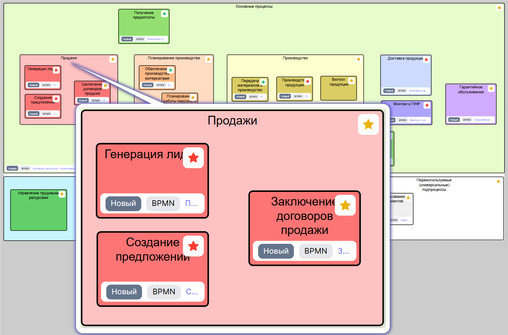

::: tip
Вложенность групп не ограничена, но по практике лучше не использовать больше 3-4 уровней, а сложные структуры проектировать через вложенность диаграммы групп в диаграммы групп.
:::

## Создание группы процессов

Создать группу процессов можно из меню [навигации](0_home-page.html#меню-навигации):
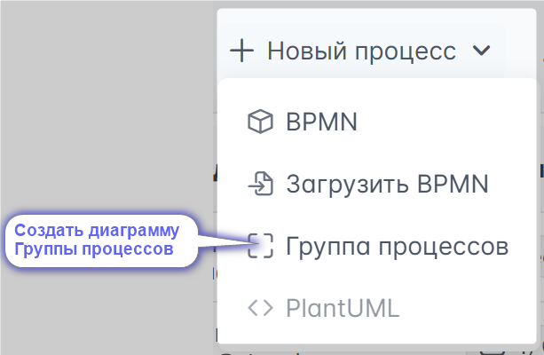

::: tip

Групп процессов может быть сколько угодно! Это значит, что вы можете формировать разные иерархии для разных целей. И этими группами можно так же [делиться по ссылке](#поделиться-диаграммои). А ещё работают [комментарии](#комментирование).
:::

## Редактор Группы процессов
Наш редактор имеет несколько меню для удобства работы с диаграммами Групп процессов.  
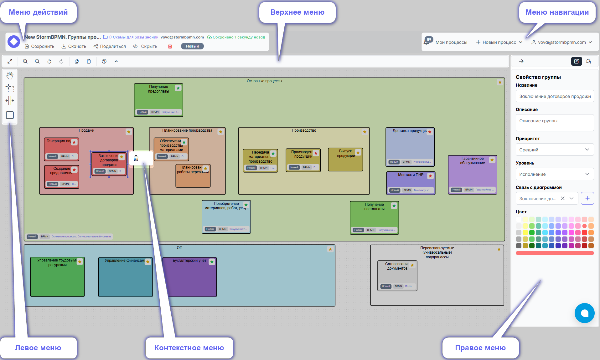

## Описание всех меню

### Меню действий
Аналогично меню действий редактора [BPMN](1_bpmn-editor.html#меню-деиствии)

### Меню навигации
О нём рассказано в описании [главной](0_home-page.html#меню-навигации) страницы

### Верхнее меню

Верхнее меню предназначено для работы с конкретной диаграммой и предоставляет возможности:  

1. Развернуть диаграмму на полный экран.
2. Приблизить.
3. Отдалить.
4. Отменить последнее действие.
5. Вернуть отмененное действие.
6. Скопировать выделенные элементы для вставки между вкладками.
7. Вставить выделенные элементы в другую схему.
8. Открыть справку по верхнему меню и горячим клавишам.
9. Скрыть шапку: меню действий и меню навигации.

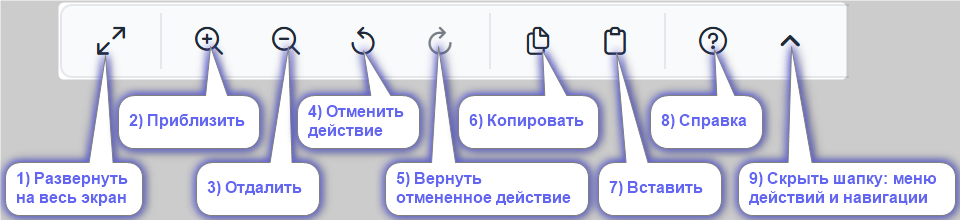

### Левое меню

Левое меню предоставляет следующие возможности
1. Переместить рабочее пространство
2. Выделить несколько элементов, обведя их
3. Изменить размеры элементов, пространства по вертикали или горизонтали
4. Добавить элемент "Группа" на диаграмму

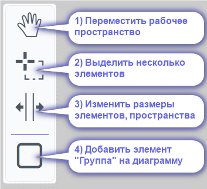

### Контекстное меню
В этом меню доступна функция удаления элемента. Она также выполняется нажатием клавиши  Delete.

### Правое меню

Правое меню позволяет:
1. Ввести название группы процессов (*вверху прямоугольника группы на диаграмме*)
2. Дать её описание
3. Установить приоритет:
   - низкий (*в группе отображен звездой зеленого цвета*);
   - средний (*жёлтая звезда*);
   - высокий (*красная звезда*)
4. Выбрать уровень:
   - стратегия;
   - контроль;
   - исполнение
5. Создать новую диаграмму, указав её название и тип, и связать её с группой
6. Выбрать, найти уже существующую диаграмму и связать её с группой 
7. Установить цвет группы

В группе (*в нижней части прямоугольника*) отображается информация о связанной диаграмме: \
а) статус \
б) тип \
в) название

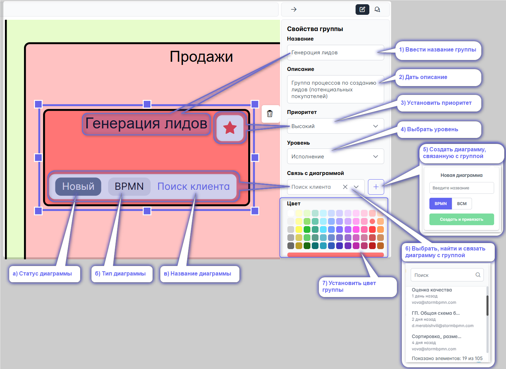

## Как работать с группами

1. Добавьте группу в пространство диаграммы (*при необходимости измените её размер*):

   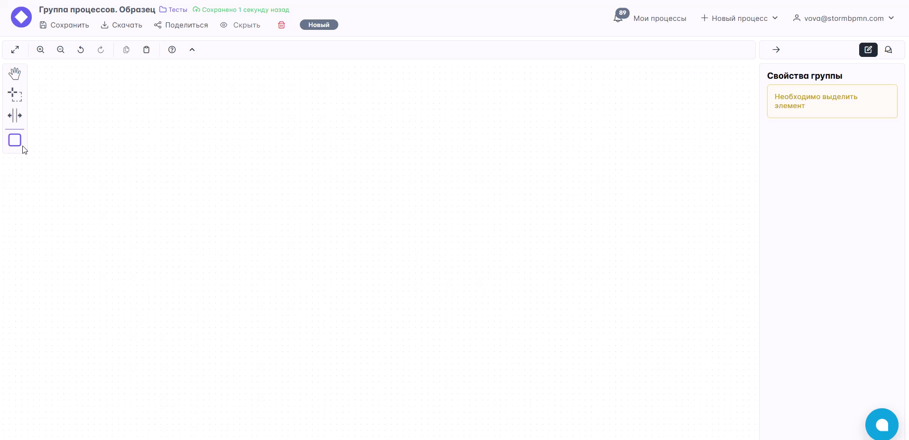

2. Двойным кликом на группу провалитесь в поле названия группы и внесите его название. \
   Или внесите название в правом меню: 

   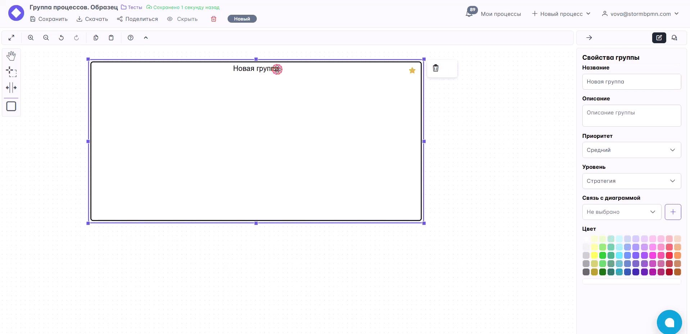

3. В правом меню укажите информацию о группе:
   - Описание
   - Приоритет
   - Уровень
   - Цвет

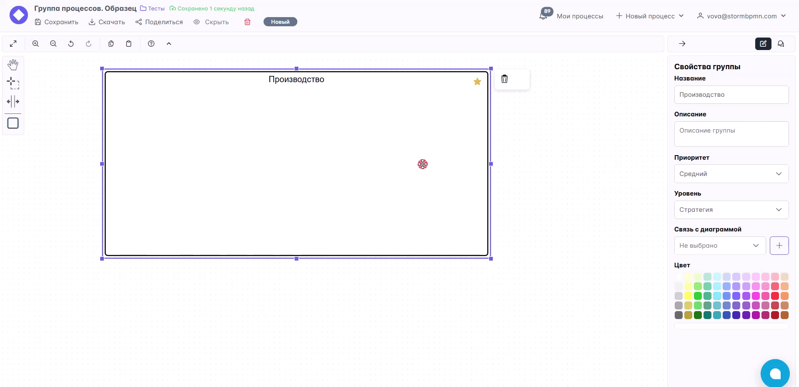

4. Укажите связь группы с реализацией. Тут 2 возможности:
   - **Создать новую** - создастся "заглушка" процесса (если выбрать BPMN) или группы процессов (если выбрать BCM). Отличная возможность приступить к реализации позднее или раздать задачи бизнес-аналиткам для моделирования. 

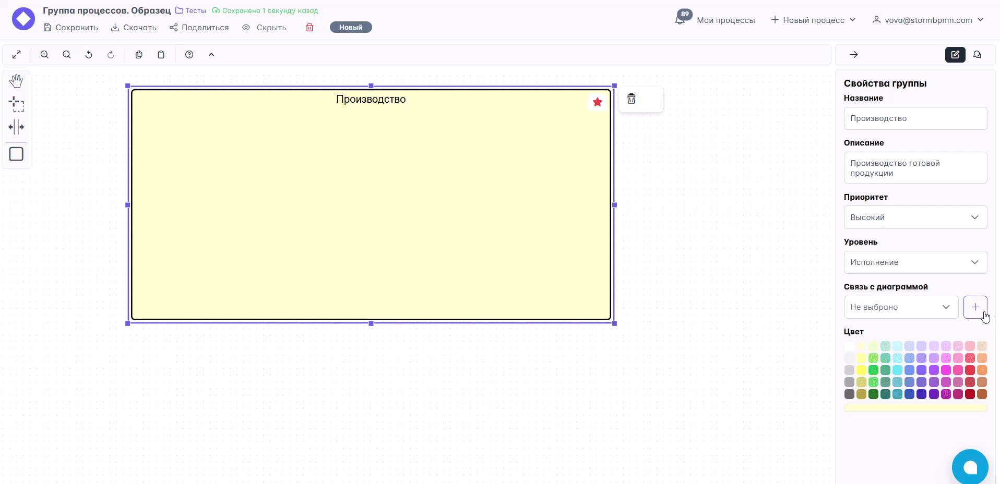

   - **Существующая схема** - позволяет выбрать уже существующую реализацию процесса или группы процессов. Отлично подойдет, если вы из существующих процессов формируете иерархию. 

   **Существующая схема может быть привязана к любому количеству групп**. 

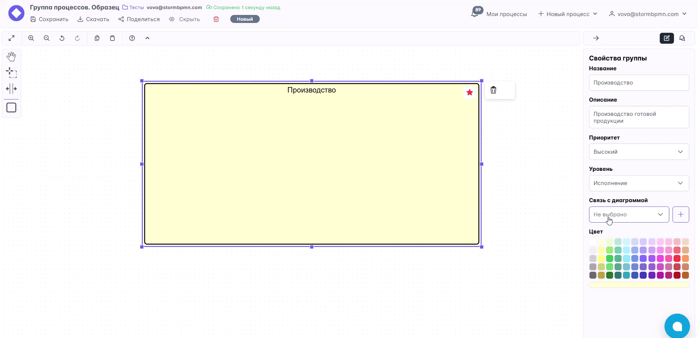

::: tip
Привязка реализации позволяет отслеживать статус работы над реализацией и визуализировать ваш процесс по моделированию всей иерархии!

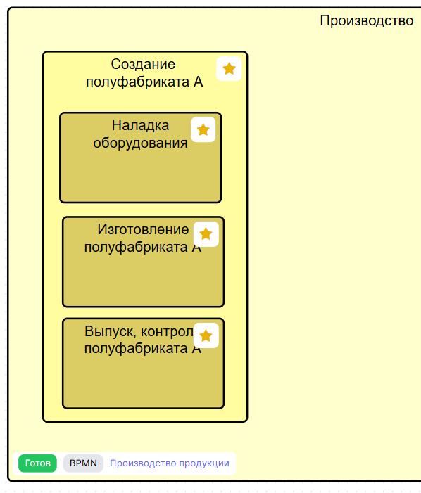
::: 

5. Формируйте группы и перемещайте их друг в друга, чтобы отобразить иерархию, вложенность.

## Горячие клавиши

Редактор групп поддерживает горячие клавиши:

- **CTRL+Z** - отменить последнее действие
- **CTRL+Y** или **CTRL+SHIFT+Z** - повторить отмененное действие
- **CTRL+C** - скопировать группу (без дочерних)
- **CTRL+V** - вставить группу
- **DEL** - удалить группу с дочерними
- **CTRL+SCROLL** - изменение масштаба
- **SCROLL** - перемещение по вертикали
- **SHIFT+SCROLL** - перемещение по горизонтали
- **SHIFT+CLICK** - выделять элементы по одному или обводя их лассо

