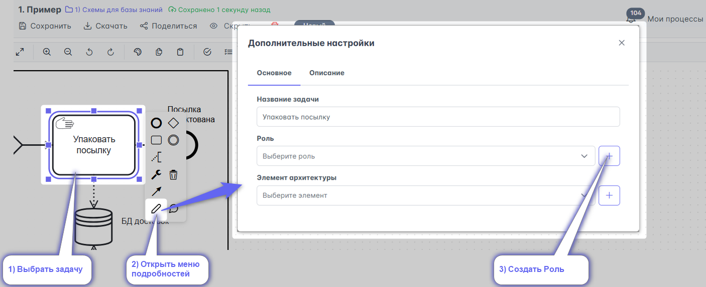
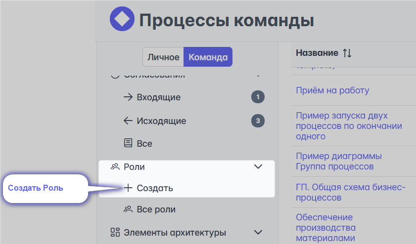

# New Шторм. Роли

Роли это отличный инструмент для указания исполнителей задач. Под ролью понимается исполнитель конкретной задачи в процессе или процессах (т.к. Роли - это справочник, который можно переиспользовать). Роли это правильная и хорошая альтернатива дорожкам.

Роль - это испольнитель задачи. Роль это не должность.
1 задача = 1 роль = N (несколько) должностей. 
Одну роль может выполнять несколько должностей. Например, роль "Инициатор закупки товаров для нужд компании". Её может выполнять несколько должностей в одной компании: офис-менеджер, бухгалтер, заведующий хозяйством, администратор
А может и одна должность выполнять несколько ролей. Например, директор компании может выполнять роль, исполняющую административные задачи, а также роль, выполняющую юридические задачи, функции ведения бухгалтерского учёта, кадровую работу и т.д

<iframe width="560" height="315" src="https://www.youtube.com/embed/_2W10c0YzcI?si=Br3u2STg2zdWwIQ8" frameborder="0" allow="autoplay; encrypted-media" allowfullscreen></iframe>

## Создание ролей

::: warning
Создавать роли может только **администратор команды**. Роли - это часть платной подписки TEAM или Enterprise. Без подписки использовать их не получится.
:::

### С интерфейса процесса в [правом меню](#правое-меню):

1) Встаньте на задачу
2) Нажмите "+" Роль

Откроется
#### меню редактирования роли

1) Впишите название роли
2) Выберите тип роли
3) Внесите стоимость работы в час
4) Выберите цвет оверлея роли
5) Сохраните роль

__Видео с примером__ \

\
\
\

### С интерфейса процесса в [меню подробностей](#меню-подробностей):

1) Встаньте на задачу
2) Откройте меню подробностей
3) Нажмите "+" Роль
4) откроется [меню редактирования роли](#меню-редактирования-роли)

### В левом меню главной страницы
Или по [ссылке](https://new.stormbpmn.com/app/team/assignees):  

Откроется [меню редактирования роли](#меню-редактирования-роли)

::: danger В разработке
### C помощью загрузки из .csv (разделитель - запятая, кодировка UTF8):

По [ссылке](https://new.stormbpmn.com/app/team):  

:::

## Редактирование ролей

Редактирование ролей доступно
- в интерфейсе процесса 

Откроется [меню редактирования роли](#меню-редактирования-роли)

- в справочнике ролей, по [ссылке](https://new.stormbpmn.com/app/team/assignees)

Откроется [меню редактирования роли](#меню-редактирования-роли)

## Удаление ролей

Удалять роли можно только в справочнике ролей, по [ссылке](https://stormbpmn.com/app/team/assignees/).

:::warning
Удалить роли не получится, пока они привязаны к задачам на процессах. Отвяжите их перед удалением.
:::