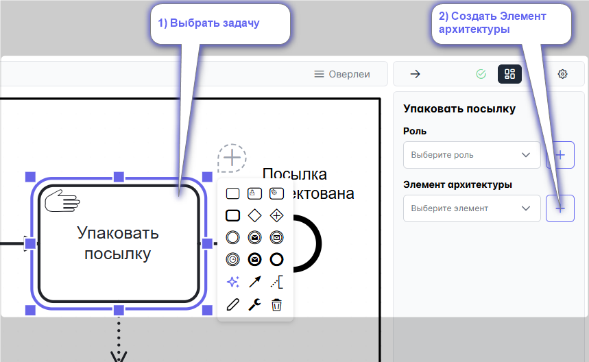
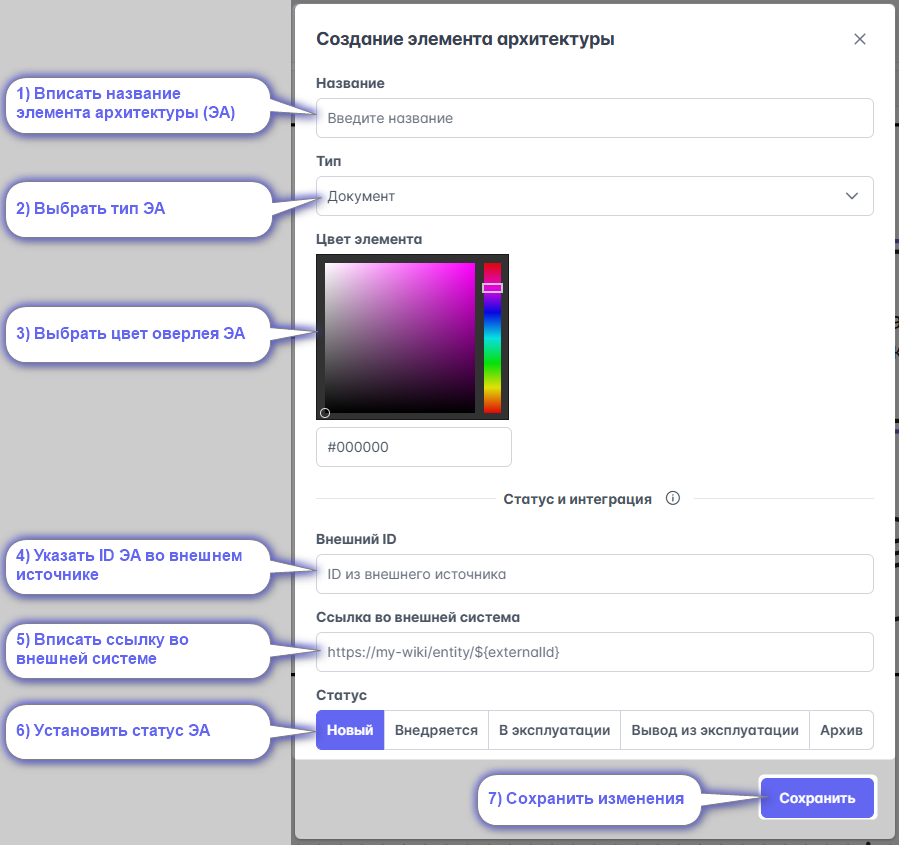
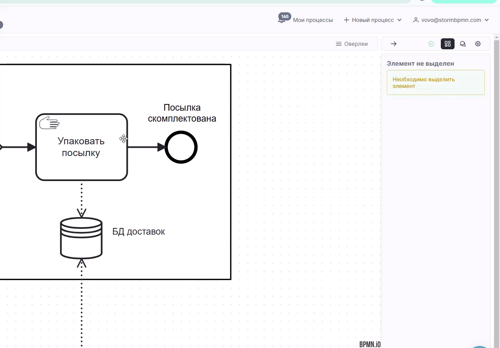
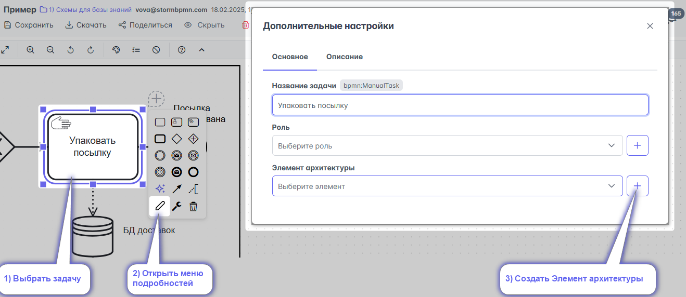
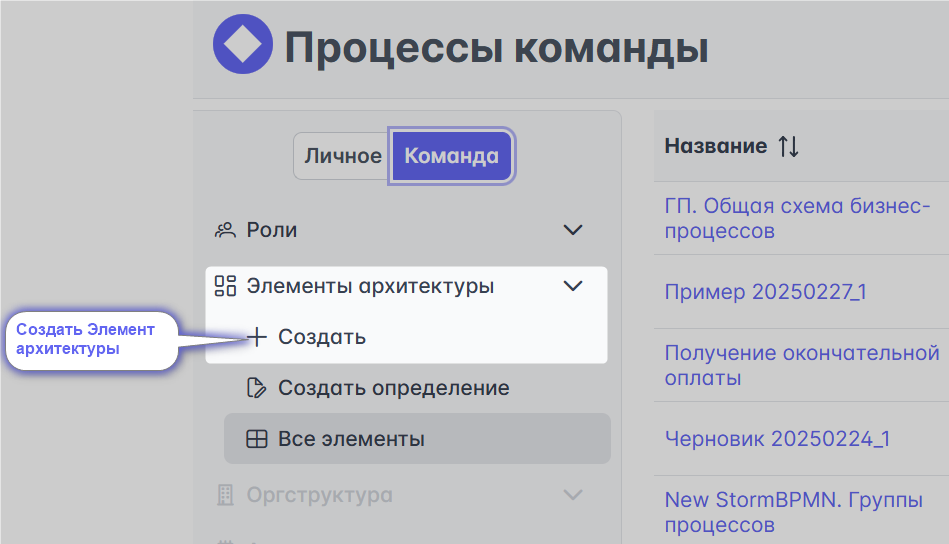
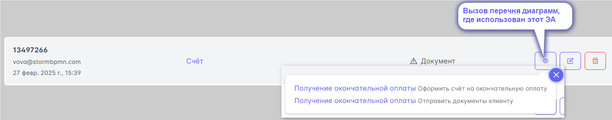

# Элементы архитектуры

Элементы архитектуры предназначены для указания ресурсов и объектов, используемых для выполнения задачи.  

Элементы архитектуры являются обогащённой альтернативой таким элементам BPMN, как объект данных и артефакты. 
Они позволяют не перегружать диаграмму, а включение их отображения раскрывает информацию о процессе и улучшает его понимание.
::: tip
Элементы архитектуры образуют справочник. Созданные Элементы можно использовать в нескольких диаграммах.
:::

Основные их типы:
- **Система** - программное обеспечение, используемое для выполнения пользовательской или сервисной задачи;
- **Документ** - артефакт, содержащий контекст бизнес-процесса;
- **Коммуникация** - отражает способ, канал коммуникации;
- **Действие** - используют для типизации действий, абстрактных задач и ручных операций.
Дополнительные типы: клиент; сущность; прочее.
::: warning
На схеме оверлеями отображаются только два основных элемента архитектуры: Система и Документ
:::

## Создание элемента архитектуры

::: warning
Создавать Элементы архитектуры  может **администратор команды** или участник, наделенный им соответствующим правом. Элементы архитектуры - это часть платной подписки TEAM или Enterprise. Без подписки их использование невозможно.
:::

При создании Элемента архитектуры можно указать:
- **Внешний ID** - идентификатор элемента в другой системе. Будет полезно, если вы загружаете элементы из других систем.
- **Ссылка во внешней системе** - ссылка на внешнюю систему. Будет красиво отображаться, если заполнена. Поддерживается плейсхолдер.
- **Статус** - отображет информацию о том, в каком состоянии находится Элемент архитектуры.
- **Цвет** - используется в оверлеях.

### С интерфейса процесса в [правом меню](/features/1_bpmn-editor.md#правое-меню)

1) Встаньте на задачу
2) Нажмите "+" Роль

Откроется
### меню редактирования элемента архитектуры

1) Впишите название элемента архитектуры (ЭА)
2) Выберите тип ЭА
3) Выберите цвет оверлея для отображения ЭА на схеме
4) Укажите ID элемента архитектуры во внешнем источнике
5) Впишите ссылку на ЭА во внешней системе
6) Установите статус ЭА
7) Сохраните ЭА

__Видео с примером создания элемента архитектуры__ \

\
\
\

### С интерфейса процесса в [меню подробностей](#меню-подробностей):

1) Встаньте на задачу
2) Откройте меню подробностей
3) Нажмите "+" Элемент архитектуры
4) откроется [меню редактирования элемента архитектуры](#меню-редактирования-элемента-архитектуры)

### В левом меню главной страницы
Или по [ссылке](https://new.stormbpmn.com/app/team/assets):  

Откроется [меню редактирования элемента архитектуры](#меню-редактирования-элемента-архитектуры)

### C помощью загрузки из .csv
::: danger В разработке

Разделитель - запятая, кодировка - UTF8.
По [ссылке](https://new.stormbpmn.com/app/team):  
:::

### C помощью [REST API](/enterprise/rest-api.html#загрузка-и-или-обновление-элементов-архитектуры)

## Редактирование Элементов архитектуры

Редактирование Элементов архитектуры доступно
- в интерфейсе процесса 

Откроется [меню редактирования элемента архитектуры](#меню-редактирования-элемента-архитектуры)

- в справочнике 'элементов архитектуры', по [ссылке](https://new.stormbpmn.com/app/team/assets)

Откроется [меню редактирования элемента архитектуры](#меню-редактирования-элемента-архитектуры)

## Удаление Элементов архитектуры

Удалить Элемент архитектуры можно только в справочнике ролей, по [ссылке](https://newstormbpmn.com/app/team/assets).

:::danger
Если Элемент архитектуры использован в диаграмме, то система не позволит его удалить /n

Тут же можно просмотреть перечень диаграмм в которых он использован. 

Отвяжите его перед удалением.
:::

## Кастомные элементы архитектуры

Система позволяет вводить свои типы элементов архитектуры. Типичной практикой является создание своих справочников:
- Метрик
- Функциональных разрывов
- Проектов
- Рисков
- Типа операций
- Оборудования
и т.д.

Это отличный способ описывать те аспекты процессов, которые интересуют именно вашу организацию.

### Создание определений элементов архитектуры

По ссылке [https://new.stormbpmn.com/app/team/assets](https://new.stormbpmn.com/app/team/assets)

 1) Нажмите **Определение элементов**:

 2) Выберите иконку, которая будет использоваться в оверлееях.
 3) Впишите название типа для справочника.
 Код автоматически создаст система - он используется в API и при генерации документов.
 4) Дайте описание: характеристики, для чего предназначен и т.д..
 5) Выберите к чему может быть применим справочник:
 - процесс и задача;
 - процесс;
 - задача.
 6) сохраните внесенные данные

 ### Создание элемента по кастомному справочнику
 Не откличается от создания типового элемента архитектуре. /n
 При выборе типа ЭА, выберите свой кастомный тип:

 

 ### Использование в практике
 Не отличается от использования типовых ЭА.
