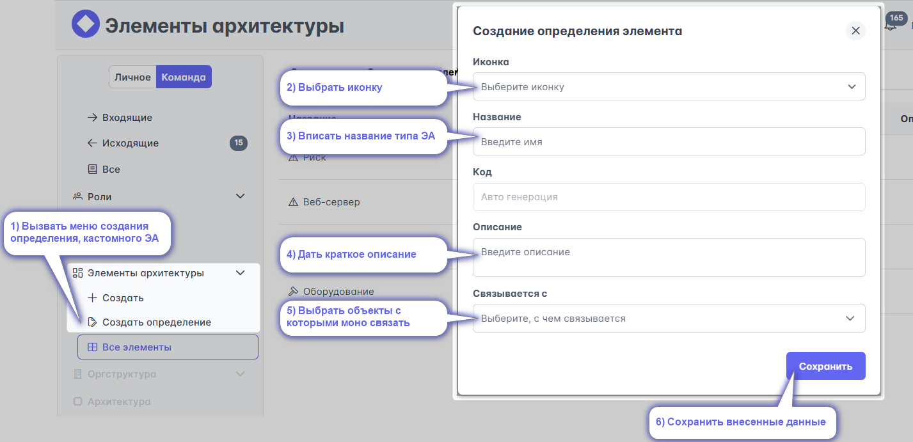
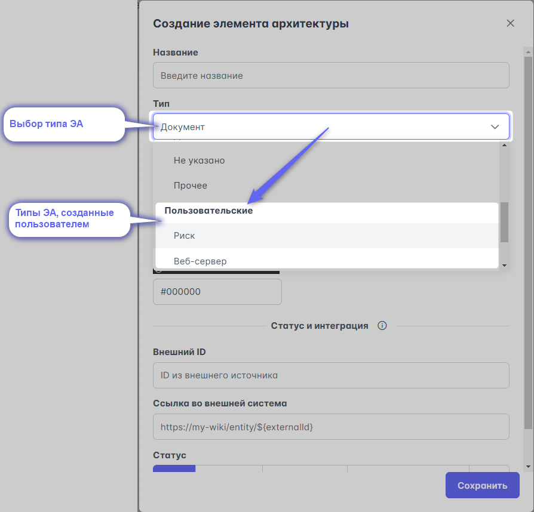

# Кастомные ЭА

# Собственные элементы архитектуры

## Кастомные элементы архитектуры

Система позволяет вводить свои типы элементов архитектуры. Типичной практикой является создание своих справочников:
- Метрик
- Функциональных разрывов
- Проектов
- Рисков
- Типа операций
- Оборудования
и т.д.

Это отличный способ описывать те аспекты процессов, которые интересуют именно вашу организацию.

### Создание определений элементов архитектуры

По ссылке [https://new.stormbpmn.com/app/team/assets](https://new.stormbpmn.com/app/team/assets)

 1) Нажмите **Определение элементов**:

 2) Выберите иконку, которая будет использоваться в оверлееях.
 3) Впишите название типа для справочника.
 Код автоматически создаст система - он используется в API и при генерации документов.
 4) Дайте описание: характеристики, для чего предназначен и т.д..
 5) Выберите к чему может быть применим справочник:
 - процесс и задача;
 - процесс;
 - задача.
 6) сохраните внесенные данные

 ### Создание элемента по кастомному справочнику
 Не откличается от создания типового элемента архитектуре. /n
 При выборе типа ЭА, выберите свой кастомный тип:

 

 ### Использование в практике
 Не отличается от использования типовых ЭА.
