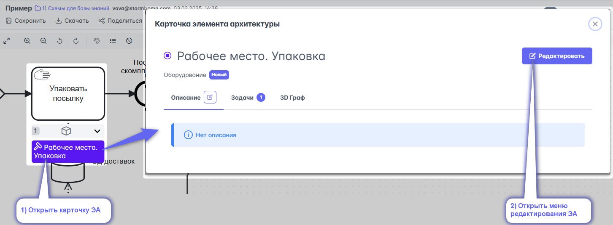
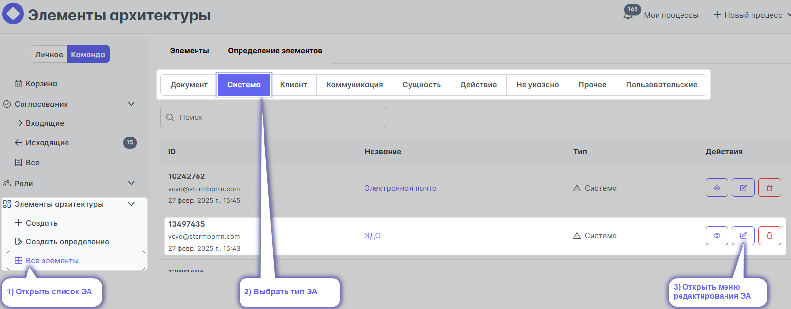
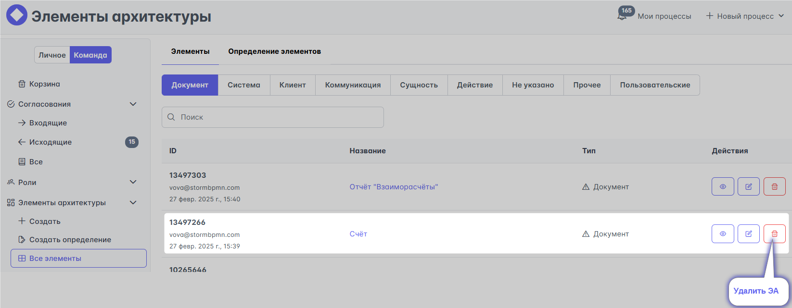
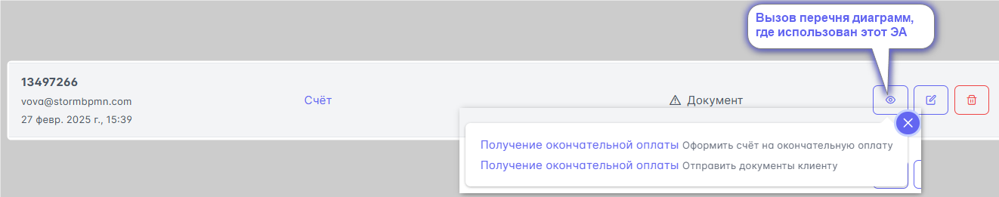

# Редактирование ЭА
# Редактирование Элементов архитектуры

Редактирование Элементов архитектуры доступно
- в интерфейсе процесса 

Откроется [меню редактирования элемента архитектуры](#меню-редактирования-элемента-архитектуры)

- в справочнике 'элементов архитектуры', по [ссылке](https://new.stormbpmn.com/app/team/assets)

Откроется [меню редактирования элемента архитектуры](#меню-редактирования-элемента-архитектуры)

# Удаление Элементов архитектуры

Удалить Элемент архитектуры можно только в справочнике ролей, по [ссылке](https://newstormbpmn.com/app/team/assets).

:::danger
Если Элемент архитектуры использован в диаграмме, то система не позволит его удалить /n

Тут же можно просмотреть перечень диаграмм в которых он использован. 

Отвяжите его перед удалением.
:::

